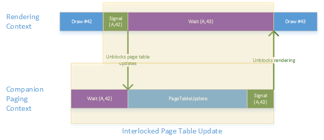

# Tile resources

For tile resources, the asynchronous video memory manager services running on the device paging queue aren't sufficient. In particular, for tile resources we want to queue page table updates along with rendering and ensure that the updates are applied synchronously between draw operations.

For example, given the following API call sequence by an application:

1.  Draw \#42
2.  Update tile mapping
3.  Draw \#43

We want to ensure that *Draw \#42* executes with the page tables in their old state while *Draw \#43* executes with page tables in their new state. For *update tile mapping* operations that specify the no-overwrite flag, this synchronization can be relaxed a bit, but high performance synchronous updates must be supported.
In order to support high performance queued updates, we need the ability to generate paging operations ahead of time and queue them to a context and wait for them to be executed once the dependent rendering context reaches a certain point (ex: after Draw \#42 above).

This means that the paging operation needs to be queued behind a graphics processing unit (GPU) wait that will be signaled by a specific rendering context. Because of this, they can't be queued directly to the shared system context as this would imply that one application could block execution of paging operations for everyone else in the system.

In theory, in today's packet based scheduling we could implement the wait portion of the operation in the device paging queue, monitor the wait and submit the paging operation to the shared system context after the wait condition has been satisfied. However, as we move beyond packet based scheduling and onto hardware scheduling we want to ensure that we can use GPU to GPU synch primitives for the interlocked operations to ensure the best possible performance.

To solve this problem, we're introducing the notion of a per-context paging companion context. The paging companion context is lazily created on the first call to [*UpdateGpuVirtualAddress*](https://msdn.microsoft.com/library/windows/hardware/dn906365) and is used for all page table updates that require interlocked synchronization. *UpdateGpuVirtualAddress* takes a GPU monitored fence object and a specific fence value as parameters. The companion context waits on this monitored fence does the page table update and then increments the monitored fence object and signals it. This allows the rendering context to tightly synchronize with the companion context.

Page table update using the companion context is illustrated below.

The companion context is lazily created by the video memory manager against an engine chosen by the kernel mode driver during context creation (**DXGKARG\_CREATECONTEXT.PagingCompanionNodeId**).

The companion context executes in a per-process privileged address space. The address space is privileged because it is both controlled by the kernel and only the direct memory access (DMA) buffers generated in the kernel are allowed to execute within. Outside of that, this is a normal GPU virtual address space and doesn't require any special hardware virtual address space privilege support.

We opted for a per-process privileged GPU virtual address space rather than re-using the system paging process GPU virtual address space for simplicity. Given that mapping and unmapping of tile resource is common, we need to have the application page table mapped permanently in an address space to avoid having to map/unmap them frequently. Also, as we'll shortly detail, we need to map all of the tile pools themselves in a permanent fashion as well. Doing these permanent mappings in the system address space would have introduced unnecessary additional complexity.

The per-process privileged GPU virtual address space is initialized such that the process GPU page tables are visible through the address space making it possible for update command to update the various page table entries using the GPU. Further, all tile pools created by a process are also mapped into the address space.

The way page table entries are updated by the companion context is a bit special and requires some explaining. When a *map* operation is queued for execution on the shared system context, the video memory manager knows the physical addresses being mapped to and those physical addresses can appear directly in the associated paging buffer. [*UpdatePageTable*](https://msdn.microsoft.com/library/windows/hardware/ff560815) paging operations are used in this case and the video memory manager guarantees that paging operations on some specific pages will complete before those pages are reused for some other purpose.

However, for synchronous updates of page tables on the companion context, things are more difficult. The video memory manager knows the physical page of tile pool being referenced at the time the update operations are built, however, given those operations will be queued behind an arbitrary long GPU wait (the app could even deadlock and never signal), the video memory manager doesn't know what the physical page of the tile pool will be at the time the paging operation actually do get executed and the video memory manager can't keep the tile pool at that location for an arbitrary long time.

To solve this problem we essentially need to either queue the paging operation and patch it up later as physical address changes or we need to late bind the actual address used in the update, the video memory manager does the latter.

To solve this problem the video memory manager does two things. First, it maps a GPU virtual address to all of the tile pool elements belonging to a process inside the process privileged address space. As tile pool moves around in memory, the video memory manager automatically keeps those GPU virtual address pointing to the right location for the tile pool using the same simple mechanism it does for any other allocation type.

To update tile resource page table entries, the video memory manager introduces a new **CopyPageTableEntry** paging operation which copies page table entries from the tile pool virtual address to the tile resource virtual address. Because the video memory manager keeps the tile pool virtual address up to date as the tile pool moves around in memory, the copy operation is guaranteed to be executed with the currently valid physical location for the tile pool no matter how much time elapsed between the command having been generated and the commands actually executing.

Note that as long as there are queued page table updates referencing a particular tile pool, the video memory manager will keep that tile pool in the residency requirement for the application no matter what the user mode driver or application says, to guarantee that the tile pool virtual addresses are valid when executing the update operation.

This mechanism is illustrated below:

**

##  Update GPU virtual address on GPUs with CPU\_VIRTUAL page table update mode

On GPUs, which support the **DXGK\_PAGETABLEUPDATE\_CPU\_VIRTUAL** page table update mode, the **CopyPageTableEntries** operation will not be used. These are integrated GPU, which do not use paging buffers. The video memory manager will defer the update operation until the right time and use the [*UpdatePageTable*](https://msdn.microsoft.com/library/windows/hardware/ff560815) operations to setup page tables.

The disadvantage of this method is that the [*UpdatePageTable*](https://msdn.microsoft.com/library/windows/hardware/ff560815) operations are not parallel with rendering operations. The advantage is that the driver does not need to implement support for paging buffers and implement *UpdatePageTable* as an immediate operation.

 

 

