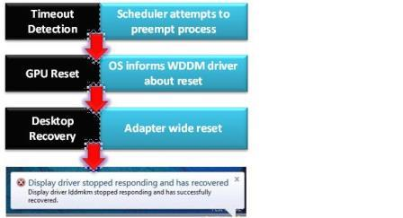

# Timeout detection and recovery (TDR)

This page describes timeout detection and recovery (TDR) for driver developers. For more information, see [TDR in Windows 8 and later](tdr-changes-in-windows-8.md).

## Overview

One of the most common stability problems in graphics occurs when a computer appears to "hang" or be completely "frozen" while, in reality, it's processing an end-user command or operation. Many users wait a few seconds and then decide to reboot the computer. The frozen appearance of the computer frequently occurs because the GPU is busy processing intensive graphical operations, typically during game play, and hence doesn't update the display screen. TDRs enable the operating system to detect that the UI isn't responsive.

The following figure shows the TDR process.

The OS attempts to detect situations in which computers appear to be "frozen". The OS then attempts to dynamically recover from the frozen situations so that desktops are responsive again, alleviating the situation where end users needlessly reboot their systems.

By default, if the OS detects that five (5) or more GPU hangs ([0x117](/windows-hardware/drivers/debugger/bug-check-0x117---video-tdr-timeout-detected)) and subsequent recoveries occur within one (1) minute, the OS bug-checks the computer on the next (sixth or more) GPU hang. For more information, see [TdrLimitCount](tdr-registry-keys.md#tdrlimitcount) and [TdrLimitTime](tdr-registry-keys.md#tdrlimittime).

As a side note, engine timeouts ([0x141](/windows-hardware/drivers/debugger/bug-check-0x141---video-engine-timeout-detected)) don’t contribute to the GPU hang count, though the OS could promote an engine timeout to a GPU hang if the engine timeout is unsuccessful. For engine timeouts (0x141), the maximum number is one less than for adapter timeouts (0x117). The engine reset process blocks GPU access for the process that’s causing such timeouts, and the system will log [0x142](/windows-hardware/drivers/debugger/bug-check-0x142--video-tdr-application-blocked) to indicate that fact. In this way, the malfunctioning process doesn’t bug-check the system.

## Timeout detection in WDDM

The GPU scheduler, which is part of the DirectX graphics kernel subsystem (*Dxgkrnl.sys*), detects that the GPU is taking more than the permitted amount of time to execute a particular task. The GPU scheduler then tries to preempt this particular task. The preempt operation has a "wait" timeout, which is the actual TDR timeout. The default timeout period in Windows Vista and later operating systems is 2 seconds. If the GPU can't complete or preempt the current task within the TDR timeout period, the OS diagnoses that the GPU has frozen.

To prevent timeout detection from occurring, hardware vendors should ensure that graphics operations (that is, DMA buffer completion) take no more than 2 seconds in end-user scenarios such as productivity and game play.

## Preparation for recovery

The GPU scheduler calls the display miniport driver's [*DxgkDdiResetFromTimeout*](/windows-hardware/drivers/ddi/d3dkmddi/nc-d3dkmddi-dxgkddi_resetfromtimeout) function to inform the driver that the OS detected a timeout. The driver must then reinitialize itself and reset the GPU. In addition, the driver must stop accessing memory and shouldn't access hardware. The OS and the driver collect hardware and other state information that can be useful for post-recovery diagnosis.

For more information, see [TDR in Windows 8 and later](tdr-changes-in-windows-8.md).

## Desktop recovery

The OS resets the appropriate state of the graphics stack. The video memory manager, which is also part of *Dxgkrnl.sys*, purges all allocations from video memory. The display miniport driver resets the GPU hardware state. The graphics stack takes the final actions and restores the desktop to the responsive state.

The only visible artifact from hang detection to recovery is a screen flicker. This flicker results when the OS resets some portions of the graphics stack, which causes a screen redraw. The display miniport driver can eliminate this redraw when it complies with WDDM 1.2 and later (see [Providing seamless state transitions in WDDM 1.2 and later](seamless-state-transitions-in-wddm-1-2-and-later.md)).

When the OS has successfully recovered the desktop, it completes the following actions:

* Displays an informational message to the end user, saying "Display driver stopped responding and has recovered."
* Logs the preceding message in the Event Viewer application and collects diagnosis information in the form of a debug report. If the end user opted in to provide feedback, the OS returns this debug report to Microsoft through the Online Crash Analysis (OCA) mechanism.

Some legacy DirectX applications might just render black at the end of this recovery, which requires the end user to restart these applications. Well-written DirectX 9Ex and DirectX 10 and later applications that handle Device Remove technology continue to work correctly. An application must release and then re-create its Microsoft Direct3D device and all of the device's objects.

## Thread synchronization and TDR

See [Thread synchronization and TDR](thread-synchronization-and-tdr.md) for details.

## Testing and debugging TDR

See [Testing and debugging TDR](tdr-registry-keys.md) for details.
