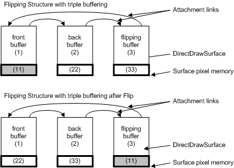

# Triple Buffering

## 

Increasing the number of buffers that can hold a primary surface increases display performance. It is preferable to have at least three flippable surfaces (some games use five or more). When there are only two surfaces and a page flip occurs, the display delays until the monitor's vertical retrace is finished. The delay is necessary to ensure that the back buffer is not written on before it is finished being displayed. With triple buffering, the third surface is always writable because it is a back buffer and available to draw on immediately (as shown in the following figure). In a game that does not use sprite memory, 3D rendering using triple buffering is 20 to 30 percent faster than double buffering.

The flipping structures in the preceding figure are the same as those in [Tearing](tearing.md), only now three buffers are used. One buffer is almost always writable (because it is not involved in a flip) so the driver does not have to wait for the display scan to finish before allowing the back buffer to be written to again.

The following is a brief explanation of flipping and blitting in a triple-buffered system, using the labels from the preceding figure. The example begins with surface pixel memory 11 being displayed. This is the primary surface pointed to by the front buffer (**fpVidMem** in the sample code supplied with the Microsoft Windows Driver Development Kit \[DDK\]). At some point, it becomes desirable to blt to the surface at pixel memory 22. Because **fpVidMem** points to the surface beginning at 11 (not 22) and the flip status is false (no flip is occurring on the requested surface), the blt can proceed. The driver locks the surface, writes to it, and then unlocks it. To display that surface, a flip must occur.

The DirectDraw front buffer object can now change **fpVidMem** (the display memory pointer) to make the surface at 22 the primary surface. Because no flip is pending, the display pointers are exchanged (see the bottom half of the preceding figure), and the flip status is set to **TRUE**. The front buffer now points to surface pixel memory 22, the back buffer points to surface pixel memory 33, and the third buffer object points to surface pixel memory 11 (the old primary surface). Unlike with double buffering, DirectDraw is free to write to the back buffer at this time. In other words, DirectDraw can write to surface pixel memory 33 because no flip is pending. This circular flipping process continues endlessly to provide smooth animation and faster game play and video playback for applications that use DirectDraw.

 

 

