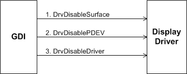

# Unloading Video Hardware

## 

When a surface is no longer required, a GDI call to [**DrvDisableSurface**](/windows/win32/api/winddi/nf-winddi-drvdisablesurface) informs the display driver that the surface created for the current hardware device by [**DrvEnableSurface**](/windows/win32/api/winddi/nf-winddi-drvenablesurface) can be disabled. The driver must also free any resources the surface was using.

After the surface is disabled, GDI calls [**DrvDisablePDEV**](/windows/win32/api/winddi/nf-winddi-drvdisablepdev) to inform the driver that the hardware device is no longer needed. The driver then frees any memory and resources that were allocated during the processing of [**DrvEnablePDEV**](/windows/win32/api/winddi/nf-winddi-drvenablepdev).

Finally, GDI disables the display driver by calling [**DrvDisableDriver**](/windows/win32/api/winddi/nf-winddi-drvdisabledriver). The driver must free any resources allocated during [**DrvEnableDriver**](/windows/win32/api/winddi/nf-winddi-drvenabledriver) and restore the video hardware to its default state. After the driver returns from the *DrvDisableDriver* function, GDI frees the memory it has allocated for the driver and removes driver code and data from memory.

The following figure shows GDI's calling sequence for disabling the video hardware.

 

