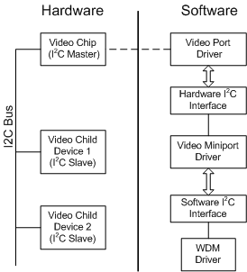

# Using I2C to Communicate with a Child Device

## 

On Microsoft Windows XP and later, after the Plug and Play manager has enumerated a video adapter's child devices, the miniport driver can communicate with the adapter's child devices on an [*I2C*](https://msdn.microsoft.com/library/windows/hardware/ff556290#wdkgloss-inter-integrated-circuit--i2c-) bus using the I²C protocol. Communication between the miniport driver and WDM drivers for those devices on an I²C bus can occur via a software interface exposed by the miniport driver (as described in [Communicating with the Driver of a Child Device](communicating-with-the-driver-of-a-child-device.md)). The miniport driver can initiate physical communication between those devices on the I²C bus by way of a new hardware interface exposed by the video port driver. If the miniport driver needs the I²C master device (usually the graphics chip) to read from or write to a physical child device over the I²C bus, it can use the hardware I²C interface provided by the video port driver's [**VideoPortQueryServices**](https://msdn.microsoft.com/library/windows/hardware/ff570337) routine. Note that this communication over the I²C bus is limited strictly to hardware devices on the same I²C bus. Miniport driver writers are strongly encouraged to use these routines for all such communication.

This mode of communication is also useful in cases where a video adapter has components for which there is no WDM driver. For example, a video adapter may have a daughter board or circuit that is used to send the video image to a digital flat panel. In this case, the miniport driver can make use of the hardware I²C interface provided by **VideoPortQueryServices** to send commands to that circuit over the I²C bus.

The preceding figure illustrates how a miniport driver can initiate communication between two hardware devices on an I²C bus.

To take advantage of the video port's I²C routines, the miniport driver must query the video port driver for an I²C interface. In preparation for this, the miniport driver must allocate a [**VIDEO\_PORT\_I2C\_INTERFACE**](https://msdn.microsoft.com/library/windows/hardware/ff570538) structure, and initialize its first two members (the **Size** and **Version** members) to appropriate values. The miniport driver then calls the video port driver's [**VideoPortQueryServices**](https://msdn.microsoft.com/library/windows/hardware/ff570337) routine, setting the *servicesType* parameter to **VideoPortServicesI2C**, and setting the *pInterface* parameter to the partially-initialized VIDEO\_PORT\_I2C\_INTERFACE structure.

If the call to **VideoPortQueryServices** is successful, the video port driver fills in the remaining members of the VIDEO\_PORT\_I2C\_INTERFACE structure, including the addresses of four I²C routines: [**I2CStart**](https://msdn.microsoft.com/library/windows/hardware/ff567375), [**I2CStop**](https://msdn.microsoft.com/library/windows/hardware/ff567376), [**I2CRead**](https://msdn.microsoft.com/library/windows/hardware/ff567372), and [**I2CWrite**](https://msdn.microsoft.com/library/windows/hardware/ff567378).

*I2CStart* and *I2CStop* are used, respectively, to initiate communication with the child device, and to terminate communication with it.

*I2CRead* reads a specified number of bytes from the child device; *I2CWrite* writes a specified number of bytes to it.

 

 

