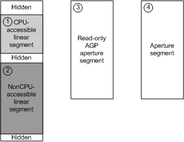

# Using Memory Segments to Describe the GPU Address Space

## 

Before the video memory manager can manage the address space of the GPU, the display miniport driver must describe the GPU's address space to the video memory manager by using memory segments. The display miniport driver creates memory segments to generalize and virtualize video memory resources. The driver can configure memory segments according to the memory types that the hardware supports (for example, frame buffer memory or system memory aperture).

During driver initialization, the driver must return the list of segment types that describe how memory resources can be managed by the video memory manager. The driver specifies the number of segment types that it supports and describes each segment type by responding to calls to its [**DxgkDdiQueryAdapterInfo**](https://msdn.microsoft.com/library/windows/hardware/ff559746) function. The driver describes each segment using a [**DXGK\_SEGMENTDESCRIPTOR**](https://msdn.microsoft.com/library/windows/hardware/ff562035) structure. For more information, see [Initializing Use of Memory Segments](initializing-use-of-memory-segments.md).

Thereafter, the number and types of segments remain unchanged. The video memory manager ensures that each process receives a fair share of the resources in any particular segment. The video memory manager manages all segments independently, and segments do not overlap. Therefore, the video memory manager allocates a fair amount of video memory resources from one segment to an application regardless of the amount of resources that application currently holds from another segment.

The driver assigns a segment identifier to each of its memory segments. Later, when the video memory manager requests to create allocations for video resources and render those resources, the driver identifies the segments that support the request and specifies, in order, the segments that the driver prefers the video memory manager use. For more information, see [Specifying Segments When Creating Allocations](specifying-segments-when-creating-allocations.md).

The driver is not required to specify all video memory resources that are available to the GPU in its memory segments; however, the driver must specify all memory resources that the video memory manager manages among all processes running on the system. For example, a vertex shader microcode that implements a fixed function pipeline can reside in the GPU address space, but outside the memory managed by the video memory manager (that is, not part of a segment) because the microcode is always available to all processes and is never the source of contention between processes. However, the video memory manager must allocate video memory resources, such as vertex buffers, textures, render targets, and application-specific shader code, from one of the driver's memory segments because the resource types must be fairly available to all processes.

The following figure shows how the driver can configure memory segments from the GPU address space.

**Note**   Video memory that is hidden from the video memory manager cannot be mapped into user space or be made exclusively available to any particular process. To do so breaks the fundamental rules of virtual memory that require that all processes running on the system have access to all memory.

 

 

 

