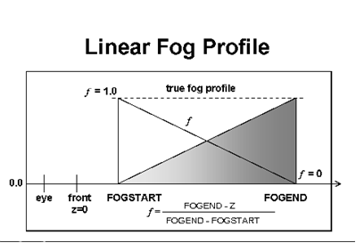

# Vertex and Pixel Fogging

## 

Fog has three main profile types: linear, exponential, and exponential squared. There are also two main implementation methods: vertex fog (also known as iterated or local fog) and pixel fog (also known as table or global fog).

In monochromatic (ramp) lighting mode, fog can work properly only when the fog color is black. (If there is no lighting, any fog color works because fog is rendered as black.) Fog can be considered a measure of visibility -- the lower the fog value, the greater the fog effect and the less visible the object.

The fog blending factor **f** is used in all fog calculations. It stands for the proportion of fog color versus object color. The final color is determined by the following formula:

**Color = f \* objColor + (1.0 - f) \* fogColor**

Therefore, a fog blending factor of 0.0 is full fog color and a fog blending factor of 1.0 is full object color. Typically, **f** decreases with distance.

As the following figure shows, linear fog density increases in a linear fashion as the distance increases.

This linear increase differs from exponential fog where the fog density increases exponentially. A linear fog profile might be set up as follows: the D3DRENDERSTATE\_FOGSTART render state is set to ZFront and *f* = 1.0; the D3DRENDERSTATE\_FOGEND render state is set to ZBack and *f* = 0.0. The D3DRENDERSTATE\_FOGDENSITY render state is ignored.

 

 

