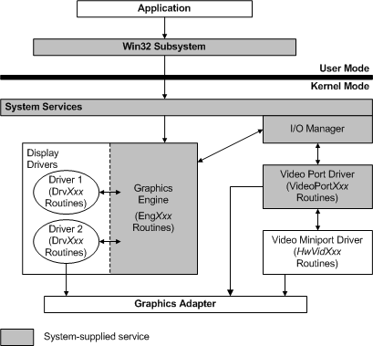

# Video Miniport Driver in the Graphics Architecture (Windows 2000 Model)

The following figure shows the video miniport driver within the NT-based operating system graphics subsystem.

Each video miniport driver provides hardware-level support for a display driver. The display driver calls the graphics engine [**EngDeviceIoControl**](/windows/win32/api/winddi/nf-winddi-engdeviceiocontrol) function to request support from the underlying video miniport driver. **EngDeviceIoControl**, in turn, calls an I/O system service to send the request through the video port driver to the miniport driver.

In most circumstances, the display driver carries out time-critical operations that are visible to the user, while the underlying miniport driver provides support for infrequently requested operations or for truly time-critical operations that cannot be preempted by an interrupt or a context switch to another process.

A display driver cannot handle device interrupts, and only the miniport driver can set up device memory and map it into a display driver's virtual address space.

The video port driver is a system-supplied module provided to support video miniport drivers. It acts as the intermediary between the display driver and video miniport drivers

For more information about NT-based operating system display drivers, see [Introduction to Display (Windows 2000 Model)](introduction-to-display--windows-2000-model-.md) and [Display Drivers (Windows 2000 Model)](display-drivers--windows-2000-model-.md).

 

