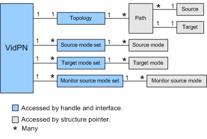

# VidPN Objects and Interfaces

The video present network (VidPN) manager uses a VidPN object to maintain information about associations between video present sources, video present targets, and display modes. For more information, see the [Introduction to Video Present Networks](introduction-to-video-present-networks.md) topic.

A VidPN object contains the following sub-objects.

-   Topology

-   Source mode set

-   Target mode set

-   Monitor source mode set

-   Path

-   Source

-   Target

-   Source mode

-   Target mode

-   Monitor source mode

The following diagram illustrates a VidPN object and its sub-objects.

The preceding diagram illustrates whether a particular association is one-to-one, one-to-many, many-to-one, or many-to-many. For example, the diagram shows that a source can belong to more than one path, but a target can belong to only one path.

The blue objects in the diagram are accessed through handles and interfaces, and the gray objects are accessed through structure pointers. An interface in this context is a structure that contains function pointers. For example, the [**DXGK\_VIDPNTOPOLOGY\_INTERFACE**](https://msdn.microsoft.com/library/windows/hardware/ff562091) structure contains pointers to functions (implemented by the VidPN manager) that the display miniport driver calls to inspect and alter a topology object. When the display miniport driver calls any one of those functions, it must supply a handle to a topology object. The following table lists the handle, interface, and pointer data types used to access a VidPN object and its sub-objects.

<table>
<colgroup>
<col width="50%" />
<col width="50%" />
</colgroup>
<thead>
<tr class="header">
<th align="left">Object</th>
<th align="left">Access method and data type</th>
</tr>
</thead>
<tbody>
<tr class="odd">
<td align="left">
VidPN
</td>
<td align="left">
Accessed through handle and interface.

D3DKMDT_HVIDPN

<a href="https://msdn.microsoft.com/library/windows/hardware/ff562108" data-raw-source="[&lt;strong&gt;DXGK_VIDPN_INTERFACE&lt;/strong&gt;](https://msdn.microsoft.com/library/windows/hardware/ff562108)"><strong>DXGK_VIDPN_INTERFACE</strong></a>
</td>
</tr>
<tr class="even">
<td align="left">
Topology
</td>
<td align="left">
Accessed through handle and interface.

D3DKMDT_HVIDPNTOPOLOGY

<a href="https://msdn.microsoft.com/library/windows/hardware/ff562091" data-raw-source="[&lt;strong&gt;DXGK_VIDPNTOPOLOGY_INTERFACE&lt;/strong&gt;](https://msdn.microsoft.com/library/windows/hardware/ff562091)"><strong>DXGK_VIDPNTOPOLOGY_INTERFACE</strong></a>
</td>
</tr>
<tr class="odd">
<td align="left">
Source mode set
</td>
<td align="left">
Accessed through handle and interface.

D3DKMDT_HVIDPNSOURCEMODESET

<a href="https://msdn.microsoft.com/library/windows/hardware/ff562073" data-raw-source="[&lt;strong&gt;DXGK_VIDPNSOURCEMODESET_INTERFACE&lt;/strong&gt;](https://msdn.microsoft.com/library/windows/hardware/ff562073)"><strong>DXGK_VIDPNSOURCEMODESET_INTERFACE</strong></a>
</td>
</tr>
<tr class="even">
<td align="left">
Target mode set
</td>
<td align="left">
Accessed through handle and interface.

D3DKMDT_HVIDPNTARGETMODESET

<a href="https://msdn.microsoft.com/library/windows/hardware/ff562082" data-raw-source="[&lt;strong&gt;DXGK_VIDPNTARGETMODESET_INTERFACE&lt;/strong&gt;](https://msdn.microsoft.com/library/windows/hardware/ff562082)"><strong>DXGK_VIDPNTARGETMODESET_INTERFACE</strong></a>
</td>
</tr>
<tr class="odd">
<td align="left">
Monitor source mode set
</td>
<td align="left">
Accessed through handle and interface.

D3DKMDT_HMONITORSOURCEMODESET

<a href="https://msdn.microsoft.com/library/windows/hardware/ff561921" data-raw-source="[&lt;strong&gt;DXGK_MONITORSOURCEMODESET_INTERFACE&lt;/strong&gt;](https://msdn.microsoft.com/library/windows/hardware/ff561921)"><strong>DXGK_MONITORSOURCEMODESET_INTERFACE</strong></a>
</td>
</tr>
<tr class="even">
<td align="left">
Path
</td>
<td align="left">
Accessed through structure pointer.

<a href="https://msdn.microsoft.com/library/windows/hardware/ff546647" data-raw-source="[&lt;strong&gt;D3DKMDT_VIDPN_PRESENT_PATH&lt;/strong&gt;](https://msdn.microsoft.com/library/windows/hardware/ff546647)"><strong>D3DKMDT_VIDPN_PRESENT_PATH</strong></a>
</td>
</tr>
<tr class="odd">
<td align="left">
Source
</td>
<td align="left">
Accessed through structure pointer.

<a href="https://msdn.microsoft.com/library/windows/hardware/ff546614" data-raw-source="[&lt;strong&gt;D3DKMDT_VIDEO_PRESENT_SOURCE&lt;/strong&gt;](https://msdn.microsoft.com/library/windows/hardware/ff546614)"><strong>D3DKMDT_VIDEO_PRESENT_SOURCE</strong></a>
</td>
</tr>
<tr class="even">
<td align="left">
Target
</td>
<td align="left">
Accessed through structure pointer.

<a href="https://msdn.microsoft.com/library/windows/hardware/ff546617" data-raw-source="[&lt;strong&gt;D3DKMDT_VIDEO_PRESENT_TARGET&lt;/strong&gt;](https://msdn.microsoft.com/library/windows/hardware/ff546617)"><strong>D3DKMDT_VIDEO_PRESENT_TARGET</strong></a>
</td>
</tr>
<tr class="odd">
<td align="left">
Source mode
</td>
<td align="left">
Accessed through structure pointer.

<a href="https://msdn.microsoft.com/library/windows/hardware/ff546724" data-raw-source="[&lt;strong&gt;D3DKMDT_VIDPN_SOURCE_MODE&lt;/strong&gt;](https://msdn.microsoft.com/library/windows/hardware/ff546724)"><strong>D3DKMDT_VIDPN_SOURCE_MODE</strong></a>
</td>
</tr>
<tr class="even">
<td align="left">
Target mode
</td>
<td align="left">
Accessed through structure pointer.

<a href="https://msdn.microsoft.com/library/windows/hardware/ff546729" data-raw-source="[&lt;strong&gt;D3DKMDT_VIDPN_TARGET_MODE&lt;/strong&gt;](https://msdn.microsoft.com/library/windows/hardware/ff546729)"><strong>D3DKMDT_VIDPN_TARGET_MODE</strong></a>
</td>
</tr>
<tr class="odd">
<td align="left">
Monitor source mode
</td>
<td align="left">
Accessed through structure pointer.

<a href="https://msdn.microsoft.com/library/windows/hardware/ff546133" data-raw-source="[&lt;strong&gt;D3DKMDT_MONITOR_SOURCE_MODE&lt;/strong&gt;](https://msdn.microsoft.com/library/windows/hardware/ff546133)"><strong>D3DKMDT_MONITOR_SOURCE_MODE</strong></a>
</td>
</tr>
</tbody>
</table>

 

The VidPN manager, which is one of the components of the DirectX graphics kernel subsystem, cooperates with the display miniport driver to build and maintain VidPNs. The following steps describe how the display miniport driver obtains a handle and an interface to a VidPN object.

1.  During initialization, the DirectX graphics kernel subsystem calls the display miniport driver's [*DxgkDdiStartDevice*](https://msdn.microsoft.com/library/windows/hardware/ff560775) function. That call provides the display miniport driver with a [**DXGKRNL\_INTERFACE**](https://msdn.microsoft.com/library/windows/hardware/ff560940) structure, which contains pointers to functions implemented by the DirectX graphics kernel subsystem. One of those functions is [*DxgkCbQueryVidPnInterface*](https://msdn.microsoft.com/library/windows/hardware/ff559553).

2.  At some point, the VidPN manager needs help from the display miniport driver, so it provides the display miniport driver with a handle to a VidPN object by calling one of the following functions:
    -   [*DxgkDdiIsSupportedVidPn*](https://msdn.microsoft.com/library/windows/hardware/ff559684)
    -   [*DxgkDdiRecommendFunctionalVidPn*](https://msdn.microsoft.com/library/windows/hardware/ff559775)
    -   [*DxgkDdiEnumVidPnCofuncModality*](https://msdn.microsoft.com/library/windows/hardware/ff559649)

3.  The display miniport driver passes the handle obtained in Step 2 to [*DxgkCbQueryVidPnInterface*](https://msdn.microsoft.com/library/windows/hardware/ff559553), which returns a pointer to a [**DXGK\_VIDPN\_INTERFACE**](https://msdn.microsoft.com/library/windows/hardware/ff562108) structure.

After the display miniport driver has a handle and an interface to a VidPN object, it can get handles and interfaces (as needed) to the primary sub-objects: topology, source mode set, target mode set, and monitor source mode set. For example, the display miniport driver can call [*pfnGetTopology*](https://msdn.microsoft.com/library/windows/hardware/ff562854) (one of the functions in the VidPN interface) to get a handle to a VidPN topology object and a pointer to a [**DXGK\_VIDPNTOPOLOGY\_INTERFACE**](https://msdn.microsoft.com/library/windows/hardware/ff562091) structure.

The following functions (in the VidPN interface) provide handles and interfaces to the primary sub-objects of a VidPN object.

-   [*pfnGetTopology*](https://msdn.microsoft.com/library/windows/hardware/ff562854)
-   [*pfnAcquireSourceModeSet*](https://msdn.microsoft.com/library/windows/hardware/ff562110)
-   [*pfnAcquireTargetModeSet*](https://msdn.microsoft.com/library/windows/hardware/ff562113)

Note that two of the functions in the preceding list have corresponding functions that release VidPN sub-objects.

-   [*pfnReleaseSourceModeSet*](https://msdn.microsoft.com/library/windows/hardware/ff562855)

-   [*pfnReleaseTargetModeSet*](https://msdn.microsoft.com/library/windows/hardware/ff562858)

After the display miniport driver obtains a handle and an interface to one of a VidPNs primary sub-objects, it can call the interface functions to get descriptors of objects related to the sub-object. For example, given a handle and an interface to a topology object, the display miniport driver could perform the following steps to get descriptors of all the paths in topology.

1.  [VidPN Topology interface](https://msdn.microsoft.com/library/windows/hardware/ff570560)

    Call the [*pfnAcquireFirstPathInfo*](https://msdn.microsoft.com/library/windows/hardware/ff562092) function of the VidPN topology interface to obtain a pointer to a [**D3DKMDT\_VIDPN\_PRESENT\_PATH**](https://msdn.microsoft.com/library/windows/hardware/ff546647) structure that describes the first path in the topology.

2.  [VidPN Topology interface](https://msdn.microsoft.com/library/windows/hardware/ff570560)

    Call the [*pfnAcquireNextPathInfo*](https://msdn.microsoft.com/library/windows/hardware/ff562093) function repeatedly to obtain pointers to D3DKMDT\_VIDPN\_PRESENT\_PATH structures that describe the remaining paths in the topology.

Similarly, the display miniport driver can get descriptors of the modes in a mode set by calling the *pfnAcquireFirstModeInfo* and *pfnAcquireNextModeInfo* functions of any of the following mode set interfaces.

-   [**DXGK\_VIDPNSOURCEMODESET\_INTERFACE**](https://msdn.microsoft.com/library/windows/hardware/ff562073)

-   [**DXGK\_VIDPNTARGETMODESET\_INTERFACE**](https://msdn.microsoft.com/library/windows/hardware/ff562082)

-   [**DXGK\_MONITORSOURCEMODESET\_INTERFACE**](https://msdn.microsoft.com/library/windows/hardware/ff561921)

Note that the [**DXGK\_VIDPNSOURCEMODESET\_INTERFACE**](https://msdn.microsoft.com/library/windows/hardware/ff562073) interface has no function for removing a mode from a source mode set. When the display miniport driver needs to update a source mode set, it does not alter an existing mode set by adding and removing modes. Instead, it creates a new mode set that replaces the old mode set. An example of a function that must update mode sets is the display miniport driver's [*DxgkDdiEnumVidPnCofuncModality*](https://msdn.microsoft.com/library/windows/hardware/ff559649) function. The steps involved in updating a source mode set are as follows:

1.  [VidPN Source Mode Set interface](https://msdn.microsoft.com/library/windows/hardware/ff570558)

    Call the [*pfnCreateNewModeInfo*](https://msdn.microsoft.com/library/windows/hardware/ff562078) of the [**DXGK\_VIDPNSOURCEMODESET\_INTERFACE**](https://msdn.microsoft.com/library/windows/hardware/ff562073) interface to get a pointer to a [**D3DKMDT\_VIDPN\_SOURCE\_MODE**](https://msdn.microsoft.com/library/windows/hardware/ff546724) structure (allocated by the VidPN manager).

    Call [*pfnAddMode*](https://msdn.microsoft.com/library/windows/hardware/ff562077) repeatedly to add modes to the source mode set.

2.  [VidPN interface](https://msdn.microsoft.com/library/windows/hardware/ff570556)

    Call the [*pfnAssignSourceModeSet*](https://msdn.microsoft.com/library/windows/hardware/ff562840) function of the [**DXGK\_VIDPN\_INTERFACE**](https://msdn.microsoft.com/library/windows/hardware/ff562108) to assign the new mode set to a particular video present source. The new source mode set replaces the source mode set that is currently assigned to that source.

Updating a target mode set is similar to updating a source mode set. The [**DXGK\_VIDPNTARGETMODESET\_INTERFACE**](https://msdn.microsoft.com/library/windows/hardware/ff562082) interface has the following functions:

-   [VidPN Target Mode Set interface](https://msdn.microsoft.com/library/windows/hardware/ff570559)

    A [*pfnCreateNewModeInfo*](https://msdn.microsoft.com/library/windows/hardware/ff562087) function for creating a new target mode set and a [*pfnAddMode*](https://msdn.microsoft.com/library/windows/hardware/ff562086) function for adding modes to the set.

There is no interface (set of functions) for obtaining the source and target that belong to a particular path. The display miniport driver can determine which source and target belong to a particular path by inspecting the **VidPnSourceId** and **VidPnTargetId** members of the [**D3DKMDT\_VIDPN\_PRESENT\_PATH**](https://msdn.microsoft.com/library/windows/hardware/ff546647) structure that represents the path.

 

 

