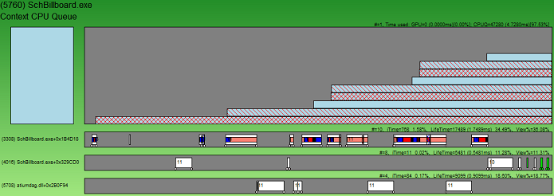

# Viewing a Process

Each process gets its own display area in the main GPUView window. The following diagram shows a zoomed-in screen shot of a Process Area in GPUView. A process may, or may not, have a Context CPU Queue. The Context CPU Queue exists only if the process created a graphics device to render to. The majority of processes in GPUView do not have Context CPU Queues (View Level 6 to see all processes and threads). By default, GPUView typically displays processes with Context CPU Queues.

 

## Name
The process ID and name are displayed in the upper left-hand corner of the Process Area. In this case, the process ID is 5760 and the process name is SchBillboard.exe.

## Context CPU Queue
Below the name is the Context CPU Queue Area. It is contained within the Process Area. There may be one or more Context CPU Queues for the process. For more information about the context queue, see [Context CPU Queue](context-cpu-queue.md).

## Threads
Below the Context CPU Queue are the threads that ran in the process during the given viewport time period. There can be any number of threads in a process. GPUView generally filters out uninteresting threads (threads that did not run or performed no video work) to keep the main display focused on threads that perform video work. For more information, see [Viewing a Thread](viewing-a-thread.md).