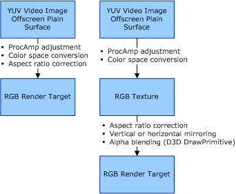
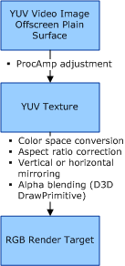
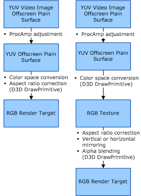

# VMR Video Processing

## 

The VMR can perform the following sequence of processing operations on the video before it is displayed. The VMR's mixer component always performs these operations in the order listed. Color space conversion and aspect ratio correction are applied to all video streams; other operations are optional. The VMR performs only those operations that are requested by the video playback application.

-   ProcAmp control adjustments

-   Deinterlacing

-   Aspect ratio correction

-   Color space conversion

-   Vertical or horizontal mirroring and alpha blending

Whenever possible, the VMR's mixer combines as many of these processes as possible to reduce the overall memory bandwidth needed to process the video. The degree to which these processes can be combined is determined by the capabilities of the hardware.

The illustrations in this section show the video processing pipelines used by the VMR's mixer to process video during a ProcAmp control operation. The operations performed by the mixer depend on the capabilities of the hardware. In the illustrations, rectangles represent Direct3D surfaces and circles represent Direct3D or DirectX VA operations. The illustrations show the video processing pipelines for the following capabilities:

-   Hardware that can perform color space conversion and horizontally resize the video image.

-   Hardware that cannot perform color space conversion and cannot horizontally resize the video image, but can support YUV textures.

-   Hardware that cannot perform color space conversion, cannot horizontally resize the video image, and cannot support YUV textures.

The output surface of the VMR's processing pipeline is always a Direct3D render target. Applications are able to configure the VMR such that the output render target may also be a Direct3D texture or part of a Direct3D swap chain.

The following illustration shows the video processing pipelines used by the VMR to process *progressive* video when the ProcAmp control hardware is able to perform color space conversion and horizontally resize the video image.

Usually, a video playback application does not request that the VMR perform alpha blending or vertical/horizontal mirroring of the video as it is displayed. The VMR is then able to incorporate all the video processing into a single stage. In this case, the first pipeline is used. If the application requests that the VMR perform alpha blending or vertical/horizontal mirroring of the video image prior to display, the VMR inserts an extra stage to the pipeline. In this case, the second pipeline is used.

The following illustration shows the video pipeline used by the VMR to process *progressive* video when the ProcAmp control hardware cannot perform color space conversion and cannot horizontally resize the video image during a ProcAmp adjustment operation (as indicated by the DXVA\_VideoProcess\_YUV2RGB and DXVA\_VideoProcess\_StretchX enumerators in [**DXVA\_VideoProcessCaps**](https://msdn.microsoft.com/library/windows/hardware/ff564076)), but does support YUV textures.

The following illustration shows the video pipelines used by the VMR to process *progressive* video when the ProcAmp control hardware cannot perform color space conversion, cannot horizontally resize the video image during a ProcAmp adjustment operation (as indicated by the DXVA\_VideoProcess\_YUV2RGB and DXVA\_VideoProcess\_StretchX enumerators in [**DXVA\_VideoProcessCaps**](https://msdn.microsoft.com/library/windows/hardware/ff564076)), and does not support YUV textures.

The VMR uses the first pipeline if the application does not request any alpha blending or mirroring of the video image. The VMR uses the second pipeline if the application requests either alpha blending or mirroring of the video image.

 

 

