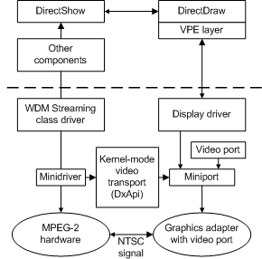
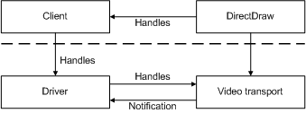

# VPE and Kernel-Mode Video Transport Architecture

This section provides some details about the Windows 2000 and later architecture for the video port extensions (VPE) and kernel-mode video transport in DirectX 5.0 and later versions. The architecture for kernel-mode video transport is based on new functions that Microsoft added as device-independent code. Kernel-mode video transport consists of a [**DxApi**](/windows-hardware/drivers/ddi/dxapi/nf-dxapi-dxapi) function that is supplied as part of DirectDraw, the [video miniport driver](video-miniport-drivers-in-the-windows-2000-display-driver-model.md), and the COM interface methods supplied as part of DirectDraw.

## Windows 2000 and Later

In Windows 2000 and later, as shown in the following figure, the DxApi callbacks are part of the [video miniport driver](video-miniport-drivers-in-the-windows-2000-display-driver-model.md).

For more information about the DxApi callbacks, see [DxApi Miniport Driver Functions For Windows 2000 and Later](dxapi-miniport-driver-functions-for-windows-2000-and-later.md).

The preceding figure shows the kernel-mode video transport architecture in relation to other kernel-mode and user-mode components (the dashed line denotes the kernel transition). In this architecture, DirectShow (or another user-mode client) calls the [IDirectDrawKernel](/windows/win32/api/ddkernel/nn-ddkernel-idirectdrawkernel) and [IDirectDrawSurfaceKernel](/windows/win32/api/ddkernel/nn-ddkernel-idirectdrawsurfacekernel) DirectDraw COM interfaces to get handles to the DirectDraw object and surface objects.

> [!NOTE]
> This architecture also supports using the PCI bus for data flow between the MPEG device and VGA device.

In Windows 2000 and later, the client then passes these handles to the miniport driver. These handles are specified in the calls to the kernel-mode video transport. The following figure shows a simple version of how the handles are passed in user- and kernel-mode video transport.

