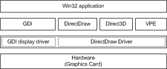

# VPE Functions in DirectDraw API and Driver

## 

The video port extensions in the latest DirectX release are low-level extensions to the DirectDraw API. VPE allows the client -- usually DirectShow -- to negotiate the connection between the MPEG or NTSC decoder and the hardware video port. VPE also allows the client to control effects in the video stream, including cropping and scaling.

VPE is not a high-level API designed for broad use by applications. Applications should use DirectShow, which provides free support for VPE. The following figure shows a simple view of the VPE and kernel-mode architecture. For more information, see [Kernel-Mode Video Transport](kernel-mode-video-transport.md).

The preceding figure shows VPE in relation to other components of DirectDraw architecture. DirectShow uses VPE to negotiate the connection, which provides information about how data and V-sync and H-sync information are transferred. This information can be an APIC connection (ITU 656), external data lines with extra pins, or proprietary data streams such as those implemented by Brooktree and Philips.

In the negotiation for the connection, the VGA hardware indicates what connections can be supported, and the MPEG or NTSC decoder indicates its preferences. DirectShow negotiates the best connection between the two. The connection is described as a globally unique identifier (GUID), with flags to describe other parameters, such as double clocking and video active.

 

 

