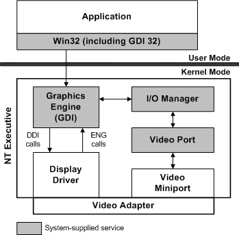

# Windows 2000 Display Architecture

## 

The following figure shows the components required to display on Windows 2000 and later.

The shaded elements in the preceding figure represent services that are supplied with Windows 2000 and later. The unshaded elements indicate that a third-party display driver and video miniport driver are required in order for a graphics adapter to display in the Windows 2000 and later systems.

For every type of graphics card that can be used with an NT-based operating system, there must be both a display driver and a corresponding video miniport driver. The miniport driver is written specifically for one graphics adapter (or family of adapters). The display driver can be written for any number of adapters that share a common drawing interface; for example, the VGA display driver can be used with either the VGA or ET4000 miniport driver. This is because the display driver draws, while the miniport driver performs operations such as mode sets and provides information about the hardware to the driver. It is also possible for more than one display driver to work with a particular miniport driver; for example, the 16- and 256-color SVGA display drivers can use the same miniport driver.

The following sections describe the key responsibilities of display and video miniport drivers. The breakdown in responsibilities is not hard and fast; the balance between modularity and performance is the key. For example, the hardware pointer code for the VGA driver resides in the miniport driver. This promotes modularity, so the same display driver can handle both the Video Seven VRAM, which has a hardware pointer, and the ET4000, which does not.

[Windows 2000 Display Driver Responsibilities](windows-2000-display-driver-responsibilities.md)

[Windows 2000 Video Miniport Driver Responsibilities](windows-2000-video-miniport-driver-responsibilities.md)

 

 

