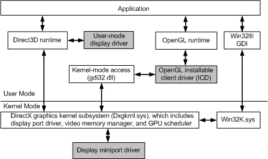

# Windows Display Driver Model (WDDM) Architecture

## 

The display driver model architecture for the Windows Display Driver Model (WDDM), available starting with Windows Vista, is composed of user-mode and kernel-mode parts. The following figure shows the architecture required to support WDDM.

A graphics hardware vendor must supply the user-mode display driver and the display miniport driver. The user-mode display driver is a dynamic-link library (DLL) that is loaded by the Microsoft Direct3D runtime. The display *miniport driver* communicates with the Microsoft DirectX graphics kernel subsystem. For more information about the user-mode display driver and display miniport driver, see the [Windows Display Driver Model (WDDM) Reference](/windows-hardware/drivers/ddi/_display/).

 

