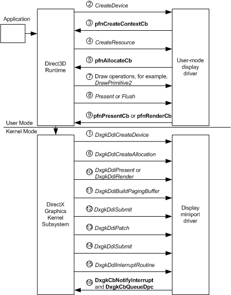

# Windows Display Driver Model (WDDM) Operation Flow

The following diagram shows the flow of Windows Display Driver Model (WDDM) operations that occur from when a rendering device is created to when the content is presented to the display. The sequence in the sections that follow describes the operation flow in more detail.

### Creating a Rendering Device

<table>
<colgroup>
<col width="50%" />
<col width="50%" />
</colgroup>
<tbody>
<tr class="odd">
<td align="left">
1.
</td>
<td align="left">
After an application requests to create a rendering device, the display miniport driver receives a <a href="https://msdn.microsoft.com/library/windows/hardware/ff559615" data-raw-source="[&lt;strong&gt;DxgkDdiCreateDevice&lt;/strong&gt;](https://msdn.microsoft.com/library/windows/hardware/ff559615)"><strong>DxgkDdiCreateDevice</strong></a> call. The display miniport driver initializes direct memory access (DMA) by returning a pointer to a filled <a href="https://msdn.microsoft.com/library/windows/hardware/ff561047" data-raw-source="[&lt;strong&gt;DXGK_DEVICEINFO&lt;/strong&gt;](https://msdn.microsoft.com/library/windows/hardware/ff561047)"><strong>DXGK_DEVICEINFO</strong></a> structure in the <strong>pInfo</strong> member of the <a href="https://msdn.microsoft.com/library/windows/hardware/ff557570" data-raw-source="[&lt;strong&gt;DXGKARG_CREATEDEVICE&lt;/strong&gt;](https://msdn.microsoft.com/library/windows/hardware/ff557570)"><strong>DXGKARG_CREATEDEVICE</strong></a> structure.
</td>
</tr>
<tr class="even">
<td align="left">
2.
</td>
<td align="left">
If the call to the display miniport driver&#39;s <a href="https://msdn.microsoft.com/library/windows/hardware/ff559615" data-raw-source="[&lt;strong&gt;DxgkDdiCreateDevice&lt;/strong&gt;](https://msdn.microsoft.com/library/windows/hardware/ff559615)"><strong>DxgkDdiCreateDevice</strong></a> succeeds, the Microsoft Direct3D runtime calls the user-mode display driver&#39;s <a href="https://msdn.microsoft.com/library/windows/hardware/ff540634" data-raw-source="[&lt;strong&gt;CreateDevice&lt;/strong&gt;](https://msdn.microsoft.com/library/windows/hardware/ff540634)"><strong>CreateDevice</strong></a> function.
</td>
</tr>
<tr class="odd">
<td align="left">
3.
</td>
<td align="left">
In the <a href="https://msdn.microsoft.com/library/windows/hardware/ff540634" data-raw-source="[&lt;strong&gt;CreateDevice&lt;/strong&gt;](https://msdn.microsoft.com/library/windows/hardware/ff540634)"><strong>CreateDevice</strong></a> call, the user-mode display driver must explicitly call the <a href="https://msdn.microsoft.com/library/windows/hardware/ff568895" data-raw-source="[&lt;strong&gt;pfnCreateContextCb&lt;/strong&gt;](https://msdn.microsoft.com/library/windows/hardware/ff568895)"><strong>pfnCreateContextCb</strong></a> function to create one or more contexts—GPU threads of execution on the newly created device. The Direct3D runtime returns information in the <strong>pCommandBuffer</strong> and <strong>CommandBufferSize</strong> members of the <a href="https://msdn.microsoft.com/library/windows/hardware/ff544143" data-raw-source="[&lt;strong&gt;D3DDDICB_CREATECONTEXT&lt;/strong&gt;](https://msdn.microsoft.com/library/windows/hardware/ff544143)"><strong>D3DDDICB_CREATECONTEXT</strong></a> structure to initialize the command buffer.
</td>
</tr>
</tbody>
</table>

 

### Creating Surfaces for a Device

<table>
<colgroup>
<col width="50%" />
<col width="50%" />
</colgroup>
<tbody>
<tr class="odd">
<td align="left">
4.
</td>
<td align="left">
After an application requests to create surfaces for the rendering device, the Direct3D runtime calls the user-mode display driver&#39;s <a href="https://msdn.microsoft.com/library/windows/hardware/ff540688" data-raw-source="[&lt;strong&gt;CreateResource&lt;/strong&gt;](https://msdn.microsoft.com/library/windows/hardware/ff540688)"><strong>CreateResource</strong></a> function.
</td>
</tr>
<tr class="even">
<td align="left">
5.
</td>
<td align="left">
The user-mode display driver&#39;s <a href="https://msdn.microsoft.com/library/windows/hardware/ff540688" data-raw-source="[&lt;strong&gt;CreateResource&lt;/strong&gt;](https://msdn.microsoft.com/library/windows/hardware/ff540688)"><strong>CreateResource</strong></a> calls the <a href="https://msdn.microsoft.com/library/windows/hardware/ff568893" data-raw-source="[&lt;strong&gt;pfnAllocateCb&lt;/strong&gt;](https://msdn.microsoft.com/library/windows/hardware/ff568893)"><strong>pfnAllocateCb</strong></a> runtime-supplied function.
</td>
</tr>
<tr class="odd">
<td align="left">
6.
</td>
<td align="left">
The display miniport driver receives a <a href="https://msdn.microsoft.com/library/windows/hardware/ff559606" data-raw-source="[&lt;strong&gt;DxgkDdiCreateAllocation&lt;/strong&gt;](https://msdn.microsoft.com/library/windows/hardware/ff559606)"><strong>DxgkDdiCreateAllocation</strong></a> call, which indicates the number and types of allocations to create. <strong>DxgkDdiCreateAllocation</strong> returns information about the allocations in an array of <a href="https://msdn.microsoft.com/library/windows/hardware/ff560960" data-raw-source="[&lt;strong&gt;DXGK_ALLOCATIONINFO&lt;/strong&gt;](https://msdn.microsoft.com/library/windows/hardware/ff560960)"><strong>DXGK_ALLOCATIONINFO</strong></a> structures in the <strong>pAllocationInfo</strong> member of the <a href="https://msdn.microsoft.com/library/windows/hardware/ff557559" data-raw-source="[&lt;strong&gt;DXGKARG_CREATEALLOCATION&lt;/strong&gt;](https://msdn.microsoft.com/library/windows/hardware/ff557559)"><strong>DXGKARG_CREATEALLOCATION</strong></a> structure.
</td>
</tr>
</tbody>
</table>

 

### Submitting the Command Buffer to Kernel Mode

<table>
<colgroup>
<col width="50%" />
<col width="50%" />
</colgroup>
<tbody>
<tr class="odd">
<td align="left">
7.
</td>
<td align="left">
After an application requests to draw to a surface, the Direct3D runtime calls the user-mode display driver function related to the drawing operation, for example, <a href="https://msdn.microsoft.com/library/windows/hardware/ff556151" data-raw-source="[&lt;strong&gt;DrawPrimitive2&lt;/strong&gt;](https://msdn.microsoft.com/library/windows/hardware/ff556151)"><strong>DrawPrimitive2</strong></a>.
</td>
</tr>
<tr class="even">
<td align="left">
8.
</td>
<td align="left">
To submit the command buffer to kernel-mode, the Direct3D runtime calls either the user-mode display driver&#39;s <a href="https://msdn.microsoft.com/library/windows/hardware/ff569176" data-raw-source="[&lt;strong&gt;Present&lt;/strong&gt;](https://msdn.microsoft.com/library/windows/hardware/ff569176)"><strong>Present</strong></a> or <a href="https://msdn.microsoft.com/library/windows/hardware/ff565957" data-raw-source="[&lt;strong&gt;Flush&lt;/strong&gt;](https://msdn.microsoft.com/library/windows/hardware/ff565957)"><strong>Flush</strong></a> function. Also, the user-mode display driver submits the command buffer if the command buffer is full.
</td>
</tr>
<tr class="odd">
<td align="left">
9.
</td>
<td align="left">
The user-mode display driver calls the <a href="https://msdn.microsoft.com/library/windows/hardware/ff568916" data-raw-source="[&lt;strong&gt;pfnPresentCb&lt;/strong&gt;](https://msdn.microsoft.com/library/windows/hardware/ff568916)"><strong>pfnPresentCb</strong></a> runtime-supplied function if <a href="https://msdn.microsoft.com/library/windows/hardware/ff569176" data-raw-source="[&lt;strong&gt;Present&lt;/strong&gt;](https://msdn.microsoft.com/library/windows/hardware/ff569176)"><strong>Present</strong></a> was called, or the <a href="https://msdn.microsoft.com/library/windows/hardware/ff568923" data-raw-source="[&lt;strong&gt;pfnRenderCb&lt;/strong&gt;](https://msdn.microsoft.com/library/windows/hardware/ff568923)"><strong>pfnRenderCb</strong></a> runtime-supplied function if <a href="https://msdn.microsoft.com/library/windows/hardware/ff565957" data-raw-source="[&lt;strong&gt;Flush&lt;/strong&gt;](https://msdn.microsoft.com/library/windows/hardware/ff565957)"><strong>Flush</strong></a> was called or the command buffer is full.
</td>
</tr>
<tr class="even">
<td align="left">
10.
</td>
<td align="left">
The display miniport driver receives a call to the <a href="https://msdn.microsoft.com/library/windows/hardware/ff559743" data-raw-source="[&lt;strong&gt;DxgkDdiPresent&lt;/strong&gt;](https://msdn.microsoft.com/library/windows/hardware/ff559743)"><strong>DxgkDdiPresent</strong></a> function if <a href="https://msdn.microsoft.com/library/windows/hardware/ff568916" data-raw-source="[&lt;strong&gt;pfnPresentCb&lt;/strong&gt;](https://msdn.microsoft.com/library/windows/hardware/ff568916)"><strong>pfnPresentCb</strong></a> was called, or the <a href="https://msdn.microsoft.com/library/windows/hardware/ff559793" data-raw-source="[&lt;strong&gt;DxgkDdiRender&lt;/strong&gt;](https://msdn.microsoft.com/library/windows/hardware/ff559793)"><strong>DxgkDdiRender</strong></a> or <a href="https://msdn.microsoft.com/library/windows/hardware/ff559800" data-raw-source="[&lt;strong&gt;DxgkDdiRenderKm&lt;/strong&gt;](https://msdn.microsoft.com/library/windows/hardware/ff559800)"><strong>DxgkDdiRenderKm</strong></a> function if <a href="https://msdn.microsoft.com/library/windows/hardware/ff568923" data-raw-source="[&lt;strong&gt;pfnRenderCb&lt;/strong&gt;](https://msdn.microsoft.com/library/windows/hardware/ff568923)"><strong>pfnRenderCb</strong></a> was called. The display miniport driver validates the command buffer, writes to the DMA buffer in the hardware&#39;s format, and produces an allocation list that describes the surfaces used.
</td>
</tr>
</tbody>
</table>

 

### Submitting the DMA Buffer to Hardware

<table>
<colgroup>
<col width="50%" />
<col width="50%" />
</colgroup>
<tbody>
<tr class="odd">
<td align="left">
11.
</td>
<td align="left">
The Microsoft DirectX graphics kernel subsystem calls the display miniport driver&#39;s <a href="https://msdn.microsoft.com/library/windows/hardware/ff559587" data-raw-source="[&lt;strong&gt;DxgkDdiBuildPagingBuffer&lt;/strong&gt;](https://msdn.microsoft.com/library/windows/hardware/ff559587)"><strong>DxgkDdiBuildPagingBuffer</strong></a> function to create special purpose DMA buffers, known as paging buffers, that move the allocations specified in the allocation list to and from GPU-accessible memory.

<strong>Note</strong>  <a href="https://msdn.microsoft.com/library/windows/hardware/ff559587" data-raw-source="[&lt;strong&gt;DxgkDdiBuildPagingBuffer&lt;/strong&gt;](https://msdn.microsoft.com/library/windows/hardware/ff559587)"><strong>DxgkDdiBuildPagingBuffer</strong></a> is not called for every frame.

 

</td>
</tr>
<tr class="even">
<td align="left">
12.
</td>
<td align="left">
The DirectX graphics kernel subsystem calls the display miniport driver&#39;s <a href="https://msdn.microsoft.com/library/windows/hardware/ff560790" data-raw-source="[&lt;strong&gt;DxgkDdiSubmitCommand&lt;/strong&gt;](https://msdn.microsoft.com/library/windows/hardware/ff560790)"><strong>DxgkDdiSubmitCommand</strong></a> function to queue the paging buffers to the GPU execution unit.
</td>
</tr>
<tr class="odd">
<td align="left">
13.
</td>
<td align="left">
The DirectX graphics kernel subsystem calls the display miniport driver&#39;s <a href="https://msdn.microsoft.com/library/windows/hardware/ff559737" data-raw-source="[&lt;strong&gt;DxgkDdiPatch&lt;/strong&gt;](https://msdn.microsoft.com/library/windows/hardware/ff559737)"><strong>DxgkDdiPatch</strong></a> function to assign physical addresses to the resources in the DMA buffer.
</td>
</tr>
<tr class="even">
<td align="left">
14.
</td>
<td align="left">
The DirectX graphics kernel subsystem calls the display miniport driver&#39;s <a href="https://msdn.microsoft.com/library/windows/hardware/ff560790" data-raw-source="[&lt;strong&gt;DxgkDdiSubmitCommand&lt;/strong&gt;](https://msdn.microsoft.com/library/windows/hardware/ff560790)"><strong>DxgkDdiSubmitCommand</strong></a> function to queue the DMA buffer to the GPU execution unit. Each DMA buffer submitted to the GPU contains a fence identifier, which is a number. After the GPU finishes processing the DMA buffer, the GPU generates an interrupt.
</td>
</tr>
<tr class="odd">
<td align="left">
15.
</td>
<td align="left">
The display miniport driver is notified of the interrupt in its <a href="https://msdn.microsoft.com/library/windows/hardware/ff559680" data-raw-source="[&lt;strong&gt;DxgkDdiInterruptRoutine&lt;/strong&gt;](https://msdn.microsoft.com/library/windows/hardware/ff559680)"><strong>DxgkDdiInterruptRoutine</strong></a> function. The display miniport driver should read, from the GPU, the fence identifier of the DMA buffer that just completed.
</td>
</tr>
<tr class="even">
<td align="left">
16.
</td>
<td align="left">
The display miniport driver should call the <a href="https://msdn.microsoft.com/library/windows/hardware/ff559545" data-raw-source="[&lt;strong&gt;DxgkCbNotifyInterrupt&lt;/strong&gt;](https://msdn.microsoft.com/library/windows/hardware/ff559545)"><strong>DxgkCbNotifyInterrupt</strong></a> function to notify the DirectX graphics kernel subsystem that the DMA buffer completed. The display miniport driver should also call the <a href="https://msdn.microsoft.com/library/windows/hardware/ff559559" data-raw-source="[&lt;strong&gt;DxgkCbQueueDpc&lt;/strong&gt;](https://msdn.microsoft.com/library/windows/hardware/ff559559)"><strong>DxgkCbQueueDpc</strong></a> function to queue a deferred procedure call (DPC).
</td>
</tr>
</tbody>
</table>

 

 

 

