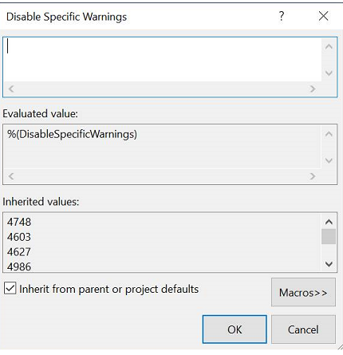

# Driver security checklist

This article provides a driver security checklist for driver developers to help reduce the risk of drivers being compromised.

## Driver security overview

A security flaw is any flaw that allows an attacker to cause a driver to malfunction in such a way that it causes the system to crash or become unusable. In addition, vulnerabilities in driver code can allow an attacker to gain access to the kernel, creating a possibility of compromising the entire OS. When most developers are working on their driver, their focus is on getting the driver to work properly, and not on whether a malicious attacker will attempt to exploit vulnerabilities within their code.

After a driver is released, however, attackers can attempt to probe and identify security flaws. Developers must consider these issues during the design and implementation phase in order to minimize the likelihood of such vulnerabilities. The goal is to eliminate all known security flaws before the driver is released.

Creating more secure drivers requires the cooperation of the system architect (consciously thinking of potential threats to the driver), the developer implementing the code (defensively coding common operations that can be the source of exploits), and the test team (proactively attempting to find weakness and vulnerabilities). By properly coordinating all of these activities, the security of the driver is dramatically enhanced.

In addition to avoiding the issues associated with a driver being attacked, many of the steps described, such as more precise use of kernel memory, will increase the reliability of your driver. This will reduce support costs and increase customer satisfaction with your product. Completing the tasks in the checklist below will help to achieve all these goals.

**Security checklist:** *Complete the security task described in each of these topics.*

[Confirm that a kernel driver is required](#confirm-that-a-kernel-driver-is-required)

[Use the driver frameworks](#use-the-driver-frameworks)

[Control access to software only drivers](#control-access-to-software-only-drivers)

[Do not production sign test driver code](#do-not-production-sign-test-code)

[Perform threat analysis](#perform-threat-analysis)

[Follow driver secure coding guidelines](#follow-driver-secure-coding-guidelines)

[Validate HVCI compatibility](#validate-hvci-compatibility)

[Follow technology specific code best practices](#follow-technology-specific-code-best-practices)

[Perform peer code review](#perform-peer-code-review)

[Manage driver access control](#manage-driver-access-control)

[Enhance device installation security](#enhance-device-installation-security)

[Execute proper release driver signing](#execute-proper-release-driver-signing)

[Use code analysis in Visual Studio to investigate driver security](#use-code-analysis-in-visual-studio-to-investigate-driver-security)

[Use Static Driver Verifier to Check for Vulnerabilities](#use-static-driver-verifier-to-check-for-vulnerabilities)

[Check code with BinSkim Binary Analyzer](#check-code-with-the-binskim-binary-analyzer)

[Use code validation tools](#use-additional-code-validation-tools)

[Review debugger techniques and extensions](#review-debugger-techniques-and-extensions)

[Review secure coding resources](#review-secure-coding-resources)

[Summary of key takeaways](#summary-of-key-takeaways)

## Confirm that a kernel driver is required

**Security checklist item \#1:** *Confirm that a kernel driver is required and that a lower risk approach, such as Windows service or app, is not a better option.*

Drivers live in the Windows kernel, and having an issue when executing in kernel exposes the entire operating system. If any other option is available, it likely will be lower cost and have less associated risk than creating a new kernel driver.
For more information about using the built in Windows drivers, see [Do you need to write a driver?](../gettingstarted/do-you-need-to-write-a-driver-.md).

For information on using background tasks, see  [Support your app with background tasks](/windows/uwp/launch-resume/support-your-app-with-background-tasks).

For information on using Windows Services, see [Services](/windows/desktop/Services/services).

## Use the driver frameworks

**Security checklist item \#2:** *Use the driver frameworks to reduce the size of your code and increase its reliability and security.*

Use the [Windows Driver Frameworks](../wdf/index.md) to reduce the size of your code and increase its reliability and security.  To get started, review [Using WDF to Develop a Driver](../wdf/using-the-framework-to-develop-a-driver.md). For information on using the lower risk user mode framework driver (UMDF), see [Choosing a driver model](../gettingstarted/choosing-a-driver-model.md).

Writing an old fashion [Windows Driver Model (WDM)](../kernel/writing-wdm-drivers.md) driver is more time consuming, costly, and almost always involves recreating code that is available in the driver frameworks.

The Windows Driver Framework source code is open source and available on GitHub. This is the same source code from which the WDF runtime library that ships in Windows 10 is built. You can debug your driver more effectively when you can follow the interactions between the driver and WDF. Download it from [https://github.com/Microsoft/Windows-Driver-Frameworks](https://github.com/Microsoft/Windows-Driver-Frameworks).

## Control access to software only drivers

**Security checklist item \#3:** *If a software-only driver is going to be created, additional access control must be implemented.*

Software-only kernel drivers do not use plug-and-play (PnP) to become associated with specific hardware IDs, and can run on any PC. Such a driver could be used for purposes other than the one originally intended, creating an attack vector.

Because software-only kernel drivers contain additional risk, they must be limited to run on specific hardware (for example, by using a unique PnP ID to enable creation of a PnP driver, or by checking the SMBIOS table for the presence of specific hardware).

For example, imagine OEM Fabrikam wants to distribute a driver that enables an overclocking utility for their systems.  If this software-only driver were to execute on a system from a different OEM, system instability or damage might result.  Fabrikam's systems should include a unique PnP ID to enable creation of a PnP driver that is also updatable through Windows Update.  If this is not possible, and Fabrikam authors a Legacy driver, that driver should find another method to verify that it is executing on a Fabrikam system (for example, by examination of the SMBIOS table prior to enabling any capabilities).

## Do not production sign test code

**Security checklist item \#4:** *Do not production code sign development, testing, and manufacturing kernel driver code.*

Kernel driver code that is used for development, testing, or manufacturing might include dangerous capabilities that pose a security risk.  This dangerous code should never be signed with a certificate that is trusted by Windows.  The correct mechanism for executing dangerous driver code is to disable UEFI Secure Boot, enable the BCD "TESTSIGNING", and sign the development, test, and manufacturing code using an untrusted certificate (for example, one generated by makecert.exe).

Code signed by a trusted Software Publishers Certificate (SPC) or Windows Hardware Quality Labs (WHQL) signature must not facilitate bypass of Windows code integrity and security technologies.  Before code is signed by a trusted SPC or WHQL signature, first ensure it complies with guidance from [Creating Reliable Kernel-Mode Drivers](../kernel/creating-reliable-kernel-mode-drivers.md). In addition the code must not contain any dangerous behaviors, described below.  For more information about driver signing, see [Release driver signing](#execute-proper-release-driver-signing) later in this article.

Examples of dangerous behavior include the following:

- Providing the ability to map arbitrary kernel, physical, or device memory to user mode.
- Providing the ability to read or write arbitrary kernel, physical or device memory, including Port input/output (I/O).
- Providing access to storage that bypasses Windows access control.
- Providing the ability to modify hardware or firmware that the driver was not designed to manage.  

## Perform threat analysis

**Security checklist item \#5:** *Either modify an existing driver threat model or create a custom threat model for your driver.*

In considering security, a common methodology is to create specific threat models that attempt to describe the types of attacks that are possible. This technique is useful when designing a driver because it forces the developer to consider the potential attack vectors against a driver in advance. Having identified potential threats, a driver developer can then consider means of defending against these threats in order to bolster the overall security of the driver component.

This article provides driver specific guidance for creating a lightweight threat model: [Threat modeling for drivers](threat-modeling-for-drivers.md). The article provides an example driver threat model diagram that can be used as a starting point for your driver.


Security Development Lifecycle (SDL) best practices and associated tools can be used by IHVs and OEMs to improve the security of their products. For more information see [SDL recommendations for OEMs](../bringup/security-overview.md#sdl-recommendations-for-oems).

## Follow driver secure coding guidelines

**Security checklist item \#6:** *Review your code and remove any known code vulnerabilities.*

The core activity of creating secure drivers is identifying areas in the code that need to be changed to avoid known software vulnerabilities. Many of these known software vulnerabilities deal with keeping strict track of the use of memory to avoid issues with others overwriting or otherwise comprising the memory locations that your driver uses.

The [Code Validation Tools](#use-additional-code-validation-tools) section of this article describes software tools that can be used to help locate known software vulnerabilities.

### Memory buffers

- Always check the sizes of the input and output buffers to ensure that the buffers can hold all the requested data. For more information, see [Failure to Check the Size of Buffers](../kernel/failure-to-check-the-size-of-buffers.md).

- Properly initialize all output buffers with zeros before returning them to the caller. For more information, see [Failure to Initialize Output Buffers](../kernel/failure-to-initialize-output-buffers.md).

- Validate variable-length buffers. For more information, see [Failure to Validate Variable-Length Buffers](../kernel/failure-to-validate-variable-length-buffers.md). For more information about working with buffers and using [**ProbeForRead**](/windows-hardware/drivers/ddi/wdm/nf-wdm-probeforread) and [**ProbeForWrite**](/windows-hardware/drivers/ddi/wdm/nf-wdm-probeforwrite) to validate the address of a buffer, see [Buffer Handling](../ifs/buffer-handling.md).

#### Use the appropriate method for accessing  data buffers with IOCTLs

One of the primary responsibilities of a Windows driver is transferring data between user-mode applications and a system's devices. The three methods for accessing data buffers are shown in the following table.

| IOCTL Buffer Type                     | Summary                          | For more information                                                                        |
|---------------------------------------|----------------------------------|---------------------------------------------------------------------------------------------|
| METHOD_BUFFERED                       | Recommended for most situtations | [Using Buffered I/O](../kernel/using-buffered-i-o.md)                                       |
| METHOD_IN_DIRECT or METHOD_OUT_DIRECT | Used in some high speed HW I/O   | [Using Direct I/O](../kernel/using-direct-i-o.md)                                           |
| METHOD_NEITHER                        | Avoid if possible                | [Using Neither Buffered Nor Direct I/O](../kernel/using-neither-buffered-nor-direct-i-o.md) |

In general buffered I/O is recommended as it provides the most secure buffering methods. But even when using buffered I/O there are risks, such as embedded pointers that must be mitigated.

For more information about working with buffers in IOCTLs, see [Methods for Accessing Data Buffers](../kernel/methods-for-accessing-data-buffers.md).

#### Errors in use of IOCTL buffered I/O

- Check the size of IOCTL related buffers. For more information, see [Failure to Check the Size of Buffers](../kernel/failure-to-check-the-size-of-buffers.md).

- Properly initialize output buffers. For more information, see [Failure to Initialize Output Buffers](../kernel/failure-to-initialize-output-buffers.md).

- Properly validate variable-length buffers. For more information, see [Failure to Validate Variable-Length Buffers](../kernel/failure-to-validate-variable-length-buffers.md).

- When using buffered I/O, be sure and return the proper length for the OutputBuffer in the [IO_STATUS_BLOCK](/windows-hardware/drivers/ddi/wdm/ns-wdm-_io_status_block) structure Information field.  Don't just directly return the length directly from a READ request.  For example, consider a situation where the returned data from the user space indicates that there is a 4K buffer.  If the driver actually should only return 200 bytes, but instead just returns 4K in the Information field an information disclosure vulnerability has occurred. This problem occurs because in earlier versions of Windows, the buffer the I/O Manager uses for Buffered I/O is not zeroed.  Thus, the user app gets back the original 200 bytes of data plus 4K-200 bytes of whatever was in the buffer (non-paged pool contents). This scenario can occur with all uses of Buffered I/O and not just with IOCTLs.

#### Errors in IOCTL direct I/O

Handle zero-length buffers correctly. For more information, see [Errors in Direct I/O](../kernel/errors-in-direct-i-o.md).

#### Errors in referencing user-space addresses

- Validate pointers embedded in buffered I/O requests. For more information, see [Errors in Referencing User-Space Addresses](../kernel/errors-in-referencing-user-space-addresses.md).

- Validate any address in the user space before trying to use it, using APIs such as [**ProbeForRead**](/windows-hardware/drivers/ddi/wdm/nf-wdm-probeforread) and [**ProbeForWrite**](/windows-hardware/drivers/ddi/wdm/nf-wdm-probeforwrite) when appropriate.

#### TOCTOU vulnerabilities

There is a [potential time of check to time of use](https://en.wikipedia.org/wiki/Time_of_check_to_time_of_use) (TOCTOU) vulnerability when using direct I/O (for IOCTLs or for Read/Write).  Be aware that the driver is accessing the user data buffer, the user can simultaneously be accessing it.

To manage this risk, copy any parameters that need to be validated from the user data buffer to memory that is solely accessibly from kernel mode (such as the stack or pool).  Then once the data can not be accessed by the user application, validate and then operate on the data that was passed-in.

### Driver code must make correct use of memory

- All driver pool allocations must be in non-executable (NX) pool. Using NX memory pools is inherently more secure than using executable non-paged (NP) pools, and provides better protection against overflow attacks.

- Device drivers must properly handle various user-mode, as well as kernel to kernel I/O, requests.

To allow drivers to support HVCI virtualization, there are additional memory requirements. For more information, see [HVCI Compatibility](#validate-hvci-compatibility) later in this article.

### Handles

- Validate handles passed between user-mode and kernel-mode memory. For more information, see [Handle Management](../ifs/handle-management.md) and [Failure to Validate Object Handles](../kernel/failure-to-validate-object-handles.md).

### Device objects

- Secure device objects. For more information, see [Securing Device Objects](../kernel/controlling-device-access.md).

- Validate device objects. For more information, see [Failure to Validate Device Objects](../kernel/failure-to-validate-device-objects.md).

### IRPs

#### WDF and IRPs

One advantage of using WDF, is that WDF drivers typically do not directly access IRPs. For example, the framework converts the WDM IRPs that represent read, write, and device I/O control operations to framework request objects that KMDF/UMDF receive in I/O queues.

If you are writing a WDM driver, review the following guidance.

#### Properly manage IRP I/O buffers

The following articles provide information about validating IRP input values:

[DispatchReadWrite Using Buffered I/O](../kernel/dispatchreadwrite-using-buffered-i-o.md)

[Errors in Buffered I/O](../kernel/failure-to-check-the-size-of-buffers.md)

[DispatchReadWrite Using Direct I/O](../kernel/dispatchreadwrite-using-direct-i-o.md)

[Errors in Direct I/O](../kernel/errors-in-direct-i-o.md)

[Security Issues for I/O Control Codes](../kernel/security-issues-for-i-o-control-codes.md)

Consider validating values that are associated with an IRP, such as buffer addresses and lengths.

If you chose to use Neither I/O, be aware that unlike Read and Write, and unlike Buffered I/O and Direct I/O, that when using Neither I/O IOCTL the buffer pointers and lengths are not validated by the I/O Manager.  

#### Handle IRP completion operations properly

A driver must never complete an IRP with a status value of STATUS\_SUCCESS unless it actually supports and processes the IRP. For information about the correct ways to handle IRP completion operations, see [Completing IRPs](../kernel/completing-irps.md).

#### Manage driver IRP pending state

The driver should mark the IRP pending before it saves the IRP, and should consider including both the call to [**IoMarkIrpPending**](/windows-hardware/drivers/ddi/wdm/nf-wdm-iomarkirppending) and the assignment in an interlocked sequence. For more information, see [Failure to Check a Driver's State](../kernel/failure-to-check-a-driver-s-state.md) and [Holding Incoming IRPs When A Device Is Paused](../kernel/holding-incoming-irps-when-a-device-is-paused.md).

#### Handle IRP cancellation operations properly

Cancel operations can be difficult to code properly because they typically execute asynchronously. Problems in the code that handles cancel operations can go unnoticed for a long time, because this code is typically not executed frequently in a running system. Be sure to read and understand all of the information supplied under [Canceling IRPs](../kernel/canceling-irps.md). Pay special attention to [Synchronizing IRP Cancellation](../kernel/synchronizing-irp-cancellation.md) and [Points to Consider When Canceling IRPs](../kernel/points-to-consider-when-canceling-irps.md).

One recommended way to minimize the synchronization problems that are associated with cancel operations is to implement a [cancel-safe IRP queue](../kernel/cancel-safe-irp-queues.md).

#### Handle IRP cleanup and close operations properly

Be sure that you understand the difference between [**IRP\_MJ\_CLEANUP**](../kernel/irp-mj-cleanup.md) and [**IRP\_MJ\_CLOSE**](../kernel/irp-mj-close.md) requests. Cleanup requests arrive after an application closes all handles on a file object, but sometimes before all I/O requests have completed. Close requests arrive after all I/O requests for the file object have been completed or canceled. For more information, see the following articles:

[DispatchCreate, DispatchClose, and DispatchCreateClose Routines](../kernel/dispatchcreate--dispatchclose--and-dispatchcreateclose-routines.md)

[DispatchCleanup Routines](../kernel/dispatchcleanup-routines.md)

[Errors in Handling Cleanup and Close Operations](../kernel/errors-in-handling-cleanup-and-close-operations.md)

For more information about handling IRPs correctly, see [Additional Errors in Handling IRPs](../kernel/additional-errors-in-handling-irps.md).

### Other security issues

- Use a lock or an interlocked sequence to prevent race conditions. For more information, see [Errors in a Multiprocessor Environment](../kernel/errors-in-a-multiprocessor-environment.md).

- Ensure that device drivers properly handle various user-mode as well as kernel to kernel I/O requests.

- Ensure that no TDI filters or LSPs are installed by the driver or associated software packages during installation or usage.

#### Use safe functions

- Use safe string functions. For more information, see [Using Safe String Functions](../kernel/using-safe-string-functions.md).

- Use safe arithmetic functions. For more information, see [Safe Integer Library Routines](/windows-hardware/drivers/ddi/_kernel/#safe-integer-library-routines)

- Use safe conversion functions.

### Additional code vulnerabilities

In addition to the possible vulnerabilities covered here, this article provides additional information about enhancing the security of kernel mode driver code: [Creating Reliable Kernel-Mode Drivers](../kernel/creating-reliable-kernel-mode-drivers.md).

For additional information about C and C++ secure coding, see [Secure coding resources](#review-secure-coding-resources) at the end of this article.

## Manage driver access control

**Security checklist item \#7:** *Review your driver to make sure that you are properly controlling access.*

### Managing driver access control - WDF

Drivers must work to prevent users from inappropriately accessing a computer's devices and files. To prevent unauthorized access to devices and files, you must:

- Name device objects only when necessary. Named device objects are generally only necessary for legacy reasons, for example if you have an application that expects to open the device using a particular name or if you're using a non-PNP device/control device.  Note that WDF drivers do not need to name their PnP device FDO in order to create a symbolic link using [WdfDeviceCreateSymbolicLink](/windows-hardware/drivers/ddi/wdfdevice/nf-wdfdevice-wdfdevicecreatesymboliclink).

- Secure access to device objects and interfaces.

In order to allow applications or other WDF drivers to access your PnP device PDO, you should use device interfaces. For more information, see [Using Device Interfaces](../wdf/using-device-interfaces.md). A device interface serves as a symbolic link to your device stack's PDO.

One of the betters way to control access to the PDO is by specifying an SDDL string in your INF. If the SDDL string is not in the INF file, Windows will apply a default security descriptor. For more information, see [Securing Device Objects](../kernel/controlling-device-access.md) and [SDDL for Device Objects](../kernel/sddl-for-device-objects.md).

For more information about controlling access, see the following articles:

[Controlling Device Access in KMDF Drivers](../wdf/controlling-device-access-in-kmdf-drivers.md)

[Names, Security Descriptors and Device Classes - Making Device Objects Accessible… and SAFE](https://www.osr.com/nt-insider/2017-issue1/making-device-objects-accessible-safe/) from the *January February 2017 The NT Insider Newsletter* published by [OSR](https://www.osr.com).

### Managing driver access control - WDM

If you are working with a WDM Driver and you used a named device object you can use [IoCreateDeviceSecure](/windows-hardware/drivers/ddi/wdmsec/nf-wdmsec-wdmlibiocreatedevicesecure) and specify a SDDL to secure it. When you implement [IoCreateDeviceSecure](/windows-hardware/drivers/ddi/wdmsec/nf-wdmsec-wdmlibiocreatedevicesecure) always specify a custom class GUID for DeviceClassGuid. You should not specify an existing class GUID here. Doing so has the potential to break security settings or compatibility for other devices belonging to that class. For more information, see [WdmlibIoCreateDeviceSecure](/windows-hardware/drivers/ddi/wdmsec/nf-wdmsec-wdmlibiocreatedevicesecure).

For more information, see the following articles:

[Controlling Device Access](../kernel/controlling-device-access.md)

[Controlling Device Namespace Access](../kernel/controlling-device-namespace-access.md)

[Windows security model for driver developers](windows-security-model.md)

## Security Identifiers (SIDs) risk hierarchy

The following section describes the risk hierarchy of the common SIDs used in driver code. For general information about SDDL, see [SDDL for Device Objects](../kernel/sddl-for-device-objects.md), [SID Strings](/windows/desktop/SecAuthZ/sid-strings), and [SDDL String Syntax](/openspecs/windows_protocols/ms-dtyp/f4296d69-1c0f-491f-9587-a960b292d070).

It is important to understand that if lower privilege callers are allowed to access the kernel, code risk is increased. In this summary diagram, the risk increases as you allow lower privilege SIDs access to your driver functionality.

```cpp
SY (System)
\/
BA (Built-in Administrators)
\/
LS (Local Service)
\/
BU (Built-in User)
\/
AC (Application Container)
```

Following the general least privilege security principle, configure only the minimum level of access that is required for your driver to function.

### WDM Granular IOCTL security control

To further manage security when IOCTLs are sent by user-mode callers, the driver code can include the [IoValidateDeviceIoControlAccess](/windows-hardware/drivers/ddi/wdm/nf-wdm-iovalidatedeviceiocontrolaccess) function. This function allows a driver to check access rights. Upon receiving an IOCTL, a driver can call [IoValidateDeviceIoControlAccess](/windows-hardware/drivers/ddi/wdm/nf-wdm-iovalidatedeviceiocontrolaccess), specifying FILE_READ_ACCESS, FILE_WRITE_ACCESS, or both.

Implementing granular IOCTL security control does not replace the need to manage driver access using the techniques discussed above.

For more information, see the following articles:

[Defining I/O Control Codes](../kernel/defining-i-o-control-codes.md)

## Validate HVCI compatibility

**Security checklist item \#8:** *Validate that your driver uses memory so that it is HVCI compatible.*

### Memory usage and HVCI compatibility

HVCI uses hardware technology and virtualization to isolate the Code Integrity (CI) decision-making function from the rest of the operating system. When using virtualization-based security to isolate CI, the only way kernel memory can become executable is through a CI verification. This means that kernel memory pages can never be Writable and Executable (W+X) and executable code cannot be directly modified.

To implement HVCI compatible code, make sure your driver code does the following:

- Opts in to NX by default
- Uses NX APIs/flags for memory allocation (NonPagedPoolNx)
- Does not use sections that are both writable and executable
- Does not attempt to directly modify executable system memory
- Does not use dynamic code in kernel
- Does not load data files as executable
- Section alignment is a multiple of 0x1000 (PAGE\_SIZE). E.g. DRIVER\_ALIGNMENT=0x1000

For more information about using the tool and a list of incompatible memory calls, see [Evaluate HVCI driver compatibility](use-device-guard-readiness-tool.md).

For more information about the related system fundamentals security test, see [Device Guard - Compliance Test](/windows-hardware/test/hlk/testref/10c242b6-49f6-491d-876c-c39b22b36abc) and [Driver Compatibility with Device Guard](/windows-hardware/test/hlk/testref/driver-compatibility-with-device-guard).

## Follow technology-specific code best practices

**Security checklist item \#9:** *Review the following technology-specific guidance for your driver.*

### File Systems

For more information, about file system driver security see the following articles:

[Introduction to File Systems Security](../ifs/introduction-to-file-systems-security.md)

[File System Security Issues](../ifs/file-system-security-issues.md)

[Security Features for File Systems](../ifs/security-features-for-file-systems.md)

[Coexistence with other File System Filter Drivers](../ifs/coexistence-with-other-file-system-filter-drivers.md)

### NDIS - Networking

For information about NDIS driver security, see [Security Issues for Network Drivers](../network/security-issues-for-network-drivers.md).

### Display

For information about display driver security, see &lt;Content Pending&gt;.

### Printers

For information related to printer driver security, see [V4 Printer Driver Security Considerations](../print/v4-printer-driver-security-considerations.md).

### Security Issues for Windows Image Acquisition (WIA) Drivers

For information about WIA security, see [Security Issues for Windows Image Acquisition (WIA) Drivers](../image/security-issues-for-wia-drivers.md).

## Enhance device installation security

**Security checklist item \#10:** *Review driver inf creation and installation guidance to make sure you are following best practices.*

When you create the code that installs your driver, you must make sure that the installation of your device will always be performed in a secure manner. A secure device installation is one that does the following:

- Limits access to the device and its device interface classes
- Limits access to the driver services that were created for the device
- Protects driver files from modification or deletion
- Limits access to the device's registry entries
- Limits access to the device's WMI classes
- Uses SetupAPI functions correctly

For more information, see the following articles:

[Creating Secure Device Installations](../install/creating-secure-device-installations.md)

[Guidelines for Using SetupAPI](../install/guidelines-for-using-setupapi.md)

[Using Device Installation Functions](../install/using-device-installation-functions.md)

[Device and Driver Installation Advanced Topics](../install/creating-secure-device-installations.md)

## Perform peer code review

**Security checklist item \#11:** *Perform peer code review, to look for issues not surfaced by the other tools and processes*

Seek out knowledgeable code reviewers to look for issues that you may have missed. A second set of eyes will often see issues that you may have overlooked.

If you don't have suitable staff to review you code internally, consider engaging outside help for this purpose.

## Execute proper release driver signing

**Security checklist item \#12:** *Use the Windows partner portal to properly sign your driver for distribution.*

Before you release a driver package to the public, we recommend that you submit the package for certification. For more information, see [Test for performance and compatibility](/windows-hardware/test/index), [Get started with the Hardware program](../dashboard/get-started-with-the-hardware-dashboard.md), [Hardware Dashboard Services](../dashboard/index.yml), and [Attestation signing a kernel driver for public release](../dashboard/attestation-signing-a-kernel-driver-for-public-release.md).

## Use code analysis in Visual Studio to investigate driver security

**Security checklist item \#13:** *Follow these steps to use the code analysis feature in Visual Studio to check for vulnerabilities in your driver code.*

Use the code analysis feature in Visual Studio to check for security vulnerabilities in your code. The Windows Driver Kit (WDK) installs rule sets that are designed to check for issues in native driver code.

For more information, see [How to run Code Analysis for drivers](../devtest/how-to-run-code-analysis-for-drivers.md).

For more information, see [Code Analysis for drivers overview](../devtest/code-analysis-for-drivers-overview.md). For additional background on code analysis, see [Visual Studio 2013 Static Code Analysis in depth](/archive/blogs/hkamel/visual-studio-2013-static-code-analysis-in-depth-what-when-and-how).

To become familiar with code analysis, you can use one of the sample drivers for example, the featured toaster sample, <https://github.com/Microsoft/Windows-driver-samples/tree/master/general/toaster/toastDrv/kmdf/func/featured> or the ELAM Early Launch Anti-Malware sample <https://github.com/Microsoft/Windows-driver-samples/tree/master/security/elam>.

1. Open the driver solution in Visual Studio.

2. In Visual Studio, for each project in the solution change the project properties to use the desired rule set. For example: Project &gt;&gt; Properties &gt;&gt; Code Analysis &gt;&gt; General, select *Recommended driver rules*. In addition to using the recommenced driver rules, use the *Recommended native rules* rule set.

3. Select Build &gt;&gt; Run Code Analysis on Solution.

4. View warnings in the **Error List** tab of the build output window in Visual Studio.

Select the description for each warning to see the problematic area in your code.

Select the linked warning code to see additional information.

Determine whether your code needs to be changed, or whether an annotation needs to be added to allow the code analysis engine to properly follow the intent of your code. For more information on code annotation, see [Using SAL Annotations to Reduce C/C++ Code Defects](/visualstudio/code-quality/using-sal-annotations-to-reduce-c-cpp-code-defects) and [SAL 2.0 Annotations for Windows Drivers](../devtest/sal-2-annotations-for-windows-drivers.md).

For general information on SAL, refer to this article available from OSR.
[https://www.osr.com/blog/2015/02/23/sal-annotations-dont-hate-im-beautiful/](https://www.osr.com/blog/2015/02/23/sal-annotations-dont-hate-im-beautiful/)

## Use Static Driver Verifier to check for vulnerabilities

**Security checklist item \#14:** *Follow these steps to use Static Driver Verifier (SDV) in Visual Studio to check for vulnerabilities in your driver code.*

Static Driver Verifier (SDV) uses a set of interface rules and a model of the operating system to determine whether the driver interacts correctly with the Windows operating system. SDV finds defects in driver code that could point to potential bugs in drivers.

For more information, see [Introducing Static Driver Verifier](../devtest/introducing-static-driver-verifier.md)
 and [Static Driver Verifier](../devtest/static-driver-verifier.md). 

Note that only certain types of drivers are supported by SDV. For more information about the drivers that SDV can verify, see [Supported Drivers](../devtest/supported-drivers.md). Refer to the following pages for information on the SDV tests available for the driver type you are working with.

- [Rules for WDM Drivers](../devtest/sdv-rules-for-wdm-drivers.md)
- [Rules for KMDF Drivers](../devtest/sdv-rules-for-kmdf-drivers.md)
- [Rules for NDIS Drivers](../devtest/sdv-rules-for-ndis-drivers.md)
- [Rules for Storport Drivers](../devtest/sdv-rules-for-storport-drivers.md)
- [Rules for Audio Drivers](../devtest/rules-for-audio-drivers.md)
- [Rules for AVStream Drivers](../devtest/rules-for-avstream-drivers.md)

To become familiar with SDV, you can use one of the sample drivers (for example, the featured toaster sample: <https://github.com/Microsoft/Windows-driver-samples/tree/master/general/toaster/toastDrv/kmdf/func/featured>).

1. Open the targeted driver solution in Visual Studio.

2. In Visual Studio, change the build type to *Release*. Static Driver Verifier requires that the build type is release, not debug.

3. In Visual Studio, select Build &gt;&gt; Build Solution.

4. In Visual Studio, select Driver &gt;&gt; Launch Static Driver Verifier.

5. In SDV, on the *Rules* tab, select *Default* under *Rule Sets*.

   Although the default rules find many common issues, consider running the more extensive *All driver rules* rule set as well.

6. On the *Main* tab of SDV, select *Start*.

7. When SDV is complete, review any warnings in the output. The *Main* tab displays the total number of defects found.

8. Select each warning to load the SDV Report Page and examine the information associated with the possible code vulnerability. Use the report to investigate the verification result and to identify paths in your driver that fail a SDV verification. For more information, see [Static Driver Verifier Report](../devtest/static-driver-verifier-report.md).

## Check code with the BinSkim Binary Analyzer

**Security checklist item \#15:** *Follow these steps to use BinSkim to double check that compile and build options are configured to minimize known security issues.*

Use BinSkim to examine binary files to identify coding and building practices that can potentially render the binary vulnerable.

BinSkim checks for:

- Use of outdated compiler tool sets - Binaries should be compiled against the most recent compiler tool sets wherever possible to maximize the use of current compiler-level and OS-provided security mitigations.
- Insecure compilation settings - Binaries should be compiled with the most secure settings possible to enable OS-provided security mitigations, maximize compiler errors and actionable warnings reporting, among other things.
- Signing issues - Signed binaries should be signed with cryptographically-strong algorithms.

BinSkim is an open source tool and generates output files that use the Static Analysis Results Interchange Format ([SARIF](https://github.com/oasis-tcs/sarif-spec)) format. BinSkim replaces the former [BinScope](https://www.microsoft.com/security/blog/2014/11/20/new-binscope-released/) tool.

For more information about BinSkim, see the [BinSkim User Guide](https://github.com/microsoft/binskim/blob/master/docs/UserGuide.md).

Follow these steps to validate that the security compile options are properly configured in the code that you are shipping.

1. Download and install the cross platform [.NET Core SDK](https://dotnet.microsoft.com/download).

2. There are a number of options to download BinSkim, such as a NuGet package. In this example we will download a zip file with BinSkim from here: <https://github.com/microsoft/binskim> and install it on a 64 bit Windows PC.

3. Select the **Clone or download** button on <https://github.com/microsoft/binskim> and select **Download Zip**.

4. Select the downloaded zip file and unzip it, for example to `C:\binskim-master`.

5. Confirm Visual Studio is installed. For information on downloading and installing Visual Studio see [Install Visual Studio](/visualstudio/install/install-visual-studio).

6. Open a Visual Studio Developer Command Prompt window and move to the directory that you unzipped the files to.  

   ```console
   C:\> Cd \binskim-master
   ```

7. Run **BuildAndTest.cmd** at the root of the enlistment to ensure that release build succeeds, and that all tests pass.

   ```console
   C:\binskim-master> BuildAndTest.cmd

   Welcome to .NET Core 3.1!
   ---------------------
   SDK Version: 3.1.101

   ...

   C:\binskim-master\bld\bin\AnyCPU_Release\Publish\netcoreapp2.0\win-x64\BinSkim.Sdk.dll
   1 File(s) copied
   C:\binskim-master\bld\bin\AnyCPU_Release\Publish\netcoreapp2.0\linux-x64\BinSkim.Sdk.dll
   1 File(s) copied

   ...

   ```

8. The build process creates a set of directories with the BinSkim executables. Move to the win-x64 bit build output directory.  

   ```console
   C:\binskim-master> Cd \binskim-master\bld\bin\AnyCPU_Release\Publish\netcoreapp2.0\win-x64>
   ```

9. Display help for the analyze option.

   ```console
   C:\binskim-master\bld\bin\AnyCPU_Release\Publish\netcoreapp2.0\win-x64> BinSkim help analyze

   BinSkim PE/MSIL Analysis Driver 1.6.0.0

   --sympath                      Symbols path value, e.g., SRV*http://msdl.microsoft.com/download/symbols or Cache*d:\symbols;Srv*http://symweb. See
                                 https://docs.microsoft.com/windows-hardware/drivers/debugger/advanced-symsrv-use for syntax information. Note that BinSkim will clear the
                                 _NT_SYMBOL_PATH environment variable at runtime. Use this argument for symbol information instead.

   --local-symbol-directories     A set of semicolon-delimited local directory paths that will be examined when attempting to locate PDBs.

   -o, --output                   File path to which analysis output will be written.

   --verbose                      Emit verbose output. The resulting comprehensive report is designed to provide appropriate evidence for compliance scenarios.

   ...
  
   ```

### Setting the symbol path

If you are building all the code you are analyzing on the same machine you are running BinSkim on, you typically don't need to set the symbol path. This is because your symbol files are available on the local box where you compiled. If you are using a more complex build system, or redirecting your symbols to different location (not alongside the compiled binary), use `--local-symbol-directories` to add these locations to the symbol file search.
If your code references a compiled binary that is not part of your code, the Window debugger sympath can be used to retrieve symbols in order to verify the security of these code dependencies. If you find an issue in these dependencies, you may not be able to fix them. But it can be useful to be aware of any possible  security risk you are accepting by taking on those dependencies.

> [!TIP]
>When adding a symbol path (that references a networked symbol server), add a local cache location to specify a local path to cache the symbols. Not doing this can greatly compromise the performance of BinSkim. The following example, specifies a local cache at d:\symbols.
`--sympath Cache*d:\symbols;Srv*http://symweb`
For more information about sympath, see [Symbol path for Windows debuggers](../debugger/symbol-path.md).

1. Execute the following command to analyze a compiled driver binary. Update the target path to point to your complied driver .sys file.

   ```console
   C:\binskim-master\bld\bin\AnyCPU_Release\Publish\netcoreapp2.0\win-x64> BinSkim analyze "C:\Samples\KMDF_Echo_Driver\echo.sys"
   ```

2. For additional information add the verbose option like this.

   ```console
   C:\binskim-master\bld\bin\AnyCPU_Release\Publish\netcoreapp2.0\win-x64> BinSkim analyze "C:\Samples\KMDF_Echo_Driver\osrusbfx2.sys" --verbose
   ```

   > [!NOTE]
   >The --verbose option will produce explicit pass/fail results for every check. If you do not provide verbose, you will only see the defects that BinSkim detects. The --verbose option is typically not recommended for actual automation systems due to the increased size of log files and because it makes it more difficult to pick up individual failures when they occur, as they will be embedded in the midst of a large number of  'pass' results.

3. Review the command output to look for possible issues. This example output shows three tests that passed. Additional information on the rules, such as BA2002 is available in the [BinSkim User Guide](https://github.com/microsoft/binskim/blob/master/docs/UserGuide.md).

   ```console
   Analyzing...
   Analyzing 'osrusbfx2.sys'...
   ...

   C:\Samples\KMDF_Echo_Driver\osrusbfx2.sys\Debug\osrusbfx2.sys: pass BA2002: 'osrusbfx2.sys' does not incorporate any known vulnerable dependencies, as configured by current policy.
   C:\Samples\KMDF_Echo_Driver\Debug\osrusbfx2.sys: pass BA2005: 'osrusbfx2.sys' is not known to be an obsolete binary that is vulnerable to one or more security problems.
   C:\Samples\KMDF_Echo_Driver\osrusbfx2.sys: pass BA2006: All linked modules of 'osrusbfx2.sys' generated by the Microsoft front-end satisfy configured policy (compiler minimum version 17.0.65501.17013).
   ```

4. This output shows that test BA3001 is not run as the tool indicates that the driver is not an ELF binary.

   ```console
   ...
   C:\Samples\KMDF_Echo_Driver\Debug\osrusbfx2.sys: notapplicable BA3001: 'osrusbfx2.sys' was not evaluated for check 'EnablePositionIndependentExecutable' as the analysis is not relevant based on observed metadata: image is not an ELF binary.
   ```

5. This output shows an error for test BA2007.

   ```console
   ...

   C:\Samples\KMDF_Echo_Driver\Debug\osrusbfx2.sys: error BA2007: 'osrusbfx2.sys' disables compiler warning(s) which are required by policy.
   A compiler warning is typically required if it has a high likelihood of flagging memory corruption, information disclosure, or double-free vulnerabilities.
   To resolve this issue, enable the indicated warning(s) by removing /Wxxxx switches (where xxxx is a warning id indicated here) from your command line, and resolve any warnings subsequently raised during compilation.
   ```

To enable these warnings in Visual Studio, under C/C++ in the property pages for the project, remove the values that you don't wish to exclude in **Disable Specific Warnings**.



The default compile options in Visual Studio for driver projects can disable warnings such as the following. These warnings will be reported by BinSkim.

[C4603 - 'name': macro is not defined or definition is different after precompiled header use](/cpp/error-messages/compiler-warnings/compiler-warning-level-1-c4603)

[C4627 - 'description': skipped when looking for precompiled header use](/cpp/error-messages/compiler-warnings/compiler-warning-level-1-c4627)

[C4986 - 'declaration': exception specification does not match previous declaration](/cpp/error-messages/compiler-warnings/compiler-warning-c4986)

For more information about the compiler warnings, see [Compiler Warnings by compiler version](/cpp/error-messages/compiler-warnings/compiler-warnings-by-compiler-version).

## Use additional code validation tools

**Security checklist item \#16:** *Use these additional tools to help validate that your code follows security recommendations and to probe for gaps that were missed in your development process.*

In addition to [Visual Studio Code analysis](#use-code-analysis-in-visual-studio-to-investigate-driver-security), [Static Driver Verifier](#use-static-driver-verifier-to-check-for-vulnerabilities), and [Binskim](#check-code-with-the-binskim-binary-analyzer) discussed above, use the following tools to probe for gaps that were missed in your development process.

### Driver Verifier

Driver Verifier allows for live testing of the driver. Driver Verifier monitors Windows kernel-mode drivers and graphics drivers to detect illegal function calls or actions that might corrupt the system. Driver Verifier can subject the Windows drivers to a variety of stresses and tests to find improper behavior. For more information, see [Driver Verifier](../devtest/driver-verifier.md).

### Hardware compatibility program tests

The hardware compatibility program includes security related tests can be used to look for code vulnerabilities. The Windows Hardware Compatibility Program leverages the tests in the Windows Hardware Lab Kit (HLK). The HLK Device Fundamentals tests can be used on the command line to exercise driver code and probe for weakness. For general information about the device fundamentals tests and the hardware compatibility program, see [Windows Hardware Lab Kit](/windows-hardware/test/hlk/).

The following tests are examples of tests that may be useful to check driver code for some behaviors associated with code vulnerabilities:

 [DF - Fuzz random IOCTL test (Reliability)](/windows-hardware/test/hlk/testref/236b8ad5-0ba1-4075-80a6-ae9dafb71c94)

 [DF - Fuzz sub-opens test (Reliability)](/windows-hardware/test/hlk/testref/92bf534e-aa48-4aeb-b3cd-e46fb7cc7d80)

 [DF - Fuzz zero length buffer FSCTL test (Reliability)](/windows-hardware/test/hlk/testref/5f5f6c7e-d5db-4ff1-8cee-da47203ab070)

 [DF - Fuzz random FSCTL test (Reliability)](/windows-hardware/test/hlk/testref/e529e34e-076a-4978-926f-7eca333e8f4d)

 [DF - Fuzz Misc API test (Reliability)](/windows-hardware/test/hlk/testref/fb305d04-6e8c-4dfc-9984-9692df82fbd8)

 You can also use the [Kernel synchronization delay fuzzing](../devtest/kernel-synchronization-delay-fuzzing.md) that is included with Driver Verifier.

The CHAOS (Concurrent Hardware and Operating System) tests run various PnP driver tests, device driver fuzz tests, and power system tests concurrently. For more information, see [CHAOS Tests (Device Fundamentals)](../devtest/chaos-tests--device-fundamentals-.md).

The Device Fundamentals Penetration tests perform various forms of input attacks, which are a critical component of security testing. Attack and Penetration testing can help identify vulnerabilities in software interfaces. For more information, see [Penetration Tests (Device Fundamentals)](../devtest/penetration-tests--device-fundamentals-.md).

Use the [Device Guard - Compliance Test](/windows-hardware/test/hlk/testref/10c242b6-49f6-491d-876c-c39b22b36abc), along with the other tools described in this article, to confirm that your driver is HVCI compatible.

### Custom and domain-specific test tools

Consider the development of custom domain-specific security tests. To develop additional tests, gather input from the original designers of the software, as well as unrelated development resources familiar with the specific type of driver being developed, and one or more people familiar with security intrusion analysis and prevention.

## Review debugger techniques and extensions

**Security checklist item \#17:** *Review these debugger tools and consider their use in your development debugging workflow.*

### !exploitable Crash Analyzer

The !exploitable Crash Analyzer is a Windows debugger extensions that parses crash logs looking for unique issues. It also examines the type of crash and tries to determine whether the error is something that could be exploited by a malicious hacker.

Microsoft Security Engineering Center (MSEC), created the !exploitable Crash Analyzer. You can download the from codeplex: <https://msecdbg.codeplex.com/>.

For more information, see [!Exploitable crash analyzer version 1.6](https://www.microsoft.com/security/blog/2013/06/13/exploitable-crash-analyzer-version-1-6/) and the Channel 9 video [!exploitable Crash Analyzer](https://channel9.msdn.com/blogs/pdcnews/bang-exploitable-security-analyzer).

### Security related debugger commands

The !acl extension formats and displays the contents of an access control list (ACL). For more information, see [Determining the ACL of an Object](../debugger/determining-the-acl-of-an-object.md) and [**!acl**](../debugger/-acl.md).

The !token extension displays a formatted view of a security token object. For more information, see [**!token**](../debugger/-token.md).

The !tokenfields extension displays the names and offsets of the fields within the access token object (the TOKEN structure). For more information, see [**!tokenfields**](../debugger/-tokenfields.md).

The !sid extension displays the security identifier (SID) at the specified address. For more information, see [**!sid**](../debugger/-sid.md).

The !sd extension displays the security descriptor at the specified address. For more information, see [**!sd**](../debugger/-sd.md).

## Review secure coding resources

**Security checklist item \#18:** *Review these resources to expand your understanding of the secure coding best practices that are applicable to driver developers.*

### Review these resources to learn more about driver security

#### Secure kernel-mode driver coding guidelines

[Creating Reliable Kernel-Mode Drivers](../kernel/creating-reliable-kernel-mode-drivers.md)

#### Secure coding organizations

[Carnegie Mellon University SEI CERT](https://www.sei.cmu.edu/about/divisions/cert/index.cfm)

Carnegie Mellon University SEI CERT [C Coding Standard: Rules for Developing Safe, Reliable, and Secure Systems](https://www.securecoding.cert.org/confluence/display/c/SEI+CERT+C+Coding+Standard) (2016 Edition).

CERT - [Build Security In](https://www.us-cert.gov/bsi)

MITRE - [Weaknesses Addressed by the CERT C Secure Coding Standard](https://cwe.mitre.org/data/definitions/734.html)

Building Security In Maturity Model (BSIMM) - [https://www.bsimm.com/](https://www.bsimm.com/)

SAFECode - [https://safecode.org/](https://safecode.org/)

#### OSR

[OSR](https://www.osr.com) provides driver development training and consulting services. These articles from the OSR newsletter highlight driver security issues.

[Names, Security Descriptors and Device Classes - Making Device Objects Accessible… and SAFE](https://www.osr.com/nt-insider/2017-issue1/making-device-objects-accessible-safe/)

[You've Gotta Use Protection -- Inside Driver & Device Security](https://www.osronline.com/article.cfm^article=100.htm)

[Locking Down Drivers - A Survey of Techniques](https://www.osronline.com/article.cfm^article=357.htm)

[Meltdown and Spectre: What about drivers?](https://www.osr.com/blog/2018/01/23/meltdown-spectre-drivers/)

#### Case Study

[From alert to driver vulnerability: Microsoft Defender ATP investigation unearths privilege escalation flaw](https://www.microsoft.com/security/blog/2019/03/25/from-alert-to-driver-vulnerability-microsoft-defender-atp-investigation-unearths-privilege-escalation-flaw/)

#### Books

*24 deadly sins of software security : programming flaws and how to fix them* by Michael Howard, David LeBlanc and John Viega

*The art of software security assessment : identifying and preventing software vulnerabilities*, Mark Dowd, John McDonald and Justin Schuh

*Writing Secure Software Second Edition*, Michael Howard and David LeBlanc

*The Art of Software Security Assessment: Identifying and Preventing Software Vulnerabilities*, Mark Dowd and John McDonald

*Secure Coding in C and C++ (SEI Series in Software Engineering) 2nd Edition*, Robert C. Seacord

*Programming the Microsoft Windows Driver Model (2nd Edition)*, Walter Oney

*Developing Drivers with the Windows Driver Foundation (Developer Reference)*, Penny Orwick and Guy Smith

#### Training

Windows driver classroom training is available from vendors such as the following:

- [OSR](https://www.osr.com)
- [Winsider](https://www.windows-internals.com/)
- [Azius](https://azius.com/)

Secure coding online training is available from a variety of sources. For example, this course is available from coursera:

[https://www.coursera.org/learn/software-security](https://www.coursera.org/learn/software-security).

SAFECode offers free training as well:

[SAFECode.org/training](https://safecode.org/training/)

#### Professional Certification

 CERT offers a [Secure Coding Professional Certification](https://www.sei.cmu.edu/education-outreach/credentials/index.cfm).

## Summary of key takeaways

Driver security is a complex undertaking containing many elements, but here are a few key points to consider:

- Drivers live in the windows kernel, and having an issue when executing in kernel exposes the entire operating system. Because of this, pay close attention to driver security and design with security in mind.

- Apply the principle of least privilege:

    a. Use a strict SDDL string to restrict access to the driver

    b. Further restrict individual IOCTL's

- Create a threat model to identify attack vectors and consider whether anything can be restricted further.
- Be careful with regard to embedded pointers being passed in from usermode. They need to be probed, accessed within try except, and they are prone to time of check time of use (ToCToU) issues unless the value of the buffer is captured and compared.
- If you're unsure, use METHOD_BUFFERED as an IOCTL buffering method.
- Use code scanning utilities to look for known code vulnerabilities and remediate any identified issues.
- Seek out knowledgeable code reviewers to look for issues that you may have missed.
- Use driver verifiers and test your driver with multiple inputs, including corner cases.
