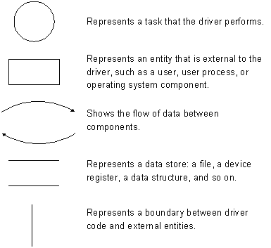
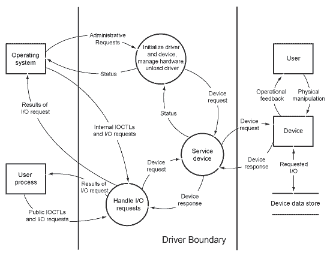
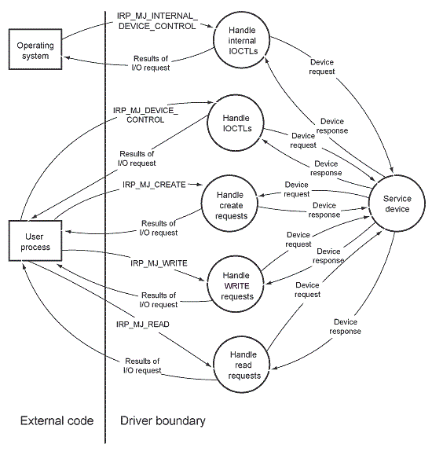
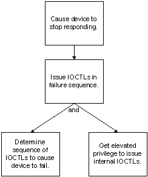

# Threat modeling for drivers

Driver writers and architects should make threat modeling an integral part of the design process for any driver. This topic provides guidelines for creating threat models for Windows drivers.

Security should be a fundamental design point for any driver. Any successful product is a target. If you are writing a driver for Windows, you must assume that sometime, somewhere, someone will try to use your driver to compromise system security.

Designing a secure driver involves:

-   Identifying the points at which the driver could be vulnerable to an attack.
-   Analyzing the types of attacks that could be mounted at each such point.
-   Ensuring that the driver is designed in such a way as to thwart such attacks.

Threat modeling is a structured approach to these important design tasks. A threat model is a way of categorizing and analyzing the threats to an asset. From a driver writer’s perspective, the assets are the hardware, software, and data on the computer or network.

A threat model answers the following questions:

-   Which assets need protection?
-   To what threats are the assets vulnerable?
-   How important or likely is each threat?
-   How can you mitigate the threats?

Threat modeling is an important part of software design because it ensures that security is built into the product, rather than addressed as an afterthought. A good threat model can help find and prevent bugs during the design process, thus eliminating potentially costly patches later and possible reputational damage to your organization.

This section applies the principles of threat modeling to driver design and provides examples of threats to which a driver might be susceptible. For a more complete description of threat modeling for software design, refer to these resources.

-   The Microsoft SDL Web site:

    <https://www.microsoft.com/sdl>

-   Simplified Implementation of the Microsoft SDL:

    [Download White Paper](https://go.microsoft.com/?linkid=9708425)

-   This blog entry describes how to download a free copy of *The Security Development Lifecycle: SDL*, by Michael Howard and Steve Lipner:

    <https://blogs.msdn.microsoft.com/microsoft_press/2016/04/19/free-ebook-the-security-development-lifecycle/>

## Create threat models for drivers

Creating a threat model requires a thorough understanding of the driver’s design, the types of threats to which the driver might be exposed, and the consequences of a security attack that exploits a particular threat. After creating the threat model for a driver, you can determine how to mitigate the potential threats.

Threat modeling is most effective when performed in an organized, structured way during driver design, rather than haphazardly during coding. A structured approach increases the likelihood that you will discover vulnerabilities in the design, thereby helping to ensure that the model is comprehensive.

One way to organize a threat modeling effort is to follow these steps:

1.  Create a structured diagram showing data flow through the driver. Include all possible tasks that the driver performs and the source and destination of all input and output from the driver. A formal data flow diagram, or similar structured diagram, can help you to analyze the path of data through your driver and to identify the driver’s external interfaces, boundaries, and interactions. 
2.  Analyze the potential security threats, based on the data flow diagram.
3.  Assess the threats that you identified in the previous step and determine how to mitigate them.

## Create a data flow diagram

A data flow diagram shows in conceptual form the flow of data between the driver and the external entities with which it interacts—typically the operating system, a user process, and the device. A formal data flow diagram uses the following symbols:

The following figure shows a sample data flow diagram for a hypothetical kernel-mode Windows Driver Model (WDM) driver. Regardless of the architecture for your particular type of driver, the conceptual model is the same: show all data paths and identify each source of data that enters or exits the driver.

**Note**  The previous figure shows data flowing directly between a user process and the driver, and omits any intermediate drivers. However, in reality, all requests pass through the I/O manager and may traverse one or more higher-level drivers before reaching a particular driver. The figure omits these intermediate steps to emphasize the importance of the original source of the data and the context of the thread that supplied the data. Kernel-mode drivers must validate data that originates in user mode.

Information enters the driver because of requests from the operating system, requests from a user process, or requests (typically interrupts) from the device.

The driver in the previous figure receives data from the operating system in several types of requests:

-   Requests to perform administrative tasks for the driver and its device, through calls to **DriverEntry**, **DriverUnload**, and **AddDevice** routines
-   Plug and Play requests (IRP\_MJ\_PNP)
-   Power management requests (IRP\_MJ\_POWER)
-   Internal device I/O control requests (IRP\_MJ\_INTERNAL\_DEVICE\_CONTROL)

In response to these requests, data flows from the driver back to the operating system as status information. The driver in the figure receives data from a user process in the following types of requests:

-   Create, read, and write requests (IRP\_MJ\_CREATE, IRP\_MJ\_READ, or IRP\_MJ\_WRITE)
-   Public device I/O control requests (IRP\_MJ\_DEVICE\_ CONTROL)

In response to these requests, output data and status information flow from the driver back to the user process.

Finally, the driver receives data from the device because of device I/O operations or user actions (such as opening the tray on a CD drive) that change device status. Likewise, data from the driver flows to the device during I/O operations and changes in device status.

The previous figure shows driver data flow at a broad conceptual level. Each circle represents a relatively large task and lacks detail. In some cases, a one-level diagram such as the sample is adequate for understanding the data sources and paths. If your driver handles many different types of I/O requests from varying sources, you might need to create one or more additional diagrams that show more detail. For example, the circle labeled “Handle I/O Requests” might be expanded into a separate diagram, similar to the following figure.

The second diagram shows separate tasks for each type of I/O request in the first diagram. (For simplicity, data paths to the device have been omitted.)

The external entities and the types of input and output shown in the diagram may vary, depending on the type of device. For example, Windows supplies class drivers for many common device types. A system-supplied class driver works with a vendor-supplied minidriver, which typically is a dynamic link library (DLL) that contains a set of callback routines. User I/O requests are directed to the class driver, which then calls the routines in the minidriver to perform specific tasks. The minidriver typically does not receive the entire I/O request packet as input; instead, each callback routine receives only the data that is required for its specific task.

As you create the data flow diagrams, remember the variety of sources for driver requests. Any code that is run on a user’s computer could generate an I/O request to a driver, from well-known applications such as Microsoft Office to freeware, shareware, and Web downloads of potentially dubious origin. Depending on your specific device, you might also need to consider media codecs or third-party filters that your company ships to support its device. Possible data sources include:

-   IRP\_MJ\_XXX requests that the driver handles
-   IOCTLs that the driver defines or handles
-   APIs that the driver calls
-   Callback routines
-   Any other interfaces that the driver exposes
-   Files that the driver reads or writes, including those used during installation
-   Registry keys that the driver reads or writes
-   Configuration property pages, and any other information provided by the user that the driver consumes

Your model should also cover the driver installation and update procedures. Include all the files, directories, and registry entries that are read or written during driver installation. Consider also the interfaces exposed in device installers, co-installers, and property pages.

Any point at which the driver exchanges data with an external entity is potentially vulnerable to attack.

## Analyze potential threats

After you identify the points at which a driver might be vulnerable, you can determine which types of threats could occur at each point. Consider the following types of questions:

-   What security mechanisms are in place to protect each resource?
-   Are all transitions and interfaces properly secured?
-   Could improper use of a feature unintentionally compromise security?
-   Could malicious use of a feature compromise security?
-   Do default settings provide adequate security?

## The STRIDE approach to threat categorization

The acronym STRIDE describes six categories of threats to software. This acronym is derived from:

-   **S**poofing
-   **T**ampering
-   **R**epudiation
-   **I**nformation disclosure
-   **D**enial of service
-   **E**levation of privilege

Using STRIDE as a guide, you can pose detailed questions about the kinds of attacks that could be targeted at a driver. The goal is to determine the types of attacks that could be possible at each vulnerable point in the driver and then to create a scenario for each possible attack.

-   **Spoofing** is using someone else’s credentials to gain access to otherwise inaccessible assets. A process mounts a spoofing attack by passing forged or stolen credentials.
-   **Tampering** is changing data to mount an attack. For example, a driver might be susceptible to tampering if the required driver files are not adequately protected by driver signing and access control lists (ACLs). In this situation, a malicious user could alter the files, thus breaching system security.
-   **Repudiation** occurs when a user denies performing an action, but the target of the action has no way to prove otherwise. A driver might be susceptible to a repudiation threat if it does not log actions that could compromise security. For example, a driver for a video device could be susceptible to repudiation if it does not log requests to change characteristics of its device, such as focus, scanned area, frequency of image capture, target location of captured images, and so forth. The resulting images could be corrupted, but system administrators would have no way to determine which user caused the problem.
-   **Information disclosure** threats are exactly as the name implies: the disclosure of information to a user who does not have permission to see it. Any driver that passes information to or from a user buffer is susceptible to information disclosure threats. To avoid information disclosure threats, drivers must validate the length of each user buffer and zero-initialize the buffers before writing data.
-   **Denial-of-service** attacks threaten the ability of valid users to access resources. The resources could be disk space, network connections, or a physical device. Attacks that slow performance to unacceptable levels are also considered denial-of-service attacks. A driver that allows a user process to monopolize a system resource unnecessarily could be susceptible to a denial-of-service attack if the resource consumption hinders the ability of other valid users to perform their tasks.

    For example, a driver might use a semaphore to protect a data structure while executing at IRQL = PASSIVE\_LEVEL. However, the driver must acquire and release the semaphore within a **KeEnterCriticalRegion/KeLeaveCriticalRegion** pair, which disables and re-enables the delivery of asynchronous procedure calls (APCs). If the driver fails to use these routines, an APC could cause the operating system to suspend the thread that holds the semaphore. As a result, other processes (including those created by an administrator) would be unable to gain access to the structure.

-   An **elevation-of-privilege** attack can occur if an unprivileged user gains privileged status. A kernel-mode driver that passes a user-mode handle to a **ZwXxx** routine is vulnerable to elevation-of-privilege attacks because **ZwXxx** routines bypass security checks. Kernel-mode drivers must validate every handle that they receive from user-mode callers.

    Elevation-of-privilege attacks can also occur if a kernel-mode driver relies on the **RequestorMode** value in the IRP header to determine whether an I/O request comes from a kernel-mode or user-mode caller. In IRPs that arrive from the network or the Server service (SRVSVC), the value of **RequestorMode** is **KernelMode**, regardless of the origin of the request. To avoid such attacks, drivers must perform access control checks for such requests instead of simply using the value of **RequestorMode**.

## Driver analysis techniques

A simple way to organize the analysis is to list the vulnerable areas along with the potential threats and one or more scenarios for each type of threat.

To perform a thorough analysis, you must explore the possibility of threats at every potentially vulnerable point in the driver. At each vulnerable point, determine each category of threat (spoofing, tampering, repudiation, information disclosure, denial of service, and elevation of privilege) that might be possible. Then create one or more attack scenarios for each plausible threat.

For example, consider the data flow for IRP\_MJ\_DEVICE\_CONTROL requests as shown in the preceding figure. The following table shows two types of threats that a driver could encounter when processing such requests:

<table>
<colgroup>
<col width="33%" />
<col width="33%" />
<col width="33%" />
</colgroup>
<thead>
<tr class="header">
<th align="left">Vulnerable point</th>
<th align="left">Potential threat (STRIDE)</th>
<th align="left">Scenario</th>
</tr>
</thead>
<tbody>
<tr class="odd">
<td align="left">IRP_MJ_DEVICE_CONTROL requests</td>
<td align="left">
Denial of service

Elevation of privilege
</td>
<td align="left">
User process issues a sequence of IOCTLs that causes the device to fail.

User process issues an IOCTL that permits FILE_ANY_ACCESS.
</td>
</tr>
</tbody>
</table>

 
One threat is often related to another. For example, an attack that exploits an elevation-of-privilege threat can result in information disclosure or denial of service. Furthermore, some types of attacks depend on a sequence of events. A malicious user might start by exploiting an elevation-of-privilege threat. Then, with the added capabilities that come with elevated privilege, the user might find and exploit additional vulnerabilities.

Threat trees and outlines can be useful in modeling such complex scenarios.

A threat tree is a diagram that shows a hierarchy of threats or vulnerabilities; in essence, a threat tree mimics the malicious user’s steps in mounting an attack. The ultimate goal of the attack is at the top of the tree. Each subordinate level shows the steps required to carry out the attack. The following figure is a simple threat tree for the denial-of-service scenario in the preceding example.

The threat tree shows the required steps to mount a particular attack and the relationships between the steps. An outline is an alternative to a threat tree.

An outline simply lists in hierarchical order the steps to attack a particular threat. For example:

1.0 Cause device to stop responding.

1.1 Issue IOCTLS in failure sequence.

1.1.1 Determine sequence that causes device to fail.

1.1.2 Get elevated privilege to issue internal IOCTLs.

Either technique can help you to understand which threats are most dangerous and which vulnerabilities in your design are most critical.

 

## Fast path threat modeling

If resources are limited, instead of creating a complete threat model diagram, a summary outline can be created to help assess security risks to the driver. For example the text below describes some of the surface areas diagramed in the example driver described in the previous example.

The driver receives data from the operating system in several types of requests:

-   Requests to perform administrative tasks for the driver and its device, through calls to **DriverEntry**, **DriverUnload**, and **AddDevice** routines
-   Plug and Play requests (IRP\_MJ\_PNP)
-   Power management requests (IRP\_MJ\_POWER)
-   Internal device I/O control requests (IRP\_MJ\_INTERNAL\_DEVICE\_CONTROL)

In response to these requests, data flows from the driver back to the operating system as status information. The driver receives data from a user process in the following types of requests:

-   Create, read, and write requests (IRP\_MJ\_CREATE, IRP\_MJ\_READ, or IRP\_MJ\_WRITE)
-   Public device I/O control requests (IRP\_MJ\_DEVICE\_ CONTROL)

In response to these requests, output data and status information flow from the driver back to the user process.

Using this basic understanding of the data flow to your driver, you can examine each input and output area for possible threats.

## The DREAD approach to threat assessment

Determining how and where a driver might be attacked is not enough. You must then assess these potential threats, determine their relative priorities, and devise a mitigation strategy. 

DREAD is an acronym that describes five criteria for assessing threats to software. DREAD stands for:

-   **D**amage
-   **R**eproducibility
-   **E**xploitability
-   **A**ffected users
-   **D**iscoverability

To prioritize the threats to your driver, rank each threat from 1 to 10 on all 5 of the DREAD assessment criteria, and then add the scores and divide by 5 (the number of criteria). The result is a numeric score between 1 and 10 for each threat. High scores indicate serious threats.

-   **Damage**. Assessing the damage that could result from a security attack is obviously a critical part of threat modeling. Damage can include data loss, hardware or media failure, substandard performance, or any similar measure that applies to your device and its operating environment.
-   **Reproducibility** is a measure of how often a specified type of attack will succeed. An easily reproducible threat is more likely to be exploited than a vulnerability that occurs rarely or unpredictable. For example, threats to features that are installed by default, or are used in every potential code path, are highly reproducible.
-   **Exploitability** assesses the effort and expertise that are required to mount an attack. A threat that can be attacked by a relatively inexperienced college student is highly exploitable. An attack that requires highly skilled personnel and is expensive to carry out is less exploitable.

    In assessing exploitability, consider also the number of potential attackers. A threat that can be exploited by any remote, anonymous user is more exploitable than one that requires an onsite, highly authorized user.

-   **Affected Users**. The number of users that could be affected by an attack is another important factor in assessing a threat. An attack that could affect at most one or two users would rate relatively low on this measure. Conversely, a denial-of-service attack that crashes a network server could affect thousands of users and therefore would rate much higher.
-   **Discoverability** is the likelihood that a threat will be exploited. Discoverability is difficult to estimate accurately. The safest approach is to assume that any vulnerability will eventually be taken advantage of and, consequently, to rely on the other measures to establish the relative ranking of the threat.

**Sample: Assessing threats using DREAD**

Continuing with the example discussed above, the following table shows how a designer might assess the hypothetical denial-of-service attack:

| DREAD Criterion | Score   | Comments                                                                |
|-----------------|---------|-------------------------------------------------------------------------|
| Damage          | 8       | Disrupts work temporarily, but causes no permanent damage or data loss. |
| Reproducibility | 10      | Causes the device to fail every time.                                   |
| Exploitability  | 7       | Requires a focused effort to determine the command sequence.            |
| Affected users  | 10      | Affects every model of this device on the market.                       |
| Discoverability | 10      | Assumes that every potential threat will be discovered.                 |
| **Total:**      | **9.0** | **Mitigating this problem is high priority.**                           |

**Mitigating  Threats**

Your driver design should mitigate against all the threats that your model exposes. However, in some cases, mitigation might not be practical. For example, consider an attack that potentially affects very few users and is unlikely to result in loss of data or system usability. If mitigating such a threat requires several months of additional effort, you might reasonably choose to spend additional time testing the driver instead. Nevertheless, remember that eventually a malicious user is likely to find the vulnerability and mount an attack, and then the driver will require a patch for the problem.

## Including threat modeling in a broader Security Development Lifecycle process

Consider including the threat modeling process in a broader Secure Development Lifecycle - SDL.

The Microsoft SDL process provides a number of recommended software development process that can be modified to fit any size of organization - including a single developer. Consider adding components of the SDL recommendations to your software development process.

For more information, see [Microsoft Security Development Lifecycle (SDL) – Process Guidance](https://msdn.microsoft.com/library/84aed186-1d75-4366-8e61-8d258746bopq.aspx).

**Training and organizational capabilities** - Pursue software development security training to expand your ability to recognize and remediate software vulnerabilities.

Microsoft makes its four core SDL Training classes available for download. [Microsoft Security Development Lifecycle Core Training classes](https://go.microsoft.com/?linkid=9708478)

For more detailed information about SDL training, see this white paper. [Essential Software Security Training for the Microsoft SDL](https://www.microsoft.com/download/details.aspx?id=9950)

**Requirements and design** - The best opportunity to build trusted software is during the initial planning stages of a new release or a new version, because development teams can identify key objects and integrate security and privacy, which minimizes disruption to plans and schedules.

A key output in this phase is to set specific security goals. For example, deciding that all of your code should pass the Visual Studio code analysis "All Rules" with zero warnings.

**Implementation** - All development teams should define and publish a list of approved tools and their associated security checks, such as compiler/linker options and warnings.

For a driver developer most of the useful work is done in this phase. As code is written it is reviewed for possible weakness. Tools such as code analysis and driver verifier are used to look for areas in the code that can be hardened.

**Verification** - Verification is the point at which the software is functionally complete and is tested against security goals outlined in the requirements and design phase.

Additional tools such as binscope and fuzz testers can be used to validate that security design goals have been met and the code is ready to ship

**Release and response** - In preparation for releasing a product, it is desirable to create an incident response plan that describes what you will do to respond to new threats and how you will service the driver after it has shipped. Doing this work in advance will mean that you will be able to respond faster if security issues are identified in code that has shipped.

For more information about the SDL process, see these additional resources:

-   This is the primary Microsoft SDL site and provides an overview of SDL. <https://www.microsoft.com/sdl>

-   This blog describes how to download a free copy of *The Security Development Lifecycle: SDL*, by Michael Howard and Steve Lipner. <https://blogs.msdn.microsoft.com/microsoft_press/2016/04/19/free-ebook-the-security-development-lifecycle/>

-   This page provides links to additional SDL publications. <https://www.microsoft.com/SDL/Resources/publications.aspx>

## Call to action

For driver developers:

-   Make threat modeling part of driver design.
-   Take steps to efficiently mitigate threats in your driver code.
-   Become familiar with the security and reliability issues that apply to your driver and device type. For more information, see the device-specific sections of the Windows Device Driver Kit (WDK).
-   Understand which checks the operating system, I/O manager, and any higher-level drivers perform before user requests reach your driver — and which checks they do not perform.
-   Use tools from the WDK, such as driver verifier to test and verify your driver.
-   Review public databases of known threats and software vulnerabilities.

For additional driver security resources, see [Driver Security Checklist](driver-security-checklist.md).

## Software Security Resources

**Books**

*Writing Secure Code*, Second Edition by Michael Howard and David LeBlanc

*24 Deadly Sins of Software Security: Programming Flaws and How to Fix Them*, First Edition by Michael Howard, David LeBlanc and John Viega

*The art of software security assessment : identifying and preventing software vulnerabilities*, by Mark Dowd, John McDonald and Justin Schuh

**Microsoft Hardware and Driver Developer Information**

[Common Driver Reliability Problems](https://download.microsoft.com/download/5/7/7/577a5684-8a83-43ae-9272-ff260a9c20e2/drvqa.doc) white paper

[Cancel Logic in Windows Drivers](https://msdn.microsoft.com/library/windows/hardware/dn653289) white paper

[Windows security model: what every driver writer needs to know](windows-security-model.md)

**Microsoft Windows Driver Development Kit (DDK)**

See [Driver Programming Techniques](https://msdn.microsoft.com/library/windows/hardware/ff544177) in [Kernel-Mode Driver Architecture](https://msdn.microsoft.com/library/windows/hardware/ff557560)

**Test Tools**

See [Windows Hardware Lab Kit](https://msdn.microsoft.com/library/windows/hardware/dn930814) in [Test for performance and compatibility](https://msdn.microsoft.com/windows/hardware/commercialize/test/index)

**Public databases of known threats and software vulnerabilities**

To expand your knowledge of software threats, review the available public databases of known threats and software vulnerabilities.

-   Common Vulnerabilities and Exposures (CVE): <https://cve.mitre.org/>
-   Common Weakness Enumeration: <https://cwe.mitre.org/>
-   Common Attack Pattern Enumeration and Classification: <https://capec.mitre.org/index.html>
-   NIST maintains a site that describes how vulnerabilities are cataloged: <https://samate.nist.gov/BF/>

 

