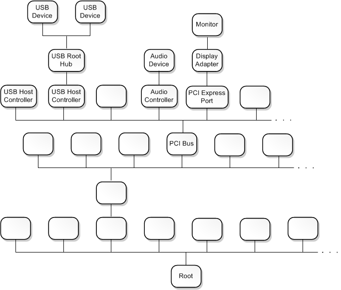

# Device nodes and device stacks

In Windows, devices are represented by device nodes in the Plug and Play (PnP) device tree. Typically, when an I/O request is sent to a device, several drivers help handle the request. Each of these drivers is associated with a device object, and the device objects are arranged in a stack. The sequence of device objects along with their associated drivers is called a device stack. Each device node has its own device stack.

## Device nodes and the Plug and Play device tree

Windows organizes devices in a tree structure called the *Plug and Play device tree*, or simply the *device tree*. Typically, a node in the device tree represents either a device or an individual function on a composite device. However, some nodes represent software components that have no association with physical devices.

A node in the device tree is called a *device node*. The root node of the device tree is called the *root device node*. By convention, the root device node is drawn at the bottom of the device tree, as shown in the following diagram.

The device tree illustrates the parent/child relationships that are inherent in the PnP environment. Several of the nodes in the device tree represent buses that have child devices connected to them. For example, the PCI Bus node represents the physical PCI bus on the motherboard. During startup, the PnP manager asks the PCI bus driver to enumerate the devices that are connected to the PCI bus. Those devices are represented by child nodes of the PCI Bus node. In the preceding diagram, the PCI Bus node has child nodes for several devices that are connected to the PCI bus, including USB host controllers, an audio controller, and a PCI Express port.

Some of the devices connected to the PCI bus are buses themselves. The PnP manager asks each of these buses to enumerate the devices that are connected to it. In the preceding diagram, we can see that the audio controller is a bus that has an audio device connected to it. We can see that the PCI Express port is a bus that has a display adapter connected to it, and the display adapter is a bus that has one monitor connected to it.

Whether you think of a node as representing a device or a bus depends on your point of view. For example, you can think of the display adapter as a device that plays a key role in preparing frames that appear on the screen. However, you can also think of the display adapter as a bus that is capable of detecting and enumerating connected monitors.

## Device objects and device stacks

A *device object* is an instance of a [**DEVICE\_OBJECT**](https://msdn.microsoft.com/library/windows/hardware/ff543147) structure. Each device node in the PnP device tree has an ordered list of device objects, and each of these device objects is associated with a driver. The ordered list of device objects, along with their associated drivers, is called the *device stack* for the device node.

You can think of a device stack in several ways. In the most formal sense, a device stack is an ordered list of (device object, driver) pairs. However, in certain contexts it might be useful to think of the device stack as an ordered list of device objects. In other contexts, it might be useful to think of the device stack as an ordered list of drivers.

By convention, a device stack has a top and a bottom. The first device object to be created in the device stack is at the bottom, and the last device object to be created and attached to the device stack is at the top.

In the following diagram, the Proseware Gizmo device node has a device stack that contains three (device object, driver) pairs. The top device object is associated with the driver AfterThought.sys, the middle device object is associated with the driver Proseware.sys, and the bottom device object is associated with the driver Pci.sys. The PCI Bus node in the center of the diagram has a device stack that contains two (device object, driver) pairs--a device object associated with Pci.sys and a device object associated with Acpi.sys.

## How does a device stack get constructed?

During startup, the PnP manager asks the driver for each bus to enumerate child devices that are connected to the bus. For example, the PnP manager asks the PCI bus driver (Pci.sys) to enumerate the devices that are connected to the PCI bus. In response to this request, Pci.sys creates a device object for each device that is connected to the PCI bus. Each of these device objects is called a *physical device object* (PDO). Shortly after Pci.sys creates the set of PDOs, the device tree looks like the one shown in the following diagram.

The PnP manager associates a device node with each newly created PDO and looks in the registry to determine which drivers need to be part of the device stack for the node. The device stack must have one (and only one) *function driver* and can optionally have one or more *filter drivers*. The function driver is the main driver for the device stack and is responsible for handling read, write, and device control requests. Filter drivers play auxiliary roles in processing read, write, and device control requests. As each function and filter driver is loaded, it creates a device object and attaches itself to the device stack. A device object created by the function driver is called a *functional device object* (FDO), and a device object created by a filter driver is called a *filter device object* (Filter DO). Now the device tree looks something like this diagram.

In the diagram, notice that in one node, the filter driver is above the function driver, and in the other node, the filter driver is below the function driver. A filter driver that is above the function driver in a device stack is called an *upper filter driver*. A filter driver that is below the function driver is called a *lower filter driver*.

The PDO is always the bottom device object in a device stack. This results from the way a device stack is constructed. The PDO is created first, and as additional device objects are attached to the stack, they are attached to the top of the existing stack.

**Note**  
When the drivers for a device are installed, the installer uses information in an information (INF) file to determine which driver is the function driver and which drivers are filters. Typically the INF file is provided either by Microsoft or by the hardware vendor. After the drivers for a device are installed, the PnP manager can determine the function and filter drivers for the device by looking in the registry.

 

## Bus drivers

In the preceding diagram, you can see that the driver Pci.sys plays two roles. First, Pci.sys is associated with the FDO in the PCI Bus device node. In fact, it created the FDO in the PCI Bus device node. So Pci.sys is the function driver for the PCI bus. Second, Pci.sys is associated with the PDO in each child of the PCI Bus node. Recall that it created the PDOs for the child devices. The driver that creates the PDO for a device node is called the *bus driver* for the node.

If your point of reference is the PCI bus, then Pci.sys is the function driver. But if your point of reference is the Proseware Gizmo device, then Pci.sys is the bus driver. This dual role is typical in the PnP device tree. A driver that serves as function driver for a bus also serves as bus driver for a child device of the bus.

## User-mode device stacks

So far we've been discussing kernel-mode device stacks. That is, the drivers in the stacks run in kernel mode, and the device objects are mapped into system space, which is the address space that is available only to code running in kernel mode. For information about the difference between kernel mode and user mode, see [User mode and kernel mode](user-mode-and-kernel-mode.md).

In some cases, a device has a user-mode device stack in addition to its kernel-mode device stack. User-mode drivers are often based on the User-Mode Driver Framework (UMDF), which is one of the driver models provided by the [Windows Driver Frameworks (WDF)](https://docs.microsoft.com/windows-hardware/drivers/wdf/). In UMDF, the drivers are user-mode DLLs, and the device objects are COM objects that implement the IWDFDevice interface. A device object in a UMDF device stack is called a *WDF device object* (WDF DO).

The following diagram shows the device node, kernel-mode device stack, and the user-mode device stack for a USB-FX-2 device. The drivers in both the user-mode and kernel-mode stacks participate in I/O requests that are directed at the USB-FX-2 device.

## Related topics

[Concepts for all driver developers](concepts-and-knowledge-for-all-driver-developers.md)

[Driver stacks](driver-stacks.md)

 

 

