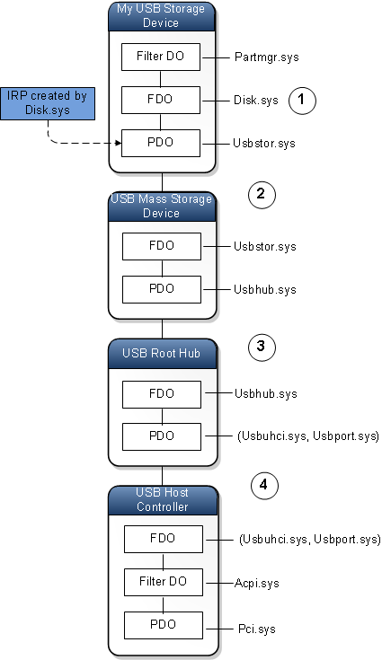
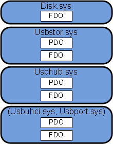
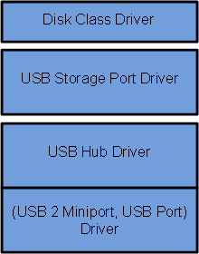
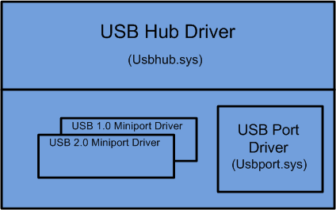

# Driver stacks

Most of the requests that are sent to device drivers are packaged in [I/O request packets](i-o-request-packets.md) (IRPs). Each device is represented by a device node, and each device node has a device stack. For more information, see [Device nodes and device stacks](device-nodes-and-device-stacks.md). To send a read, write, or control request to a device, the I/O manager locates the device node for the device and then sends an IRP to the device stack of that node. Sometimes more than one device stack is involved in processing an I/O request. Regardless of how many device stacks are involved, the overall sequence of drivers that participate in an I/O request is called the *driver stack* for the request. We also use the term *driver stack* to refer to the layered set of drivers for a particular technology.

## I/O requests that are processed by several device stacks

In some cases, more than one device stack is involved in processing an IRP. The following diagram illustrates a case where four device stacks are involved in processing a single IRP.

Here is how the IRP is processed at each numbered stage in the diagram:

1.  The IRP is created by Disk.sys, which is the function driver in the device stack for the My USB Storage Device node. Disk.sys passes the IRP down the device stack to Usbstor.sys.

2.  Notice that Usbstor.sys is the PDO driver for the My USB Storage Device node and the FDO driver for the USB Mass Storage Device node. At this point, it is not important to decide whether the IRP is owned by the (PDO, Usbstor.sys) pair or the (FDO, Usbstor.sys) pair. The IRP is owned by the driver, Usbstor.sys, and the driver has access to both the PDO and the FDO.
3.  When Usbstor.sys has finished processing the IRP, it passes the IRP to Usbhub.sys. Usbhub.sys is the PDO driver for the USB Mass Storage Device node and the FDO driver for the USB Root Hub node. It is not important to decide whether the IRP is owned by the (PDO, Usbhub.sys) pair or the (FDO, Usbhub.sys) pair. The IRP is owned by the driver, Usbhub.sys, and the driver has access to both the PDO and the FDO.

4.  When Usbhub.sys has finished processing the IRP, it passes the IRP to the (Usbuhci.sys, Usbport.sys) pair.

    Usbuhci.sys is a miniport driver, and Usbport.sys is a port driver. The (miniport, port) pair plays the role of a single driver. In this case, both the miniport driver and the port driver are written by Microsoft. The (Usbuhci.sys, Usbport.sys) pair is the PDO driver for the USB Root Hub node, and the (Usbuhci.sys, Usbport.sys) pair is also the FDO driver for the USB Host Controller node. The (Usbuhci.sys, Usbport.sys) pair does the actual communication with the host controller hardware, which in turn communicates with the physical USB storage device.

## The driver stack for an I/O request

Consider the sequence of four drivers that participated in the I/O request illustrated in the preceding diagram. We can get another view of the sequence by focusing on the drivers rather than on the device nodes and their individual device stacks. The following diagram shows the drivers in sequence from top to bottom. Notice that Disk.sys is associated with one device object, but each of the other three drivers is associated with two device objects.

The sequence of drivers that participate in an I/O request is called the *driver stack for the I/O request*. To illustrate a driver stack for an I/O request, we draw the drivers from top to bottom in the order that they participate in the request.

Notice that the driver stack for an I/O request is quite different from the device stack for a device node. Also notice that the driver stack for an I/O request does not necessarily remain in one branch of the device tree.

## Technology driver stacks

Consider the driver stack for the I/O request shown in the preceding diagram. If we give each of the drivers a friendly name and make some slight changes to the diagram, we have a block diagram that is similar to many of those that appear in the Windows Driver Kit (WDK) documentation.

In the diagram, the driver stack is divided into three sections. We can think of each section as belonging to a particular technology or to a particular component or portion of the operating system. For example, we might say that the first section at the top of the driver stack belongs to the Volume Manager, the second section belongs to the storage component of the operating system, and the third section belongs to the core USB portion of the operating system.

Consider the drivers in the third section. These drivers are a subset of a larger set of core USB drivers that Microsoft provides for handling various kinds of USB requests and USB hardware. The following diagram shows what the entire USB core block diagram might look like.

A block diagram that shows all of the drivers for a particular technology or a particular component or portion of the operating system is called a *technology driver stack*. Typically, technology driver stacks are given names like the USB Core Driver Stack, the Storage Stack, the 1394 Driver Stack, and the Audio Driver Stack.

**Note**  The USB core block diagram in this topic shows one of several possible ways to illustrate the technology driver stacks for USB 1.0 and 2.0. For the official diagrams of the USB 1.0, 2.0, and 3.0 driver stacks, see [USB Driver Stack Architecture](https://msdn.microsoft.com/library/windows/hardware/hh406256).

 

## Related topics

[Device nodes and device stacks](device-nodes-and-device-stacks.md)

[Minidrivers and driver pairs](minidrivers-and-driver-pairs.md)

[Concepts for all driver developers](concepts-and-knowledge-for-all-driver-developers.md)

 

 

