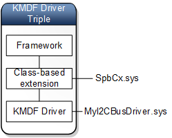

# KMDF extensions and driver triples

In this topic, we discuss class-based extensions to the Kernel Mode Driver Framework (KMDF). Before you read this topic, you should understand the ideas presented in [Minidrivers and driver pairs](minidrivers-and-driver-pairs.md) and [KMDF as a Generic Driver Pair Model](kmdf-as-a-generic-pair-model.md).

For some device classes, Microsoft provides KMDF extensions that further reduce the amount of processing that must be performed by KMDF drivers. A driver that uses a class-based KMDF extension has these three pieces, which we call a *driver triple*.

-   The Framework, which handles tasks common to most all drivers
-   The class-based framework extension, which handles tasks that are specific to a particular class of devices
-   The KMDF driver, which handles tasks that are specific to a particular device.

The three drivers in a driver triple (KMDF driver, device-class KMDF extension, Framework) combine to form a single WDM driver.

An example of a device-class KMDF extension is SpbCx.sys, which is the KMDF extension for the Simple Peripheral Bus (SPB) device class. The SPB class includes synchronous serial buses such as I2C and SPI. A driver triple for an I2C bus controller would look like this:

-   The Framework handles general tasks that are common to most all drivers.
-   SpbCx.sys handles tasks that are specific to the SPB bus class. These are tasks that are common to all SPB busses.
-   The KMDF driver handles tasks that are specific to an I2C bus. Let's call this driver MyI2CBusDriver.sys.

The three drivers in the driver triple (MyI2CBusDriver.sys, SpbCx.sys, Wdf01000.sys) combine to form a single WDM driver that serves as the function driver for the I2C bus controller. Wdf01000.sys (the Framework) owns the dispatch table for this driver, so when someone sends an IRP to the driver triple, it goes to the wdf01000.sys. If the wdf01000.sys can handle the IRP by itself, SpbCx.sys and MyI2CBusDriver.sys are not involved. If wdf01000.sys cannot handle the IRP by itself, it gets help by calling an event handler in SbpCx.sys.

Here are some examples of event handlers that might be implemented by MyI2CBusDriver.sys:

-   EvtSpbControllerLock
-   EvtSpbIoRead
-   EvtSpbIoSequence

Here are some examples of event handlers that are implemented by SpbCx.sys

-   EvtIoRead

 

 

