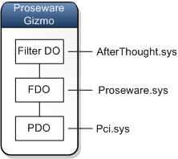

# I/O request packets

Most of the requests that are sent to device drivers are packaged in I/O request packets ([**IRP**](https://msdn.microsoft.com/library/windows/hardware/ff550694)s). An operating system component or a driver sends an IRP to a driver by calling [**IoCallDriver**](https://msdn.microsoft.com/library/windows/hardware/ff548336), which has two parameters: a pointer to a [**DEVICE\_OBJECT**](https://msdn.microsoft.com/library/windows/hardware/ff543147) and a pointer to an **IRP**. The **DEVICE\_OBJECT** has a pointer to an associated [**DRIVER\_OBJECT**](https://msdn.microsoft.com/library/windows/hardware/ff544174). When a component calls **IoCallDriver**, we say the component *sends the IRP to the device object* or *sends the IRP to the driver associated with the device object*. Sometimes we use the phrase *passes the IRP* or *forwards the IRP* instead of *sends the IRP*.

Typically an IRP is processed by several drivers that are arranged in a stack. Each driver in the stack is associated with a device object. For more information, see [Device nodes and device stacks](device-nodes-and-device-stacks.md). When an [**IRP**](https://msdn.microsoft.com/library/windows/hardware/ff550694) is processed by a device stack, the **IRP** is usually sent first to the top device object in the device stack. For example, if an **IRP** is processed by the device stack shown in this diagram, the IRP would be sent first to the filter device object (Filter DO) at the top of the device stack.

## Passing an IRP down the device stack

Suppose the I/O manager sends an IRP to the Filter DO in the diagram. The driver associated with the Filter DO, AfterThought.sys, processes the IRP and then passes it to the functional device object (FDO), which is the next lower device object in the device stack. When a driver passes an IRP to the next lower device object in the device stack, we say the driver *passes the IRP down the device stack*.

Some IRPs are passed all the way down the device stack to the physical device object (PDO). Other IRPs never reach the PDO because they are completed by one of the drivers above the PDO.

## IRPs are self-contained

The IRP structure is self-contained in the sense that it holds all of the information that a driver needs to handle an I/O request. Some parts of the IRP structure hold information that is common to all of the participating drivers in the stack. Other parts of the IRP hold information that is specific to a particular driver in the stack.

 

 

