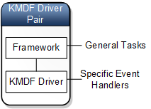
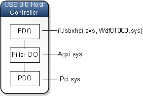

# KMDF as a generic driver pair model

In this topic, we discuss the idea that the Kernel Mode Driver Framework can be viewed as a generic driver pair model. Before you read this topic, you should understand the ideas presented in [Minidrivers and driver pairs](minidrivers-and-driver-pairs.md).

Over the years, Microsoft has created several technology-specific driver models that use this paradigm:

-   The driver is split into two pieces: one that handles general processing and one that handles processing that is specific to a particular device.
-   The general piece, called the Framework, is written by Microsoft.
-   The specific piece, called the KMDF driver, may be written by Microsoft or an independent hardware vendor.

The Framework portion of the driver pair performs general tasks that are common to a wide variety of drivers. For example, the Framework can handle I/O request queues, thread synchronization, and a large portion of the power management duties.

The Framework owns the dispatch table for the KMDF driver, so when someone sends an I/O request packet (IRP) to the (KMDF driver, Framework) pair, the IRP goes to Framework. If the Framework can handle the IRP by itself, the KMDF driver is not involved. If the Framework cannot handle the IRP by itself, it gets help by calling event handlers implemented by the KMDF driver. Here are some examples of event handlers that might be implemented by a KMDF driver.

-   EvtDevicePrepareHardware
-   EvtIoRead
-   EvtIoDeviceControl
-   EvtInterruptIsr
-   EvtInterruptDpc
-   EvtDevicePnpStateChange

For example, a USB 2.0 host controller driver has a specific piece named usbehci.sys and a general piece named usbport.sys. Usbehci.sys, which is called the USB 2.0 Miniport driver, has code that is specific to USB 2.0 host controllers. Usbport.sys, which is called the USB Port driver, has general code that applies to both USB 2.0 and USB 1.0. The pair of drivers (usbehci.sys, usbport.sys) combine to form a single WDM driver for a USB 2.0 host controller.

The (specific, general) driver pairs have a variety of names across different device technologies. Most of the device-specific drivers have the prefix *mini*. The general drivers are often called port or class drivers. Here are some examples of (specific, general) pairs:

-   (display miniport driver, display port driver)
-   (USB miniport driver, USB port driver)
-   (battery miniclass driver, battery class driver)
-   (HID minidriver, HID class driver)
-   (storage miniport driver, storage port driver)

As more and more driver pair models were developed, it became difficult to keep track of all the different ways to write a driver. Each model has it's own interface for communication between the device-specific driver and the general driver. The body of knowledge required to develop drivers for one device technology (for example, Audio) can be quite different from the body of knowledge required to develop drivers for another device technology (for example, Storage).

Over time, developers realized that it would be good to have a single unified model for kernel-mode driver pairs. The Kernel Mode Driver Framework (KMDF), which was first available in Windows Vista, fulfills that need. A driver based on KMDF uses a paradigm that is similar to many of the technology-specific driver pair models.

-   The driver is split into two pieces: one that handles general processing and one that handles processing that is specific to a particular device.
-   The general piece, which is written by Microsoft, is called the Framework.
-   The specific piece, which is written by Microsoft or an independent hardware vendor, is called the KMDF driver.

The USB 3.0 host controller driver is an example of a driver based on KMDF. In this example, both drivers in the pair are written by Microsoft. The general driver is the Framework, and the device-specific driver is the USB 3.0 Host Controller Driver. This diagram illustrates the device node and device stack for a USB 3.0 host controller.

In the diagram, Usbxhci.sys is the USB 3.0 host controller driver. It is paired with Wdf01000.sys, which is the Framework. The (usbxhci.sys, wdf01000.sys) pair forms a single WDM driver that serves as the function driver for the USB 3.0 host controller. Notice that the driver pair occupies one level in the device stack and is represented by single device object. The single device object that represents the (usbxhci.sys, wdf01000.sys) pair is the functional device object (FDO) for the USB 3.0 host controller.

In a (KMDF driver, Framework) pair, the Framework handles tasks that are common to a wide variety of kernel-mode drivers. For example, the Framework can handle queuing of I/O requests, thread synchronization, most of the Plug and Play tasks, and most of the power management tasks. The KMDF driver handles tasks that require interaction with a specific device. The KMDF driver participates in processing requests by registering event handlers that the Framework calls as needed.

## Related topics

[Minidrivers and driver pairs](minidrivers-and-driver-pairs.md)

[Kernel-Mode Driver Framework](../wdf/index.md)

 

