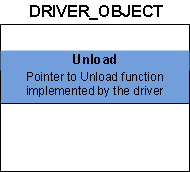
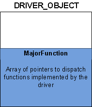
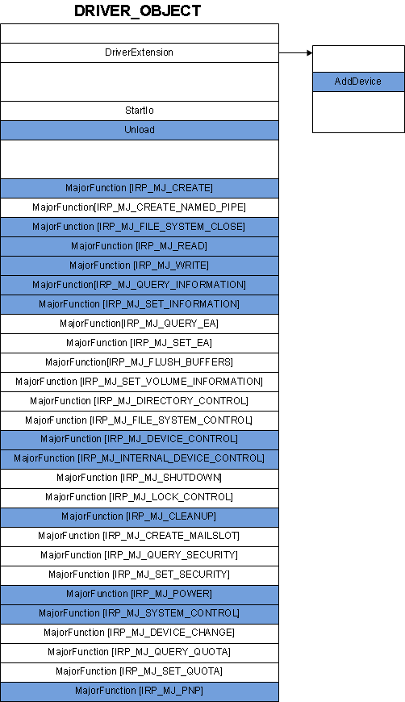
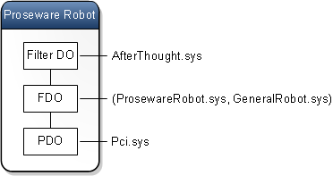
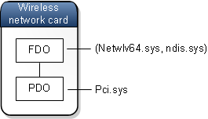

# Minidrivers, Miniport drivers, and driver pairs


A minidriver or a miniport driver acts as half of a driver pair. Driver pairs like (miniport, port) can make driver development easier. In a driver pair, one driver handles general tasks that are common to a whole collection of devices, while the other driver handles tasks that are specific to an individual device. The drivers that handle device-specific tasks go by a variety of names, including miniport driver, miniclass driver, and minidriver.

Microsoft provides the general driver, and typically an independent hardware vendor provides the specific driver. Before you read this topic, you should understand the ideas presented in [Device nodes and device stacks](device-nodes-and-device-stacks.md) and [I/O request packets](i-o-request-packets.md).

Every kernel-mode driver must implement a function named [**DriverEntry**](https://msdn.microsoft.com/library/windows/hardware/ff544113), which gets called shortly after the driver is loaded. The **DriverEntry** function fills in certain members of a [**DRIVER\_OBJECT**](https://msdn.microsoft.com/library/windows/hardware/ff544174) structure with pointers to several other functions that the driver implements. For example, the **DriverEntry** function fills in the **Unload** member of the **DRIVER\_OBJECT** structure with a pointer to the driver's [*Unload*](https://msdn.microsoft.com/library/windows/hardware/ff564886) function, as shown in the following diagram.



The **MajorFunction** member of the [**DRIVER\_OBJECT**](https://msdn.microsoft.com/library/windows/hardware/ff544174) structure is an array of pointers to functions that handle I/O request packets ([**IRP**](https://msdn.microsoft.com/library/windows/hardware/ff550694)s), as shown in the following diagram. Typically the driver fills in several members of the **MajorFunction** array with pointers to functions (implemented by the driver) that handle various kinds of IRPs.



An IRP can be categorized according to its major function code, which is identified by a constant, such as **IRP\_MJ\_READ**, **IRP\_MJ\_WRITE**, or **IRP\_MJ\_PNP**. The constants that identify major function code serve as indices in the **MajorFunction** array. For example, suppose the driver implements a dispatch function to handle IRPs that have the major function code **IRP\_MJ\_WRITE**. In this case, the driver must fill in the **MajorFunction**\[IRP\_MJ\_WRITE\] element of the array with a pointer to the dispatch function.

Typically the driver fills in some of the elements of the **MajorFunction** array and leaves the remaining elements set to default values provided by the I/O manager. The following example shows how to use the [**!drvobj**](https://msdn.microsoft.com/library/windows/hardware/ff562408) debugger extension to inspect the function pointers for the parport driver.

``` syntax
0: kd> !drvobj parport 2
Driver object (fffffa80048d9e70) is for:
 \Driver\Parport
DriverEntry:   fffff880065ea070 parport!GsDriverEntry
DriverStartIo: 00000000 
DriverUnload:  fffff880065e131c parport!PptUnload
AddDevice:     fffff880065d2008 parport!P5AddDevice

Dispatch routines:
[00] IRP_MJ_CREATE                      fffff880065d49d0    parport!PptDispatchCreateOpen
[01] IRP_MJ_CREATE_NAMED_PIPE           fffff80001b6ecd4    nt!IopInvalidDeviceRequest
[02] IRP_MJ_CLOSE                       fffff880065d4a78    parport!PptDispatchClose
[03] IRP_MJ_READ                        fffff880065d4bac    parport!PptDispatchRead
[04] IRP_MJ_WRITE                       fffff880065d4bac    parport!PptDispatchRead
[05] IRP_MJ_QUERY_INFORMATION           fffff880065d4c40    parport!PptDispatchQueryInformation
[06] IRP_MJ_SET_INFORMATION             fffff880065d4ce4    parport!PptDispatchSetInformation
[07] IRP_MJ_QUERY_EA                    fffff80001b6ecd4    nt!IopInvalidDeviceRequest
[08] IRP_MJ_SET_EA                      fffff80001b6ecd4    nt!IopInvalidDeviceRequest
[09] IRP_MJ_FLUSH_BUFFERS               fffff80001b6ecd4    nt!IopInvalidDeviceRequest
[0a] IRP_MJ_QUERY_VOLUME_INFORMATION    fffff80001b6ecd4    nt!IopInvalidDeviceRequest
[0b] IRP_MJ_SET_VOLUME_INFORMATION      fffff80001b6ecd4    nt!IopInvalidDeviceRequest
[0c] IRP_MJ_DIRECTORY_CONTROL           fffff80001b6ecd4    nt!IopInvalidDeviceRequest
[0d] IRP_MJ_FILE_SYSTEM_CONTROL         fffff80001b6ecd4    nt!IopInvalidDeviceRequest
[0e] IRP_MJ_DEVICE_CONTROL              fffff880065d4be8    parport!PptDispatchDeviceControl
[0f] IRP_MJ_INTERNAL_DEVICE_CONTROL     fffff880065d4c24    parport!PptDispatchInternalDeviceControl
[10] IRP_MJ_SHUTDOWN                    fffff80001b6ecd4    nt!IopInvalidDeviceRequest
[11] IRP_MJ_LOCK_CONTROL                fffff80001b6ecd4    nt!IopInvalidDeviceRequest
[12] IRP_MJ_CLEANUP                     fffff880065d4af4    parport!PptDispatchCleanup
[13] IRP_MJ_CREATE_MAILSLOT             fffff80001b6ecd4    nt!IopInvalidDeviceRequest
[14] IRP_MJ_QUERY_SECURITY              fffff80001b6ecd4    nt!IopInvalidDeviceRequest
[15] IRP_MJ_SET_SECURITY                fffff80001b6ecd4    nt!IopInvalidDeviceRequest
[16] IRP_MJ_POWER                       fffff880065d491c    parport!PptDispatchPower
[17] IRP_MJ_SYSTEM_CONTROL              fffff880065d4d4c    parport!PptDispatchSystemControl
[18] IRP_MJ_DEVICE_CHANGE               fffff80001b6ecd4    nt!IopInvalidDeviceRequest
[19] IRP_MJ_QUERY_QUOTA                 fffff80001b6ecd4    nt!IopInvalidDeviceRequest
[1a] IRP_MJ_SET_QUOTA                   fffff80001b6ecd4    nt!IopInvalidDeviceRequest
[1b] IRP_MJ_PNP                         fffff880065d4840    parport!PptDispatchPnp
```

In the debugger output, you can see that parport.sys implements **GsDriverEntry**, the entry point for the driver. **GsDriverEntry**, which was generated automatically when the driver was built, performs some initialization and then calls [**DriverEntry**](https://msdn.microsoft.com/library/windows/hardware/ff544113), which was implemented by the driver developer.

You can also see that the parport driver (in its [**DriverEntry**](https://msdn.microsoft.com/library/windows/hardware/ff544113) function) provides pointers to dispatch functions for these major function codes:

-   IRP\_MJ\_CREATE
-   IRP\_MJ\_CLOSE
-   IRP\_MJ\_READ
-   IRP\_MJ\_WRITE
-   IRP\_MJ\_QUERY\_INFORMATION
-   IRP\_MJ\_SET\_INFORMATION
-   IRP\_MJ\_DEVICE\_CONTROL
-   IRP\_MJ\_INTERNAL\_DEVICE\_CONTROL
-   IRP\_MJ\_CLEANUP
-   IRP\_MJ\_POWER
-   IRP\_MJ\_SYSTEM\_CONTROL
-   IRP\_MJ\_PNP

The remaining elements of the **MajorFunction** array hold pointers to the default dispatch function **nt!IopInvalidDeviceRequest**.

In the debugger output, you can see that the parport driver provided function pointers for [*Unload*](https://msdn.microsoft.com/library/windows/hardware/ff564886) and [*AddDevice*](https://msdn.microsoft.com/library/windows/hardware/ff540521), but did not provide a function pointer for [*StartIo*](https://msdn.microsoft.com/library/windows/hardware/ff563858). The *AddDevice* function is unusual because its function pointer is not stored in the [**DRIVER\_OBJECT**](https://msdn.microsoft.com/library/windows/hardware/ff544174) structure. Instead, it is stored in the **AddDevice** member of an extension to the **DRIVER\_OBJECT** structure. The following diagram illustrates the function pointers that the parport driver provided in its [**DriverEntry**](https://msdn.microsoft.com/library/windows/hardware/ff544113) function. The function pointers provided by parport are shaded.



## <span id="Making_it_easier_by_using_driver_pairs"></span><span id="making_it_easier_by_using_driver_pairs"></span><span id="MAKING_IT_EASIER_BY_USING_DRIVER_PAIRS"></span>Making it easier by using driver pairs


Over a period of time, as driver developers inside and outside of Microsoft gained experience with the Windows Driver Model (WDM), they realized a couple of things about dispatch functions:

-   Dispatch functions are largely boilerplate. For example, much of the code in the dispatch function for IRP\_MJ\_PNP is the same for all drivers. It is only a small portion of the Plug and Play (PnP) code that is specific to an individual driver that controls an individual piece of hardware.
-   Dispatch functions are complicated and difficult to get right. Implementing features like thread synchronization, IRP queuing, and IRP cancellation is challenging and requires a deep understanding of how the operating system works.

To make things easier for driver developers, Microsoft created several technology-specific driver models. At first glance, the technology-specific models seem quite different from each other, but a closer look reveals that many of them are based on this paradigm:

-   The driver is split into two pieces: one that handles the general processing and one that handles processing specific to a particular device.
-   The general piece is written by Microsoft.
-   The specific piece may be written by Microsoft or an independent hardware vendor.

Suppose that the Proseware and Contoso companies both make a toy robot that requires a WDM driver. Also suppose that Microsoft provides a General Robot Driver called GeneralRobot.sys. Proseware and Contoso can each write small drivers that handle the requirements of their specific robots. For example, Proseware could write ProsewareRobot.sys, and the pair of drivers (ProsewareRobot.sys, GeneralRobot.sys) could be combined to form a single WDM driver. Likewise, the pair of drivers (ContosoRobot.sys, GeneralRobot.sys) could combine to form a single WDM driver. In its most general form, the idea is that you can create drivers by using (specific.sys, general.sys) pairs.

## <span id="Function_pointers_in_driver_pairs"></span><span id="function_pointers_in_driver_pairs"></span><span id="FUNCTION_POINTERS_IN_DRIVER_PAIRS"></span>Function pointers in driver pairs


In a (specific.sys, general.sys) pair, Windows loads specific.sys and calls its [**DriverEntry**](https://msdn.microsoft.com/library/windows/hardware/ff544113) function. The **DriverEntry** function of specific.sys receives a pointer to a [**DRIVER\_OBJECT**](https://msdn.microsoft.com/library/windows/hardware/ff544174) structure. Normally you would expect **DriverEntry** to fill in several elements of the **MajorFunction** array with pointers to dispatch functions. Also you would expect **DriverEntry** to fill in the **Unload** member (and possibly the **StartIo** member) of the **DRIVER\_OBJECT** structure and the **AddDevice** member of the driver object extension. However, in a driver pair model, **DriverEntry** does not necessarily do this. Instead the **DriverEntry** function of specific.sys passes the **DRIVER\_OBJECT** structure along to an initialization function implemented by general.sys. The following code example shows how the initialization function might be called in the (ProsewareRobot.sys, GeneralRobot.sys) pair.

```ManagedCPlusPlus
PVOID g_ProsewareRobottCallbacks[3] = {DeviceControlCallback, PnpCallback, PowerCallback};

// DriverEntry function in ProsewareRobot.sys
NTSTATUS DriverEntry (DRIVER_OBJECT *DriverObject, PUNICODE_STRING RegistryPath)
{
   // Call the initialization function implemented by GeneralRobot.sys.
   return GeneralRobotInit(DriverObject, RegistryPath, g_ProsewareRobottCallbacks);
}
```

The initialization function in GeneralRobot.sys writes function pointers to the appropriate members of the [**DRIVER\_OBJECT**](https://msdn.microsoft.com/library/windows/hardware/ff544174) structure (and its extension) and the appropriate elements of the **MajorFunction** array. The idea is that when the I/O manager sends an IRP to the driver pair, the IRP goes first to a dispatch function implemented by GeneralRobot.sys. If GeneralRobot.sys can handle the IRP on its own, then the specific driver, ProsewareRobot.sys, does not have to be involved. If GeneralRobot.sys can handle some, but not all, of the IRP processing, it gets help from one of the callback functions implemented by ProsewareRobot.sys. GeneralRobot.sys receives pointers to the ProsewareRobot callbacks in the GeneralRobotInit call.

At some point after [**DriverEntry**](https://msdn.microsoft.com/library/windows/hardware/ff544113) returns, a device stack gets constructed for the Proseware Robot device node. The device stack might look like this.



As shown in the preceding diagram, the device stack for Proseware Robot has three device objects. The top device object is a filter device object (Filter DO) associated with the filter driver AfterThought.sys. The middle device object is a functional device object (FDO) associated with the driver pair (ProsewareRobot.sys, GeneralRobot.sys). The driver pair serves as the function driver for the device stack. The bottom device object is a physical device object (PDO) associated with Pci.sys.

Notice that the driver pair occupies only one level in the device stack and is associated with only one device object: the FDO. When GeneralRobot.sys processes an IRP, it might call ProsewareRobot.sys for assistance, but that is not the same as passing the request down the device stack. The driver pair forms a single WDM driver that is at one level in the device stack. The driver pair either completes the IRP or passes it down the device stack to the PDO, which is associated with Pci.sys.

## <span id="Example_of_a_driver_pair"></span><span id="example_of_a_driver_pair"></span><span id="EXAMPLE_OF_A_DRIVER_PAIR"></span>Example of a driver pair


Suppose you have a wireless network card in your laptop computer, and by looking in Device Manager, you determine that netwlv64.sys is the driver for the network card. You can use the [**!drvobj**](https://msdn.microsoft.com/library/windows/hardware/ff562408) debugger extension to inspect the function pointers for netwlv64.sys.

``` syntax
1: kd> !drvobj netwlv64 2
Driver object (fffffa8002e5f420) is for:
 \Driver\netwlv64
DriverEntry:   fffff8800482f064 netwlv64!GsDriverEntry
DriverStartIo: 00000000 
DriverUnload:  fffff8800195c5f4 ndis!ndisMUnloadEx
AddDevice:     fffff88001940d30 ndis!ndisPnPAddDevice
Dispatch routines:
[00] IRP_MJ_CREATE                      fffff880018b5530 ndis!ndisCreateIrpHandler
[01] IRP_MJ_CREATE_NAMED_PIPE           fffff88001936f00 ndis!ndisDummyIrpHandler
[02] IRP_MJ_CLOSE                       fffff880018b5870 ndis!ndisCloseIrpHandler
[03] IRP_MJ_READ                        fffff88001936f00 ndis!ndisDummyIrpHandler
[04] IRP_MJ_WRITE                       fffff88001936f00 ndis!ndisDummyIrpHandler
[05] IRP_MJ_QUERY_INFORMATION           fffff88001936f00 ndis!ndisDummyIrpHandler
[06] IRP_MJ_SET_INFORMATION             fffff88001936f00 ndis!ndisDummyIrpHandler
[07] IRP_MJ_QUERY_EA                    fffff88001936f00 ndis!ndisDummyIrpHandler
[08] IRP_MJ_SET_EA                      fffff88001936f00 ndis!ndisDummyIrpHandler
[09] IRP_MJ_FLUSH_BUFFERS               fffff88001936f00 ndis!ndisDummyIrpHandler
[0a] IRP_MJ_QUERY_VOLUME_INFORMATION    fffff88001936f00 ndis!ndisDummyIrpHandler
[0b] IRP_MJ_SET_VOLUME_INFORMATION      fffff88001936f00 ndis!ndisDummyIrpHandler
[0c] IRP_MJ_DIRECTORY_CONTROL           fffff88001936f00 ndis!ndisDummyIrpHandler
[0d] IRP_MJ_FILE_SYSTEM_CONTROL         fffff88001936f00 ndis!ndisDummyIrpHandler
[0e] IRP_MJ_DEVICE_CONTROL              fffff8800193696c ndis!ndisDeviceControlIrpHandler
[0f] IRP_MJ_INTERNAL_DEVICE_CONTROL     fffff880018f9114 ndis!ndisDeviceInternalIrpDispatch
[10] IRP_MJ_SHUTDOWN                    fffff88001936f00 ndis!ndisDummyIrpHandler
[11] IRP_MJ_LOCK_CONTROL                fffff88001936f00 ndis!ndisDummyIrpHandler
[12] IRP_MJ_CLEANUP                     fffff88001936f00 ndis!ndisDummyIrpHandler
[13] IRP_MJ_CREATE_MAILSLOT             fffff88001936f00 ndis!ndisDummyIrpHandler
[14] IRP_MJ_QUERY_SECURITY              fffff88001936f00 ndis!ndisDummyIrpHandler
[15] IRP_MJ_SET_SECURITY                fffff88001936f00 ndis!ndisDummyIrpHandler
[16] IRP_MJ_POWER                       fffff880018c35e8 ndis!ndisPowerDispatch
[17] IRP_MJ_SYSTEM_CONTROL              fffff880019392c8 ndis!ndisWMIDispatch
[18] IRP_MJ_DEVICE_CHANGE               fffff88001936f00 ndis!ndisDummyIrpHandler
[19] IRP_MJ_QUERY_QUOTA                 fffff88001936f00 ndis!ndisDummyIrpHandler
[1a] IRP_MJ_SET_QUOTA                   fffff88001936f00 ndis!ndisDummyIrpHandler
[1b] IRP_MJ_PNP                         fffff8800193e518 ndis!ndisPnPDispatch
```

In the debugger output, you can see that netwlv64.sys implements **GsDriverEntry**, the entry point for the driver. **GsDriverEntry**, which was automatically generated when the driver was built, performs some initialization and then calls [**DriverEntry**](https://msdn.microsoft.com/library/windows/hardware/ff544113), which was written by the driver developer.

In this example, netwlv64.sys implements [**DriverEntry**](https://msdn.microsoft.com/library/windows/hardware/ff544113), but ndis.sys implements [*AddDevice*](https://msdn.microsoft.com/library/windows/hardware/ff540521), [*Unload*](https://msdn.microsoft.com/library/windows/hardware/ff564886), and several dispatch functions. Netwlv64.sys is called an NDIS miniport driver, and ndis.sys is called the NDIS Library. Together, the two modules form an (NDIS miniport, NDIS Library) pair.

This diagram shows the device stack for the wireless network card. Notice that the driver pair (netwlv64.sys, ndis.sys) occupies only one level in the device stack and is associated with only one device object: the FDO.



## <span id="Available_driver_pairs"></span><span id="available_driver_pairs"></span><span id="AVAILABLE_DRIVER_PAIRS"></span>Available driver pairs


The different technology-specific driver models use a variety of names for the specific and general pieces of a driver pair. In many cases, the specific portion of the pair has the prefix "mini." Here are some of (specific, general) pairs that are available:

-   (display miniport driver, display port driver)
-   (audio miniport driver, audio port driver)
-   (storage miniport driver, storage port driver)
-   (battery miniclass driver, battery class driver)
-   (HID minidriver, HID class driver)
-   (changer miniclass driver, changer port driver)
-   (NDIS miniport driver, NDIS library)

**Note**  As you can see in the list, several of the models use the term *class driver* for the general portion of a driver pair. This kind of class driver is different from a standalone class driver and different from a class filter driver.

 

## <span id="related_topics"></span>Related topics


[Concepts for all driver developers](concepts-and-knowledge-for-all-driver-developers.md)

[Device nodes and device stacks](device-nodes-and-device-stacks.md)

[Driver stacks](driver-stacks.md)

 

 


