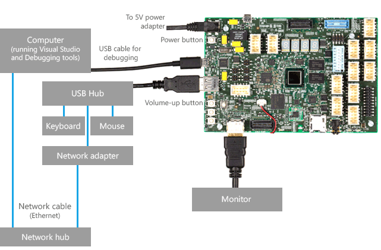

# Sharks Cove hardware development board

> [!WARNING]
> The Sharks Cove hardware development board is no longer supported for Windows IoT Core.  For a list of currently supported boards, see [SoCs and custom boards](/windows/iot-core/learn-about-hardware/socsandcustomboards).

Sharks Cove is a [hardware development board](./windows-compatible-hardware-development-boards.md) that you can use to develop hardware and drivers for Windows.

The Intel Sharks Cove board supports driver development for devices that use a variety of interfaces, including GPIO, I2C, I2S, UART, SDIO, and USB. You can also use the Sharks Cove board to develop drivers for cameras and touch screens.

## Before you start

The instructions given here require that you are running Windows 10, Windows 8.1, or Windows 7. These instructions do not work if you are running Windows 8.

If you are running Windows 7, you need to install [PowerShell 4.0](https://go.microsoft.com/fwlink/p?linkid=507377) and the[Windows Assessment and Deployment Kit (ADK) for Windows 8.1 Update](https://go.microsoft.com/fwlink/p/?linkid=239721). Then on the **Start** menu, go to **All Programs &gt; Windows Kits &gt; Windows ADK &gt; Deployment and Imaging Tools Environment**. Open this Command Prompt window as Administrator. Use this Command Prompt window when you enter the commands given in these instructions.

## Step 1: Get the board and related hardware

You will need this hardware:

- Sharks Cove board with included power cord and adapter.
- USB hub
- USB keyboard
- USB mouse
- USB network adapter
- Monitor and HDMI cable (and possibly adapters)

You can get a Sharks Cove board at [Mouser Electronics](https://go.microsoft.com/fwlink/p?linkid=403172).

## Step 2: Download kits and tools

A driver development environment has two computers: the *host computer* and the *target computer*. The target computer is also called the *test computer*. You develop and build your driver in Microsoft Visual Studio on the host computer. The debugger runs on the host computer and is available in the Visual Studio user interface. When you test and debug a driver, the driver runs on the target computer. In this case, the Sharks Cove board is the target computer.

To develop hardware and drivers for the Sharks Cove board, you need these kits and tools on the host computer:

- [Visual Studio](https://go.microsoft.com/fwlink/p/?LinkId=533470)
- [Windows Driver Kit (WDK), WDK Test Pack, and Debugging Tools for Windows](../download-the-wdk.md)

On the host computer, first download Visual Studio, then download the WDK, and then download the WDK Test Pack. You do not need to download Debugging Tools for Windows separately, because it is included in the WDK.

### Documentation

- The online [documentation for the WDK](../index.yml).

- The online [documentation for Debugging Tools for Windows](../debugger/index.md).

- The documentation for Debugging Tools for Windows is also available as a CHM file in the installation directory. Example: C:\\Program Files (x86)\\Windows Kits\\10\\Debuggers\\x64\\debugger.chm.

## Step 3: Install Windows on the Sharks Cove board

You can install one of these versions of Windows on your Sharks Cove board:

|Term|Description|
|----|----|
|Windows Embedded 8.1 Industry Pro Evaluation|This is a 180-day free trial. We will refer to this as the evaluation version.|
|Windows Embedded 8.1 Industry Pro with Update (x86) - DVD|This requires a subscription. We will refer to this as the full version.|

If you intend to install the evaluation version, read this amendment to the license agreement:

### Evaluation Software License Terms Amendment for the Hardware Developer Program

If the use of this software is in support of the Hardware Developer Program the following terms shall apply:

- You agree to the terms of the Microsoft Evaluation Software License Terms for Windows Embedded 8.1 Industry Pro (“Evaluation Software License Terms”) in its entirety except for:
  - Section 1.b. (Demonstration Rights) of the Evaluation Software License Terms is amended in part, as:
        -   You may demonstrate or deliver for demonstration use to potential customers, a number reasonably necessary for demonstration purposes, Windows Embedded 8.1 Industry Pro devices developed by you through your use of the software ("Demonstration Device"). You may demonstrate and deliver Demonstration Devices to customers that are not under non-disclosure obligations.
  - All provisions in Section 1.b. that do not directly conflict with the amended section above, shall apply.
- **By using the software, you accept these terms.** If you do not accept and comply with these terms, you may not use the software or its features.

Download [Windows Embedded 8.1 Industry (x86) Pro Evaluation](https://go.microsoft.com/fwlink/p?linkid=403173) or Windows Embedded 8.1 Industry Pro with Update (x86) - DVD.
Locate the downloaded file. For example,

9600.17050.WINBLUE\_REFRESH...X86FRE\_EN-US\_DV9.ISO.

Create a folder that will be the root for your Sharks Cove setup files (for example, C:\\SharksCoveWindows). We will call this folder *Root*. In *Root*, create these subfolders:

- Setup
- SharksCoveBsp

Double click your ISO file, and copy these files to *Root*\\Setup.

- Boot
- Efi
- Sources
- Support
- Autorun.inf
- Bootmgr
- Bootmgr.efi
- Setup.exe

>[!NOTE]
>If you are running Windows 7, right-click the ISO file, and choose **Burn disk image** . Burn the image to a recordable DVD. Then copy the files from the DVD to *Root*\\Setup.

Get the Sharks Cove board support package (BSP). Copy all the files in the package to *Root*\\SharksCoveBsp.

Get the [WDK Development Boards Add-on Kit](https://go.microsoft.com/fwlink/p/?linkid=403174). Open the **SourceCode** tab. Click **Download** (not the Downloads tab) to get the kit scripts. Open the Scripts folder, and copy these two items to *Root*.

- Create-DevboardImage.ps1
- DevBoard folder

>[!NOTE]
>The DevBoard folder contains several scripts and modules (DevboardImage.ps1, Devboard.psm1, enable-telnet.ps1, and others).

Open a Command Prompt window as Administrator, and enter **Powershell**. Navigate to *Root*. To add the BSP to your Windows image, enter one of these commands:

If you are using the evaluation version of Windows, enter this command:

``` syntax
.\Create-DevboardImage -SourcePath Setup\sources\install.wim -Index 2 -BspManifest SharksCoveBsp\SharksCoveBsp.xml
```

If you are using the full version of Windows, enter this command:

``` syntax
.\Create-DevboardImage -SourcePath Setup\sources\install.wim -Index 1 -BspManifest SharksCoveBsp\SharksCoveBsp.xml
```

**Note**  You might need to set your execution policy before you run the **Create-DevboardImage** script. For example:

``` syntax
Set-ExecutionPolicy -ExecutionPolicy Unrestricted
```

Now that you have added the BSP to your Windows image, copy these folders and files from *Root*\\Setup to a USB flash drive (FAT32).

- Boot
- Efi
- Sources
- Support
- Autorun.inf
- Bootmgr
- Bootmgr.efi
- Setup.exe

Set up your Sharks Cove hardware as shown here:


Plug the flash drive into the hub that is connected to the Sharks Cove board. Hold the volume-up button as you start or restart the Sharks Cove board. The volume-up button is the top button in the set of three buttons on the left side of the board as shown in the preceding diagram. (If the board is already started, you can turn it off by holding the Power button for several seconds.) When the board starts, you will see the EFI shell on the screen.

>[!NOTE]
>You might need to navigate to the EFI Shell. Go to **Boot Manager &gt; EFI Internal Shell**.

Note the name of the USB flash drive (for example, **fs1**:).

(Here we will use **fs1**: for the name of the USB flash drive.) At the **Shell&gt;** prompt, enter these commands:

**fs1:**
**cd efi\\boot**
**dir**
Verify that bootia32.efi is in the directory. Enter this command:

**bootia32.efi**
Follow the Windows setup instructions on the screen.

## Step 4: Provision the Sharks Cove board for driver deployment and testing

*Provisioning* is the process of configuring a computer for automatic driver deployment, testing, and debugging.

Set up your hardware as shown here.



Provisioning the Sharks Cove board is similar to provisioning any other computer. To provision the Sharks Cove board, follow the instructions in this topic:

- [Provision a computer for driver development and testing (WDK 8.1)](provision-a-target-computer-wdk-8-1.md)

and this topic, which is available on line and in debugger.chm.

- [Setting up Kernel-Mode Debugging using Serial over USB in Visual Studio](../debugger/setting-up-kernel-mode-debugging-using-serial-over-usb-in-visual-studio.md)

>[!NOTE]
>Before you provision the Sharks Cove board, you need to disable Secure Boot. Restart the Sharks Cove board. As the board restarts, hold the Volume-up button. Go to **Device Manager &gt; System Setup &gt; Boot**. Set **UEFI Security Boot** to **Disabled**.

## Step 5: Write a software driver for the Sharks Cove board

Before you write a device driver for the Sharks Cove board, it is helpful to familiarize yourself with the driver development tools by writing a software driver. The procedure is similar to writing a software driver for any other target computer. To get started, follow the hands-on exercises here:

- [Write your first driver](writing-your-first-driver.md)

## Step 6: Alter the Secondary System Description Table (SSDT)

If you are writing a driver for a driver for a device that connects to a simple peripheral bus (SPB) on the Sharks Cove board, you need to update the Secondary System Description Table (SSDT) in the Sharks Cove firmware. An example of this is writing a driver for an accelerometer that transfers data over an I2C bus and generates interrupts through a general-purpose I/O (GPIO) pin. For more information, see [Simple Peripheral Buses](/previous-versions//hh450903(v=vs.85)).

Here's an example of altering the SSDT. We will add a table entry for the [ADXL345](https://go.microsoft.com/fwlink/p?linkid=401463) accelerometer.

>[!NOTE]
>See the [SpbAccelerometer driver cookbook](../sensors/spbaccelerometer-driver-cookbook.md) for a step-by-step guide to the [SpbAccelerometer sample driver](/samples/browse/) and the ADXL345 accelerometer.

1. Copy the x86 version of ASL.exe to the Sharks Cove board. ASL.exe is included in the WDK.

    Example: C:\\Program Files (x86)\\Windows Kits\\8.1\\Tools\\x86\\ACPIVerify\\ASL.exe

2. Open a Command Prompt windows as Administrator. Decompile the SSDT by entering this command:

    **asl /tab=ssdt**

    This creates the file Ssdt.asl.

3. Open Ssdt.asl (for example, in Notepad).

    ``` syntax
    DefinitionBlock("SSDT.AML", "SSDT", 0x01, "Intel_", "ADebTabl", 0x00001000)
    {
        Scope()
        {
            Name(DPTR, 0x3bf2d000)
            Name(EPTR, 0x3bf3d000)
            Name(CPTR, 0x3bf2d010)
            Mutex(MMUT, 0x0)
            Method(MDBG, 0x1, Serialized)
            {
                Store(Acquire(MMUT, 0x3e8), Local0)
                If(LEqual(Local0, Zero))
                {
                    OperationRegion(ABLK, SystemMemory, CPTR, 0x10)
                    Field(ABLK, ByteAcc, NoLock, Preserve)
                    {
                        AAAA, 128
                    }
                    Store(Arg0, AAAA)
                    Add(CPTR, 0x10, CPTR)
                    If(LNot(LLess(CPTR, EPTR)))
                    {
                        Add(DPTR, 0x10, CPTR)
                    }
                    Release(MMUT)
                }
                Return(Local0)
            }
        }

        // Insert a Scope(_SB_) and a Device entry here.

    }
    ```

4. Insert a Scope(\_SB\_) entry. Inside your scope entry, insert your own Device entry. For example, here's a scope(\_SB\_) entry and a Device entry for the ADXL345 accelerometer.

```syntax
    Scope(_SB_)
    {
        Device(SPBA)
        {
            Name(_HID, "SpbAccelerometer")
            Name(_UID, 1)


        Method(_CRS, 0x0, NotSerialized)
        {
            Name(RBUF, ResourceTemplate()
            {
                I2CSerialBus(0x53, ControllerInitiated, 400000, AddressingMode7Bit, "\\_SB.I2C3", 0, ResourceConsumer)
                GpioInt(Edge, ActiveHigh, Exclusive, PullDown, 0, "\\_SB.GPO2") {0x17}
            })

            Return(RBUF)
        }


        Method(_DSM, 0x4, NotSerialized)
        {
            If(LEqual(Arg0, Buffer(0x10)
            {
                0x1e, 0x54, 0x81, 0x76, 0x27, 0x88, 0x39, 0x42, 0x8d, 0x9d, 0x36, 0xbe, 0x7f, 0xe1, 0x25, 0x42
            }))
            {
                If(LEqual(Arg2, Zero))
                {
                    Return(Buffer(One)
                    {
                        0x03
                    })
                }

                If(LEqual(Arg2, One))
                {
                    Return(Buffer(0x4)
                    {
                        0x00, 0x01, 0x02, 0x03
                    })
                }
            }
            Else
            {
                Return(Buffer(One)
                {
                    0x00
                })
            }
        } // Method(_DSM ...)

    } // Device(SPBA)

} // Scope(_SB_)
```

In this example, the entries under `ResourceTemplate()` specify that the accelerometer needs two hardware resources: a connection ID to a particular I2C bus controller (I2C3) and a GPIO interrupt. The interrupt uses pin 0x17 on the GPIO controller named GPO2.

5. After you have added your own Device entry to Ssdt.asl, compile Ssdt.asl by entering this command:

    **asl ssdt.asl**

    This puts the compiled output in a file named Ssdt.aml.

6. Verify that test signing is turned on for the Sharks Cove board.

  >[!NOTE]
  >Test signing is turned on automatically during provisioning.

On the Sharks Cove board, open a Command Prompt window as Administrator. Enter this command.

`bcdedit /enum {current}`

Verify that you see `testsigning Yes` in the output.

``` syntax
Windows Boot Loader
-------------------
identifier              {current}
...
testsigning             Yes
...
```

If you need to turn on test signing manually, here are the steps:

1. Open a Command Prompt window as Administrator, and enter this command.

    **bcdedit /set TESTSIGNING ON**

2. Restart the Sharks Cove board. As the board restarts, hold the Volume-up button. Go to **Device Manager &gt; System Setup &gt; Boot**. Set **UEFI Security Boot** to **Disabled**.
3. Save your changes and continue booting to Windows.

4. To load your updated SSDT, open a Command Prompt window as Administrator, and enter this command:

    **asl /loadtable ssdt.aml**

    Restart the Sharks Cove board.

## Step 7: Connect your device to the Sharks Cove board

Use the specification to determine which pins to use for your device. For example, suppose you want to connect the ADXL345 accelerometer to an I2C bus. In the specification, you can see that the J1C1 header has the pins you need. Here are some, but not all, of the pins you would use on the J1C1 header.

| Pin | Pin name        | Comments                            | ACPI object      |
|-----|-----------------|-------------------------------------|------------------|
| 7   | GPIO\_S5\[23\]  | Accelerometer Interrupt signal      | \_SB.GPO2 {0x17} |
| 13  | SIO\_I2C2\_DATA | I2C Data line for I2C controller 2  | \_SB.I2C3        |
| 15  | SIO\_I2C2\_CLK  | I2C clock line for I2C controller 2 | \_SB.I2C3        |

Notice the relationship to the Device entry in the SSDT.

``` syntax
I2CSerialBus(... "\\_SB.I2C3", , )
GpioInt(... "\\_SB.GPO2") {0x17}
```

## Step 8: Write, build, and deploy a driver for your device

Writing a device driver for the Sharks Cove board is similar to writing a device driver for any other computer. In Visual Studio, you can start with a driver template or you can start with a driver sample.

When you are ready to test your driver on the Sharks Cove board, follow these steps:

1. On the host computer, in Visual Studio, right click your package project, and choose **Properties**. Go to **Driver Install &gt; Deployment**. Check **Enable Deployment** and **Remove previous driver versions before deployment**. For **Target Computer Name**, select the name of your Sharks Cove board. Select **Install and Verify**.
2. Still in the property pages, go to **Driver Signing &gt; General**. For **Sign Mode**, select **Test Sign**. Click **OK**.
3. In your driver project, open your INF file. Edit the hardware ID so that it matches the hardware ID (\_HID) that you created in the SSDT. For example, suppose you put this Device entry in the SSDT.

    ``` syntax
    Device(SPBA)
    {
       Name(_HID, "SpbAccelerometer")
       ...
    ```

    Then the hardware ID in you INF file would be ACPI\\SpbAccelerometer.

    ``` syntax
    [Standard.NT$ARCH$]
    %KMDFDriver1.DeviceDesc%=KMDFDriver1_Device, ACPI\SpbAccelerometer
    ```

4. In Visual Studio, on the **Debug** menu, choose **Start Debugging**.
5. Microsoft Visual Studio first shows progress in the **Output** window. Then it opens the **Debugger Immediate Window** and continues to show progress.

    Wait until your driver has been deployed, installed, and loaded on the Sharks Cove board. This might take a minute or two.

6. If the debugger does not automatically break in, choose **Break All** from the **Debug** menu. The debugger on the host computer will break into the target computer (kernel-mode) or to the correct instance of Wudfhost.exe (UMDF). In the **Debugger Immediate Window**, you'll see a debugger command prompt.

7. To view the loaded modules, enter **lm**. Verify that your driver appears in the list of loaded modules.

## Using WinDbg to debug the Sharks Cove board

As an alternative to using Visual Studio to set up kernel-mode debugging, you can do the setup manually.

- [Setting Up Kernel-Mode Debugging over a USB 3.0 Cable Manually](../debugger/setting-up-a-usb-3-0-debug-cable-connection.md)

As an alternative to using Visual Studio for debugging, you can use WinDbg.

Regardless of whether you use Visual Studio or WinDbg, these hands-on guides are helpful for learning debugger commands:

- [Getting Started with WinDbg (User-Mode)](../debugger/getting-started-with-windbg.md)
- [Getting Started with WinDbg (Kernel-Mode)](../debugger/getting-started-with-windbg--kernel-mode-.md)

## Sample driver code

- [SpbAccelerometer Sample Driver (UMDF Version 1)](/samples/browse/)

## Understanding simple peripheral buses

To learn how Windows drivers work with simple peripheral buses, see [Simple Peripheral Buses](/previous-versions//hh450903(v=vs.85)).

## Related topics

[Concepts for all driver developers](./concepts-and-knowledge-for-all-driver-developers.md)

[Developing, Testing, and Deploying Drivers](../develop/index.md)

[Windows Driver Frameworks](../wdf/index.md)

[Windows Hardware Developer Center](https://developer.microsoft.com/windows/hardware/)

[WDK Samples for Windows](../samples/index.md)

[Technical Support](https://support.microsoft.com/)
