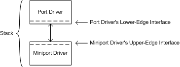
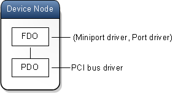
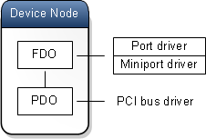
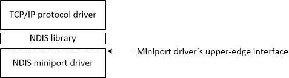
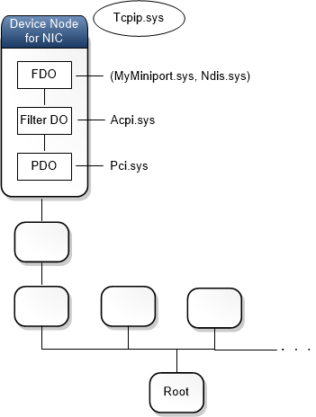

# Upper and lower edges of drivers

The sequence of drivers that participate in an I/O request is called the driver stack for the request. A driver can call into the upper edge of a lower driver in the stack. A driver can also call into the lower edge of a higher driver in the stack.

Before you read this topic, you should understand the ideas presented in [Device nodes and device stacks](device-nodes-and-device-stacks.md) and [Driver stacks](driver-stacks.md).

I/O requests are processed first by the top driver in the driver stack, then by the next lower driver, and so on until the request is fully processed.

When a driver implements a set of functions that a higher driver can call, that set of functions is called the *upper edge* of the driver or the *upper-edge interface* of the driver.

When a driver implements a set of functions that a lower driver can call, that set of functions is called the *lower edge* of the driver or the *lower-edge interface* of the driver.

### Audio example

We can think of an audio miniport driver sitting below an audio port driver in a driver stack. The port driver makes calls to the miniport driver's upper edge. The miniport driver makes calls to the port driver's lower edge.

The preceding diagram illustrates that it is sometimes useful to think of a port driver sitting above a miniport driver in a driver stack. Because I/O requests are processed first by the port driver and then by the miniport driver, it is reasonable to think of the port driver as being above the miniport driver. Keep in mind, however, that a (miniport, port) driver pair usually sits at a single level in a device stack, as shown here.

Note that a *device stack* is not the same thing as a *driver stack*. For definitions of these terms, and for a discussion of how a pair of drivers can form a single WDM driver that occupies one level in a device stack, see [Minidrivers and driver pairs](minidrivers-and-driver-pairs.md).

Here's another way to draw a diagram of the same device node and device stack:

In the preceding diagram, we see that the (miniport, port) pair forms a single WDM driver that is associated with a single device object (the FDO) in the device stack; that is, the (miniport, port) pair occupies only one level in the device stack. But we also see a vertical relationship between the miniport and port drivers. The port driver is shown above the miniport driver to indicate that the port driver processes I/O requests first and then calls into the miniport driver for additional processing.

The key point is that when the port driver calls into the miniport driver's upper-edge interface, that is not the same as passing an I/O request down the device stack. In a driver stack (not device stack) you can choose to draw a port driver above a miniport driver, but that does not mean that the port driver is above the miniport driver in the device stack.

### NDIS example

Sometimes a driver calls the upper edge of a lower driver indirectly. For example, suppose a [TCP/IP protocol driver](../network/introduction-to-ndis-protocol-drivers.md) sits above an [NDIS](../network/ndis-drivers.md) miniport driver in a driver stack. The miniport driver implements a set of *MiniportXxx* functions that form the miniport driver's upper edge. We say that the TCP/IP protocol driver *binds* to the upper edge of the NDIS miniport driver. But the TCP/IP driver does not call the *MiniportXxx* functions directly. Instead, it calls functions in the NDIS library, which then call the *MiniportXxx* functions.

The preceding diagram shows a driver stack. Here's another view of the same drivers.

The preceding diagram shows the device node for a network interface card (NIC). The device node has a position in the Plug and Play (PnP) device tree. The device node for the NIC has a device stack with three device objects. Notice that the NDIS miniport driver and the NDIS library work as a pair. The pair (MyMiniport.sys, Ndis.sys) forms a single WDM driver that is represented by the functional device object (FDO).

Also notice that the protocol driver Tcpip.sys is not part of the device stack for the NIC. In fact, Tcpip.sys is not part of the PnP device tree at all.

## Summary

The terms *upper edge* and *lower edge* are used to describe the interfaces that drivers in a stack use to communicate with each other. A [*driver stack*](driver-stacks.md) is not the same thing as [*device stack*](device-nodes-and-device-stacks.md). Two drivers that are shown vertically in a driver stack might form a driver pair that sits at a single level in a device stack. Some drivers are not part of the PnP device tree.

## Related topics

[Concepts for all driver developers](concepts-and-knowledge-for-all-driver-developers.md)

[Device nodes and device stacks](device-nodes-and-device-stacks.md)

[Driver stacks](driver-stacks.md)

[Audio Devices](../audio/portal-audio-ref.md)

[Network Drivers Starting with Windows Vista](/previous-versions/windows/hardware/drivers/ff570021(v=vs.85))

 

