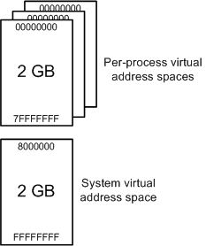

# Virtual address spaces

When a processor reads or writes to a memory location, it uses a virtual address. As part of the read or write operation, the processor translates the virtual address to a physical address. Accessing memory through a virtual address has these advantages:

-   A program can use a contiguous range of virtual addresses to access a large memory buffer that is not contiguous in physical memory.

-   A program can use a range of virtual addresses to access a memory buffer that is larger than the available physical memory. As the supply of physical memory becomes small, the memory manager saves pages of physical memory (typically 4 kilobytes in size) to a disk file. Pages of data or code are moved between physical memory and the disk as needed.

-   The virtual addresses used by different processes are isolated from each other. The code in one process cannot alter the physical memory that is being used by another process or the operating system.

The range of virtual addresses that is available to a process is called the *virtual address space* for the process. Each user-mode process has its own private virtual address space. For a 32-bit process, the virtual address space is usually the 2-gigabyte range 0x00000000 through 0x7FFFFFFF. For a 64-bit process, the virtual address space is the 8-terabyte range 0x000'00000000 through 0x7FF'FFFFFFFF. A range of virtual addresses is sometimes called a range of *virtual memory*.

This diagram illustrates some of the key features of virtual address spaces.

The diagram shows the virtual address spaces for two 64-bit processes: Notepad.exe and MyApp.exe. Each process has its own virtual address space that goes from 0x000'0000000 through 0x7FF'FFFFFFFF. Each shaded block represents one page (4 kilobytes in size) of virtual or physical memory. Notice that the Notepad process uses three contiguous pages of virtual addresses, starting at 0x7F7'93950000. But those three contiguous pages of virtual addresses are mapped to noncontiguous pages in physical memory. Also notice that both processes use a page of virtual memory beginning at 0x7F7'93950000, but those virtual pages are mapped to different pages of physical memory.

## User space and system space

Processes like Notepad.exe and MyApp.exe run in user mode. Core operating system components and many drivers run in the more privileged kernel mode. For more information about processor modes, see [User mode and kernel mode](user-mode-and-kernel-mode.md). Each user-mode process has its own private virtual address space, but all code that runs in kernel mode shares a single virtual address space called *system space*. The virtual address space for a user-mode process is called *user space*.

In 32-bit Windows, the total available virtual address space is 2^32 bytes (4 gigabytes). Usually the lower 2 gigabytes are used for user space, and the upper 2 gigabytes are used for system space.

In 32-bit Windows, you have the option of specifying (at boot time) that more than 2 gigabytes are available for user space. The consequence is that fewer virtual addresses are available for system space. You can increase the size of user space to as much as 3 gigabytes, in which case only 1 gigabyte is available for system space. To increase the size of user space, use [**BCDEdit /set increaseuserva**](https://msdn.microsoft.com/library/windows/hardware/ff542202).

In 64-bit Windows, the theoretical amount of virtual address space is 2^64 bytes (16 exabytes), but only a small portion of the 16-exabyte range is actually used. The 8-terabyte range from 0x000'00000000 through 0x7FF'FFFFFFFF is used for user space, and portions of the 248-terabyte range from 0xFFFF0800'00000000 through 0xFFFFFFFF'FFFFFFFF are used for system space.

Code running in user mode has access to user space but does not have access to system space. This restriction prevents user-mode code from reading or altering protected operating system data structures. Code running in kernel mode has access to both user space and system space. That is, code running in kernel mode has access to system space and the virtual address space of the current user-mode process.

Drivers that run in kernel mode must be very careful about directly reading from or writing to addresses in user space. This scenario illustrates why.

1.  A user-mode program initiates a request to read some data from a device. The program supplies the starting address of a buffer to receive the data.

2.  A device driver routine, running in kernel mode, starts the read operation and returns control to its caller.

3.  Later the device interrupts whatever thread is currently running to say that the read operation is complete. The interrupt is handled by kernel-mode driver routines running on this arbitrary thread, which belongs to an arbitrary process.
4.  At this point, the driver must not write the data to the starting address that the user-mode program supplied in Step 1. This address is in the virtual address space of the process that initiated the request, which is most likely not the same as the current process.

## Paged pool and Nonpaged pool

In user space, all physical memory pages can be paged out to a disk file as needed. In system space, some physical pages can be paged out and others cannot. System space has two regions for dynamically allocating memory: paged pool and nonpaged pool. 

Memory that is allocated in paged pool can be paged out to a disk file as needed. Memory that is allocated in nonpaged pool can never be paged out to a disk file.

## Related topics

[User mode and kernel mode](user-mode-and-kernel-mode.md)

 

 

