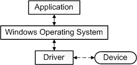
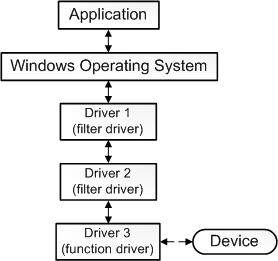
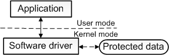
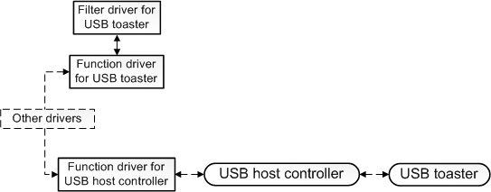

# What is a driver?

It is challenging to give a single precise definition for the term *driver*. In the most fundamental sense, a driver is a software component that lets the operating system and a device communicate with each other. For example, suppose an application needs to read some data from a device. The application calls a function implemented by the operating system, and the operating system calls a function implemented by the driver. The driver, which was written by the same company that designed and manufactured the device, knows how to communicate with the device hardware to get the data. After the driver gets the data from the device, it returns the data to the operating system, which returns it to the application.

## Expanding the definition

Our explanation so far is oversimplified in several ways:

-   Not all drivers have to be written by the company that designed the device. In many cases, a device is designed according to a published hardware standard. This means that the driver can be written by Microsoft, and the device designer does not have to provide a driver.

-   Not all drivers communicate directly with a device. For a given I/O request (like reading data from a device), there are often several drivers, layered in a stack, that participate in the request. The conventional way to visualize the stack is with the first participant at the top and the last participant at the bottom, as shown in this diagram. Some of the drivers in the stack might participate by transforming the request from one format to another. These drivers do not communicate directly with the device; they just manipulate the request and pass the request along to drivers that are lower in the stack.

    

    The one driver in the stack that communicates directly with the device is called the *function driver*; the drivers that perform auxiliary processing are called *filter drivers*.

-   Some filter drivers observe and record information about I/O requests but do not actively participate in them. For example, certain filter drivers act as verifiers to make sure the other drivers in the stack are handling the I/O request correctly.

We could expand our definition of *driver* by saying that a driver is any software component that observes or participates in the communication between the operating system and a device.

## Software drivers

Our expanded definition is reasonably accurate but is still incomplete because some drivers are not associated with any hardware device at all. For example, suppose you need to write a tool that has access to core operating system data structures, which can be accessed only by code running in kernel mode. You can do that by splitting the tool into two components. The first component runs in user mode and presents the user interface. The second component runs in kernel mode and has access to the core operating system data. The component that runs in user mode is called an application, and the component that runs in kernel mode is called a *software driver*. A software driver is not associated with a hardware device. For more information about processor modes, see [User Mode and Kernel Mode](user-mode-and-kernel-mode.md).

This diagram illustrates a user-mode application communicating with a kernel-mode software driver.

## Additional notes

Software drivers always run in kernel mode. The main reason for writing a software driver is to gain access to protected data that is available only in kernel mode. But device drivers do not always need access to kernel-mode data and resources. So some device drivers run in user mode.

There is a category of driver we have not mentioned yet, the *bus driver*. To understand bus drivers, you need to understand device nodes and the device tree. For information about device trees, device nodes, and bus drivers, see [Device Nodes and Device Stacks](device-nodes-and-device-stacks.md).

Our explanation so far over simplifies the definition of *function driver*. We said that the function driver for a device is the one driver in the stack that communicates directly with the device. This is true for a device that connects directly to the Peripheral Component Interconnect (PCI) bus. The function driver for a PCI device obtains addresses that are mapped to port and memory resources on the device. The function driver communicates directly with the device by writing to those addresses. However in many cases, a device does not connect directly to the PCI bus. Instead the device connects to a host bus adapter that is connected to the PCI bus. For example, a USB toaster connects to a host bus adapter (called a USB host controller), which is connected to the PCI bus. The USB toaster has a function driver, and the USB host controller also has a function driver. The function driver for the toaster communicates indirectly with the toaster by sending a request to the function driver for the USB host controller. The function driver for the USB host controller then communicates directly with the USB host controller hardware, which communicates with the toaster.

 

 

