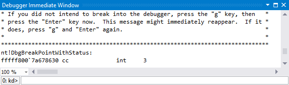

# Write a Universal Windows driver (KMDF) based on a template


This topic describes how to write a [Universal Windows driver](https://msdn.microsoft.com/windows-drivers/develop/getting_started_with_universal_drivers) using Kernel-Mode Driver Framework (KMDF). You'll start with a Microsoft Visual Studio template and then deploy and install your driver on a separate computer.

To get started, be sure you have [Microsoft Visual Studio 2015](https://go.microsoft.com/fwlink/p/?LinkId=698539) and the [Windows Driver Kit (WDK) 10](https://go.microsoft.com/fwlink/p/?LinkId=733614) installed.

[Debugging Tools for Windows](http://go.microsoft.com/fwlink/p?linkid=223405) is included when you install the WDK.

## <span id="Create_and_build_a_driver_package"></span><span id="create_and_build_a_driver_package"></span><span id="CREATE_AND_BUILD_A_DRIVER_PACKAGE"></span>Create and build a driver package


1.  Open Microsoft Visual Studio. On the **File** menu, choose **New &gt; Project**. The **New Project** dialog box opens, as shown here.
2.  In the **New Project** dialog box, select **WDF**.
3.  In the middle pane, select **Kernel Mode Driver (KMDF)**.
4.  In the **Name** field, enter "KmdfDriver" as the project name.

    **Note**  \*When you create a new KMDF or UMDF driver, you must select a driver name that has 32 characters or less. This length limit is defined in wdfglobals.h.

     

5.  In the **Location** field, enter the directory where you want to create the new project.
6.  Check **Create directory for solution**. Click **OK**.

    

    Visual Studio creates one project and a solution. You can them in the **Solution Explorer** window, as shown here. (If the **Solution Explorer** window is not visible, choose **Solution Explorer** from the **View** menu.) The solution has a driver project named KmdfDriver. To see the driver source code, open any of the files under **Source Files**. Driver.c and Device.c are good places to start.

    

7.  In the **Solution Explorer** window, right-click **Solution 'KmdfDriver' (1 project)**, and choose **Configuration Manager**. Choose a configuration and platform for both the driver project and the package project. In this exercise, we choose Debug and x64.

8.  To build your driver and create a driver package, choose **Build Solution** from the **Build** menu. Visual Studio shows the build progress in the **Output** window. (If the **Output** window is not visible, choose **Output** from the **View** menu.)

    When you've verified that the solution built successfully, you can close Visual Studio.

9.  To see the built driver, in File Explorer, go to your **KmdfDriver** folder, and then to **x64\\Debug\\KmdfDriver**. The folder includes:

    -   KmdfDriver.sys -- the kernel-mode driver file
    -   KmdfDriver.inf -- an information file that Windows uses when you install the driver

## <span id="Deploy_and_install_the_driver"></span><span id="deploy_and_install_the_driver"></span><span id="DEPLOY_AND_INSTALL_THE_DRIVER"></span>Deploy and install the driver


Typically when you test and debug a driver, the debugger and driver run on separate computers. The computer that runs the debugger is called the *host computer*, and the computer that runs the driver is called the *target computer*. The target computer is also called the *test computer*. For more information about debugging drivers, see [Debugging Tools for Windows](http://go.microsoft.com/fwlink/p?linkid=223405).

So far you've used Visual Studio to build a driver on the host computer. Now you need to configure a target computer. Follow the instructions in [Provision a computer for driver deployment and testing (WDK 10)](provision-a-target-computer-wdk-8-1.md). Then you can deploy, install, load, and debug your driver:

1.  On the host computer, open your solution in Visual Studio. You can double-click the solution file, KmdfDriver.sln, in your KmdfDriver folder.
2.  In the **Solution Explorer** window, right-click the **KmdfDriver** project, and choose **Properties**.
3.  In the **KmdfDriver Package Property Pages** window, in the left pane, go to **Configuration Properties &gt; Driver Install &gt; Deployment**.
4.  Check **Remove previous driver versions before deployment**.
5.  For **Remote Computer Name**, select the name of the computer that you configured for testing and debugging. In this exercise, we use a computer named MyTestComputer.
6.  Select **Hardware ID Driver Update**, and enter the hardware ID for your driver. In this exercise, the hardware ID is Root\\KmdfDriver. Click **OK**.

    

    **Note**  In this exercise, the hardware ID does not identify a real piece of hardware. It identifies an imaginary device that will be given a place in the [device tree](http://go.microsoft.com/fwlink/p?linkid=399236) as a child of the root node. For real hardware, do not select **Hardware ID Driver Update**; instead, select **Install and Verify**.
    You'll see the hardware ID in your driver's information (INF) file. In the **Solution Explorer** window, go to **KmdfDriver &gt; Driver Files** and double-click KmdfDriver.inf. The hardware ID is located under \[Standard.NT$ARCH$\].

    ```ManagedCPlusPlus
    [Standard.NT$ARCH$]
    %KmdfDriver.DeviceDesc%=KmdfDriver_Device, Root\KmdfDriver
    ```

     

7.  On the **Debug** menu, choose **Start Debugging**, or press **F5** on the keyboard.
8.  Visual Studio first shows progress in the **Output** window. Then it opens the **Debugger Immediate Window** and continues to show progress.

    Wait until your driver has been deployed, installed, and loaded on the target computer. This might take a minute or two.

9.  On the **Debug** menu, choose **Break All**. The debugger on the host computer will break into the target computer. In the **Debugger Immediate Window**, you'll see the kernel debugging command prompt: **kd&gt;**.

    

10. At this point, you can experiment with the debugger by entering commands at the **kd&gt;** prompt. For example, you could try these commands:

    -   [lm](http://go.microsoft.com/fwlink/p?linkid=399236)
    -   [.sympath](http://go.microsoft.com/fwlink/p?linkid=399238)
    -   [.reload](http://go.microsoft.com/fwlink/p?linkid=399239)
    -   [x KmdfDriver!\*](http://go.microsoft.com/fwlink/p?linkid=399240)

11. To let the target computer run again, choose **Continue** from the **Debug** menu.
12. To stop the debugging session, choose **Stop Debugging** from the **Debug** menu.

## <span id="related_topics"></span>Related topics


[Developing, Testing, and Deploying Drivers](http://go.microsoft.com/fwlink/p?linkid=399234)

[Debugging Tools for Windows](http://go.microsoft.com/fwlink/p?linkid=223405)

[Write your first driver](writing-your-first-driver.md)

 

 

[Send comments about this topic to Microsoft](mailto:wsddocfb@microsoft.com?subject=Documentation%20feedback%20[wdkgetstart\wdkgetstart]:%20Write%20a%20Universal%20Windows%20driver%20%28KMDF%29%20based%20on%20a%20template%20%20RELEASE:%20%281/20/2017%29&body=%0A%0APRIVACY%20STATEMENT%0A%0AWe%20use%20your%20feedback%20to%20improve%20the%20documentation.%20We%20don't%20use%20your%20email%20address%20for%20any%20other%20purpose,%20and%20we'll%20remove%20your%20email%20address%20from%20our%20system%20after%20the%20issue%20that%20you're%20reporting%20is%20fixed.%20While%20we're%20working%20to%20fix%20this%20issue,%20we%20might%20send%20you%20an%20email%20message%20to%20ask%20for%20more%20info.%20Later,%20we%20might%20also%20send%20you%20an%20email%20message%20to%20let%20you%20know%20that%20we've%20addressed%20your%20feedback.%0A%0AFor%20more%20info%20about%20Microsoft's%20privacy%20policy,%20see%20http://privacy.microsoft.com/default.aspx. "Send comments about this topic to Microsoft")


