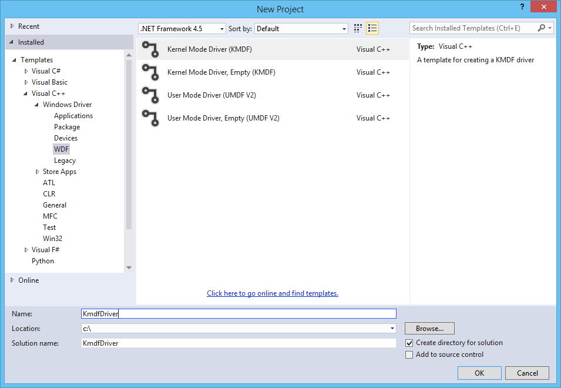
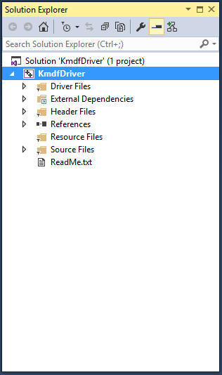
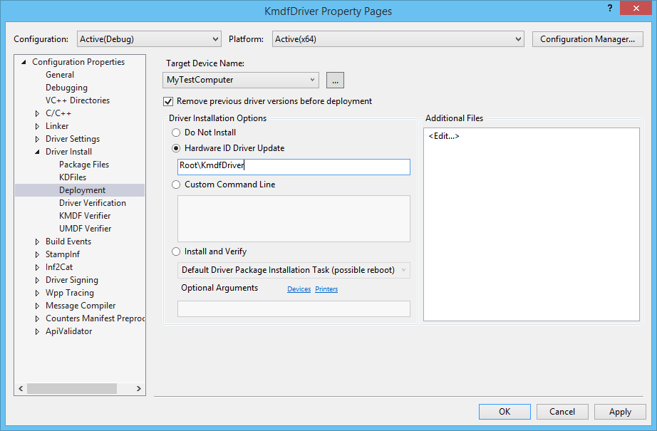

# Write a Universal Windows driver (KMDF) based on a template


This topic describes how to write a [Universal Windows driver](https://msdn.microsoft.com/windows-drivers/develop/getting_started_with_universal_drivers) using Kernel-Mode Driver Framework (KMDF). You'll start with a Microsoft Visual Studio template and then deploy and install your driver on a separate computer.

To get started, be sure you have [Microsoft Visual Studio 2015](https://go.microsoft.com/fwlink/p/?LinkId=698539) and the [Windows Driver Kit (WDK) 10](https://go.microsoft.com/fwlink/p/?LinkId=733614) installed.

[Debugging Tools for Windows](http://go.microsoft.com/fwlink/p?linkid=223405) is included when you install the WDK.

## <span id="Create_and_build_a_driver_package"></span><span id="create_and_build_a_driver_package"></span><span id="CREATE_AND_BUILD_A_DRIVER_PACKAGE"></span>Create and build a driver package


1.  Open Microsoft Visual Studio. On the **File** menu, choose **New &gt; Project**. The **New Project** dialog box opens, as shown here.
2.  In the **New Project** dialog box, select **WDF**.
3.  In the middle pane, select **Kernel Mode Driver (KMDF)**.
4.  In the **Name** field, enter "KmdfDriver" as the project name.

    > [!NOTE]
    > When you create a new KMDF or UMDF driver, you must select a driver name that has 32 characters or less. This length limit is defined in wdfglobals.h.  

5.  In the **Location** field, enter the directory where you want to create the new project.
6.  Check **Create directory for solution**. Click **OK**.

    

    Visual Studio creates one project and a solution. You can them in the **Solution Explorer** window, as shown here. (If the **Solution Explorer** window is not visible, choose **Solution Explorer** from the **View** menu.) The solution has a driver project named KmdfDriver. To see the driver source code, open any of the files under **Source Files**. Driver.c and Device.c are good places to start.

    

7.  In the **Solution Explorer** window, right-click **Solution 'KmdfDriver' (1 project)**, and choose **Configuration Manager**. Choose a configuration and platform for both the driver project and the package project. In this exercise, we choose Debug and x64.

8.  To build your driver and create a driver package, choose **Build Solution** from the **Build** menu. Visual Studio shows the build progress in the **Output** window. (If the **Output** window is not visible, choose **Output** from the **View** menu.)

    When you've verified that the solution built successfully, you can close Visual Studio.

9.  To see the built driver, in File Explorer, go to your **KmdfDriver** folder, and then to **x64\\Debug\\KmdfDriver**. The folder includes:

    -   KmdfDriver.sys -- the kernel-mode driver file
    -   KmdfDriver.inf -- an information file that Windows uses when you install the driver

## <span id="Deploy_the_driver"></span><span id="deploy_the_driver"></span><span id="DEPLOY_THE_DRIVER"></span>Deploy the driver


Typically when you test and debug a driver, the debugger and driver run on separate computers. The computer that runs the debugger is called the *host computer*, and the computer that runs the driver is called the *target computer*. The target computer is also called the *test computer*. For more information about debugging drivers, see [Debugging Tools for Windows](http://go.microsoft.com/fwlink/p?linkid=223405).

So far you've used Visual Studio to build a driver on the host computer. Now you need to configure a target computer. 

So far you've used Visual Studio to build a driver on the host computer. Now you need to configure a target computer. 

1. Follow the instructions in [Provision a computer for driver deployment and testing (WDK 10)](provision-a-target-computer-wdk-8-1.md).

    > [!TIP]
    > When you follow the steps to provision the target computer automatically using a network cable, take note of the port and key. You'll use them later in the debugging step. In this example, we'll use **50000** as the port and **1.2.3.4** as the key.
    >
    > In real driver debugging scenarios, we recommend using a KDNET-generated key. For more information about how to use KDNET to generate a random key, see the [Debug Drivers - Step by Step Lab (Sysvad Kernel Mode)](../debugger/debug-universal-drivers--kernel-mode-.md) topic.

2.  On the host computer, open your solution in Visual Studio. You can double-click the solution file, KmdfDriver.sln, in your KmdfDriver folder.
3.  In the **Solution Explorer** window, right-click the **KmdfDriver** project, and choose **Properties**.
4.  In the **KmdfDriver Package Property Pages** window, in the left pane, go to **Configuration Properties &gt; Driver Install &gt; Deployment**.
5.  Check **Remove previous driver versions before deployment**.
6.  For **Remote Computer Name**, select the name of the computer that you configured for testing and debugging. In this exercise, we use a computer named MyTestComputer.
7.  Select **Hardware ID Driver Update**, and enter the hardware ID for your driver. In this exercise, the hardware ID is Root\\KmdfDriver. Click **OK**.

    

    > [!NOTE]
    > In this exercise, the hardware ID does not identify a real piece of hardware. It identifies an imaginary device that will be given a place in the [device tree](http://go.microsoft.com/fwlink/p?linkid=399236) as a child of the root node. For real hardware, do not select **Hardware ID Driver Update**; instead, select **Install and Verify**. You'll see the hardware ID in your driver's information (INF) file. In the **Solution Explorer** window, go to **KmdfDriver &gt; Driver Files** and double-click KmdfDriver.inf. The hardware ID is located under \[Standard.NT$ARCH$\].

    ```C++
    [Standard.NT$ARCH$]
    %KmdfDriver.DeviceDesc%=KmdfDriver_Device, Root\KmdfDriver
    ```
8. On the **Build** menu, choose **Deploy Solution**. Visual Studio automatically copies the files required to install and run the driver to the target computer. This may take a minute or two.

    When you deploy a driver, the driver files are copied to the %Systemdrive%\drivertest\drivers folder on the test computer. If something goes wrong during deployment, you can check to see if the files are copied to the test computer. Verify that the .inf, .cat, test cert, and .sys files, and any other necessary files, are present in the %systemdrive%\drivertest\drivers folder.

    For more information about deploying drivers, see [Deploying a Driver to a Test Computer](../develop/deploying-a-driver-to-a-test-computer.md).

## Install the driver

With your KMDF driver deployed to the target computer, now you'll install the driver. When you previously provisioned the target computer with Visual Studio using the *automatic* option, Visual Studio set up the target computer to run test signed drivers as part of the provisioning process. Now you just need to install the driver using the DevCon tool.

1. On the host computer, navigate to the Tools folder in your WDK installation and locate the DevCon tool. For example, look in the following folder:

    *C:\\Program Files (x86)\\Windows Kits\\10\\Tools\\x64\\devcon.exe*

    Copy the DevCon tool to your remote computer.

2. On the target computer, install the driver by navigating to the folder containing the driver files, then running the DevCon tool. 
    1. Here's the general syntax for the devcon tool that you will use to install the driver:

        *devcon install \<INF file\> \<hardware ID\>*

        The INF file required for installing this driver is KmdfDriver.inf. The INF file contains the hardware ID for installing the driver binary, *KmdfDriver.sys*. Recall that the hardware ID, located in the INF file, is **Root\\KmdfDriver**.
    2. Open a Command Prompt window as Administrator. Navigate to your driver package folder, then enter this command:

        **devcon install kmdfdriver.inf root\\kmdfdriver**

        If you get an error message about *devcon* not being recognized, try adding the path to the *devcon* tool. For example, if you copied it to a folder on the target computer called *C:\\Tools*, then try using the following command:

        **c:\\tools\\devcon install kmdfdriver.inf root\kmdfdriver**

        A dialog box will appear indicating that the test driver is an unsigned driver. Click **Install this driver anyway** to proceed.

        

## Debug the driver

Now that you have installed your KMDF driver on the target computer, you'll attach a debugger remotely from the host computer.

1. On the host computer, open a Command Prompt window as Administrator. Change to the WinDbg.exe directory. We will use the x64version of WinDbg.exe from the Windows Driver Kit (WDK) that was installed as part of the Windows kit installation. Here is the default path to WinDbg.exe:

    *C:\\Program Files (x86)\\Windows Kits\\10\\Debuggers\\x64*

2. Launch WinDbg to connect to a kernel debug session on the target computer by using the following command. The value for the port and key should be the same as what you used to provision the target computer. We'll use **50000** for the port and **1.2.3.4** for the key, the values we used during the deploy step. The *k* flag indicates that this is a kernel debug session.

    **WinDbg -k net:port=50000,key=1.2.3.4**

3.  On the **Debug** menu, choose **Break**. The debugger on the host computer will break into the target computer. In the **Debugger Command** window, you can see the kernel debugging command prompt: **kd\>**.

4. At this point, you can experiment with the debugger by entering commands at the **kd&gt;** prompt. For example, you could try these commands:

    -   [lm](http://go.microsoft.com/fwlink/p?linkid=399236)
    -   [.sympath](http://go.microsoft.com/fwlink/p?linkid=399238)
    -   [.reload](http://go.microsoft.com/fwlink/p?linkid=399239)
    -   [x KmdfHelloWorld!\*](http://go.microsoft.com/fwlink/p?linkid=399240)

5. To let the target computer run again, choose **Go** from the **Debug** menu or press "g," then press "enter."
6. To stop the debugging session, choose **Detach Debuggee** from the **Debug** menu.

    > [!IMPORTANT]
    > Make sure you use the "go" command to let the target computer run again before exiting the debugger, or the target computer will remain unresponsive to your mouse and keyboard input because it is still talking to the debugger.

For a detailed step-by-step walkthrough of the driver debugging process, see [Debug Universal Drivers - Step by Step Lab (Echo Kernel-Mode)](../debugger/debug-universal-drivers---step-by-step-lab--echo-kernel-mode-.md).

For more information about remote debugging, see [Remote Debugging Using WinDbg](../debugger/remode-debugging-using-windbg.md).

## <span id="related_topics"></span>Related topics


[Developing, Testing, and Deploying Drivers](http://go.microsoft.com/fwlink/p?linkid=399234)

[Debugging Tools for Windows](http://go.microsoft.com/fwlink/p?linkid=223405)

[Debug Universal Drivers - Step by Step Lab (Echo Kernel-Mode)](../debugger/debug-universal-drivers---step-by-step-lab--echo-kernel-mode-.md)

[Write your first driver](writing-your-first-driver.md)

 

 


