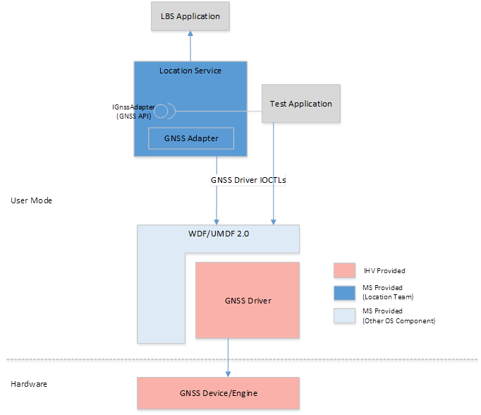
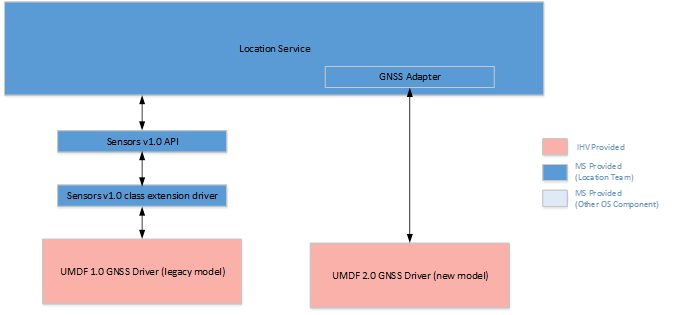
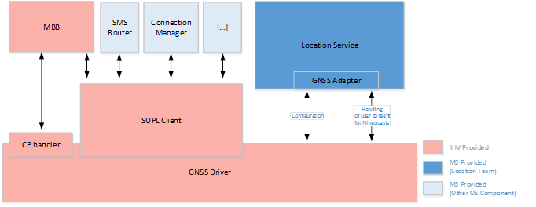
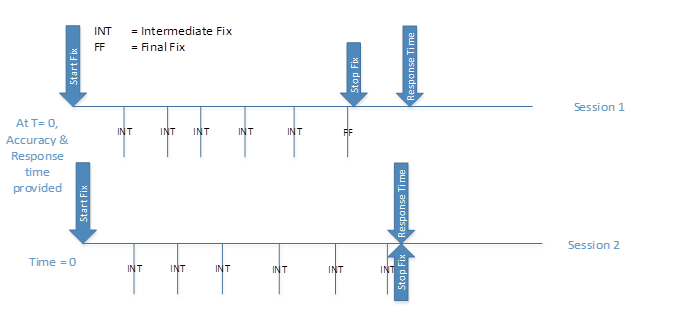
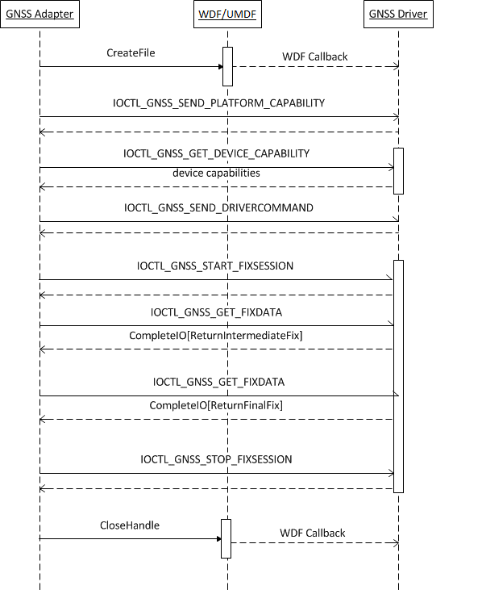
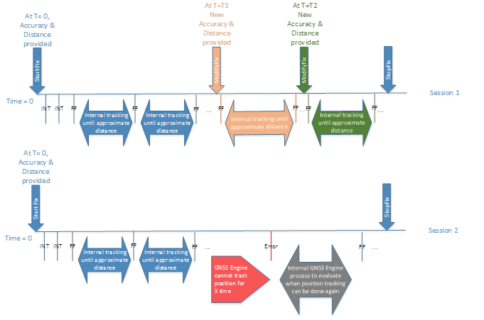
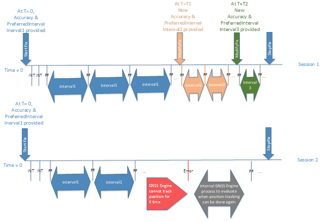

# Global Navigation Satellite System (GNSS) driver architecture

Provides an overview of Global Navigation Satellite System (GNSS) UMDF 2.0 driver architecture, I/O considerations, and discusses several types of tracking and fix sessions.

## Architecture overview

The following high-level component block diagram shows how the Global Navigation Satellite System (GNSS) UMDF 2.0 driver integrates with the Windows 10 platform.

The components in the diagram are described here:

- **LBS application:** A user application that uses the location functionality of the Windows 10 platform

- **Test application:** An application for testing GNSS functionality.

- **GNSS API:** The **IGnssAdapter** COM (Component Object Model) interface that exposes the functionality of the GNSS device to the internal components of the location service, as well as to test applications. The exact shape of this API is outside the scope of this document. The Windows components use the GNSS device by programming against the **IGnssAdapter** COM interface. The GNSS API set is private API to only location platform components (for example, the location service and location test applications) and is not available to other first-party or third-party applications.

- **GNSS adapter:** This is a singleton COM object that implements the **IGnssAdapter** COM interface. Test applications and internal components of the location service instantiates this object and use the GNSS device through the **IGnssAdapter** interface. The GNSS positioning engine component of the location service implements the COM class that exposes the **IGnssAdapter** interface. The location service exposes a factory mechanism to test and other out-of-process applications for instantiating a singleton COM object of the GNSS adapter COM class within the location service. Out-of-process applications use the COM interface pointer to program against the GNSS driver.

    > [!NOTE]
    > COM handles proxy the interface pointer to the out-of-process applications so that the applications treats the **IGnssAdapter** interface pointer as an in-process COM object, but the calls are actually handled by the singleton GNSS adapter object within the location service.

    The GNSS positioning engine uses the internal GNSS adapter object for providing location-specific functionality to the location service. The GNSS adapter opens a file handle to the GNSS driver using the **CreateFile** API, then wraps the GNSS native APIs calls into appropriate **DeviceIoControl** calls, maintains the state machine with the GNSS driver object, and maintains the state of the various incoming requests from the upper layers. This component interacts directly with the underlying GNSS device stack through the public GNSS IOCTL interface defined in this document. The GNSS device is logically treated as an exclusive resource and hence the singleton GNSS adapter controls all access to the GNSS device.

    > [!NOTE]
    > Certain white-box driver test applications can also use the GNSS driver IOCTL interface directly in a non-production environment instead of using the GNSS adapter through the GNSS private APIs. However, these test applications will have to implement their own state machine and processing to mimic certain functionalities of the GNSS adapter.

- **GNSS driver:** An IHV-delivered driver implemented using UMDF 2.0. The GNSS driver supports the GNSS **DeviceIoControl** APIs by interfacing with the actual GNSS hardware. The GNSS driver also works as a mediator/integrator for the SUPL functions.

- **GNSS device/engine:** This is a conceptual component that encapsulates the SoC and hardware pieces of the GNSS device. An IHV may choose to implement most of the GNSS functionality within this component, thus making the GNSS driver layer very thin (essentially an adapter for interfacing with the GNSS device).

## Support for Global Navigation Satellite System (GNSS) devices and drivers that follow the legacy Windows model

The location platform in Windows 10 supports GNSS devices integrated via the legacy Sensors v1.0 class driver (see [Writing a location sensor driver](writing-a-location-sensor-driver.md)) or integrated via the new GNSS DDI described in thr [GNSS driver reference](/windows-hardware/drivers/ddi/gnssdriver).

Therefore, Windows devices with a GNSS device that integrate with the Sensor v1.0 class extension model that existed in Windows 7, Windows 8, and Windows 8.1 are expected to continue working in Windows 10 without the need of any changes. It is strongly recommended for these drivers (and any new drivers) to be published to Windows Update to improve the upgrade process for our users.

There will also be two different sets of tests for GNSS devices in the Hardware Lab Kit (HLK) issued with Windows 10:

- One new set of tests to certify drivers following the new model.

- Another set of tests to certify the drivers following the old model. These will be the same set of tests that were available in the WHCK in Windows 8.1.

A new gatherer component in the HLK identifies which of the two sets of tests needs to be run in a system, if any.

## Coexistence of Global Navigation Satellite System (GNSS) devices

In the rare case of multiple GNSS devices detected in a system, the location platform will only use one device, mainly to reduce the overall power consumption in the system. The following assumptions were considered:

- Devices using the new DDI are likely to be newer, and thus more likely to have better power consumption, support more constellations and support better assistance. Therefore if a device using the old driver model and a device using the new driver model are detected, the latter would be the one selected.

- If a user plugs an external GNSS device when an internal GNSS device is present, it is most likely that the user wants this external device to be used.

The behavior of the location platform, based on these assumptions will be as follows:

- Case of two coexistent legacy drivers: To avoid back compatibility issues the behavior will be the same as in Windows 8.1, in which both GNSS devices are used simultaneously and one of the responses is communicated up the stack to applications.

- Case of one legacy driver in the device and one new driver externally plugged: The externally plugged GNSS device is used.

- Case of one new driver in the device and one new driver externally plugged: The externally plugged GNSS device is used.

If the selected GNSS device supports geofencing or other offloaded operations, then offload will be done while that device is used. The GNSS adapter will not split the functionality or sessions among multiple GNSS devices.

## Global Navigation Satellite System (GNSS) interface overview

The interaction between the GNSS adapter and the GNSS driver falls under the following categories:

### Capability information exchange

To support extensibility and adaptability of the GNSS stack on Windows platforms, the GNSS adapter and the GNSS driver establish a common understanding of the various well-defined capabilities of the underlying GNSS stack, as well as the support provided by the Windows platform. The capability aspects are well defined by Microsoft as part of this GNSS interface definition and will evolve as more innovation in the GNSS space continues and a diverse set of chipsets/drivers emerge in the market. The GNSS adapter queries the various capabilities of the underlying GNSS driver/device at the time of initialization or on as-needed basis and accordingly optimizes the interaction with the GNSS driver.

The capability information exchange between the GNSS adapter and the GNSS driver is done using the control codes [**IOCTL\_GNSS\_SEND\_PLATFORM\_CAPABILITY**](/windows-hardware/drivers/ddi/gnssdriver/ni-gnssdriver-ioctl_gnss_send_platform_capability) and [**IOCTL\_GNSS\_GET\_DEVICE\_CAPABILITY**](/windows-hardware/drivers/ddi/gnssdriver/ni-gnssdriver-ioctl_gnss_get_device_capability).

### Global Navigation Satellite System (GNSS) driver command and configuration

The GNSS adapter may perform one-time configuration or periodic re-configuration of the GNSS driver. Similarly the GNSS adapter may execute certain GNSS-specific commands through the driver. This is accomplished by defining a command execution protocol between the driver and the high level operating system (HLOS). Depending on the specific command type, the intended action may take effect immediately or after a system restart. Similar to GNSS device capability information, the GNSS commands are also well-defined by Microsoft as part of this GNSS interface definition and will continue evolving with future innovations and diversification of GNSS devices/drivers.

Device command execution and configuration is done using the control code [**IOCTL\_GNSS\_SEND\_DRIVERCOMMAND**](/windows-hardware/drivers/ddi/gnssdriver/ni-gnssdriver-ioctl_gnss_send_drivercommand).

### Position information

This is the primary function of the underlying GNSS device. In the most basic form, the GNSS adapter requests the current position of the device from the GNSS driver. Variations of the position request include (but are not limited to) the following position session types:

- Current position of the device (single shot fix)

- Continuous periodic stream of fixes (time-based tracking)

- Continuous stream of fixes based on movement threshold (distance-based tracking)

The only mandatory position session type required by every GNSS hardware and GNSS driver is the single shot fix session type. Native (implemented in the SOC, in the GNSS device, and not in the GNSS driver or in a service running in the application processor), time-based tracking sessions, and distance-based tracking sessions can be supported optionally. The main benefit for these two types of native tracking sessions are potential power savings by keeping the application processor (AP) dormant for longer times by doing more of the processing in the SOC and only reporting changes when needed. Support for native distance-based tracking is more impactful than native time-based tracking sessions because it can bring higher power savings and because is more broadly used by applications.

The act of retrieving position information from the GNSS driver happens through a stateful, unique fix session, consisting of the following actions:

1. **Start fix session:** The GNSS adapter initiates a start fix session (as a result of a request from an LBS application). The GNSS adapter sets the specific requirements and preferences association with the request, and intimates the GNSS driver to start the engine to get the fix by issuing control code [**IOCTL\_GNSS\_START\_FIXSESSION**](/windows-hardware/drivers/ddi/gnssdriver/ni-gnssdriver-ioctl_gnss_start_fixsession).

1. **Get device position (fix data):** Once a fix session is started, the GNSS adapter issues control code [**IOCTL\_GNSS\_GET\_FIXDATA**](/windows-hardware/drivers/ddi/gnssdriver/ni-gnssdriver-ioctl_gnss_get_fixdata) to start waiting for a fix from the driver. When a new position information is available from the engine , the GNSS driver responds to this pending get fix request.

    > [!NOTE]
    > If fix session type is LKG fix (rather than current fix), the position information comes from the driver's cache.

    The GNSS adapter makes sure that an asynchronous I/O request is always available for the GNSS driver to return the fix data when available. Depending on the nature of the fix, if more fix data is expected, the GNSS adapter issues another I/O request (using the same IOCTL) and this sequence continues till no more data will be available or the fix session is stopped.

1. **Modify fix session:** If the GNSS driver does not support multiplexing of fix sessions of the same type the GNSS adapter may issue an [**IOCTL\_GNSS\_MODIFY\_FIXSESSION**](/windows-hardware/drivers/ddi/gnssdriver/ni-gnssdriver-ioctl_gnss_modify_fixsession) for that fix session type when it does multiplexing at its level.

1. **Stop fix session:** The GNSS adapter issues a stop fix session when no further position information pertaining to a specific fix session is either needed or expected.

### Native geofencing support

The GNSS DDI supports geofence offloading scenarios using a set of IOCTLs defined in this specification. A special capability flag is defined for the driver to indicate this support, this flag must only be set if the GNSS stack supports geofencing natively (i.e. it implements geofencing in the GNSS chip rather than in the application processor). If the driver does not natively support geofence, the flag shall not be set. The HLOS already supports a suboptimal application processor (AP)-based geofence tracking engine; while this solution is not as power optimized as a native solution can be, it is well tested and optimized, thus it should not be replaced by a equivalent solution implemented in the AP.

> [!NOTE]
> Geofence tracking by the HLOS requires the application processor to wake up periodically to detect geofence breaches, thereby draining power even when fences are not breached. Therefore, this implementation is considered to be suboptimal.

The HLOS also uses the AP-based geofence tracking as a failover mechanism when the underlying driver is unable to track geofences due to low signal conditions or other transient errors, upon error notifications received from the native geofence tracking solution.
The native geofencing support is beneficial only when geofence tracking is fully off-loaded to the SoC and the application processor is woken up only for processing geofence-related events. If the hardware does not support native geofence tracking, the GNSS driver must not attempt to implement it at the driver layer.

The GNSS engine must also expose documented IHV-specific tuning parameters to enable finding the right balance between power consumption and user experience. In addition the number of geofences supported should be more than the **MIN\_GEOFENCES\_REQUIRED** value which is defined in the header file. Note that the **MIN\_GEOFENCES\_REQUIRED** is defined per application, as one application has no knowledge of the number of geofences used by other applications or by the mobile operator.

The geofencing offloading support involves the following requirements:

- The HLOS shall be able to create one or more geofences via the DDI and the driver sends them off to the hardware to start tracking them.

- The HLOS shall be able to delete one or more previously created geofences via the DDI and the driver sends them off to the hardware to stop tracking them.

- Ideally, the GNSS hardware should understand the initial geofence tracking state for each geofence and use it to only report changes from this initial state. If the GNSS hardware does not support this functionality it will report the initial state to the HLOS every time a geofence is created.

- The GNSS hardware tracks the device's current position in a power-efficient way and wakes up the AP whenever the device has entered and/or exited a tracked geofence. The GNSS driver passes the geofence alerts to the HLOS.

- Under low satellite signal and other transient error conditions, the GNSS engine may be unable to reliably track the existing geofences. The GNSS engine shall be able to detect the tracking interruptions and the GNSS driver shall pass the tracking status error alert to the HLOS. The HLOS switches to the default AP-based geofence tracking till the GNSS hardware is able to recover and track geofences again.

- The exact conditions in which a GNSS engine needs to provide a notification to indicate that geofences cannot be tracked will vary and the implementation will be IHV specific. Following are some guidelines for the implementation:

  - If the GNSS engine is able to detect with high confidence that the user is not moving and there is no geofence boundary in 25 meters or less, the GNSS engine does not need to send a tracking error.

  - If the GNSS engine is able to detect with high confidence that the user is not moving but there is a geofence boundary in 25 meters or less, the GNSS engine needs to send a tracking error within a minute.

  - If the GNSS engine has been detecting that the user is moving and there is a geofences boundary within 100 meters or less, the GNSS engine needs to send a tracking error within a minute or less.

  - If the GNSS engine is unable to determine if the user is moving and there is a geofences boundary within 100 meters or less, the GNSS engine needs to send a tracking error within a minute or less.

  - If the GNSS engine has been detecting that the user is moving, the GNSS engine needs to send a tracking error in a time proportional to the estimated speed of movement and the distance to the closest geofence. A recommendation is to send an errors within \[(Distance-to-closest-fence-boundary(m) / estimated speed (m/s)) - 15s\]. The GNSS engine may use indicators of movement detection to determine the timing in which the tracking error should be sent.

  - If the GNSS engine is unable to determine if the user is moving, the GNSS engine needs to send a tracking error in a time proportional to high speed of movement and the distance to the closest geofence. A recommendation is to send an errors within \[Distance-to-closest-fence-boundary(m) / 343(m/s)\].

- During the period where the GNSS engine has reported geofence tracking status error, there should be no geofence breach events sent to the HLOS.

- The HLOS can reset the geofence tracking by deleting all previously created geofences through a single command.

- The mobile originated geofences are not persisted in the GNSS hardware or driver across reboot or driver restarts. The HLOS handles persistence on behalf of the end-user applications and creates/deletes geofences as required.

In terms of interactions between the GNSS adapter and the GNSS engine that supports natively geofencing offloading, in the case of geofences tracking failure, the GNSS adapter will do as follows:

- It will use the AP based tracking once the GNSS driver returns failure to track.

- It will continue pushing any updates (add/delete) in the geofences currently being tracked at the OS level to the driver as well so they are in sync. This will help the GNSS engine to know what geofences are currently being tracked by the OS and it can make a can track/cannot track determination based on the fresh data.

- It will push the geofence state changes as determined by the AP based tracker once the GNSS driver sends back SUCCESS in its ability to track.

### Driver notifications for assistance and helper data

From time to time, the GNSS driver may need assistance data or helper actions from the GNSS adapter. This includes the various forms of AGNSS data (time injection, ephemeris, initial coarse position), user consent pop-up for supporting network initiated user plane positioning, and so on.

- GNSS assistance data could be obtained by the GNSS driver without using the GNSS adapter. Nevertheless it is recommended that the assistance data is obtained using the GNSS adapter and leveraging the Microsoft positioning service for several reasons:

  - The Microsoft location stack will take care of establishing the data connections and adhering to any roaming constraints, data preferences, network quiet mode integration, and so on.

  - The Microsoft positioning service can obtain periodically assistance data specific to an IHV via server to server backend connection and provide it to all devices that needing, saving the IHV the need for deploying front end assistance service around the world that meet availability, scalability and responsiveness requirements.

- User consents for privacy for inbox applications are owned by the operating system. Therefore any UI to notify the user about a network initiated location request or any UI to request consent from the user to respond to a network initiated location request, will be owned by Microsoft. The GNSS driver will notify the GNSS adapter when a network initiated location request is received and if needed it will wait for the response from the user up to the default time before proceeding to fulfil the request.

Since the GNSS driver is unable to initiate a request to the upper layer on its own, this type of operations can be accomplished by the GNSS adapter proactively seeking such request from the GNSS driver and thereby always keeping one or more pending IRPs so that the GNSS driver can respond back on such pending requests. On receipt of request for assistance/helper date, the GNSS adapter fetches the data (or executes the specific action on behalf of the GNSS driver), and subsequently injects the needed information to the GNSS driver through another **DeviceIoControl** call.

The notification from the driver is handled through a common event model. For example, for GNSS assistance, the GNSS adapter uses control code [**IOCTL\_GNSS\_LISTEN\_AGNSS**](/windows-hardware/drivers/ddi/gnssdriver/ni-gnssdriver-ioctl_gnss_listen_agnss) to receive the AGNSS request from the GNSS driver. Subsequently the GNSS adapter fetches the AGNSS assistance data and issues [**IOCTL\_GNSS\_INJECT\_AGNSS**](/windows-hardware/drivers/ddi/gnssdriver/ni-gnssdriver-ioctl_gnss_inject_agnss) to push the data into the GNSS driver.

This notification mechanism is also used for receiving geofence-related alert data and status updates. The adapter uses control code [**IOCTL\_GNSS\_LISTEN\_GEOFENCE\_ALERT**](/windows-hardware/drivers/ddi/gnssdriver/ni-gnssdriver-ioctl_gnss_listen_geofence_alert) for receiving individual geofence alerts, and [**IOCTL\_GNSS\_LISTEN\_GEOFENCES\_TRACKINGSTATUS**](/windows-hardware/drivers/ddi/gnssdriver/ni-gnssdriver-ioctl_gnss_listen_geofences_trackingstatus) for receiving changes in the overall status of geofence tracking.

### Global Navigation Satellite System (GNSS) driver logging

For diagnostic purposes, the GNSS driver should log errors and other diagnostic information using the Microsoft prescribed logging mechanism (WPP) described below or ETW. It is recommended for drivers to use WPP for logging purposes rather than ETW, although both mechanisms are supported. Among the reasons for WPP being recommended is the availability of tools that can help driver debugging.

The driver must not log any information, human-readable or otherwise, other than through this prescribed logging technique. For more information, see [WPP Software Tracing](../devtest/wpp-software-tracing.md).

Logging messages with WPP software tracing is similar to using Windows event logging services. The driver logs a message ID and unformatted binary data in a log file. Subsequently, a postprocessor converts the information in the log file to a human-readable form. However, WPP software tracing supports message formats that are more capable and flexible than that supported by the event logging services. For example, WPP software tracing has built-in support for IP addresses, GUIDs, system IDs, time stamps, and other useful data types. In addition, users can add custom data types relevant to their application.

### Mobile operator protocol support

The IHV supplied GNSS stack (the GNSS driver, the GNSS device/engine) is required to support the various mobile operator positioning protocols (SUPL, UPL, CP, and so on). Failure to do so means that the device will not pass acceptance from mobile operators and will significantly limit where the device can be commercialized.

> [!NOTE]
> Support for these protocols and compliance with mobile operator requirements is mandatory in order to ship devices for certain mobile operators. The support for mobile operator protocols may not be essential for most non-phone platforms, specially if the platform does not include mobile broadband (MBB) support.

All implementation pieces are abstracted in the IHV stack and the Microsoft HLOS components are agnostic to:

- The specific implementation details of the protocols (for example, how the protocols work, the interpretation of the protocol messages, and so on).

- The shape of the implementation stack (for example, the implementation can reside within the GNSS device/engine, or the GNSS driver, or if needed a separate HLOS service).

- Interaction between the various pieces within the IHV-owned GNSS stack for implementing the protocols. For example, if the GNSS driver requires the Wi-Fi scan results for responding to a specific SUPL protocol message, it can do so by having a user-mode extension inject the Wi-Fi scan results to the driver through a private IOCTL call, or make this part of the UMDF 2.0 driver, or handle this interaction at a lower level. The Microsoft GNSS HLOS components are oblivious to such interactions between the IHV GNSS stack components.

In summary, the IHV or OEM needs to provide a SUPL client (and potentially a UPL client if the system is to be shipped in China) and integrate it with/within the GNSS driver. All interactions of the location platform with the SUPL client will be done through the GNSS DDI.

To facilitate the implementation of the mobile operator protocols and reduce the burden of software development using platform specific technologies, the GNSS adapter provides certain functionality to the IHV GNSS stack. The GNSS driver is treated as the intermediary for receiving such functionality from the HLOS components, for example, the GNSS adapter interacts only with the GNSS driver and not with any other part of the IHV GNSS stack. The GNSS driver IOCTLs defines the syntax and semantics of such functionality between the GNSS driver and the GNSS adapter. The GNSS driver is responsible for routing to the specific IHV component that implements the mobile operator protocol. Broadly, the GNSS adapter provides the following functionality to the GNSS driver:

1. **Configuration:** The mobile operators provision the device and change configuration using the configuration mechanism imposed by the OMA protocol standards. For example, SUPL standard requires the SUPL configuration to be done based on the UICC and/or be done using the SUPL OMA configuration profile information obtained via OMA-DM or OMA-CP.

    > [!NOTE]
    > Certain functionality available in phone for configuration purposes (OMA-DM and OMA CP) was not available in other platforms until Windows 10. Starting in Windows 10 all platforms can support SUPL configuration via the SUPL Configuration Service Provider (CSP), as far as the new GNSS DDI is used. The provisioning injected through the CSP can come from the image itself (through provxml or multivariant) or from the mobile operator via OMA-DM or OMA-CP. SUPL CSP is defined in [SUPL CSP](/windows/client-management/mdm/supl-csp).

    Windows 10 defines a proprietary technology, device management using a Configuration Service Provider (CSP), for interpreting and extracting the configuration data. Microsoft provides a CSP for consuming the OMA configuration and pushing the configuration to the GNSS driver through the GNSS adapter.

    > [!NOTE]
    > Alternatively, the IHV can also write user-mode component to consume the mobile operator configuration specification using the phone-specific device management technology (CSPs). However, this will be an additional burden on IHV and not recommended.

    Only one SUPL configuration is supported in a system, including in cases of dual SIM devices. Microsoft provides the functionality to reconfigure SUPL based on UICC and on UICC change. In addition to this, in case of the device roaming, the HLOS re-configures the SUPL client to work in standalone mode. This document defines the IOCTLs for pushing such configuration data for a variety of mobile operation protocols (SUPL 1.0 and 2.0, v2UPL, and so on).

1. **Handling of user consent for NI requests:** To meet privacy requirements, certain network initiated positioning requests need user consent. IHVs are not allowed to write UI for platform components. Hence the GNSS adapter handles the UI for user consent on behalf of the GNSS driver. The notification IOCTLs for the GNSS driver to request a UI popup, and the IOCTLs for the GNSS adapter to convey the user response to such a request are defined in [GNSS driver IOCTLs](/windows-hardware/drivers/ddi/gnssdriver).

In order to implement a fully functional SUPL client the IHV stack will need to make use of interfaces or general functionality available in/through the OS platform. The following is the list of functionality available in Windows 10 that IHVs can leverage to implement their SUPL client:

> [!NOTE]
> None of the this functionality is part of the location platform or the GNSS DDI, but it is included here for clarification and to help GNSS driver developers understand what can be leveraged from the OS to implement the SUPL functionality.

- **SMS router:** The SMS Router enables the SUPL client to subscribe to WAP Push of SIP Push messages that carry SUPL NI requests.

- **Connection Manager ability to configure which connection shall be used for SUPL and APIs to request such connection:** Mobile operators may require to have the SUPL traffic in a dedicated connection, or simply on a connection that is different from the default Internet connection. To do this, **Connection Manager** offers:

  - A Configuration service provider that the OEM or the mobile operator can use to configure which connection shall be used for the purpose of SUPL communications.

  - An API for the SUPL client to query for the connection parameters of the SUPL connection.

  - An API to establish the SUPL connection, with the parameters obtained in the previous step.

- **Cellular connection configuration:** To configure the parameters of different cellular connections, for example the parameters for a SUPL connection, there is a configuration service provider that the OEM or the mobile operator can use. Then this connection can be associated in **Connection Manager** to the SUPL purpose.

- **Request to keep the connections active while a SUPL connection is ongoing:** The SUPL client may need to initiate connections with the HSLP while the system is in connected standby. This may happen because the GNSS device needs to obtain assistance information when configured to use Microsoft-based positioning or because the mobile operator sent an NI request. If that is the case the SUPL client will need to initiate a connection with the HSLP and ensure that connection is active until the SUPL session is completed.

- **Interactions with the Mobile Broadband (MBB) module:** In Windows 10, there are no APIs available through the HLOS to retrieve cellular measurements, know when an emergency call has been placed, and so on. Any interaction with the MBB needs to be done through direct integration with the MBB (through AT commands or other proprietary method).

### Manufacturing testing

OEMs need to have a way to validate at manufacturing time and also at the customer support points that the GNSS hardware and GNSS stack (the GNSS driver and the GNSS device/engine) are operating correctly. The IHV can provide proprietary mechanisms to enable OEMs to do this testing, or can optionally implement the interface in the DDI to enable the OEM to initiate manufacturing tests and obtain results.

The location framework will be bypassed when doing the manufacturing testing, given that a big focus of the testing is on hardware validation or driver validation. In general, the device will be in a special "safe operating system mode" where the minimal set of components and services will be loaded. In this mode, the OEM can initiate a set of test applications that will trigger test cases. For efficiency and speed during manufacturing, it is highly desired to have concurrency support for tests within different components.

The interface for manufacturing tests includes two types of tests:

1. **Carrier wave test:** This test is to validate the external connectivity/antenna test. In this test the GNSS engine must search for a CW signal and provide the SNRs (signal to noise rations or carrier to noise ration) measurements in the response. Ideally the tests should provide responses back at 10 Hz.

1. **Self-test:** This test is to validate the basic functionality of the GNSS engine. The self-test should be able to detect basic issues in the engine (defective hardware, bad connections in the GNSS hardware without requiring any external signal injected. The goal of this validation is to do this cheap test and use it as a gate in the production line, before the device goes through more exhaustive and expensive testing. In this test the GNSS engine and driver shall do self-validation for pin connections and return a status code indicating that everything is OK or that a failure occurred. The error code for failures must indicate the fault detected. Error codes are set by the IHV.

## I/O considerations

Since the GNSS functionality does not map to traditional file read and write requests to device drivers, the **ReadFile** and **WriteFile** functions will not be used for the GNSS driver APIs. All the GNSS functionality will be implemented using well defined GNSS-specific device I/O control (**DeviceIoControl**) requests, also known as IOCTLs.

All IOCTLs will use METHOD\_BUFFERED as the data transfer mechanism for both input and output data. Since the size of the GNSS-related data is relatively small, the extra buffer copy should not affect the system performance.

The GNSS driver will be opened using the **FILE\_FLAG\_OVERLAPPED** option in the **CreateFile** function. Hence all IOCTLs are implicitly asynchronous. However, while most of the GNSS IOCTLs are semantically asynchronous (for example, an IOCTL triggers an activity within the driver and the results are expected back asynchronously), some IOCTLs are semantically synchronous in the sense that there is no logical asynchronous action or activity involved with such IOCTLs. The synchronous behavior of these few IOCTLs will be achieved by simply blocking the GNSS adapter thread after issuing the **DeviceIoControl** call until the I/O operation is complete. Hence it is the responsibility of the GNSS driver to always complete the IRP as part of processing of all IOCTLs. The GNSS adapter is expected to simply honor the contract of a synchronous call and in case of errors may or may not retry these commands. The IHV driver needs to make sure that it has incorporated all the logics on the driver side before returning an error.

For request and response operations, the GNSS adapter will always keep a pending I/O operation available so that when the GNSS driver has data to send as a response to a previously invoked operation, the response can be sent through the pending IRP.

## Single shot session

A start fix request for a single shot fix to the driver includes accuracy and response time values. The GNSS engine can make use of these values to understand the intent of the application request and make intelligent decisions. Once a request is received by the driver it should start returning any intermediate fixes generated by the engine. Intermediate fixes are fixes generated by the engine while computing a fix which meets the accuracy requirements or is final. The frequency of these intermediate fixes is not enforced and is an implementation detail of the engine. The GNSS adapter expects the fixes to come every few seconds and they should be different from the last intermediate fix.

Once the GNSS engine determines that it cannot get a better fix under the current signal conditions it should return a final fix and should stop doing any further computations. The final fix either meets the accuracy requirement or indicates that the engine cannot improve the accuracy provided under the current conditions.

The GNSS adapter issues a stop fix for a single shot session in either of the two cases:

- It gets a final fix from the driver.

- The response time for the request has reached. Here the last intermediate fix will be sent to the application.

The following figure illustrates two single shot sessions:

**Session 1:** The driver was given Accuracy and Response Time parameters. After the start fix command, the driver started sending intermediate fixes. After a while, it determined that it could not return a more accurate fix, so it indicated the last fix as final. This happened before the response time limit was reached. The adapter sent the final fix to the application and issued a stop fix command.

**Session 2:** Same as in Session 1 above but in this case the engine kept going for a better fix to meet the accuracy requirement and kept sending intermediate fixes in between. Once the session response time limit was reached, the adapter issued a stop fix which should close this session in the driver. The last intermediate fix received was sent to the application.

One important design aspect to consider when implementing single shot support is that, if distance-based tracking sessions and time-based tracking sessions are not both supported, the GNSS engine shall continue tracking satellites for 3 to 5 seconds after receiving a stop fix command. This is because the GNSS adapter will need to implement simulated distance-based tracking sessions and/or time-based tracking sessions by using single shot fix sessions, and if the GNSS engine stops tracking satellites immediately, most GNSS devices will have a delay on acquisition which makes impossible a to implement a simulated tracking session that meets the needs of navigation, run tracking or mapping applications.

The GNSS adapter may initiate requests for single shot fixes while the system is in Connected Standby, not just when the system is Active. This may happen to satisfy the need of Background Tasks, system services, geofences tracking in the application processor or other cases. The GNSS driver shall be able to pass these session requests to the GNSS device and either satisfy the request or provide an error to the GNSS adapter.

The following sequence diagram illustrates the high-level actions related to getting a standalone GNSS Fix. Note that this does not include any request for assistance data.

The sequence description is as follows:

1. The GNSS adapter opens the GNSS driver using the **CreateFile** API. WDF/KMDF/UMDF makes the needed optional callbacks to the GNSS driver. The file handle returned is used for all subsequent operations.

1. The GNSS adapter issues an IOCTL to communicate the various platform capabilities to the driver. The GNSS driver completes the I/O operation.

1. The GNSS adapter issues IOCTL for getting the device capabilities. The GNSS driver returns the device capabilities and completes the I/O operation.

1. The GNSS adapter issues IOCTLs for any driver-specific configuration or commands. The GNSS driver performs the needed action and completes the I/O operation.

1. The GNSS adapter issues an [**IOCTL\_GNSS\_START\_FIXSESSION**](/windows-hardware/drivers/ddi/gnssdriver/ni-gnssdriver-ioctl_gnss_start_fixsession), along with the parameters specifying the type and other aspects of the fix. On receipt of this IOCTL, the GNSS driver interacts with the underlying device to start receiving fixes and subsequently completes the I/O operation.

1. The GNSS adapter issues an [**IOCTL\_GNSS\_GET\_FIXDATA**](/windows-hardware/drivers/ddi/gnssdriver/ni-gnssdriver-ioctl_gnss_get_fixdata) and waits for the I/O completion. Whenever the GNSS driver has an available intermediate fix, it returns the data by completing the I/O operation.

1. Step 6 is repeated till the GNSS driver indicates that no more fixes are expected (final fix received).

1. The GNSS adapter issues [**IOCTL\_GNSS\_STOP\_FIXSESSION**](/windows-hardware/drivers/ddi/gnssdriver/ni-gnssdriver-ioctl_gnss_stop_fixsession). The GNSS driver does the needed cleanup operation associated with the original fix request.

1. The GNSS adapter closes the driver file handle using the **CloseHandle** API.

The GNSS IOCTLs and associated data structures are described in detail in the [GNSS driver reference](/windows-hardware/drivers/ddi/gnssdriver/).

## Distance-based tracking session

Distance-based tracking sessions are used frequently by end-user applications, as historically, it was the only session type available in the .NET APIs. A distance value of 0 indicates that the GNSS engine shall provide fixes at the highest rate possible.

The GNSS adapter will start distance tracking sessions with the GNSS driver, only if the later indicates it has the capability **SupportDistanceTracking**.

A start fix request to the driver for a distance tracking session will include the horizontal accuracy desired and the movement threshold, which is the haversine distance in meters that the system shall cover before the GNSS driver provides a position update. The GNSS engine can make use of these values to understand the intent of the application request and make intelligent decisions, such as adapt the frequency at which to check for location.

Once a start fix request is received by the driver it should start returning any intermediate fixes generated by the engine, until it obtains a final fix. This will be considered the first position of the session. After this the GNSS engine shall start providing fixes whenever it detects that the haversine distance has been approximately covered.

If the GNSS engine determines that it cannot track any longer the location of the device (for example, if satellites are not visible any longer), it should return an error to the GNSS adapter so that the location platform can fall back to other mechanisms to provide position updates to the end user application. The GNSS adapter shall provide an error within the following time:

\[(Distance-remaining-since-last-known-position (m) / estimated speed (m/s)) – 5 seconds\] or 5 seconds, whichever is largest.

If the GNSS engine provided an error to the GNSS adapter, but the GNSS adapter has not yet stopped the tracking session, the GNSS engine should continue to check, in a power optimized way, if it can resume tracking location. The IHV can use optimizations to make this detection at low power. Common techniques for optimization include:

- Progressive back-off

- Waiting for low-cost signals that are indicative of device movements to recheck

- Low power checks for satellite signal

Once the GNSS engine is able to provide a final fix again after an error condition, it should send that position to the GNSS adapter as an indication that tracking was resumed successfully.

The GNSS adapter issues a modify fix command for a distance-based tracking session if one or more applications that requested the tracking session have cancelled the request or if new applications are requesting a distance based tracking session. In such case the GNSS adapter calculates the new aggregated session parameters required to multiplex the different active sessions and updates the GNSS driver with these parameters.

The GNSS adapter issues a stop fix command for a distance-based tracking session if:

- The tracking session was handed over to another positioning engine available in the system.

- Applications that requested the tracking session have cancelled the request.

The following figure illustrates two distance based tracking sessions:

**Session 1:** The GNSS driver was given accuracy and movement threshold parameters when initiating the tracking session. After the start fix command, the driver starts sending intermediate fixes until it obtains a final fix or a fix that meets the accuracy requirement at which point such fix is provided to the GNSS adapter and the GNSS engine will start the distance-tracking process. While the session is active, the GNSS adapter sends a request to modify the session parameters at times T1 and T2. After each modification of parameters the GNSS driver will send a fix update to the GNSS adapter and will resume the distance tracking session with the new parameters, until the GNSS adapter sends a stop fix command.

**Session 2:** The session initiation process is similar to Session 1 above, but at a given point the GNSS engine is unable to track position. After a time that is dependent on the distance and estimated speed of movement, the GNSS driver sends an error. The GNSS engine continues to check at lower power when it can recover, and when it recovers it indicates so to the GNSS adapter by sending a new fix. The session is updated with new fixes as needed until the GNSS adapter sends a stop fix command.

The GNSS adapter may keep active or even initiate distance based tracking sessions while the system is in connected standby, not just when the system is active. This may happen to satisfy the need of background tasks, system services, geofences tracking in the application processor or other cases. The GNSS driver shall be able to pass these session requests to the GNSS device and either satisfy the request or provide an error to the GNSS adapter.

## Time-based tracking session

Time-based tracking sessions can be used by applications that require a frequent and regular position update to refresh the user interface (for example, maps, navigation applications, and so on).

The GNSS adapter will start time-based tracking sessions with the GNSS driver, only if the later indicates it has the capability **SupportContinuousTracking**.

A start fix request to the driver for a time-based tracking session will include the horizontal accuracy desired and the time interval preferred at which the GNSS driver should provide a position update. The GNSS engine can make use of these values to understand the intent of the application request and make intelligent decisions, such as adapt the frequency at which to check for location, start acquiring satellites a few seconds before the interval to provide a position update timely, and so on.

Once a start fix request is received by the driver it should start returning any intermediate fixes generated by the engine, until it obtains a final fix. This will be considered the first position of the session. After this the GNSS engine shall start providing fixes at the interval required by the session parameters. If the GNSS engine is unable to provide positions at the frequency required by the application, it should simply provide fixes at the maximum rate it can.

If the GNSS engine determines that it cannot track any longer the location of the device (for example, if satellites are no longer visible), it should return an error to the GNSS adapter so that the location platform can fall back to other mechanisms to provide position updates to the end-user application.

If the GNSS engine provided an error to the GNSS adapter, but the GNSS adapter has not yet stopped the tracking session, the GNSS engine should continue to check, in a power optimized way, if it can resume tracking location.

The IHV can use optimizations to make this detection at low power, as explained in the previous section. Once the GNSS engine is able to provide a final fix again after an error condition, it should send that position to the GNSS adapter as an indication that tracking was resumed successfully.

The GNSS adapter issues a modify fix command for a time-based tracking session if one or more applications that requested the tracking session have cancelled the request or if new applications are requesting a time-based tracking session. In such case the GNSS adapter calculates the new aggregated session parameters required to multiplex the different active sessions and updates the GNSS driver with these parameters.

The GNSS adapter issues a stop fix command for a time-based tracking session if:

- The tracking session was handed over to another positioning engine available in the system.

- Applications that requested the tracking session have cancelled the request.

The following figure illustrates two time-based tracking sessions.

**Session 1:** The GNSS driver was given accuracy and a preferred interval parameters when initiating the tracking session. After the start fix command the driver shall start sending intermediate fixes until it obtains a final fix or a fix that meets the accuracy requirement at which point such fix is provided to the GNSS adapter and the GNSS engine will start the time-based tracking process. While the session is active, the GNSS adapter sends a request to modify the session parameters at times T1 and T2. After each modification of parameters the GNSS driver will send a fix update to the GNSS adapter and will resume the time-based tracking session, with the new parameters, until the GNSS adapter sends a stop fix command.

**Session 2:** The session initiation process is similar to the one in Session 1 above, but at a given point the GNSS engine stops being able to track position. When the GNSS engine is unable to provide a fix within 15 seconds of the interval required by the session parameters, the GNSS driver sends an error. The GNSS engine continues to check at lower power when it can recover, and when it recovers it indicates so to the GNSS adapter by sending a new fix. The session is updated with new fixes as needed until the GNSS adapter sends a stop fix command.

The GNSS adapter may keep active or even initiate time based tracking sessions while the system is in connected standby, not just when the system is active. This may happen to satisfy the need of background tasks, system services, geofence tracking in the application processor, or other cases. The GNSS driver shall be able to pass these session requests to the GNSS device and either satisfy the request or provide an error to the GNSS adapter.

## Handle different types of fix session simultaneously

Some advanced GNSS engines may be able to handle simultaneously a Single Shot session, with a Distance-Based and/or a Time-Based tracking session. Ideally independent sessions should not influence each other, but this may not be always possible, specially in the case of simultaneous Single Shot and Time Based Tracking sessions. This section provide some guidelines for the IHV implementation for in case compromises need to be made to handle simultaneous sessions of different types.

The following acronyms are used in this section:

- **SS:** Single Shot session

- **DBT:** Distance Based Tracking session

- **TBT**: Time Based Tracking session

- **TBF:** Time Between Fixes

The following table provides some scenarios for handling single shot and time-based tracking sessions simultaneously:

| Case | SS active? | TBT active? | Case details | Acceptable interval of fixes | Comments |
|:-|:-|:-|:-|:-|:-|
| 1 | X | X | SS session ongoing at the time of the TBT periodic session started with remaining timeout >= interval | Same as TBT interval | SS session behavior: <ul><li>Intermediate and final fixes are sent until the timeout.</li><li>Session closed immediately after stop is received.</li></ul> TBT session behavior: <ul><li>Intermediate and final fixes are sent.</li><li>Fixes received approximately as per the interval.</li><li>Session closed immediately after stop is received. |
| 2 | X | X | SS session ongoing at the time of the TBT periodic session started with remaining timeout < interval | Interval remains the same as the SS timeout, until the SS session is satisfied. Then the interval can be updated to be the same as TBT interval. | SS session behavior: <ul><li>Intermediate and final fixes are sent until the timeout.</li><li>Session closed immediately after stop is received.</li></ul> TBT session behavior: <ul><li>Intermediate and final fixes are sent</li><li>Fixes received approximately as per the interval, but could be more frequent while the SS session is being served.</li><li>Session closed immediately after stop is received.</li></ul> |
| 3 | X | X | SS session started while there is an ongoing TBT periodic session started with timeout >= interval | Same as TBT interval | SS session behavior: <ul><li>Intermediate and final fixes are sent until the timeout.</li><li>Session closed immediately after stop is received.</li></ul> TBT session behavior: <ul><li>Intermediate and final fixes are sent</li><li>Fixes received approximately as per the interval.</li><li>Session closed immediately after stop is received.</li></ul> |
| 4 | X | X | SS session started while there is an ongoing TBT periodic session started with timeout < interval | Interval changes to be the same as the SS timeout, until the SS session is satisfied. Then the interval can be updated to be the same as TBT interval. | SS session behavior: <ul><li>Intermediate and final fixes are sent until the timeout.</li><li>Session closed immediately after stop is received.</li></ul> TBT session behavior: <ul><li>Intermediate and final fixes are sent.</li><li>Fixes received approximately as per the interval, but could be more frequent while the SS session is being served.</li><li>Session closed immediately after stop is received.</li> |
| 5 |  | X | TBT periodic session started with interval modified | Session with modem is updated to the new interval to be the same as TBT interval. If needed the modem session will be restarted. | SS session behavior: <ul><li>Not applicable</li></ul> TBT session behavior: <ul><li>Intermediate and final fixes are sent.</li><li>Fixes received approximately as per the interval.</li><li>Session closed immediately after stop is received.</li> |
| 6 | X | X | SS session ongoing at the time at which an ongoing TBT periodic session receives a change of interval, with remaining timeout >= interval | Same as TBT interval | SS session behavior: <ul><li>Intermediate and final fixes are sent until the timeout.</li><li>Session closed immediately after stop is received.</li></ul> TBT session behavior: <ul><li>Intermediate and final fixes are sent</li><li>Fixes received approximately as per the interval.</li><li>Session closed immediately after stop is received.</li></ul> |
| 7 | X | X | SS session ongoing at the time at which an ongoing TBT periodic session receives a change of interval, with remaining timeout < interval | Interval changes to be the same as the SS remaining timeout, until the SS session is satisfied. Then the interval can be updated to be the same as TBT interval. | SS session behavior: <ul><li>Intermediate and final fixes are sent until the timeout.</li><li>ession closed immediately after stop is received./li></ul> TBT session behavior: <ul><li>Intermediate and final fixes are sent</li><li>Fixes received approximately as per the interval, but could be more frequent while the SS session is being served.</li><li>Session closed immediately after stop is received.</li>  |

If there are simultaneously both a time-based and a distance-based tracking session, the GNSS engine accuracy tracking can be set to work with the smallest of the two. The following table also provide some guidelines for the case of disparate values for the accuracy required when there are simultaneous single shot and tracking sessions:

| Case | SS accuracy | DBT or TBT accuracy | Overall GNSS engine accuracy | Comments |
|--|--|--|--|--|
| 1 | Medium/Low --> High | Not applicable | Medium/Low --> High | <b>SS session behavior:</b> Session with GNSS device is refreshed or restarted to obtain high accuracy result. Intermediate fixes are provided to the HLOS as they are available. |
| 2 | High --> Medium/Low | Not applicable | High --> Medium/Low | <b>SS session behavior:</b> Session with GNSS device is refreshed or restarted to obtain medium/low accuracy result. If a fix meeting the requirements is available already, this is returned as a final fix. Otherwise, intermediate fixes are provided to the HLOS as they are available. |
| 3 | Medium/Low --> High | High | High | <b>SS session behavior:</b> Given that a high accuracy session already exists for the DBT or TBT session, the SS session just provides intermediate further fixes to the HLOS until the final accuracy desired is obtained or a final fix is obtained. |
| 4 | High --> Medium/Low | High | High | <b>SS session behavior:</b> Given that a high accuracy session already exists for the DBT or TBT session, the SS session just provides intermediate further fixes to the HLOS until the final accuracy desired is obtained or a final fix is obtained. |
| 5 | Medium/Low --> High | Medium/Low | Medium/Low --> High then back to Medium/Low after the SS session is complete | <b>SS session behavior:</b> Session with GNSS device is refreshed or restarted to obtain high accuracy result. Intermediate fixes are provided to the HLOS as they are available.  <b>DBT or TBT session behavior:</b> It is OK for this session to temporarily receive high accuracy results. However, after the SS session is served, the accuracy of this session should return to Medium/Low. |
| 6 | High --> Medium/Low | Medium/Low | High --> Medium/Low | <b>SS session behavior:</b> Session with GNSS device is refreshed or restarted to obtain medium/low accuracy result. If a fix meeting the requirements is available already, this is returned as a final fix. Otherwise, intermediate fixes are provided to the HLOS as they are available. |
| 7 | Not applicable | Medium/Low --> High | Medium/Low --> High | b>DBT or TBT session behavior:</b> Session with GNSS device is refreshed or restarted to obtain high accuracy results. Intermediate fixes are provided to the HLOS as they are available. |
| 8 | Not applicable | High --> Medium/Low | High --> Medium/Low | <b>DBT or TBT session behavior:</b> Session with GNSS device is refreshed or restarted to obtain medium/low accuracy result. If a fix meeting the requirements is available already, this is returned as a final fix. Otherwise, intermediate fixes are provided to the HLOS as they are available. |
| 9 | High | Medium/Low --> High | High | <b>DBT or TBT session behavior:</b> Session was already getting high accuracy fixes or intermediate fixes, so no changes. |
| 10 | High | High --> Medium/Low | High then changes to Medium/Low after the SS session is complete | <b>DBT or TBT session behavior:</b> Session can continue getting high accuracy fixes or intermediate fixes, until the SS session is complete. Then it shall change to medium/low accuracy fixes. |
| 11 | Medium/Low< | Medium/Low --> High | Medium/Low --> High | <b>DBT or TBT session behavior:</b> Session with GNSS device is refreshed or restarted to obtain high accuracy results. Intermediate fixes are provided to the HLOS as they are available. |
| 12 | Medium/Low | High --> Medium/Low | High --> Medium/Low | <b>DBT or TBT session behavior:</b> Session with GNSS device is refreshed or restarted to obtain medium/low accuracy result. If a fix meeting the requirements is available already, this is returned as a final fix. Otherwise, intermediate fixes are provided to the HLOS as they are available. |
