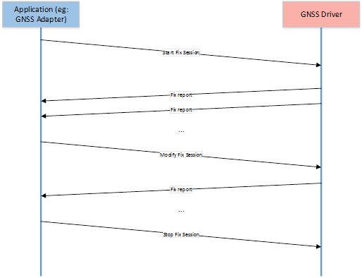

# Global Navigation Satellite System (GNSS) driver requirements

Describes requirements, assumptions, and constraints to consider when developing a Global Navigation Satellite System (GNSS) driver for Windows 10.

## General requirements

- **Driver framework:** The GNSS driver should be written as a UMDF 2.0 driver a based on this interface definition, as opposed to a raw WDM driver or KMDF driver. UMDF 1.0 drivers are not supported either. The GNSS driver interface definition or the Microsoft high level operating system (HLOS) GNSS components like GNSS adapter do not make a distinction between a WDF, KMDF GNSS driver and a UMDF 2.0 driver, as long as the driver provides the needed functionality per this interface design. UMDF 2.0 provides higher stability, simplicity and flexibility to implement features that requires functionality only offered in user mode. As a general rule, IHVs should prefer UMDF 2.0 to KMDF when the former framework is available on the platform.

  > [!NOTE]
  >  UMDF 2.0 is available on all platforms and IHVs are strongly recommended to use the driver written in user mode.

- **Multiple application sessions:** An application session is a positioning session coming from an HLOS component interacting directly with the GNSS driver. The GNSS driver could choose to natively support multiple application sessions by partitioning its state variables and functionality into per-application basis. This is an optional capability of the driver and is indicated specifically through well-defined GNSS driver capability information. In order to support this optional behavior, the GNSS driver needs to keep track of the file handle that the HLOS applications get during **CreateFile**, and associate all subsequent HLOS operations to the application-session specific file handle. This native support from the GNSS driver allows the HLOS components to be more flexible and less restrictive about exposing the driver to the rest of the platform. A GNSS driver that support this capability may need to logically partition and maintain state information for each individual application sessions. A GNSS driver that does not support this capability will only need to maintain global state for all application sessions instead of the logical app-specific partition. In this latter mode, the GNSS driver is oblivious to the presence of multiple parallel application sessions and treats all requests from HLOS as if they are originated from the same application session.

  

  The support in the GNSS driver for multiple application sessions has the advantage of enabling a test application in the HLOS to interact directly with the GNSS driver at the same time as the GNSS adapter. The test application and the GNSS adapter are what we considered different applications that can request to a single GNSS driver different sessions simultaneously. If multiple application sessions are not supported, then the GNSS driver needs to either be tested with through the OS Location Platform, or otherwise the service hosting the OS Location Platform should be stopped to avoid interfering with the test application.

- **Fix session:** The act of getting positioning information from the underlying driver (single shot or tracking) is abstracted into a notion of a fix session. Drivers need to support at least one fix session of each session type supported. The session types are defined under the [**GNSS\_FIXSESSIONTYPE**](/windows-hardware/drivers/ddi/gnssdriver/ne-gnssdriver-gnss_fixsessiontype) enumeration.

  - At a minimum, GNSS drivers must support a single shot fix session.

  - Drivers that support distance based tracking fix sessions must support simultaneously a single shot fix session and a distance based tracking fix session.

  - Drivers that support time based tracking fix sessions must support simultaneously a single shot fix session and a time based tracking fix session.

  - Drivers that support distance based tracking fix sessions and time based tracking fix sessions must support simultaneously a single shot fix session, a distance based tracking fix session and a time based tracking fix session.

  

  Whether the driver supports multiple simultaneous fix sessions or not is expressed by a well-defined driver capability parameter. If a driver does not explicitly support multiple parallel fix sessions, it must fail a new fix-session request if a session of the same fix type is already started and active. If multiple fix session support is not present, the onus is on the HLOS component to ensure that multiple GNSS requests coming from the high-level applications are multiplexed and mapped into a single fix session request to the GNSS driver.

  The GNSS driver is not required to support multiple parallel fix sessions of the same type. In fact in Windows 10, the HLOS GNSS adapter does not support leveraging the GNSS driver capability to have multiple fix sessions of the same type, thus IHVs are not encouraged to invest on this functionality for the time being. In future releases it will be considered to enable the GNSS adapter to directly start sessions with the GNSS driver for every fix request obtained from the upper layers of the location platform, rather than doing the session multiplexing itself. Support of multiplexing of fix sessions in the GNSS adapter simplifies the driver implementation as it does not require it to handle multiple sessions of the same type for an application or implementation of multiplexing, it reduces the memory usage in the driver, and it does not require the GNSS adapter to handle the case of the HLOS starting a number of fix sessions larger than what is supported by the GNSS driver. Different tiers of devices and different drivers would support a different number of concurrent fix sessions, thus this case would need to be handled, introducing complexity in the GNSS adapter to handle all cases. Therefore, in Windows 10 the GNSS adapter will only implement the single fix session of each supported type and will ignore the multiple fix session support by the driver until we have a need for this functionality.

  Each fix session is stateful and must follow this well-defined sequence:

  1. Starting a fix session

  1. Getting one or more fixes

  1. Modify the fix session if needed

      > [!NOTE]
      > This is required at least until the GNSS adapter handles multiplexing of fix sessions of the same type and it may even be require later on to handle the case of more simultaneous fix sessions active than the number supported by the GNSS driver.

  1. Stopping the fix session

  Fix sessions are uniquely identified by a fix session ID. No positional information can be retrieved by the HLOS outside the context of a fix session. The GNSS driver must allow modification of the session parameters on the fly to facilitate the multiplexing operation by the HLOS component, without the need of restarting the fix session.

  

- **Fix type:** The GNSS driver must at a minimum support the basic single shot fix. Additionally the driver should natively support advanced fix types (such as tracking). As stated earlier, supporting additional fix types implies that even if the driver does not support multiple fix sessions of the same type, it must support simultaneously at least one fix session of a supported fix type. The HLOS component does not multiplex different fix types into a single type.

- **Device interface and PnP:** The GNSS driver should advertise a Microsoft-defined device interface using the **WdfDeviceCreateDeviceInterface** API so that the HLOS can get notified about the arrival and departure of the GNSS driver. This will be required to handle a GNSS driver in a Plug and Play (PnP) setting and also in cases where unexpected driver unload happens due to user level service crash if the driver is a UMDF 2.0 driver. The GNSS driver should ensure that the device interface is advertised only when the underneath hardware is capable of supporting the HLOS IOCTL calls and not before that.

- **Device power policy:** The GNSS driver should manage the power policy of its device and should handle the power management events raised by the OS. The driver should register for the *WDF\_PNPPOWER\_EVENT\_CALLBACKS.EvtDeviceD0Entry* callback (raised by WDF when system goes to D0 state) and *WDF\_PNPPOWER\_EVENT\_CALLBACKS.EvtDeviceD0Exit* callback (raised by WDF when system exits from D0 state). The GNSS driver should be configurable to optionally disable power management.

  The exact power management that needs to be done in a GNSS device in the different system power states needs to be adapted according to the capabilities of the GNSS device (does it support offloaded operations or not), whether there are actual offloaded operations active, and how the communication between the system and GNSS device gets done. In general the expectations are as follows:

  - The GNSS device will work in the lowest power mode possible when there are no active sessions or offloaded operations, regardless of the system power state.

  - In case of offloaded scenarios, again regardless of the system power state, the GNSS device may need to check for position at different intervals or receive notifications and thus the GNSS device may need to stay in D0 state even during connected standby (this is the screen-off sleep state), but still the hardware needs to reduce the power consumption to the minimum. This model would work for those devices using DMA (Direct Memory Access) or a serial port on a UART to communicate with the host, for example. But will be a challenge for those GNSS devices connected via USB bus, in which case most likely the device's USB function should be in the D2 (suspend) device power state during connected standby. In general GNSS devices connected via USB must be able to enter a low-power D2 (suspend) state after they have no fix sessions or offloaded operations ongoing and the USB bus interface enters the suspend state. All sleep and wake power transitions must be signaled over the USB bus. If the GNSS device has fix sessions active or offloaded operations, the device must be able to use in-band, USB resume signaling to wake the SoC or core silicon from connected standby. The SoC or core silicon must be able to wake from its lowest power state in response to in-band, USB resume signaling from the GNSS device.

  - Devices that do not support connected standby will have all offloaded operations cancelled at the time when the device goes to modern standby or hibernation. This includes geofences offloaded, distance tracking, or periodic tracking sessions.

  - Devices that do support connected standby will continue having all offloaded operations active when the device goes to connected standby, and the GNSS device is expected to continue the tracking operations as efficiently as possible, and it is expected to provide notifications to the HLOS in case that the a geofence trigger condition or a tracking session update is pertinent. If there are no offloaded operations in a device that supports connected standby, the GNSS device is supposed to go to the lowest power state possible but still be able to listen to location session requests from the HLOS. In devices that support SUPL, it must also be possible for the GNSS device and SUPL stack to wake up on NI notifications while in connected standby.

  General information on power management for drivers can be found in [Power Management Responsibilities for Drivers](../kernel/power-management-responsibilities-for-drivers.md).

- **Power consideration:** The GNSS driver stack must take power footprint into account as a primary design goal and minimize keeping the main processor awake as much as possible. All advanced functionality support (such as different fix types) must be executed in a power-efficient way such than the main app processor does not need to be active more than needed and most processing can be offloaded to the chipset/low-power processor. As a general rule, unless otherwise indicated from the HLOS, the GNSS driver must always treat power consumption as the most important constraint, and must be designed to perform the normal operations with minimal power footprint. The GNSS driver interface is explicitly designed to allow the mobile device to transition to low-power mode as often as possible, and to provide necessary power-related hints to the GNSS driver to optimize the power usage. For tracking, geofencing and other functionality that require long-running pervasive position monitoring, the GNSS driver/engine must take advantage of low-power hardware/processors. If such functionality has to be implemented using a brute-force polling mechanism in the driver or if it needs to be implemented in the app processor, the driver should not declare itself as capable of such operations. This will allow the HLOS to either restrict exposure of such functionality to the rest of the platform, or use an alternative implementation of those functionalities based on other platform services/primitives.

- **Programming language:** The GNSS driver interface is delivered as a C language header file that does not use any C++ specific language primitives (for example, structure inheritance). This allows the IHV to choose between C and C++. The GNSS interface header file leaves the choice open to IHVs.

- **Filter driver:** The GNSS device stack must not be constrained in such a way that prevents adding a future filter driver in the stack to support extended functionality. The IHV-delivered GNSS driver must not include its own filter driver either at the top or at the bottom of the driver stack.

- **Notifications and events:** Since a WDF driver is unable to send unsolicited notification to the HLOS, there will always be at least one pending IRP initiated from the HLOS that serves the purpose of receiving any such unsolicited notification from the driver layer. This includes the case in which the system is in connected standby. For the GNSS driver, such unsolicited notifications include (but are not limited to) network-initiated requests, assistance data for AGNSS support, other vendor-specific notifications. The HLOS will ensure that a pending I/O request is always present to handle such notifications.

- **User mode IHV extension:** IHVs can write accessory user-mode component that interacts with the GNSS driver over IHV-defined private IOCTLs. This is in particular needed if the GNSS driver is in kernel mode, in which case it does not have access to functionality exclusively available in user-mode (for example, Wi-Fi scan, Connection Manager APIs, and so on). Note that with UMDF 2.0 in Windows 10, a UMDF GNSS driver does not need a separate user-mode component, although the IHV may still implement a separate user mode component. These user-mode components are treated as a mere extension to the GNSS driver and will be treated as part of the IHV-delivered BSP drop. The Microsoft-provided HLOS components are oblivious to the exact implementation details of such components and the interaction mechanism between the IHV user-mode/kernel-mode components. If the GNSS driver is written as a UMDF 2.0 driver using user-mode IHV extensions is not recommended because this model will likely require more memory usage.

  The user-mode IHV extensions must comply with the following rules:
  
  - The semantics and behavior of the public GNSS driver IOCTLs must remain unaffected and unobstructed by the user-mode IHV extension and its interaction with the GNSS driver.

  - The user-mode extension must comply with the security, power, and other platform basics and policies imposed by the Windows 10 platform.

  - The user-mode extension must perform only the authorized activities approved by Microsoft, without having the OS platform enforce/validate such authorization at runtime.

  > [!NOTE]
  > Microsoft can still enforce security policies and control lifetime of such components. The key point here is that the IHV user-mode components should not count on the platform to enforce such policies as the extension component is treated as a trusted OS component.

  IHVs will not add arbitrary functionality or use unauthorized OS services/ secure resources.

## Minimum support requirements

There will be a large variety of Global Navigation Satellite System (GNSS) devices that can be used for Windows platforms to satisfy the needs of diverse tiers of devices (low cost, high end, different device types, and so on). To enable such rich ecosystem and increase the number of tablets, laptops and other device types that can include a GNSS chip at lower cost, Microsoft does not require all GNSS devices to support the full set of features described in [GNSS driver reference](/windows-hardware/drivers/ddi/gnssdriver). The following table provides a high level view of the minimal functionality required for different device types and what functionality is optional or recommended.

| Functionality | Requirement for all platforms | Specific requirement for phones | Notes |
|--|--|--|--|
| Reporting accurately the GNSS_DEVICE_CAPABILITIES | Mandatory |  | Minimal functionality requirement |
| Support for MultipleFixSessions | Optional |  | Not supported by the GNSS adapter |
| Support for MultipleAppSessions | Recommended |  |  |
| GNSS Assistance support (IHV specific) | Recommended | Mandatory |  |
| Obtaining GNSS Assistance support via Microsoft (use of the Agss_inject IOCTLs) | Recommended |  |  |
| Support for the full GNSS_FixData structure | Mandatory |  |  |
| Single shot session | Mandatory |  |  |
| Time-based tracking session native support | Optional |  | If supported, it must include support to modify session parameters. |
| Distance-based tracking session native support | Optional |  | If supported, it must include support to modify session parameters. |
| Last good known session | Optional |  |  |
| Geofencing native support | Optional | Recommended | Only circular geofences required and supported |
| Providing ChipsetInfo | Mandatory |  | Using the GNSS_ChipsetInfo |
| Reporting errors | Recommended |  | Using the GNSS_ErrorInfo |
| Reports via NMEA | Optional |  |  |
| Manufacturing test support (carrier wave or self test) | Optional |  |  |
| Control plane location with integration with MBB | Mandatory only if required by mobile operator | Mandatory | Normally required by mobile operators in devices with voice support. Almost always required for phones. |
| SUPL 1.0 | Mandatory only if required by mobile operator |  | In general replaced by SUPL 2.0.  Includes implementation of the full client meeting mobile operator requirements, configuration via the DDI, reporting of NI events to the OS via the DDI and integration with MBB. |
| SUPL 2.x | Mandatory only if required by mobile operator | Mandatory | Normally required by mobile operators in devices with voice support. Almost always required for phones.  Includes implementation of the full client meeting mobile operator requirements, configuration via the DDI, reporting of NI events to the OS via the DDI and integration with MBB. |
| UPL | Mandatory only if required by mobile operator |  | Only needs to be supported for those CDMA devices shipping in China, if required by the mobile operator.  Includes implementation of the full client meeting mobile operator requirements, configuration via the DDI, reporting of NI events to the OS via the DDI and integration with MBB. |
| GNSS_SetLocationServiceEnabled driver command | Mandatory |  |  |
| GNSS_SetLocationNIRequestAllowed driver command | Mandatory only if SUPL supported and required by mobile operator |  | No known mobile operators require this anymore |
| GNSS_ForceSatelliteSystem driver command | Recommended |  | Good for test purposes. Some mobile operators or OEMs may require this for testing. |
| GNSS_ForceOperationMode driver command | Mandatory only if SUPL supported |  | Some mobile operators may require for test purposes. |
| GNSS_ResetEngine driver command | Mandatory |  | For test purposes |
| GNSS_ClearAgnssData driver command | Mandatory |  | For test purposes |
| GNSS_SetNMEALogging driver command | Optional |  | Only if required by mobile operators or OEMs needs this for test purposes |
| GNSS_SetSuplVersion driver command | Mandatory only if SUPL supported |  | Required for SUPL |
| GNSS_SetUplServerAccessInterval driver command | Mandatory only if SUPL supported and required by mobile operator |  | Only if required by mobile operator |
| GNSS_SetNiTimeoutInterval driver command | Mandatory only if SUPL supported and required by mobile operator |  | Only if required by mobile operator |
| GNSS_ResetGeofencesTracking driver command | Mandatory only if geofencing supported |  |  |
| GNSS_CustomCommand driver command | Optional |  |  |
