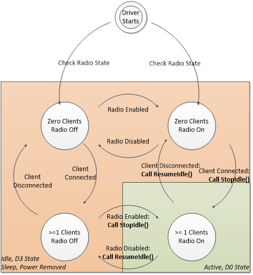

# Location driver guidelines for power and performance

The following sections describe guidelines to ensure that your location driver conserves power and provides data efficiently.

### Tracking the Number of Connected Clients and Radio State

Location sensors must track the number of connected applications, and must track the value of both the SENSOR\_PROPERTY\_LOCATION\_DESIRED\_ACCURACY and SENSOR\_PROPERTY\_CURRENT\_REPORT\_INTERVAL properties for each subscribed application.

When the number of connected clients is zero, the location sensor should enter the lowest possible power state, preferably D3. When an event indicates that a client is connected, the sensor should exit the low-power state and acquire data.

Also, if the location device contains a radio, like a GPS location sensor, then the radio state must also be tracked using [Radio Management](https://msdn.microsoft.com/library/windows/hardware/hh406615). The driver writer must create a Radio Management implementation that communicates with the driver to set the radio state. An example of the Radio Management implementation and how to communicate with the driver is in the [Sensors Geolocation Driver Sample](sensors-geolocation-driver-sample.md).

When tracking connected clients and radio state, the location sensor should enter the lowest possible power state, preferably D3, at any time there is not a connected client while the radio is on. The diagram below illustrates a state machine for connected clients, radio state, and the suggested corresponding device state.

The following table provides another view of the various input combinations and the resulting outputs (including power state).

|               |             |                  |                   |            |               |             |
|---------------|-------------|------------------|-------------------|------------|---------------|-------------|
| Inputs        |             |                  |                   | Outputs    |               |             |
| Client exists | Radio state | CRI              | Position reported | ASIC state | Sensor state  | Power state |
| No            | Any         | Any              | Any               | Off        | N/A           | D3          |
| Yes           | On          | &lt;=120 seconds | No                | On         | Initializing  | D0          |
| Yes           | On          | &lt;=120 seconds | Yes               | On         | Ready         | D0          |
| Yes           | Off         | Any              | Any               | Off        | Not available | D3          |
| Yes           | On          | &gt;120 seconds  | Any               | Off        | Ready         | D3          |
| Yes           | On          | &gt;120 seconds  | Any               | On         | Ready         | D0          |

 

The [Sensors Geolocation Driver Sample](sensors-geolocation-driver-sample.md) in the WDK provides an example of a driver that tracks the number of connected clients and the radio state.

### Tracking Report Intervals

Applications that consume location data by subscribing to events request the maximum frequency for data-updated events by setting the SENSOR\_PROPERTY\_CURRENT\_REPORT\_INTERVAL property. To conserve power, your driver should send data reports no more frequently than the lowest requested report interval.

For more information on how to track values for each application, see [Filtering data](https://msdn.microsoft.com/library/windows/hardware/hh706201). You can also find example of tracking report intervals in the [Sensors Geolocation Driver Sample](sensors-geolocation-driver-sample.md) in the WDK.

### Tracking Desired Accuracy

Just as report intervals are tracked per client, the accuracy level requested by each client must be tracked.

The [Sensors Geolocation Driver Sample](sensors-geolocation-driver-sample.md) in the WDK provides an example of a driver that tracks the desired accuracy requested by clients.

Location sensor drivers must support the SENSOR\_PROPERTY\_LOCATION\_DESIRED\_ACCURACY as a settable property. The driver should monitor the desired accuracy property of the connected clients and set SENSOR\_PROPERTY\_LOCATION\_DESIRED\_ACCURACY based on the highest requested desired accuracy.

If the highest accuracy requested by an app is DESIRED\_ACCURACY\_DEFAULT, the location sensor should optimize power and other cost considerations. The Location API will not use GPS sensors if location data is available from other providers on the system and data accuracy is 500m or better.

If any app requests DESIRED\_ACCURACY\_HIGH, the sensor should deliver the highest accuracy report possible. The Location API will always connect to all location sensors (including GPS) in order to acquire the most accurate position possible.

### Detecting Idle States

Your driver should detect an idle state and enter a low-power state. For example, an idle state may occur when the location of a GPS device is not changing, there are no pending I/O requests, or data is not available. If your GPS or GNSS device is implemented over USB, it must support selective suspend. See [Supporting Idle Power-Down in UMDF-based Drivers](https://msdn.microsoft.com/library/windows/hardware/ff561211.aspx) for more info.

### Position Injection for GPS and GNSS

GPS or GNSS sensors can use data from triangulation sensors on the system to shorten the time to first fix. This is known as *position injection*.

This use of sensor-to-sensor communication is supported only during the acquisition phase. A GNSS driver may open a connection to any triangulation sensor, including the Windows Location Provider, through the Sensor API. The driver can then get a coarse position, if position data is available. The driver should close the connection immediately after getting the position.

If the GNSS driver does not get a position from the Sensor API within 15 seconds, it should time out and close the connection to the Sensor API. Do not continue subscribing to events.

**Important**  A persistent connection to the Windows Location Provider (or any other sensor through the Sensor API) should not be kept open.

 

**Important**  Do not instantiate [**ILocation**](https://msdn.microsoft.com/library/windows/desktop/dd317674) to get data from other location sensors. Instead, use the Sensor API ([**ISensorManager**](https://msdn.microsoft.com/library/windows/desktop/dd318946)).

 

**Note**  Sensors should not get data from location sensors of the same type. For instance, a triangulation sensor should not use data from other triangulation sensors.

 

To access triangulation sensors, call [**ISensorManager::GetSensorByType**](https://msdn.microsoft.com/library/windows/desktop/dd318866) with type SENSOR\_TYPE\_LOCATION\_TRIANGULATION. This will return all triangulation sensors, including the Windows Location Provider that is built into Windows 8. Your GPS driver needs to be able to handle anywhere from zero sensors returned to multiple sensors. See [Retrieving a Sensor Object](https://msdn.microsoft.com/library/windows/desktop/dd318960) for more information on the use of **GetSensorsByType**.

**Note**  The Windows Location Provider does not provide any guarantee of accuracy or availability.

 

The use of the Sensor API for sensor-to-sensor communication to enable location fusion (for example, the use of accelerometer or gyro magnetometer data to estimate physical location) is not supported.

## Related topics
[Writing a Location Sensor Driver](writing-a-location-sensor-driver.md)  
[The Sensors Geolocation Driver Sample](sensors-geolocation-driver-sample.md)  

