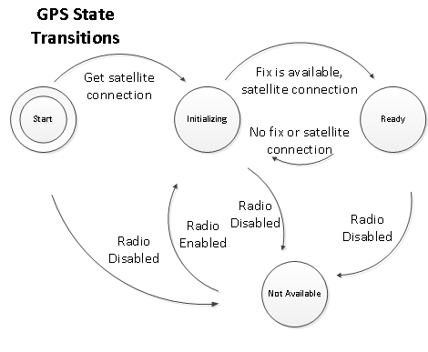

# Writing a location sensor driver for Windows 8.1

The Sensor and Location Platform provides the Windows Location API to enable software developers to add location features to their programs easily. If you are writing a driver for a location sensor, you must understand how to make the driver compatible with the Location API and follow the guidelines in [Location Driver Guidelines for Power and Performance](location-driver-guidelines-for-power-and-performance.md).

## Windows Hardware Certification Program requirements

The Windows Hardware Certification Program enables hardware manufacturers to receive certification that their devices meet the required standards for working with Windows. The certification program describes the requirements for location sensors and other types of sensors. You should make your location sensor driver comply with all the certification program requirements. These requirements include the following:

- Location sensors must support the required set of data and sensor properties.

- Location sensors must support the required data fields for at least one built-in data report type.

Generally, the recommendations in this WDK documentation match the Certification Program requirements. However, you must review the official Certification Program documentation when you create sensor drivers that you intend to submit for approval. For more information about the Windows Hardware Certification Program, see the [Windows Hardware Developer Central](https://developer.microsoft.com/windows/hardware) website.

## Location API requirements

You create drivers for location sensors by using the same driver model and class extension as for any other category of sensor. At a minimum, to work as a location sensor, the driver must:

- Identify the location sensor as belonging to the Location category.

- Set the sensor type to one of the location sensor types.

- Identify the location report data fields the sensor provides.

- Support the required properties.

- Provide data, when it is requested.

- Manage state transitions.

- Raise data-updated and state-changed events.

The rest of this section describes these minimum requirements

## Identifying the category

When it is called through [**ISensorDriver::OnGetProperties**](/windows-hardware/drivers/ddi/sensorsclassextension/nf-sensorsclassextension-isensordriver-ongetproperties), set the **WPD\_FUNCTIONAL\_OBJECT\_CATEGORY** property value to **SENSOR\_CATEGORY\_LOCATION**. The following code example shows how to set this constant through a pointer to [IPortableDeviceValues](/windows-hardware/drivers/ddi/portabledevicetypes/nn-portabledevicetypes-iportabledevicevalues) named pValues.

```cpp
hr = pValues->SetGuidValue(WPD_FUNCTIONAL_OBJECT_CATEGORY, SENSOR_CATEGORY_LOCATION);
```

## Setting the location sensor type

When it is called through [**ISensorDriver::OnGetProperties**](/windows-hardware/drivers/ddi/sensorsclassextension/nf-sensorsclassextension-isensordriver-ongetproperties), set the **SENSOR\_PROPERTY\_TYPE** property value to the correct value. The following code example shows how to set the sensor type by using the **SENSOR\_TYPE\_LOCATION\_GPS** constant through a pointer to [IPortableDeviceValues](/windows-hardware/drivers/ddi/portabledevicetypes/nn-portabledevicetypes-iportabledevicevalues) named pValues.

```cpp
hr = pValues->SetGuidValue(SENSOR_PROPERTY_TYPE, SENSOR_TYPE_LOCATION_GPS);
```

## Identifying the supported data fields

The Location API defines two kinds of location reports. These are objects that organize location data. LatLong reports contain latitude, longitude, and altitude data fields, together with data fields that contain error range information. Civic address reports contain street address data fields, such as city and postal code. Your location driver must support the required data fields for at least one of these two data report types.

To support a LatLong report, the following data fields are required:

- SENSOR\_DATA\_TYPE\_LATITUDE\_DEGREES

- SENSOR\_DATA\_TYPE\_LONGITUDE\_DEGREES

- SENSOR\_DATA\_TYPE\_ERROR\_RADIUS\_METERS

To support a civic address report, at least one of the following data fields is required:

- SENSOR\_DATA\_TYPE\_COUNTRY\_REGION

To view the complete set of platform-defined location data fields, see [**SENSOR\_CATEGORY\_LOCATION**](../sensors/sensor-category-loc.md) in the [Windows Sensor Reference](/windows-hardware/drivers/ddi/_sensors/) section.

When they are called through [**ISensorDriver::OnGetSupportedDataFields**](/windows-hardware/drivers/ddi/sensorsclassextension/nf-sensorsclassextension-isensordriver-ongetsupporteddatafields), add the supported data field property key constants to the [IPortableDeviceKeyCollection](/windows-hardware/drivers/ddi/portabledevicetypes/nn-portabledevicetypes-iportabledevicekeycollection) that you return through the *ppSupportedDataFields* parameter. The following code example shows how to add the postal code data field to [IPortableDeviceKeyCollection](/windows-hardware/drivers/ddi/portabledevicetypes/nn-portabledevicetypes-iportabledevicekeycollection) through a variable named pKeyCollection.

```cpp
pKeyCollection->Add(SENSOR_DATA_TYPE_POSTALCODE);
```

## Support the required properties

Like other sensor drivers, location drivers provide information about the sensor itself through a set of properties. The Windows Hardware Certification Program specifies the minimum required set of properties that a location sensor must support. For more information about sensor properties, their meanings, and which properties are required for sensor drivers, see [**Sensor Properties**](../sensors/sensor-properties.md). The following list contains the required properties:

- WPD\_FUNCTIONAL\_OBJECT\_CATEGORY

- SENSOR\_PROPERTY\_TYPE

- SENSOR\_PROPERTY\_STATE

- SENSOR\_PROPERTY\_PERSISTENT\_UNIQUE\_ID

- SENSOR\_PROPERTY\_MANUFACTURER

- SENSOR\_PROPERTY\_MODEL

- SENSOR\_PROPERTY\_SERIAL\_NUMBER

- SENSOR\_PROPERTY\_FRIENDLY\_NAME

- SENSOR\_PROPERTY\_MIN\_REPORT\_INTERVAL

- SENSOR\_PROPERTY\_CURRENT\_REPORT\_INTERVAL

- SENSOR\_PROPERTY\_LOCATION\_DESIRED\_ACCURACY

## Providing data

Location drivers provide data through the same mechanisms as other sensor drivers. That is, the sensor class extension calls the driver through [**ISensorDriver::OnGetDataFields**](/windows-hardware/drivers/ddi/sensorsclassextension/nf-sensorsclassextension-isensordriver-ongetdatafields) and the driver returns the values through the *ppDataValues* parameter.

The following requirements apply to providing data from a location sensor:

- Provide data both through synchronous requests and by [raising events](../sensors/raising-events.md).

- Maintain a copy of your most recent data report. If new data is not available when you request it, return the cached report. Do not update the time stamp.

- Do not provide values for SENSOR\_DATA\_TYPE\_LATITUDE\_DEGREES and SENSOR\_DATA\_TYPE\_LONGITUDE\_DEGREES that fall outside the range of real-world latitudes and longitudes.

- Do not report a value for SENSOR\_DATA\_TYPE\_ERROR\_RADIUS\_METERS that is zero or less.

- Set the value for SENSOR\_DATA\_TYPE\_COUNTRY\_REGION to a valid ISO 3166 1-alpha-2 country code.

- If your driver supports both latitude/longitude and civic address reports, the location data in these reports should correspond to the same physical location.

The following table describes the sensor data fields that correspond to Location API data report fields. Use these data field constants when you provide data reports for a location.

| Sensor constant | Location API method and property |
| --- | --- |
| SENSOR_DATA_TYPE_ADDRESS1 | [ICivicAddressReport::GetAddressLine1](/windows/win32/api/locationapi/nf-locationapi-icivicaddressreport-getaddressline1)<br><br>[LocationDisp.DispCivicAddressReport.AddressLine1](/windows/win32/locationapi/locationdisp-dispcivicaddressreport-addressline1) |
| SENSOR_DATA_TYPE_ADDRESS2 | [ICivicAddressReport::GetAddressLine2](/windows/win32/api/locationapi/nf-locationapi-icivicaddressreport-getaddressline2)<br><br>[LocationDisp.DispCivicAddressReport.AddressLine2](/windows/win32/locationapi/locationdisp-dispcivicaddressreport-addressline2) |
| SENSOR_DATA_TYPE_ALTITUDE_ELLIPSOID_ERROR_METERS | [ILatLongReport::GetAltitudeError](/windows/win32/api/locationapi/nf-locationapi-ilatlongreport-getaltitudeerror)<br><br>[LocationDisp.DispLatLongReport.AltitudeError](/windows/win32/locationapi/locationdisp-displatlongreport-altitudeerror) |
| SENSOR_DATA_TYPE_ALTITUDE_ELLIPSOID_METERS | [ILatLongReport::GetAltitude](/windows/win32/api/locationapi/nf-locationapi-ilatlongreport-getaltitude)<br><br>[LocationDisp.DispLatLongReport.Altitude](/windows/win32/locationapi/locationdisp-displatlongreport-altitude) |
| SENSOR_DATA_TYPE_CITY | [ICivicAddressReport::GetCity](/windows/win32/api/locationapi/nf-locationapi-icivicaddressreport-getcity)<br><br>[LocationDisp.DispCivicAddressReport.City](/windows/win32/locationapi/locationdisp-dispcivicaddressreport-city)<br><br>[Windows.Devices. Geolocation.CivicAddress](/uwp/api/Windows.Devices.Geolocation.CivicAddress#Windows_Devices_Geolocation_CivicAddress_City) |
| SENSOR_DATA_TYPE_COUNTRY_REGION | [ICivicAddressReport::GetCountryRegion](/windows/win32/api/locationapi/nf-locationapi-icivicaddressreport-getcountryregion)<br><br>[LocationDisp.DispCivicAddressReport.CountryRegion](/windows/win32/locationapi/locationdisp-civicaddressreport-countryregion) |
| SENSOR_DATA_TYPE_ERROR_RADIUS_METERS | [ILatLongReport::GetErrorRadius](/windows/win32/api/locationapi/nf-locationapi-ilatlongreport-geterrorradius)<br><br>[LocationDisp.DispLatLongReport.ErrorRadius](/windows/win32/locationapi/locationdisp-displatlongreport-errorradius) |
| SENSOR_DATA_TYPE_LATITUDE_DEGREES | [ILatLongReport::GetLatitude](/windows/win32/api/locationapi/nf-locationapi-ilatlongreport-getlatitude)<br><br>[LocationDisp.DispLatLongReport.Latitude](/windows/win32/locationapi/locationdisp-displatlongreport-latitude) |
| SENSOR_DATA_TYPE_LONGITUDE_DEGREES | [ILatLongReport::GetLongitude](/windows/win32/api/locationapi/nf-locationapi-ilatlongreport-getlongitude)<br><br>[LocationDisp.DispLatLongReport.Longitude](/windows/win32/locationapi/locationdisp-displatlongreport-longitude) |
| SENSOR_DATA_TYPE_POSTALCODE | [ICivicAddressReport::GetPostalCode](/windows/win32/api/locationapi/nf-locationapi-icivicaddressreport-getpostalcode)<br><br>[LocationDisp.DispCivicAddressReport.PostalCode](/windows/win32/locationapi/locationdisp-dispcivicaddressreport-postalcode) |
| SENSOR_DATA_TYPE_STATE_PROVINCE | [ICivicAddressReport::GetStateProvince](/windows/win32/api/locationapi/nf-locationapi-icivicaddressreport-getstateprovince)<br><br>[LocationDisp.DispCivicAddressReport.StateProvince](/windows/win32/locationapi/locationdisp-dispcivicaddressreport-stateprovince) |

## Managing state transitions

At any time, a sensor driver can be in one of a number of states. Sensor states are defined by the [**SensorState**](/windows-hardware/drivers/ddi/sensorsclassextension/ne-sensorsclassextension-__midl___midl_itf_windowssensorclassextension_0000_0000_0001) enumeration. To work correctly with the Location API, location sensors must follow these rules for handling state transitions.

- Always start in the SENSOR\_STATE\_INITIALIZING state, but do not raise a state-changed event at startup.

- The driver should transition from SENSOR\_STATE\_INITIALIZING to SENSOR\_STATE\_READY when data is available.

- The driver should transition back to SENSOR\_STATE\_INITIALIZING when the driver does not have current data to report. The driver should decide when that transition occurs. If you have lost a signal, but still have a means to provide valid data, stay in the SENSOR\_STATE\_READY state.

- Always raise events in the correct order. First, establish that data is available. Then, raise a state-changed event. Finally, raise the data-updated event.

- Always raise a state-changed event when the driver's state changes.

-The Location API does not use data from sensors that are in the following states: SENSOR\_STATE\_NO\_DATA, SENSOR\_STATE\_NOT\_AVAILABLE, SENSOR\_STATE\_ERROR.

The various sensor states for location sensor drivers are described in the following table.

| Value | Description | Location API state |
| --- | --- | --- |
| SENSOR_STATE_READY | Sensor driver can provide new location reports that have complete and accurate data.<br><br>For example, a Wi-Fi or cellular provider is connected and working, or a GPS sensor has a fix.<br><br>A GPS driver that has used data from a triangulation sensor to determine location has this state. | REPORT_RUNNING |  
| SENSOR_STATE_INITIALIZING | Sensor driver is trying to acquire a fix. The sensor driver should leave this state to transition to SENSOR_STATE_READY, after a fix is locked and tracking.<br><br>For example, a Wi-Fi provider is looking for an Internet connection, a cellular provider is looking for radios, or a GPS sensor is acquiring a fix.<br><br>GPS sensors should re-enter this state when they try to reacquire a fix. | REPORT_INITIALIZING |  
| SENSOR_STATE_NO_DATA | The location provider is available, but is unable to provide location data.<br><br>For example, a Wi-Fi provider has access to the Internet, but the database has no location data. | REPORT_ERROR |  
| SENSOR_STATE_NOT_AVAILABLE | The functionality that the location provider uses to acquire data is disabled.<br><br>A GPS sensor could be in this state if the radio is turned off. | REPORT_ERROR |  
| SENSOR_STATE_ERROR | The sensor has encountered a major error. The sensor can recover from this state, but the time frame for recovery is not known. | REPORT_ERROR |  

The following diagram shows how state transitions may occur in a location sensor.

## Raising data-updated and state-changed events

The Location API, requires location sensors, such as GPS sensors, to raise events that provide data and state-change information. For more information about raising sensor events, see [About Sensor Driver Events](../sensors/about-sensor-driver-events.md).

When raising these events, location drivers must follow these rules:

- Raise state change events by calling the sensor class extension's [**ISensorClassExtension::PostStateChange**](/windows-hardware/drivers/ddi/sensorsclassextension/nf-sensorsclassextension-isensorclassextension-poststatechange) method. Do not call [**PostEvent**](/windows-hardware/drivers/ddi/sensorsclassextension/nf-sensorsclassextension-isensorclassextension-postevent) to raise state change events.

- Raise data-updated events by calling [**PostEvent**](/windows-hardware/drivers/ddi/sensorsclassextension/nf-sensorsclassextension-isensorclassextension-postevent).

- Raise a data-updated event only if the data is up to date and accurate.

- Do not raise a data-updated event twice. This means that you should not raise a data-updated event by using cached data. You can provide cached data in response to a synchronous request for data.

- Always include all the required data fields when you send a latitude/longitude report through an event.

- Always raise a data-updated event when the sensor accuracy changes.

- Report a valid value for SENSOR\_DATA\_TYPE\_ERROR\_RADIUS\_METERS before raising events or changing the value for SENSOR\_PROPERTY\_STATE to SENSOR\_STATE\_READY.

- Do not provide incomplete data reports.

- You might not have current data for the required data fields, such as when a GPS sensor has lost its fix. In this case, you might still want to provide notifications about updates to extended data fields, such as SENSOR\_DATA\_TYPE\_NMEA\_SENTENCE. To provide such notifications, you must use a custom event type and raise only the custom event until data for the required data fields becomes available. For information about how to define custom types, see [Defining Custom Values for Constants](../sensors/defining-custom-values-for-constants.md).

## Related topics

[Location Driver Guidelines for Power and Performance](location-driver-guidelines-for-power-and-performance.md)
