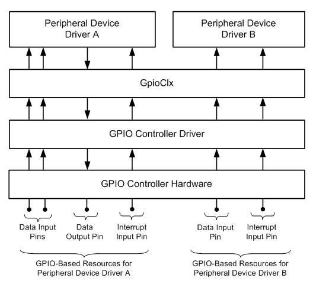

# GPIO-Based Hardware Resources

Starting with Windows 8, the general-purpose I/O (GPIO) pins that are controlled by a GPIO controller driver are available to other drivers as system-managed hardware resources. GPIO I/O pins, which are pins that are configured as data inputs or data outputs, are available as a new Windows resource type, *GPIO I/O resources*. In addition, GPIO interrupt pins, which are pins that are configured as interrupt request inputs, are available as ordinary Windows interrupt resources.

A GPIO I/O resource represents a set of one or more GPIO pins that the driver for a peripheral device can read from or write to. Windows hides details about the underlying implementation of the GPIO I/O pins so that peripheral device drivers can be written to manipulate abstract GPIO I/O resources. Peripheral device drivers that use these abstract resources can work across platforms regardless of the GPIO controller hardware that implements the resources. A GPIO I/O resource is represented by a WDFIOTARGET handle that associates this resource with the specific GPIO controller driver that owns the underlying GPIO pin or pins.

Typically, an I/O pin on a GPIO controller can be configured either for input or for output, depending on the capabilities of the controller hardware and the device that is physically connected to the pin. Thus, a driver can open a logical connection to this pin for either write or read operations, but not both. However, this constraint is imposed by the hardware, and not by the GPIO framework extension (GpioClx). If the hardware enables an I/O pin to be configured for both input and output, GpioClx enables a driver to open a logical connection to the pin for both read and write operations.

For GPIO pins that are configured as interrupt request inputs, the fact that an interrupt request is implemented by a GPIO pin instead of by an interrupt controller or a dedicated interrupt request line is completely abstracted by the operating system. GPIO interrupts are presented to peripheral device drivers as abstract interrupt resources. The abstraction of these resources is supported by the GPIO driver stack and by the hardware abstraction layer (HAL). Thus, peripheral device drivers that use interrupt resources can largely ignore details about the underlying implementation of these resources. For more information, see [GPIO Interrupts](https://msdn.microsoft.com/library/windows/hardware/hh406467).

The following diagram shows an example assignment of GPIO-based resources to two peripheral device drivers:

In the preceding diagram, the following three GPIO-based resources are assigned peripheral device driver A:

-   Two data input pins
-   A data output pin
-   An interrupt input pin

The following two GPIO-based resources are assigned to peripheral device driver B:

-   A data input pin
-   An interrupt input pin

Drivers A and B receive their assigned resources in their [*EvtDevicePrepareHardware*](https://msdn.microsoft.com/library/windows/hardware/ff540880) callback functions. If a driver receives, as a resource, a set of one or more GPIO I/O pins, the driver can open a connection to these pins to access them. The driver obtains a WDFIOTARGET handle to identify the connection and sends I/O requests to this handle to read from or write to these pins.

For code examples that show how to connect to a set of GPIO I/O pins and send I/O requests to this pins, see the following topics:

[Connecting a KMDF Driver to GPIO I/O Pins](https://msdn.microsoft.com/library/windows/hardware/hh406474)

In both topics, the `IoRoutine` function in the code example opens a GPIO I/O pin resource either for reads or for writes, depending on the `ReadOperation` parameter value. If the resource is opened for reads (`DesiredAccess` = GENERIC\_READ), the pins in the resource are configured as inputs, and an [**IOCTL\_GPIO\_READ\_PINS**](https://msdn.microsoft.com/library/windows/hardware/hh406483) request sent to the pin resource reads the input values at these pins. GpioClx does not allow a [**IOCTL\_GPIO\_WRITE\_PINS**](https://msdn.microsoft.com/library/windows/hardware/hh406487) request to be sent a set of input pins, and completes such a request with a STATUS\_GPIO\_OPERATION\_DENIED error status. Similarly, if the pin resource is opened for writes (`DesiredAccess` = GENERIC\_WRITE), the pins in the resource are configured as outputs, and an **IOCTL\_GPIO\_WRITE\_PINS** request sent to the pin resource sets the values in the output latches that drive these pins. Typically, sending an **IOCTL\_GPIO\_READ\_PINS** request to a set of output pins simply reads the last values written to the output latches.

To use an interrupt resource to receive interrupts, a client driver must connect an interrupt service routine (ISR) to the interrupt. Typically, the driver makes this connection by calling the [**WdfInterruptCreate**](https://msdn.microsoft.com/library/windows/hardware/ff547345) method (or, possibly, the [**IoConnectInterruptEx**](https://msdn.microsoft.com/library/windows/hardware/ff548378) routine). For more information about KMDF interrupts, see [Creating an Interrupt Object](https://msdn.microsoft.com/library/windows/hardware/ff540757).

In contrast to Plug and Play devices that can be dynamically connected to and disconnected from a hardware platform, a GPIO controller device is permanently attached. In addition, connections between GPIO pins and a peripheral device are assumed to be permanent. (Or, if the peripheral device can be unplugged from a slot, the slot is dedicated to this device.) Therefore, the available GPIO resources are fixed and can be specified in the platform firmware. Similarly, peripheral device drivers that use GPIO resources are assumed to use dedicated sets of GPIO resources. Thus, the resource requirements for these device drivers can be specified in the platform firmware.

When the platform firmware designates a set of GPIO pins as a GPIO I/O resource, the firmware indicates whether the pins in this resource can be opened for reads, for writes, or for both reads and writes.

If a peripheral device driver uses more than one GPIO I/O resource, this driver must be aware of the order in which these resources are enumerated by the PnP manager. For example, if a driver uses two GPIO I/O pins, but these pins must be accessed independently and at separate times, the platform firmware should describe each pin as a separate GPIO I/O resource. The PnP manager enumerates these resources in the order in which they are described in the platform firmware, which must match the order that is expected by the driver.

After a peripheral device driver opens a connection to a GPIO I/O resource, an [**IOCTL\_GPIO\_READ\_PINS**](https://msdn.microsoft.com/library/windows/hardware/hh406483) or [**IOCTL\_GPIO\_WRITE\_PINS**](https://msdn.microsoft.com/library/windows/hardware/hh406487) request that this driver sends to this connection accesses all of the pins in the resource. If the driver must sometimes access only a subset of these pins, this subset must be assigned to the driver as a separate resource.

For more information about **IOCTL\_GPIO\_READ\_PINS** requests, including the mapping of data input pins to the bits in the request output buffer, see [**IOCTL\_GPIO\_READ\_PINS**](https://msdn.microsoft.com/library/windows/hardware/hh406483). For more information about **IOCTL\_GPIO\_WRITE\_PINS** requests, including the mapping of the bits in the request input buffer to data output pins, see [**IOCTL\_GPIO\_WRITE\_PINS**](https://msdn.microsoft.com/library/windows/hardware/hh406487).

 

 

