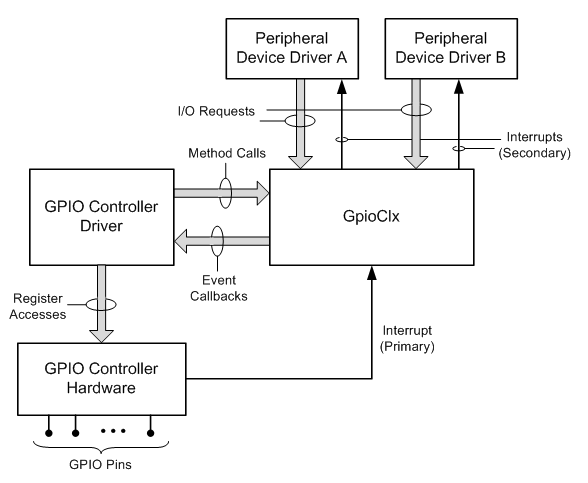

# GPIO Driver Support Overview

Starting with Windows 8, the GPIO framework extension (GpioClx) simplifies the task of writing a driver for a GPIO controller device. Additionally, GpioClx provides driver support for peripheral devices that connect to GPIO pins. GpioClx, which is a system-supplied extension to the kernel-mode driver framework (KMDF), performs processing tasks that are common to members of the GPIO device class.

This overview discusses the following topics:

- [GPIO Driver Support Overview](#gpio-driver-support-overview)
    - [GPIO Controller Drivers](#gpio-controller-drivers)
    - [Drivers for Peripheral Devices That Use GPIO Pins](#drivers-for-peripheral-devices-that-use-gpio-pins)

## GPIO Controller Drivers

Hardware vendors supply drivers to control their GPIO controllers. A GPIO controller driver is a KMDF driver that manages all hardware-specific operations for a GPIO controller. The GPIO controller driver cooperates with GpioClx to handle I/O requests for groups of GPIO pins that are configured as data inputs and data outputs. In addition, this driver cooperates with GpioClx to handle interrupt requests from GPIO pins that are configured as interrupt inputs.

A GPIO controller device has some number of GPIO pins. These pins can be physically connected to peripheral devices. GPIO pins can be configured as data inputs, data outputs, or interrupt request inputs. Typically, a GPIO pin is dedicated to a peripheral device, and not shared by two or more devices. Connections between GPIO pins and peripheral devices are fixed and cannot be changed by the user (for example, by removing a peripheral device and replacing it with another device). Thus, the assignment of GPIO pins to peripheral devices can be described in the platform firmware.

The following diagram shows the GPIO controller driver and GpioClx.

The GPIO controller driver and GpioClx communicate with each other through the GpioClx device-driver interface (DDI). The GPIO controller driver calls [driver support methods](https://msdn.microsoft.com/library/windows/hardware/hh439460) that are implemented by GpioClx. GpioClx calls [event callback functions](https://msdn.microsoft.com/library/windows/hardware/hh439464) that are implemented by the GPIO controller driver.

The GPIO controller driver directly accesses the hardware registers of the GPIO controller device.

GpioClx handles I/O requests from the drivers for peripheral devices that physically connect to GPIO pins. GpioClx translates these I/O requests into simple hardware operations, which it performs by calling the event callback functions that are implemented by the GPIO controller driver. For example, to read data from or write data to a set of GPIO pins, GpioClx calls event callback functions such as [*CLIENT\_ReadGpioPins*](https://msdn.microsoft.com/library/windows/hardware/hh439404) and [*CLIENT\_WriteGpioPins*](https://msdn.microsoft.com/library/windows/hardware/hh439439). GpioClx manages the I/O queues for the GPIO controller, and thereby relieves the GPIO controller driver of this task.

In addition, GpioClx handles primary interrupts from the GPIO controller device and maps these interrupts to secondary interrupts, which are handled by peripheral device drivers. Primary interrupts are interrupts that are generated by hardware devices. Secondary interrupts are generated by the operating system in response to certain primary interrupts. Both primary and secondary interrupts are identified by global system interrupts (GSIs). The ACPI firmware for the hardware platform assigns GSIs to primary interrupts, and, at run time, the operating system assigns GSIs to secondary interrupts.

For example, the firmware assigns a GSI to the hardware interrupt from the GPIO controller, and the operating system assigns a GSI to a GPIO pin that is configured as an interrupt input.

GpioClx implements an ISR that handles the hardware-generated, primary interrupts from the GPIO controller device. When a peripheral device asserts an interrupt on a GPIO pin, and interrupts on this pin are enabled and unmasked, the GPIO controller interrupts the processor. In response, the kernel trap handler schedules the GpioClx ISR to run. To identify the GPIO pin that caused the interrupt, the GpioClx ISR calls the [*CLIENT\_QueryActiveInterrupts*](https://msdn.microsoft.com/library/windows/hardware/hh439395) event callback function, which is implemented by the GPIO controller driver. The GpioClx ISR then looks up the GSI that is assigned to this pin and passes this GSI to the hardware abstraction layer (HAL). The HAL generates a secondary interrupt by calling the ISR that is registered for this GSI. This ISR belongs to the driver for the peripheral device that originally asserted the interrupt.

For more information about primary and secondary interrupts, see [GPIO Interrupts](https://msdn.microsoft.com/library/windows/hardware/hh406467).

## Drivers for Peripheral Devices That Use GPIO Pins

At startup, the Plug and Play (PnP) manager enumerates both PnP devices and non-PnP devices. For non-PnP devices that have fixed connections to GPIO pins, the PnP manager queries the platform firmware to determine which GPIO pins are assigned as system-managed hardware resources to these devices.

The KMDF driver for a peripheral device receives its assigned hardware resources during an [*EvtDevicePrepareHardware*](https://msdn.microsoft.com/library/windows/hardware/ff540880) callback. These resources might include GPIO pins that are configured as data outputs, data inputs, or interrupt request inputs.

A GPIO I/O resource is a new Windows resource type in Windows 8. This resource consists of a set of one or more GPIO pins that can be used either as data inputs or data outputs. If a peripheral device driver opens a GPIO I/O resource for reads, the driver uses all of the pins in the resource as data inputs. If a driver opens a GPIO I/O resource for writes, the driver uses all of the pins in the resource as data outputs. For code examples that show how a peripheral device driver opens a logical connection to a set of GPIO I/O pins, see the following topics:

[Connecting a KMDF Driver to GPIO I/O Pins](https://msdn.microsoft.com/library/windows/hardware/hh406474)

A GPIO pin that is configured as an interrupt input is assigned to a driver as an ordinary Windows interrupt resource. The interrupt resource abstraction hides the fact that an interrupt might be implemented by a GPIO pin instead of, for example, a programmable interrupt controller. Thus, the driver can treat a GPIO-based interrupt resource the same as any other interrupt resource.

To access the GPIO pins in a GPIO I/O resource, a peripheral device driver must open a logical connection to the pins. A KMDF driver calls the [**WdfIoTargetOpen**](https://msdn.microsoft.com/library/windows/hardware/ff548634) method to open the connection. Through this connection, the driver can send I/O requests to the GPIO pins. The driver sends [**IOCTL\_GPIO\_READ\_PINS**](https://msdn.microsoft.com/library/windows/hardware/hh406483) requests to read data from these pins (if they are input pins) or [**IOCTL\_GPIO\_WRITE\_PINS**](https://msdn.microsoft.com/library/windows/hardware/hh406487) requests to write data to them (if they are output pins).

To receive interrupts from the GPIO pin in an interrupt resource, a peripheral device driver must register its interrupt service routine (ISR) to receive interrupts from the interrupt resource that is implemented by this pin. A KMDF driver calls the [**WdfInterruptCreate**](https://msdn.microsoft.com/library/windows/hardware/ff547345) method to connect an ISR to the interrupt. 

 

 

