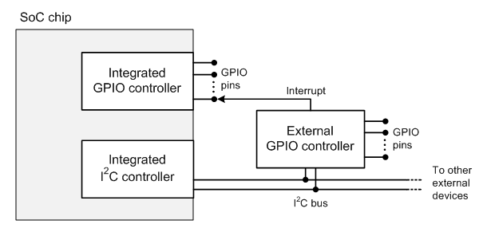

# Interrupt-Related Callbacks

As an option, the driver for a general-purpose I/O (GPIO) controller can provide support for GPIO interrupts. To support GPIO interrupts, a GPIO controller driver implements a set of callback functions to manage these interrupts. The driver includes pointers to these callback functions in the registration packet that the driver supplies when it registers itself as a client of GPIO framework extension (GpioClx). For more information about this registration packet, see [**GPIO\_CLIENT\_REGISTRATION\_PACKET**](https://msdn.microsoft.com/library/windows/hardware/hh439479).

As a rule, a GPIO controller that is an integrated part of a System on a Chip (SoC) chip has memory-mapped hardware registers that can be directly accessed by the processor in the SoC chip. However, a separate GPIO controller device might be connected externally to the SoC chip through a serial bus, as shown in the following diagram.

In this diagram, the external GPIO controller is connected to an I²C bus. This bus is controlled by an I²C bus controller that is an integrated part of the SoC chip. The interrupt request line from the external GPIO controller is connected to a pin on the integrated GPIO controller. The [GpioClx DDI](https://msdn.microsoft.com/library/windows/hardware/hh439456) can accommodate both the integrated GPIO controller and the external GPIO controller in this example.

If a GPIO controller device is memory-mapped, the GPIO controller driver can directly access the controller's hardware registers at DIRQL. However, if the GPIO controller is serially connected, the GPIO controller driver can access the hardware registers only at IRQL = PASSIVE\_LEVEL, as discussed in [Passive-Level ISRs](https://msdn.microsoft.com/library/windows/hardware/hh698262).

The driver for a GPIO controller that has memory-mapped hardware registers should set the **MemoryMappedController** flag bit in the device information that the driver provides to GpioClx. Otherwise, GpioClx assumes that the hardware registers are not memory-mapped, and that the driver can access these registers only at IRQL = PASSIVE\_LEVEL. For more information about this flag bit, see [**CONTROLLER\_ATTRIBUTE\_FLAGS**](https://msdn.microsoft.com/library/windows/hardware/hh439449).

GpioClx implements an interrupt service routine (ISR) to service interrupt requests from the GPIO controller. This ISR calls the following interrupt-related callback functions:

[*CLIENT\_ClearActiveInterrupts*](https://msdn.microsoft.com/library/windows/hardware/hh439341)
[*CLIENT\_MaskInterrupts*](https://msdn.microsoft.com/library/windows/hardware/hh439380)
[*CLIENT\_QueryActiveInterrupts*](https://msdn.microsoft.com/library/windows/hardware/hh439395)
[*CLIENT\_QueryEnabledInterrupts*](https://msdn.microsoft.com/library/windows/hardware/dn265184)
[*CLIENT\_UnmaskInterrupt*](https://msdn.microsoft.com/library/windows/hardware/hh439435)
These functions are called at either DIRQL or PASSIVE\_LEVEL, depending on whether the ISR in GpioClx runs at DIRQL or PASSIVE\_LEVEL. The ISR calls these functions at DIRQL if **MemoryMappedController** = 1, and at PASSIVE\_LEVEL if **MemoryMappedController** = 0. In either case, the ISR automatically serializes its callbacks so that a call to one of these functions does not occur in the middle of a call to another of these functions.

The GPIO framework extension calls the following interrupt-related callback functions only at PASSIVE\_LEVEL, regardless of whether the **MemoryMappedController** flag is set:

[*CLIENT\_DisableInterrupt*](https://msdn.microsoft.com/library/windows/hardware/hh439371)
[*CLIENT\_EnableInterrupt*](https://msdn.microsoft.com/library/windows/hardware/hh439377)
If the **MemoryMappedController** flag is not set, all of the interrupt-related callback functions are called at PASSIVE\_LEVEL. GpioClx automatically serializes calls to these functions so that a call to one of these functions does not occur in the middle of a call to another of these functions.

However, if the **MemoryMappedController** flag is set, the *CLIENT\_EnableInterrupt* and *CLIENT\_DisableInterrupt* functions must explicitly synchronize their interrupt enable and disable operations to the GpioClx ISR, which calls the other four interrupt-related callback functions at DIRQL.

Typically, the other <em>CLIENT\_</em>Xxx callback functions (whose names do not contain "*Interrupt*") do not perform interrupt-related processing and, therefore, do not need to synchronize to the GpioClx ISR. However, if any of these functions are called at PASSIVE\_LEVEL and contain code that accesses interrupt settings that are accessed by interrupt-related functions at DIRQL, this code must be synchronized to the ISR.

To support interrupt synchronization, GpioClx implements a set of interrupt locks. A callback function that runs at PASSIVE\_LEVEL can call the [**GPIO\_CLX\_AcquireInterruptLock**](https://msdn.microsoft.com/library/windows/hardware/hh439482) method to acquire an interrupt lock, and call the [**GPIO\_CLX\_ReleaseInterruptLock**](https://msdn.microsoft.com/library/windows/hardware/hh439494) method to release the lock. When the function holds the interrupt lock, the GpioClx ISR cannot run, and this ISR cannot call any interrupt-related callback function. To enable GPIO interrupts to be handled in a timely way, the driver should hold the interrupt lock for no longer than is necessary.

For more information, see [Interrupt Synchronization for GPIO Controller Drivers](https://msdn.microsoft.com/library/windows/hardware/jj851070).

 

 

