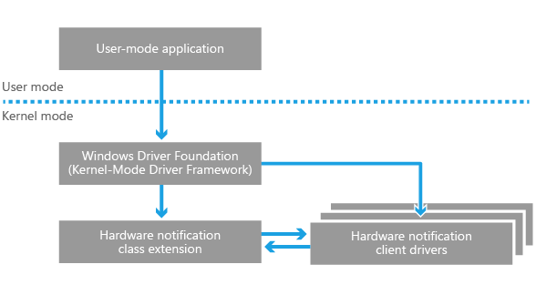
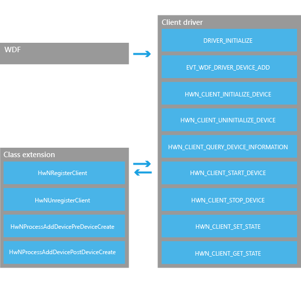

# Hardware notifications support

**Applies to**

-   Driver developers and OEMs

**Important APIs**

-   [Hardware notifications reference](https://msdn.microsoft.com/library/windows/hardware/dn789336)

Windows 10, version 1709 provides an infrastructure for the hardware-agnostic support of notification components such as LEDs and vibration mechanisms. This support is delivered through the introduction of a Kernel-Mode Driver Framework (KMDF) class extension specifically for hardware notification components that allows for the rapid development of client drivers. A KMDF class extension is essentially a KMDF driver that provides a defined set of functionality for a given class of devices, similar to a port driver in the Windows Driver Model (WDM). This section provides an overview of the architecture of the hardware notification class extension. For additional information about the KMDF, see [Using WDF to Develop a Driver](https://docs.microsoft.com/windows-hardware/drivers/wdf/using-the-framework-to-develop-a-driver).

## Hardware notification class extension

The hardware notification class extension is the central component of the hardware notification driver architecture. The class extension is designed to minimize the necessary interaction with the KMDF and to instead provide a simple interface for the control of notification components. The class extension handles tasks such as:

-   Registration of client drivers
-   Allocation and cleanup of system resources
-   Registration of PnP power callback functions for client drivers
-   Registration of I/O queues for client drivers
-   Data verification and error checking
-   Communication of hardware requests to the client driver

The following diagram illustrates the basic hardware notification class extension architecture.

## Hardware notification client driver

Client drivers can be easily generated for hardware notification components by using the hardware notification class extension. The client driver's only responsibility is to provide the appropriate entry points for the KMDF, implement the defined class extension callback functions, manage power states, and control the physical hardware. Specifically, the client driver must implement the [*DriverEntry*](https://msdn.microsoft.com/library/windows/hardware/ff544113) and [*EVT\_WDF\_DRIVER\_DEVICE\_ADD*](https://msdn.microsoft.com/library/windows/hardware/ff541693) callback functions for use by the Windows Driver Foundation (WDF), as well as the required callback functions for the class extension.

The following diagram illustrates the interactions from the perspective of the client driver.

 

 

