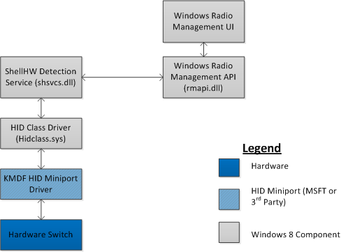

# Airplane mode radio management


Starting with Windows 8, the Windows operating system provides support via HID, for airplane mode radio management controls.

## Architecture and overview


The objective of airplane mode is to allow the PC manufacturer to provide a button or switch (and potentially an LED to indicate status) that enables an end user to turn on/off all wireless controls in one shot. This primarily empowers a user who need to turn airplane mode on/off to do to so in a programmatic way allowing the operating system to (a) identify the status of switch and (b) control the various wireless radios via software.

Windows provides support for the following HID Usages on the Generic Desktop usage page.

| Usage ID | Usage Name                   | Usage Type                 |
|----------|------------------------------|----------------------------|
| 0x000C   | Wireless Radio Controlls     | CollectionApplication (CA) |
| 0x00C6   | Wireless Radio Button        | On/Off Control (OOC)       |
| 0x00C7   | Wireless Radio LED           | On/Off Control (OOC)       |
| 0x00C8   | Wireless Radio Slider Switch | On/Off Control (OOC)       |

 

The following is an architectural diagram of the HID Client that provides support for Radio Management / Airplane Mode.



ShellHW Detection service (SHSVCD.dll) is the HID Client Driver/Service that runs in user mode and provides support for the Radio Management device. It monitors for the presence of a HID Top Level Collection of type

-   USAGE\_PAGE (Generic Desktop) 05 01
-   USAGE (Wireless Radio Controls) 09 0C

## Sample report descriptor


The following section provides sample report descriptors that PC Manufacturers must leverage. Please note that if the Top Level Collection is part of a report descriptor that already has another Top Level Collection, a Report ID MUST be included (not shown in samples below).

The following section provides additional information for PC manufacturers and identifies which report descriptor sample is most appropriate for their system design:

-   The stateless button is often use on keyboard consumer control buttons (either standalone or in conjunction with the Function button on many mobile systems (e.g. Fn+F5)).
-   The slider switch is often used on mobile systems with a physical slider on/off switch (e.g. laptops with an on airplane mode on/off switch).
-   The LED is often used as stand alone airplane more indicator or in conjunction with the either stateless button or slider switch. Window users do not need the use of this LED on mobile form factor systems as there is visual indication in the UI around airplane mode.

*Stateless Button without LED*

``` syntax
USAGE_PAGE (Generic Desktop)                   05 01 
USAGE (Wireless Radio Controls)                09 0C 
COLLECTION (Application)                       A1 01 
LOGICAL_MINIMUM (0)                            15 00 
LOGICAL_MAXIMUM (1)                            25 01 
USAGE (Wireless Radio Button)                  09 C6 
REPORT_COUNT (1)                               95 01 
REPORT_SIZE (1)                                75 01 
INPUT (Data,Var,Rel)                           81 06 
REPORT_SIZE (7)                                75 07 
INPUT (Cnst,Var,Abs)                           81 03 
END_COLLECTION                                 C0
```

*Stateless Button with LED*

``` syntax
USAGE_PAGE (Generic Desktop)                    05 01 
USAGE (Wireless Radio Controls)                 09 0C 
COLLECTION (Application)                        A1 01 
LOGICAL_MINIMUM (0)                             15 00 
LOGICAL_MAXIMUM (1)                             25 01 
USAGE (Wireless Radio Button)                   09 C6 
REPORT_COUNT (1)                                95 01 
REPORT_SIZE (1)                                 75 01 
INPUT (Data,Var,Rel)                            81 06 
REPORT_SIZE (7)                                 75 07 
INPUT (Cnst,Var,Abs)                            81 03 
USAGE (Wireless Radio LED)                      09 C7 
REPORT_SIZE (1)                                 75 01 
OUTPUT (Data,Var,Rel)                           91 02 
REPORT_SIZE (7)                                 75 07 
OUTPUT (Cnst,Var,Abs)                           91 03 
END_COLLECTION                                  C0
```

*Slider Switch (without LED)*

``` syntax
USAGE_PAGE (Generic Desktop)                    05 01 
USAGE (Wireless Radio Controls)                 09 0C 
COLLECTION (Application)                        A1 01 
LOGICAL_MINIMUM (0)                             15 00 
LOGICAL_MAXIMUM (1)                             25 01 
USAGE (Wireless Radio Slider Switch)            09 C8 
REPORT_COUNT (1)                                95 01 
REPORT_SIZE (1)                                 75 01 
INPUT (Data,Var,Abs)                            81 02 
REPORT_SIZE (7)                                 75 07 
INPUT (Cnst,Var,Abs)                            81 03 
END_COLLECTION                                  C0
```

*Slider Switch with LED*

``` syntax
USAGE_PAGE (Generic Desktop)                    05 01 
USAGE (Wireless Radio Controls)                 09 0C 
COLLECTION (Application)                        A1 01 
LOGICAL_MINIMUM (0)                             15 00 
LOGICAL_MAXIMUM (1)                             25 01 
USAGE (Wireless Radio Slider Switch)            09 C8 
REPORT_COUNT (1)                                95 01 
REPORT_SIZE (1)                                 75 01 
INPUT (Data,Var,Abs)                            81 02 
REPORT_SIZE (7)                                 75 07 
INPUT (Cnst,Var,Abs)                            81 03 
USAGE (Wireless Radio LED)                      09 C7 
REPORT_SIZE (1)                                 75 01 
OUTPUT (Data,Var,Rel)                           91 02 
REPORT_SIZE (7)                                 75 07 
OUTPUT (Cnst,Var,Abs)                           91 03 
END_COLLECTION                                  C0
```

*LED Only (No button or slider)*

``` syntax
USAGE_PAGE (Generic Desktop)                   05 01 
USAGE (Wireless Radio Controls)                09 0C 
COLLECTION (Application)                       A1 01 
LOGICAL_MINIMUM (0)                            15 00 
LOGICAL_MAXIMUM (1)                            25 01 
USAGE (Wireless Radio LED)                     09 C7 
REPORT_COUNT (1)                               95 01 
REPORT_SIZE (1)                                75 01 
OUTPUT (Data,Var,Rel)                          91 02 
REPORT_SIZE (7)                                75 07 
OUTPUT (Cnst,Var,Abs)                          91 03 
END_COLLECTION                                 C0
```

## Troubleshooting common errors


Tip \#1: When using a radio manager BUTTON, the PC manufacturer should send one HID report when the button is released and not when the button is pressed. This is because the toggle button is generally a relative input and not an absolute one.

Tip \#2: Airplane Mode radio management HID usages only operate on Mobile systems (battery powered) and require Windows 8 or later versions of Windows.

Tip \#3: For more information on the Airplane Mode radio management button, see the [Keyboard Enhancements to Windows 8](https://msdn.microsoft.com/library/windows/hardware/dn613956.aspx) whitepaper.

Tip \#4: For more information regarding the buttons, and to ensure that you are implementing the correct hardware, please review the Windows 8 System Logo Requirements.

 

 


