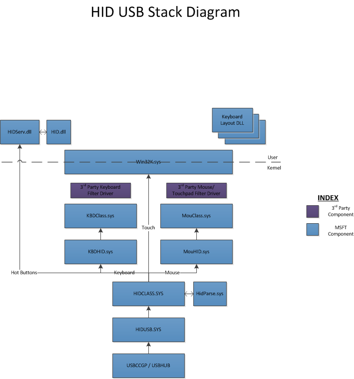

# Architecture and overview

This section describes the driver stack for devices that support HID over the USB transport.

The HID over USB driver stack consists of the following components supplied by Microsoft. The following illustration depicts the stack and these components.

Windows 8 provides a WDF-based HID miniport driver that implements version 1.1+ of the protocol specification for HID over USB. This driver is named HIDUSB.SYS. Windows loads this driver based on a USB Device Class compatible ID match.

 

 

