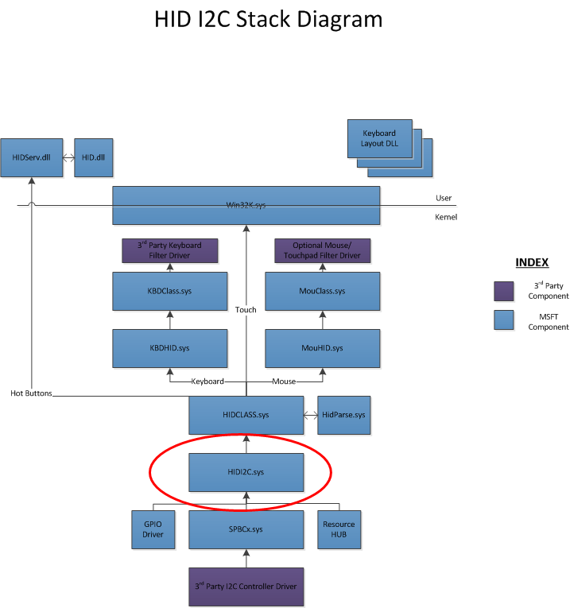

# Architecture and overview for HID over the I²C transport

This section describes the driver stack for devices that support HID over the I²C transport.

## Architecture and overview

The HID I²C driver stack consists of existing and new components supplied by Microsoft, as well as components provided by the I²C silicon manufacturer. The following illustration depicts the stack and these components.

Windows 8 provides an interface for low-power, simple buses to communicate effectively with the operating system. This interface is referred to as simple peripheral bus (SPB), and it supports buses like Inter-Integrated Circuit (I²C) and Serial Peripheral Interface (SPI). For additional details about SPB, refer to the Simple Peripheral Buses topic.

Windows 8 provides a KMDF-based HID miniport driver that implements version 1.0 of the protocol specification for HID over I²C. This driver is named HIDI2C.sys. Windows loads this driver based on a compatible ID match, which is exposed by the Advanced Configuration and Power Interface (ACPI). The driver ensures that apps that use HID IOCTLs application level compatibility for software that leverages the HID IOCTLs and API set. A device will assert the host when it requires attention or has data. However, before the assertion occurs, a GPIO connection must exist.

**Note**  The HIDI2C.sys device driver supports only the I²C bus. It does not support SPI, SMBUS, or other low-power buses in Windows 8.

 

## The I²C Controller Driver

The I²C controller driver exposes a Serial Peripheral Bus (SPB) IOCTL interface to perform read and write operations. This driver provides the actual controller intrinsics (for example, I²C). The SPB Class Extension, on behalf of the controller driver, handles all interaction with the resource hub and implements necessary queues to manage simultaneous targets.

**Note**  The HID I²C driver will not function on systems that do not have an I²C bus that is compatible with the SPB platform. Contact your system manufacturer to determine whether the I²C bus on your device system is compatible with the SPB platform.

 

## The GPIO Controller Driver

The General Purpose Input/Output (GPIO) controller delivers interrupts from the device over GPIO. This is often a simple slave component that uses GPIO pins to signal Windows of new data or other events. GPIO can also control the device by approaches other than the I²C channel.

## The Resource Hub

Connections on a SoC platform are typically non-discoverable, because there are no standards for device enumeration on the buses that are used on SoC. As a result, these devices must be statically defined in the Advanced Configuration and Power Interface (ACPI). Furthermore, components often have multiple dependencies spanning multiple buses, as opposed to a strict branching tree structure.

The resource hub is a proxy that manages the connections among all devices and bus controllers. The HIDI²C driver uses the resource hub to reroute device-open requests to the appropriate controller driver. For more information about the resource hub, refer to the [Connection IDs for SPB Connected Devices](https://msdn.microsoft.com/library/windows/hardware/hh698216) topic.

 

 

