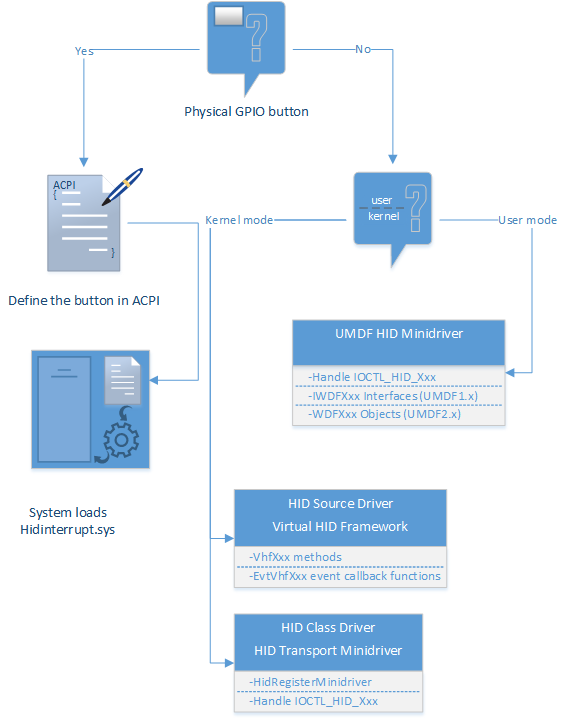
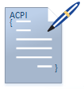
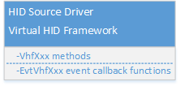
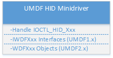

# HID button drivers

**Summary**

-   [Describe a GPIO button in ACPI and load Microsoft-provided driver](acpi-button-device.md)
-   [Write a HID source driver in kernel mode for non-GPIO button](virtual-hid-framework--vhf-.md)
-   [Write a UMDF HID Minidriver for a non-GPIO button](https://msdn.microsoft.com/library/windows/hardware/hh439579)

**Applies to**

-   Windows 10
-   Driver developers of HID button devices

**Important APIs**

-   [Virtual HID Framework Reference](https://msdn.microsoft.com/library/windows/hardware/dn925048)
-   [UMDF HID Minidriver IOCTLs](https://msdn.microsoft.com/library/windows/hardware/hh463977)

Use the Microsoft-provided button driver for GPIO buttons; otherwise, implement your driver that injects HID data to the operating system.

Buttons (Power, Windows, volume and rotation lock) are typically used for tasks that occur while the physical keyboard is not available to the user, on form factors such as convertibles or slates. Buttons declare themselves to the operating system as HID devices by supplying [HID button report descriptors](https://msdn.microsoft.com/library/windows/hardware/dn457881). This allows the system to interpret the purpose and events of those buttons in a standardized way. When a button state changes, that event is mapped to a [HID Usages](hid-usages.md). A HID transport minidriver reports those events to upper-level drivers that then send details to HID clients in user mode or kernel mode.

For physical general-purpose I/O (GPIO) buttons, the HID transport minidriver is a Microsoft-provided in-box driver that reports the events based on the interrupts that are received on the defined GPIO hardware resources.

The in-box driver cannot service a button that is not wired to an interrupt line. For such buttons, you need to write a driver that exposes the button as a HID button and reports state changes to the HID class driver (Microsoft-provided). Your driver could be a HID source driver or a HID transport driver.

## Guidance for supporting HID buttons

Here are some general pointers to help you decide which implementation you should follow if you are creating HID buttons.

<table>
<colgroup>
<col width="50%" />
<col width="50%" />
</colgroup>
<tbody>
<tr class="odd">
<td>
<strong>Use the Microsoft-provided in-box button driver</strong>

</td>
<td>
If you are implementing a GPIO button, describe the button in the system ACPI so that Windows can load the in-box driver, Hidinterrupt.sys, as the button driver that reports events to the operating system.

<ul>
<li>[ACPI button device](acpi-button-device.md)</li>
<li>[Sample buttons ACPI for phone/tablet](acpi-button-device.md#acpi-button-phone)</li>
<li>[Sample buttons ACPI for desktop](acpi-button-device.md#acpi-button-desktop)</li>
</ul>

Microsoft encourages you to use the in-box transport-minidrivers whenever possible.
</td>
</tr>
<tr class="even">
<td>
<strong>Write a HID source driver in kernel mode</strong>

</td>
<td>
If you are implementing a non-GPIO button such as a stream of data in the HID format that needs to be injected by another software component, you can choose to write a kernel-mode driver. Starting in Windows 10, you can write a HID source driver by calling programming interfaces that communicate with Virtual HID Framework (VHF) and gets and sets HID Reports to and from the HID class driver.

<ul>
<li>[How to write a HID source driver that interacts with Virtual HID Framework (VHF)](virtual-hid-framework--vhf-.md)</li>
<li>[Virtual HID Framework Reference](https://msdn.microsoft.com/library/windows/hardware/dn925048)</li>
</ul>

Alternately, you can write a kernel-mode HID transport minidriver as supported by the earlier versions of Windows. However, we do not recommend this approach because poorly written KMDF HID transport minidrivers can crash the system.

<ul>
<li>[Transport Minidrivers](transport-minidrivers.md)</li>
<li>[HID Minidriver IOCTLs](https://msdn.microsoft.com/library/windows/hardware/ff539926)</li>
</ul></td>
</tr>
<tr class="odd">
<td>
<strong>Write a UMDF HID Minidriver</strong>

</td>
<td>
If you are implementing a non-GPIO button, instead of using preceding model of writing a HID source driver, you can write a HID transport minidriver in user mode. These drivers are easier to develop than kernel-mode drivers and errors in this driver do not bug check the whole system.

<ul>
<li>[Creating UMDF HID Minidrivers](https://msdn.microsoft.com/library/windows/hardware/hh439579)</li>
<li>[UMDF HID Minidriver IOCTLs](https://msdn.microsoft.com/library/windows/hardware/hh463977)</li>
</ul></td>
</tr>
</tbody>
</table>

 

## Universal Windows drivers for HID buttons

Starting with Windows 10, the HID driver programming interfaces are part of OneCoreUAP-based editions of Windows. By using that common set of interfaces, you can write a button driver by using [Virtual HID Framework](https://msdn.microsoft.com/library/windows/hardware/dn925048) or [Transport Minidrivers](transport-minidrivers.md) interfaces. Those drivers will run on both Windows 10 for desktop editions (Home, Pro, Enterprise, and Education) and Windows 10 Mobile, as well as other Windows 10 versions.

For step-by-step guidance, see [Getting Started with Universal Windows drivers](https://msdn.microsoft.com/windows-drivers/develop/getting_started_with_universal_drivers).

## Related topics
[Human Interface Device](https://msdn.microsoft.com/library/windows/hardware/ff543301)  

--------------------
[Send comments about this topic to Microsoft](mailto:wsddocfb@microsoft.com?subject=Documentation%20feedback%20%5Bhid\hid%5D:%20HID%20button%20drivers%20%20RELEASE:%20%287/18/2016%29&body=%0A%0APRIVACY%20STATEMENT%0A%0AWe%20use%20your%20feedback%20to%20improve%20the%20documentation.%20We%20don't%20use%20your%20email%20address%20for%20any%20other%20purpose,%20and%20we'll%20remove%20your%20email%20address%20from%20our%20system%20after%20the%20issue%20that%20you're%20reporting%20is%20fixed.%20While%20we're%20working%20to%20fix%20this%20issue,%20we%20might%20send%20you%20an%20email%20message%20to%20ask%20for%20more%20info.%20Later,%20we%20might%20also%20send%20you%20an%20email%20message%20to%20let%20you%20know%20that%20we've%20addressed%20your%20feedback.%0A%0AFor%20more%20info%20about%20Microsoft's%20privacy%20policy,%20see%20http://privacy.microsoft.com/default.aspx. "Send comments about this topic to Microsoft")

