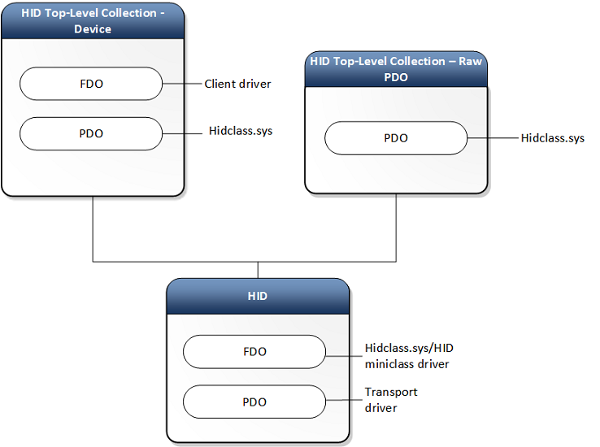

# HID Architecture

The architecture of the HID driver stack in Windows is built on the class driver named *hidclass.sys*. Clients and transport minidrivers access the class driver from user-mode or kernel-mode.

## The HID Class Driver

The system-supplied HID class driver is the WDM function driver and bus driver for the HID device setup class (HIDClass). The executable component of the HID class driver is *hidclass.sys*. The HID Class driver is the glue between HID clients and various transports. This allows a HID Client to be written in an independent way from transports. This level of abstraction allows clients to continue to work (with little to no modifications) when a new standard, or a 3rd party transport is introduced.

The following is an architectural representation.

The preceding diagram includes the following:

- HID Clients – Identifies the Windows and 3rd party clients and their interfaces.
- HID Class driver - The *hidclass.sys* executable.
- HID Transport Minidriver - Identifies the Windows and 3rd party transports and their interfaces.

Here is the device stack diagram of a generic HID client and transport.

Here is another device stack diagram showing HID keyboard and mouse collections over USB.

## HID Clients

The HID Clients are drivers, services or applications that communicate with *HIDClass.sys* and often represent a specific type of device (E.g. sensor, keyboard, mouse, etc). They identify the device via a hardware ID or a specific HID Collection and communicate with the HID Collection via the following guidance.

User-mode drivers and applications, and kernel-mode drivers, do the following to operate HID collections:

- User-mode drivers and applications use HIDClass support routines (HidD\_Xxx) to obtain information about a HID collection.
- Kernel-mode drivers, user-mode drivers and applications use HID parsing support routines (HidP\_Xxx), and kernel-mode drivers use HID class driver IOCTLs to handle HID reports.

The following table is a simplification of the information listed above.

|      Mode   | Drivers                      | Applications |
|-------------|------------------------------|--------------|
| User Mode   | HidD\_Xxx                    | HidP\_Xxx    |
| Kernel Mode | HidD\_Xxx OR IOCTL\_HID\_xxx | N/A          |

For more information, see [Opening HID collections](opening-hid-collections.md).

### HID Clients Supported in Windows

Windows supports the following top-level collections:

| **Usage Page** | **Usage** | **Windows 7** | **Windows 8** | **Windows 10** | **Notes** | **Access Mode** |
| --- | --- | --- | --- | --- | --- | --- |
| 0x0001 | 0x0001 - 0x0002 | Yes | Yes | Yes | [Mouse class driver and mapper driver](keyboard-and-mouse-class-drivers.md) | Exclusive |
| 0x0001 | 0x0004 - 0x0005 | Yes | Yes | Yes | Game Controllers | Shared |
| 0x0001 | 0x0006 - 0x0007 | Yes | Yes | Yes | [Keyboard / Keypad class driver and mapper driver](keyboard-and-mouse-class-drivers.md) | Exclusive |
| 0x0001 | 0x000C | No | Yes | Yes | Flight Mode Switch | Shared |
| 0x0001 | 0x0080 | Yes | Yes | Yes | System Controls (Power) | Shared |
| 0x000C | 0x0001 | Yes | Yes | Yes (For both Windows 10 and Windows 10 Mobile) | Consumer Controls | Shared (For both Windows 10 and Windows 10 Mobile) |
| 0x000D | 0x0001 | Yes | Yes | Yes | External Pen Device | Exclusive |
| 0x000D | 0x0002 | Yes | Yes | Yes | Integrated Pen Device | Exclusive |
| 0x000D | 0x0004 | Yes | Yes | Yes | Touchscreen | Exclusive |
| 0x000D | 0x0005 | No | Yes | Yes | Precision Touchpad (PTP) | Exclusive |
| 0x0020 | *Multiple | No | Yes | Yes | Sensors | Shared |
| 0x0084 | 0x0004 | Yes | Yes | Yes | HID UPS Battery | Shared |
| 0x008C | 0x0002 | No | Yes (Windows 8.1 and later) | Yes | Barcode Scanner (hidscanner.dll) | Shared |

In the preceding table, the access mode for input HID clients is *Exclusive* to prevent other HID clients from intercepting or receiving global input state when they are not the target recipient of that input. Therefore, for security reasons RIM (Raw Input Manager) opens all such devices exclusively. 

If device is opened in *Exclusive* mode by  RIM (Raw Input Manager) user can still open HID device interface without requesting read and write permissions and obtain HID device information via HIDClass support routines (HidD\_GetXxx).

Sharing mode allows multiple applications to access the device. For example, multiple applications can access a barcode scanner to inquire about device capabilities and retrieve statistics. However, retrieving decoded data from a barcode scanner is done in Exclusive mode. Usages are defined by the [USB-IF Usage Tables](https://usb.org/document-library/hid-usage-tables-121).

*Multiple: Sensors usages from 0x00 – 0xFF are segmented for different purposes. For example 0x10 indicates a Biometric sensor; 0x40 indicates a Light sensor. Those allocations are not contiguous. For the list of sensor usages, see  [USB-IF Device Class Defnitions for HID](https://www.usb.org/document-library/device-class-definition-hid-111). For information about  sensors usages that are supported in Windows, [HID Sensors Usages](/windows-hardware/design/whitepapers/hid-sensors-usages).

## The HID Transport Driver

The HID class driver is designed to use HID minidrivers to access a hardware input device. A HID minidriver abstracts the device-specific operation of the input devices that it supports. The HID minidriver binds its operation to the HID class driver by registering with the HID class driver. The HID class driver communicates with a HID minidriver by calling the minidriver's support routines. The HID minidriver, in turn, sends communications down the driver stack to an underlying bus or port driver.

### HID Transports Supported in Windows

See [this page](hid-transports.md) for a list of supported HID Transports.

[**USB Generic HID Test**](/windows-hardware/test/hlk/testref/f7949ab5-dd13-4c74-876f-6d54ff85e213) in the Windows Hardware Lab Kit (HLK) covers HidUsb and HidClass drivers. There is no HLK test for third-party HID mini drivers.
