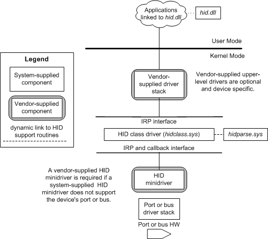

# HID client drivers

If a system-supplied HID minidriver does not support a device's port or bus, a vendor supplied minidriver is required.

## 

The following figure illustrates a driver stack for a generic HIDClass device (which might use optional and required vendor-supplied components).

Windows builds the driver stack as follows:

-   The transport stack creates a physical device object (PDO) for each HID device attached and loads the appropriate HID transport driver which in turn loads the HID Class Driver.
-   The HID class driver creates a PDO for the TLC . For complex devices with multiple TLC, HID Class driver creates a PDO for each TLC and ensures that the hardware ID associated with the TLC includes an identifier to represent each device object.
-   A vendor-supplied function or filter driver creates an FDO or a filter DO for a HID collection.
-   Alternatively a vendor-supplied application can open the device using SetupDI\* APIs to identify the device and then HID supported routines to communicate with the device. Such devices are said to be opened in RAW mode.

If the system-supplied [Minidriver Operations](minidriver-operations.md) do not support a device, a vendor-supplied HID minidriver is required. You can implement this minidriver in two ways:

-   HID client driver
-   Application accesses HID directly

If a vendor supplies a driver (other than a minidriver), that driver:

-   Must comply with the minimum requirements on Windows driver. Ideally, this should be based on the user-mode driver framework (UMDF) or the kernel-mode driver framework (KMDF). A less ideal solution is to create a WDM function driver, as described in Windows Driver Model.
-   Typically supports a vendor-defined device interface -- see Device Interface Classes. Upper-level drivers or user-mode applications use the custom interface to access the devices that the vendor driver operates. The custom interface might add functionality or, perhaps, simplify the interface to the HID class driver.

If the driver is not a function driver or filter driver, it can use Plug and Play notification to find HID collections. After finding a collection, the driver opens the collection and operates it in the same manner as a function or filter driver.

Important note:

-   If a vendor-supplied function driver creates an FDO or filter DO for a HID collection, it should not use the FsContext field of FILE\_OBJECT to store file object-specific data. The FsContext field is reserved for the HID class driver. If another driver in the stack needs to store file object-specific context data, it should use the FsContext2 field instead.
-   If there are multiple devices attached to the PDO, there is no built-in mechanism to determine which device can use the FsContext2 field.

 

 

--------------------
[Send comments about this topic to Microsoft](mailto:wsddocfb@microsoft.com?subject=Documentation%20feedback%20%5Bhid\hid%5D:%20HID%20client%20drivers%20%20RELEASE:%20%287/18/2016%29&body=%0A%0APRIVACY%20STATEMENT%0A%0AWe%20use%20your%20feedback%20to%20improve%20the%20documentation.%20We%20don't%20use%20your%20email%20address%20for%20any%20other%20purpose,%20and%20we'll%20remove%20your%20email%20address%20from%20our%20system%20after%20the%20issue%20that%20you're%20reporting%20is%20fixed.%20While%20we're%20working%20to%20fix%20this%20issue,%20we%20might%20send%20you%20an%20email%20message%20to%20ask%20for%20more%20info.%20Later,%20we%20might%20also%20send%20you%20an%20email%20message%20to%20let%20you%20know%20that%20we've%20addressed%20your%20feedback.%0A%0AFor%20more%20info%20about%20Microsoft's%20privacy%20policy,%20see%20http://privacy.microsoft.com/default.aspx. "Send comments about this topic to Microsoft")

