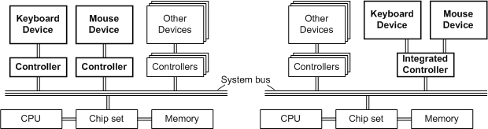
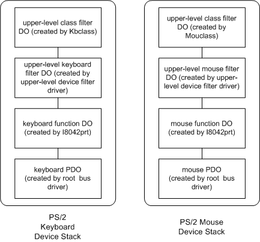

# Keyboard and mouse class drivers


Non-HID keyboards and mice can connect over multiple legacy buses but still use the same class driver. This section contains details on the class drivers themselves. The following sections goes into details on the controllers.

This topic describes the typical physical configuration of keyboard and mouse devices in Microsoft Windows 2000 and later.

The following figures show two common configurations that employ a single keyboard and a single mouse.



The figure on the left shows a keyboard and a mouse connected to a system bus through independent controllers. A typical configuration consists of a PS/2-style keyboard operated through an i8042 controller, and a serial-style mouse operated through a serial port controller.

The following additional information is important for keyboard and mice manufactures:

-   Keyboards are opened in exclusive mode by the operating system stack for security reasons
-   Windows supports the simultaneous connection of more than one keyboard and mouse device.
-   Windows does not support independent access by a client to each device.

## Class driver features


This topic describes the features of the following Microsoft Windows 2000 and later system class drivers:

-   **Kbdclass**, the class driver for devices of GUID\_CLASS\_KEYBOARD device class

-   **Mouclass**, the class driver for devices of GUID\_CLASS\_MOUSE device class

Kbdclass implements the Kbdclass service and its executable image is kbdclass.sys.

Mouclass implements the Mouclass service and its executable image is mouclass.sys.

Kbdclass and Mouclass each feature:

-   Generic and hardware-independent operation of the device class.

-   Plug and Play, power management, and Windows Management Instrumentation (WMI).

-   Operation of legacy devices.

-   Simultaneous operation of more than one device.

-   Connection of a [class service callback routine](https://msdn.microsoft.com/library/windows/hardware/ff542274) that a function driver uses to transfer data from the input data buffer of the device to the data buffer of the class driver.

## Configuration of device objects


The following figure shows the configuration of device objects for a Plug and Play PS/2-style keyboard and mouse device. Each class driver creates an upper-level class [*filter device object*](https://msdn.microsoft.com/library/windows/hardware/ff556280#wdkgloss-filter-device-object) (filter DO) that is attached to a function device object ([*FDO*](https://msdn.microsoft.com/library/windows/hardware/ff556280#wdkgloss-fdo)) through an optional upper-level device filter DO. An upper-level device filter driver creates the upper-level device filter DO. I8042prt creates the function DO and attaches it to a physical device object ([*PDO*](https://msdn.microsoft.com/library/windows/hardware/ff556325#wdkgloss-pdo)) created by the root bus driver.



*PS/2 Keyboard*

The keyboard driver stack consists of the following.

-   Kbdclass, the upper-level keyboard class filter driver
-   One or more optional upper-level keyboard filter driver
-   I8042prt, the function driver

*PS/2 Mouse*

The mouse driver stack consists of the following.

-   Mouclass, the upper-level mouse class filter driver
-   One or more optional upper-level mouse filter driver
-   I8042prt, the function driver

Kbdclass and Mouclass can support more than one device in two different modes. In the *one-to-one mode*, each device has an independent device stack. The class driver creates and attaches an independent class DO to each device stack. Each device stack has its own control state and input buffer. The Microsoft Win32 subsystem accesses input from each device through a unique file object.

In the *grandmaster mode*, the class driver operates all the devices in the following way:

-   The class driver creates both a *grandmaster class DO* that represents all of the devices and a *subordinate class DO* for each device.

    The class driver attaches a subordinate class DO to each device stack. Below the subordinate class DO, the device stack is same as that created in the one-to-one mode.

-   The grandmaster class DO controls the operation of all the subordinate DOs.

-   The Win32 subsystem accesses all device input through the file object that represents the grandmaster class device.

-   All device input is buffered in the grandmaster's data queue.

-   The grandmaster maintains a single global device state.

Kbdclass and Mouclass operate in the one-to-one mode if their registry entry value **ConnectMultiplePorts** is set to 0x00 (under the key **HKLM\\Services\\CurrentControlSet\\***&lt;class service&gt;***\\Parameters**, where *class service* is Kbdclass or Mouclass). Otherwise Kbdclass and Mouclass operate in grandmaster mode.

## Open and close via the class driver


The Microsoft Win32 subsystem opens all keyboard and mouse devices for its exclusive use. For each device class, the Win32 subsystem treats input from all the devices as if the input came from a single input device. An application cannot request to receive input from only one particular device.

The Win32 subsystem dynamically opens Plug and Play input devices after it receives notification from the Plug and Play manager that a GUID\_CLASS\_KEYBOARD or GUID\_CLASS\_MOUSE device interface is enabled. The Win32 subsystem closes Plug and Play devices after it receives notification that an opened interface is disabled. The Win32 subsystem also opens legacy devices by name (for example, "\\Device\\KeyboardLegacyClass0"). Note that once the Win32 subsystem successfully opens a legacy device, it cannot determine if the device is later physically removed.

After Kbdclass and Mouclass receive a create request they do the following for Plug and Play and legacy operation:

-   **Plug and Play Operation**

    If the device is in the Plug and Play started state, the class driver sends the IRP\_MJ\_CREATE request down the driver stack. Otherwise the class driver completes the request without sending the request down the driver stack. The class driver sets the trusted file that has read access to the device. If there is a grandmaster device, the class driver sends a create request to all the ports that are associated with the subordinate class devices.

-   **Legacy Operation**

    The class driver sends an internal device control request to the port driver to enable the device.

## Connect a service callback to a device


The class drivers must connect their class service to a device before the device can be opened. The class drivers connect their class service after they attach a class DO to a device stack. The function driver uses the class service callback to transfer input data from a device to the class data queue for the device. The function driver's ISR dispatch completion routine for a device calls the class service callback. Kbdclass provides the class service callback [**KeyboardClassServiceCallback**](https://msdn.microsoft.com/library/windows/hardware/ff542324), and Mouclass provides the class service callback [**MouseClassServiceCallback**](https://msdn.microsoft.com/library/windows/hardware/ff542394).

A vendor can modify the operation of a class service callback by installing an upper-level filter driver for a device. The sample filter driver [Kbfiltr](http://go.microsoft.com/fwlink/p/?linkid=256125) defines the [**KbFilter\_ServiceCallback**](https://msdn.microsoft.com/library/windows/hardware/ff542297) callback, and the sample filter driver [Moufiltr](http://go.microsoft.com/fwlink/p/?linkid=256135) defines the [**MouFilter\_ServiceCallback**](https://msdn.microsoft.com/library/windows/hardware/ff542380) callback. The sample filter service callbacks can be configured to modify the input data that is transferred from the port input buffer for a device to the class data queue. For example, the filter service callback can delete, transform, or insert data.

The class and filter service callbacks are connected in the following way:

-   The class driver sends an internal device connect request down the device stack ([**IOCTL\_INTERNAL\_KEYBOARD\_CONNECT**](https://msdn.microsoft.com/library/windows/hardware/ff541279) or [**IOCTL\_INTERNAL\_MOUSE\_CONNECT**](https://msdn.microsoft.com/library/windows/hardware/ff541300)). The class connect data is specified by a CONNECT\_DATA structure that includes a pointer to the class device object, and a pointer to the class service callback.

-   After the filter driver receives the connect request, it saves a copy of the class connect data, and replaces the request's connect data with filter connect data. The filter connect data specifies a pointer to the filter device object and a pointer to the filter driver service callback. The filter driver then sends the filtered connect request to the function driver.

The class and filter service callbacks are called in the following way:

-   The function driver uses the filter connect data to make the initial callback to the filter service callback.

-   After filtering the input data, the filter service callback uses the class connect data that it saved to make a callback to the class service callback.

## Query and set a keyboard device


I8042prt supports the following internal device control requests to query information about a keyboard device, and to set parameters on a keyboard device:

[**IOCTL\_KEYBOARD\_QUERY\_ATTRIBUTES**](https://msdn.microsoft.com/library/windows/hardware/ff541325)

[**IOCTL\_KEYBOARD\_QUERY\_INDICATOR\_TRANSLATION**](https://msdn.microsoft.com/library/windows/hardware/ff541352)

[**IOCTL\_KEYBOARD\_QUERY\_INDICATORS**](https://msdn.microsoft.com/library/windows/hardware/ff541337)

[**IOCTL\_KEYBOARD\_QUERY\_TYPEMATIC**](https://msdn.microsoft.com/library/windows/hardware/ff541357)

[**IOCTL\_KEYBOARD\_SET\_INDICATORS**](https://msdn.microsoft.com/library/windows/hardware/ff542059)

[**IOCTL\_KEYBOARD\_SET\_TYPEMATIC**](https://msdn.microsoft.com/library/windows/hardware/ff542070)

For more information about all keyboard device control requests, see [I8042prt Keyboard Internal Device Control Requests](https://msdn.microsoft.com/library/windows/hardware/ff539973).

## Scan code mapper for keyboards


In Microsoft Windows operating systems, PS/2-compatible scan codes provided by an input device are converted into virtual keys, which are propagated through the system in the form of Windows messages. If a device produces an incorrect scan code for a certain key, the wrong virtual key message will be sent. This can be fixed by writing a filter driver that analyzes the scan codes generated by firmware and modifies the incorrect scan code to one understood by the system. However, this is a tedious process and can sometimes lead to severe problems, if errors exist in the kernel-level filter driver.

Windows 2000 and Windows XP include a new Scan Code Mapper, which provides a method that allows for mapping of scan codes. The scan code mappings for Windows are stored in the following registry key:

``` syntax
HKEY_LOCAL_MACHINE\SYSTEM\CurrentControlSet\Control\Keyboard Layout
```

**Note**  There is also a **Keyboard Layouts** key (notice the plural form) under the Control key, but that key should not be modified.

 

In the **Keyboard Layout** key, the **Scancode Map** value must be added. This value is of type REG\_BINARY (little Endian format) and has the data format specified in the following table.

|                         |                 |                              |
|-------------------------|-----------------|------------------------------|
| Start offset (in bytes) | Size (in bytes) | Data                         |
| 0                       | 4               | Header: Version Information  |
| 4                       | 4               | Header: Flags                |
| 8                       | 4               | Header: Number of Mappings   |
| 12                      | 4               | Individual Mapping           |
| ...                     | ...             | ...                          |
| Last 4 bytes            | 4               | Null Terminator (0x00000000) |

 

The first and second DWORDS store header information and should be set to all zeroes for the current version of the Scan Code Mapper. The third DWORD entry holds a count of the total number of mappings that follow, including the null terminating mapping. The minimum count would therefore be 1 (no mappings specified). The individual mappings follow the header. Each mapping is one DWORD in length and is divided into two WORD length fields. Each WORD field stores the scan code for a key to be mapped.

Once the map is stored in the registry, the system must be rebooted for the mappings to take effect. Note that if the mapping of a scan code is necessary on a keypress, the step is performed in user mode just before the scan code is converted to a virtual key. Doing this conversion in user mode can present certain limitations, such as mapping not working correctly when running under Terminal Services.

To remove these mappings, remove the Scancode Map registry value and reboot.

*Example 1*

The following presents an example. To swap the left CTRL key with the CAPS LOCK key, use a registry editor (preferably Regedt32.exe) to modify the Scancode Map key with the following value:

``` syntax
00000000 00000000 03000000 3A001D00 1D003A00 00000000
```

The following table contains these entries broken into DWORD fields and the bytes swapped.

|            |                                                    |
|------------|----------------------------------------------------|
| Value      | Interpretation                                     |
| 0x00000000 | Header: Version. Set to all zeroes.                |
| 0x00000000 | Header: Flags. Set to all zeroes.                  |
| 0x00000003 | Three entries in the map (including null entry).   |
| 0x001D003A | Left CTRL key --&gt; CAPS LOCK (0x1D --&gt; 0x3A). |
| 0x003A001D | CAPS LOCK --&gt; Left CTRL key (0x3A --&gt; 0x1D). |
| 0x00000000 | Null terminator.                                   |

 

*Example 2*

It is also possible to add a key not generally available on a keyboard or to remove a key that is never used. The following example shows the value stored in **Scancode Map** to remove the right CTRL key and change the functionality of the right ALT key to work as a mute key:

``` syntax
00000000 00000000 03000000 00001DE0 20E038E0 00000000
```

The following table contains these entries broken into DWORD fields and the bytes swapped.

|            |                                                       |
|------------|-------------------------------------------------------|
| Value      | Interpretation                                        |
| 0x00000000 | Header: Version. Set to all zeroes.                   |
| 0x00000000 | Header: Flags. Set to all zeroes.                     |
| 0x00000003 | Three entries in the map (including null entry).      |
| 0xE01D0000 | Remove the right CTRL key (0xE01D --&gt; 0x00).       |
| 0xE038E020 | Right ALT key --&gt; Mute key (0xE038 --&gt; 0xE020). |
| 0x00000000 | Null terminator.                                      |

 

After the necessary data is generated, it can be inserted into the registry in several ways.

-   A .reg file can be generated that can be easily incorporated into the system registry using a registry editor.
-   An .inf file can also be created with an \[AddReg\] section that contains the registry information to be added.
-   Regedt32.exe can be used to manually add the information to the registry.

The Scan Code Mapper has several advantages and disadvantages.

The advantages include:

-   The Mapper can be used as an easy fix to correct firmware errors.
-   Frequently used keys can be added to the keyboard by modifying the map in registry. Keys that aren't often used (for example, right CTRL key) can be mapped to null (removed) or exchanged for other keys.
-   Key locations can be altered easily. Users can easily customize the location of frequently used keys for their benefit.

The following disadvantages are recognized:

-   Once the map is stored in the registry, a system reboot is required to activate it.
-   The mappings stored in the registry work at system level and apply to all users. These mappings cannot be set to work differently depending on the current user.
-   The current implementation restricts the functionality of the map such that mappings always apply to all keyboards connected to the system. It is not currently possible to create a map on a per-keyboard basis.

## Query a mouse device


I8042prt supports the following internal device control request to query information about a mouse device:

[**IOCTL\_MOUSE\_QUERY\_ATTRIBUTES**](https://msdn.microsoft.com/library/windows/hardware/ff542085)

For more information about all mouse device control requests, see [I8042prt Mouse Internal Device Control Requests](https://msdn.microsoft.com/library/windows/hardware/ff539982).

## Registry settings associated with mouse class driver


The following is a list of registry keys associated with the mouse class driver.

\[Key: HKLM\\SYSTEM\\CurrentControlSet\\Services\\Mouclass\\Parameters\]

-   MaximumPortsServiced – Not used on Windows XP and later. Only for Windows NT4.
-   PointerDeviceBaseName – Specifies the base name for the device objects created by the mouse class device driver
-   ConnectMultiplePorts – Determines whether there is one or more than one port device object for each class device object. This entry is used primarily by device drivers.
-   MouseDataQueueSize - Specifies the number of mouse events buffered by the mouse driver. It also is used in calculating the size of the mouse driver's internal buffer in the nonpaged memory pool.

Additional details on each specific registry key are available on http://technet.microsoft.com

## Absolute pointing devices


For devices of type GUID\_CLASS\_MOUSE, a device's function driver:

-   Handles device-specific input.

-   Creates the [**MOUSE\_INPUT\_DATA**](https://msdn.microsoft.com/library/windows/hardware/ff542403) structures required by [**MouseClassServiceCallback**](https://msdn.microsoft.com/library/windows/hardware/ff542394).

-   Transfers MOUSE\_INPUT\_DATA structures to the Mouclass data queue by calling **MouseClassServiceCallback** in its ISR dispatch completion routine.

For an absolute pointing device, the device's function driver must set the **LastX**, **LastY**, and **Flags** members of the MOUSE\_INPUT\_DATA structures in the following way:

-   In addition to dividing the device input value by the maximum capability of the device, the driver scales the device input value by 0xFFFF:

    ```cpp
    LastX = ((device input x value) * 0xFFFF ) / (Maximum x capability of the device)
    LastY = ((device input y value) * 0xFFFF ) / (Maximum y capability of the device)
    ```

-   The driver sets the MOUSE\_MOVE\_ABSOLUTE flag in **Flags**.

-   If the input should be mapped by Window Manager to an entire virtual desktop, the driver sets the MOUSE\_VIRTUAL\_DESKTOP flag in **Flags**. If the MOUSE\_VIRTUAL\_DESKTOP flag is not set, Window Manager maps the input to only the primary monitor.

The following specifies, by type of device, how these special requirements for an absolute pointing device are implemented:

-   HID devices:

    Mouhid, the Windows function driver for HID mouse devices, implements these special requirements automatically.

-   PS/2-style devices:

    An upper-level filter driver is required. The filter driver supplies an IsrHook callback and a class service callback. I8042prt calls the IsrHook to handle raw device input, and calls the filter class service callback to filter the input. The filter class service callback, in turn, calls **MouseClassServiceCallback**. The combination of the IsrHook callback and the class service callback handles device-specific input, creates the required MOUSE\_INPUT\_DATA structures, scales the device input data, and sets the MOUSE\_MOVE\_ABSOLUTE flag.

-   Plug and Play COM port devices that are enumerated by Serenum:

    A Plug and Play function driver is required. The function driver creates the required MOUSE\_INPUT\_DATA structures, scales the device input data, and sets the MOUSE\_MOVE\_ABSOLUTE flag before it calls **MouseClassServiceCallback**.

-   Non-Plug and Play COM port devices:

    A device-specific function driver is required. The function driver creates the required MOUSE\_INPUT\_DATA structures, scales the device input data, and sets the MOUSE\_MOVE\_ABSOLUTE flag before it calls **MouseClassServiceCallback**.

-   Device on an unsupported bus:

    A device-specific function driver is required. The function driver creates the required MOUSE\_INPUT\_DATA structures, scales the device input data, and sets the MOUSE\_MOVE\_ABSOLUTE flag before it calls **MouseClassServiceCallback**.

 

 


