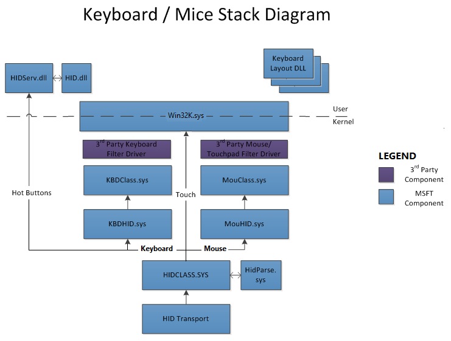

# Keyboard and mouse HID client drivers

This topic discusses keyboard and mouse HID client drivers. Keyboards and mice represent the first set of HID clients that were standardized in the HID Usage tables and implemented in Windows operating systems.

Keyboard and mouse HID client drivers are implemented in the form of HID Mapper Drivers. A HID mapper driver is a kernel-mode WDM filter driver that provides a bidirectional interface for I/O requests between a non-HID Class driver and the HID class driver. The mapper driver maps the I/O requests and data protocols of one to the other.

Windows provides system-supplied HID mapper drivers for HID keyboard, and HID mice devices.

## Architecture and overview

The following figure illustrates the system-supplied driver stacks for USB keyboard and mouse/touchpad devices.

The figure above includes the following components:

-   KBDHID.sys – HID client mapper driver for keyboards. Converts HID usages into scancodes to interface with the existing keyboard class driver.
-   MOUHID.sys – HID client mapper driver for mice/touchpads. Converts HID usages into mouse commands (X/Y, buttons, wheel) to interface with the existing keyboard class driver.
-   KBDCLASS.sys – The keyboard class driver maintains functionality for all keyboards and keypads on the system in a secure manner.
-   MOUCLASS.sys – The mouse class driver maintains functionality for all mice / touchpads on the system. The driver does support both absolute and relative pointing devices. This is not the driver for touchscreens as that is managed by a different driver in Windows.

The system builds the driver stack as follows:

-   The transport stack creates a physical device object (PDO) for each HID device attached and loads the appropriate HID transport driver which in turn loads the HID Class Driver.
-   The HID class driver creates a PDO for each keyboard or mouse TLC. Complex HID devices (more than 1 TLC) are exposed as multiple PDOs created by HID class driver. For example, a keyboard with an integrated mouse might have one collection for the standard keyboard controls and a different collection for the mouse.
-   The keyboard or mouse hid client mapper drivers are loaded on the appropriate FDO.
-   The HID mapper drivers create FDOs for keyboard and mouse, and load the class drivers.

Important notes:

-   Vendor drivers are not required for keyboards and mice that are compliant with the supported HID Usages and top level collections.
-   Vendors may optionally provide filter drivers in the HID stack to alter/enhance the functionality of these specific TLC.
-   Vendors should create separate TLCs, that are vendor specific, to exchange vendor proprietary data between their hid client and the device. Avoid using filter drivers unless critical.
-   The system opens all keyboard and mouse collections for its exclusive use.
-   The system prevents disable/enabling a keyboard.
-   The system provides support for horizontal/vertical wheels with smooth scrolling capabilities.

## Driver Guidance

Microsoft provides the following guidance for IHVs writing drivers:

1.  Driver developers are allowed to add additional drivers in the form of a filter driver or a new HID Client driver. The criteria are described below:
    1.  Filters Drivers: Driver developers should ensure that their value-add driver is a filter driver and does not replace (or be used in place of) existing Windows HID drivers in the input stack.
        -   Filter drivers are allowed in the following scenarios:
            -   As an upper filter to kbdhid/mouhid
            -   As an upper filter to kbdclass/mouclass
        -   Filter drivers are _not_ recommended as a filter between HIDCLASS and HID Transport minidriver

    2.  Function Drivers: Alternatively vendors can create a function driver (instead of a filter driver) but only for vendor specific HID PDOs (with a user mode service if necessary).

        Function drivers are allowed in the following scenarios:

        -   Only load on the specific vendor’s hardware

    3.  Transport Drivers: Windows team does not recommend creating additional HID Transport minidriver as they are complex drivers to write/maintain. If a partner is creating a new HID Transport minidriver, especially on SoC systems, we recommend a detailed architectural review to understand the reasoning and ensure that the driver is developed correctly.

2.  Driver developers should leverage driver Frameworks (KMDF or UMDF) and not rely on WDM for their filter drivers.
3.  Driver developers should reduce the number of kernel-user transitions between their service and the driver stack.
4.  Driver developers should ensure ability to wake the system via both keyboard and touchpad functionality (adjustable by the end user (device manager) or the PC manufacturer). In addition on SoC systems, these devices must be able to wake themselves from a lower powered state while the system is in a working S0 state.
5.  Driver developers should ensure that their hardware is power managed efficiently.
    -   Device can go into its lowest power state when the device is idle.
    -   Device is in the lowest power state when the system is in a low power state (for example, standby (S3) or connected standby).

## Keyboard layout

A *keyboard layout* fully describes a keyboard's input characteristics for Microsoft Windows 2000 and later versions. For example, a keyboard layout specifies the language, keyboard type and version, modifiers, scan codes, and so on.

See the following for information about keyboard layouts:

-   Keyboard header file, kdb.h, in the Windows Driver Development Kit (DDK), which documents general information about keyboard layouts.

-   Sample keyboard [layouts](http://go.microsoft.com/fwlink/p/?linkid=256128).

To visualize the layout of a specific keyboard, see [Windows Keyboard Layouts](https://docs.microsoft.com/globalization/windows-keyboard-layouts).

For additional details around the keyboard layout, visit Control Panel\\Clock, Language, and Region\\Language.

## Supported buttons and wheels on mice

The following table identifies the features supported across different client versions of the Windows operating system.

| Feature                                               | Windows XP             | Windows Vista          | Windows 7              | Windows 8 and later    |
|-------------------------------------------------------|------------------------|------------------------|------------------------|------------------------|
| Buttons 1-5                                           | Supported (P/2 & HID)  | Supported (PS/2 & HID) | Supported (PS/2 & HID) | Supported (PS/2 & HID) |
| Vertical Scroll Wheel                                 | Supported (PS/2 & HID) | Supported (PS/2 & HID) | Supported (PS/2 & HID) | Supported (PS/2 & HID) |
| Horizontal Scroll Wheel                               | Not Supported          | Supported(HID only)    | Supported(HID only)    | Supported(HID only)    |
| Smooth Scroll Wheel Support (Horizontal and Vertical) | Not Supported          | Partly Supported       | Supported (HID only)   | Supported (HID only)   |

 

### Activating buttons 4-5 and wheel on PS/2 mice

The method used by Windows to activate the new 4&5-button + wheel mode is an extension of the method used to activate the third button and the wheel in IntelliMouse-compatible mice:

-   First, the mouse is set to the 3-button wheel mode, which is accomplished by setting the report rate consecutively to 200 reports/second, then to 100 reports/second, then to 80 reports/second, and then reading the ID from the mouse. The mouse should report an ID of 3 when this sequence is completed.
-   Next, the mouse is set to the 5-button wheel mode, which is accomplished by setting the report rate consecutively to 200 reports/second, then to 200 reports/second again, then to 80 reports/second, and then reading the ID from the mouse. Once this sequence is completed, a 5-button wheel mouse should report an ID of 4 (whereas an IntelliMouse-compatible 3-button wheel mouse would still report an ID of 3).

Note that this is applicable to PS/2 mice only and is not applicable to HID mice (HID mice must report accurate usages in their report descriptor).

*Standard PS/2-compatible mouse data packet format (2 Buttons)*

| Byte | D7    | D6    | D5    | D4    | D3  | D2  | D1  | D0  | Comment                          |
|------|-------|-------|-------|-------|-----|-----|-----|-----|----------------------------------|
| 1    | Yover | Xover | Ysign | Xsign | Tag | M   | R   | L   | X/Y overvlows and signs, buttons |
| 2    | X7    | X6    | X5    | X4    | X3  | X2  | X1  | X0  | X data byte                      |
| 3    | Y7    | Y6    | Y5    | Y4    | Y3  | Y2  | Y1  | Y0  | Y data bytes                     |

 

**Note**  Windows mouse drivers do not check the overflow bits. In case of overflow, the mouse should simply send the maximal signed displacement value.

 

*Standard PS/2-compatible mouse data packet format (3 Buttons + VerticalWheel)*

| Byte | D7  | D6  | D5    | D4    | D3  | D2  | D1  | D0  | Comment                     |
|------|-----|-----|-------|-------|-----|-----|-----|-----|-----------------------------|
| 1    | 0   | 0   | Ysign | Xsign | 1   | M   | R   | L   | X/Y signs and R/L/M buttons |
| 2    | X7  | X6  | X5    | X4    | X3  | X2  | X1  | X0  | X data byte                 |
| 3    | Y7  | Y6  | Y5    | Y4    | Y3  | Y2  | Y1  | Y0  | Y data bytes                |
| 4    | Z7  | Z6  | Z5    | Z4    | Z3  | Z2  | Z1  | Z0  | Z/wheel data byte           |

 

*Standard PS/2-compatible mouse data packet format (5 Buttons + VerticalWheel)*

| Byte | D7  | D6  | D5    | D4    | D3  | D2  | D1  | D0  | Comment                               |
|------|-----|-----|-------|-------|-----|-----|-----|-----|---------------------------------------|
| 1    | 0   | 0   | Ysign | Xsign | 1   | M   | R   | L   | X/Y signs and R/L/M buttons           |
| 2    | X7  | X6  | X5    | X4    | X3  | X2  | X1  | X0  | X data byte                           |
| 3    | Y7  | Y6  | Y5    | Y4    | Y3  | Y2  | Y1  | Y0  | Y data bytes                          |
| 4    | 0   | 0   | B5    | B4    | Z3  | Z2  | Z1  | Z0  | Z/wheel data and buttons 4 and 5 |

 

Important note:

-   Notice that the Z/wheel data for a 5-button wheel mouse has been reduced to four bits instead of the 8 bits used in the IntelliMouse-compatible 3-button wheel mode. This reduction is made possible by the fact that the wheel typically cannot generate values beyond the range +7/-8 during any given interrupt period. Windows mouse drivers will sign extend the four Z/wheel data bits when the mouse is in the 5-button wheel mode, and the full Z/wheel data byte when the mouse operates in the 3-button wheel mode.
-   Buttons 4 & 5 on are mapped to WM\_APPCOMMAND messages and correspond to App\_Back and App\_Forward.

### Devices not requiring vendor drivers

Vendor drivers are not required for the following devices:

-   Devices that comply with the HID Standard.
-   Keyboard, mouse, or game port devices operated by the system-supplied non-HIDClass drivers.

 
## Kbfiltr sample

Kbfiltr is designed to be used with Kbdclass, the system class driver for keyboard devices and I8042prt, the function driver for a PS/2-style keyboard. Kbfiltr demonstrates how to filter I/O requests and how to add callback routines that modify the operation of Kbdclass and I8042prt.

For more information about Kbfiltr operation, see the following:

* The ntddkbd.h WDK header file. 

* The sample [Kbfiltr](http://go.microsoft.com/fwlink/p/?linkid=256125) source code. 

### Kbfiltr IOCTLs

<table>
<tr>
<th>Control Code</th>
<th>Description</th>
</tr>
<tr>
<td>

&lt;MSHelp:link tabindex=&quot;0&quot; keywords=&quot;hid.ioctl_internal_i8042_hook_keyboard&quot;&gt;<b>IOCTL_INTERNAL_I8042_HOOK_KEYBOARD</b>&lt;/MSHelp:link&gt;

</td>
<td>

The IOCTL_INTERNAL_I8042_HOOK_KEYBOARD request does the following:

<ul>
<li>

Adds an initialization callback routine to the I8042prt keyboard initialization routine

</li>
<li>

Adds an ISR callback routine to the I8042prt keyboard ISR

</li>
</ul>

The initialization and ISR callbacks are optional and are provided by an upper-level filter driver for a PS/2-style keyboard device.

After I8042prt receives an &lt;MSHelp:link tabindex=&quot;0&quot; keywords=&quot;hid.ioctl_internal_keyboard_connect2&quot;&gt;<b>IOCTL_INTERNAL_KEYBOARD_CONNECT</b>&lt;/MSHelp:link&gt; request, it sends a synchronous IOCTL_INTERNAL_I8042_HOOK_KEYBOARD request to the top of the keyboard device stack.

After Kbfiltr receives the hook keyboard request, Kbfiltr filters the request in the following way:

<ul>
<li>

Saves the upper-level information passed to Kbfiltr, which includes the context of an upper-level device object, a pointer to an initialization callback, and a pointer to an ISR callback

</li>
<li>

Replaces the upper-level information with its own

</li>
<li>

Saves the context of I8042prt and pointers to callbacks that the Kbfiltr ISR callback can use

</li>
</ul>

</dd>
</dl>
</td>
</tr>
<tr>
<td>

&lt;MSHelp:link tabindex=&quot;0&quot; keywords=&quot;hid.ioctl_internal_keyboard_connect&quot;&gt;<b>IOCTL_INTERNAL_KEYBOARD_CONNECT</b>&lt;/MSHelp:link&gt;

</td>
<td>

The IOCTL_INTERNAL_KEYBOARD_CONNECT request connects the Kbdclass service to the keyboard device. Kbdclass sends this request down the keyboard device stack before it opens the keyboard device. 

After Kbfiltr received the keyboard connect request, Kbfiltr filters the connect request in the following way:

<ul>
<li>

Saves a copy of Kbdclass&#39;s &lt;MSHelp:link tabindex=&quot;0&quot; keywords=&quot;hid.connect_data__kbdclass_&quot;&gt;<b>CONNECT_DATA (Kbdclass)</b>&lt;/MSHelp:link&gt; structure that is passed to the filter driver by Kbdclass

</li>
<li>

Substitutes its own connect information for the class driver connect information

</li>
<li>

Sends the IOCTL_INTERNAL_KEYBOARD_CONNECT request down the device stack

</li>
</ul>

If the request is not successful, Kbfiltr completes the request with an appropriate error status.

Kbfiltr provides a template for a filter service callback routine that can supplement the operation of &lt;MSHelp:link tabindex=&quot;0&quot; keywords=&quot;hid.keyboardclassservicecallback&quot;&gt;<b>KeyboardClassServiceCallback</b>&lt;/MSHelp:link&gt;, the Kbdclass class service callback routine. The filter service callback can filter the input data that is transferred from the device input buffer to the class data queue. 

<dl>
<dd>

</dd>
</dl>
</td>
</tr>
<tr>
<td>

&lt;MSHelp:link tabindex=&quot;0&quot; keywords=&quot;hid.ioctl_internal_keyboard_disconnect&quot;&gt;<b>IOCTL_INTERNAL_KEYBOARD_DISCONNECT</b>&lt;/MSHelp:link&gt;

</td>
<td>

The IOCTL_INTERNAL_KEYBOARD_DISCONNECT request is completed with a status of STATUS_NOT_IMPLEMENTED. Note that a Plug and Play keyboard can be added or removed by the Plug and Play manager.

</td>
</tr>
</table>

For all other device control requests, Kbfiltr skips the current IRP stack and sends the request down the device stack without further processing.

<b>Callback routines implemented by Kbfiltr</b>

<ul>
<li><b>KbFilter_InitializationRoutine</b>
      
     (see &lt;MSHelp:link tabindex=&quot;0&quot; keywords=&quot;hid.pi8042_keyboard_initialization_routine&quot;&gt;<b>PI8042_KEYBOARD_INITIALIZATION_ROUTINE</b>&lt;/MSHelp:link&gt;)
<b>
          KbFilter_InitializationRoutine</b> is not needed if I8042prt&#39;s default initialization of a keyboard is sufficient.

I8042prt calls <b>
          KbFilter_InitializationRoutine</b> when it initializes the keyboard. Default keyboard initialization includes the following operations: reset the keyboard, set the typematic rate and delay, and set the light-emitting diodes (LED).<pre class="syntax" xml:space="preserve"><code>
/*
Parameters
DeviceObject [in] 
Pointer to the device object that is the context for this callback.

SynchFuncContext [in] 
Pointer to the context for the routines pointed to by ReadPort and Writeport.

ReadPort [in] 
Pointer to the system-supplied PI8042_SYNCH_READ_PORT callback that reads from the port.

WritePort [in] 
Pointer to the system-supplied PI8042_SYNCH_WRITE_PORT callback that writes to the port.

TurnTranslationOn [out] 
Specifies, if TRUE, to turn translation on. Otherwise, translation is turned off.

Return value
KbFilter_InitializationRoutine returns an appropriate NTSTATUS code.

<em>/

NTSTATUS KbFilter_InitializationRoutine(
  <em>In</em>  PDEVICE_OBJECT          DeviceObject,
  <em>In</em>  PVOID                   SynchFuncContext,
  <em>In</em>  PI8042_SYNCH_READ_PORT  ReadPort,
  <em>In</em>  PI8042_SYNCH_WRITE_PORT WritePort,
  <em>Out</em> PBOOLEAN                TurnTranslationOn
);
</code></pre>

</li>
<li><b>KbFilter_IsrHook</b>
      
     (see &lt;MSHelp:link tabindex=&quot;0&quot; keywords=&quot;hid.pi8042_keyboard_isr&quot;&gt;<i>PI8042_KEYBOARD_ISR</i>&lt;/MSHelp:link&gt;)
This callback is not needed if the default operation of I8042prt is sufficient.

The I8042prt keyboard ISR calls <b>KbFilter_IsrHook</b> after it validates the interrupt and reads the scan code. 

<b>KbFilter_IsrHook</b> runs in kernel mode at the IRQL of the I8042prt keyboard ISR.

<pre class="syntax" xml:space="preserve"><code>
/</em>
Parameters
DeviceObject [in] 
Pointer to the filter device object of the driver that supplies this callback.

CurrentInput [in] 
Pointer to the input KEYBOARD_INPUT_DATA structure that is being constructed by the ISR.

CurrentOutput [in] 
Pointer to an OUTPUT_PACKET structure that specifies the bytes that are being written to the hardware device.

StatusByte [in, out] 
Specifies the status byte that is read from I/O port 60 when an interrupt occurs.

DataByte [in] 
Specifies the data byte that is read from I/O port 64 when an interrupt occurs.

ContinueProcessing [out] 
Specifies, if TRUE, to continue processing in the I8042prt keyboard ISR after this callback returns; otherwise, processing is not continued.

ScanState [in] 
Pointer to a KEYBOARD_SCAN_STATE structure that specifies the keyboard scan state.

Return value
KbFilter_IsrHook returns TRUE if the interrupt service routine should continue; otherwise it returns FALSE.

<em>/

KbFilter_IsrHook KbFilter_IsrHook(
  <em>In</em>    PDEVICE_OBJECT       DeviceObject,
  <em>In</em>    PKEYBOARD_INPUT_DATA CurrentInput,
  <em>In</em>    POUTPUT_PACKET       CurrentOutput,
  <em>Inout</em> UCHAR                StatusByte,
  <em>In</em>    PUCHAR               DataByte,
  <em>Out</em>   PBOOLEAN             ContinueProcessing,
  <em>In</em>    PKEYBOARD_SCAN_STATE ScanState
);

);
</code></pre>
</li>
<li><b>KbFilter_ServiceCallback</b> (see &lt;MSHelp:link tabindex=&quot;0&quot; keywords=&quot;hid.kbdclass_class_service_callback_routine&quot;&gt;<i>PSERVICE_CALLBACK_ROUTINE</i>&lt;/MSHelp:link&gt;)
The ISR dispatch completion routine of the function driver calls <b>KbFilter_ServiceCallback</b>, which then calls the keyboard class driver&#39;s implementation of &lt;MSHelp:link tabindex=&quot;0&quot; keywords=&quot;hid.kbdclass_class_service_callback_routine&quot;&gt;<i>PSERVICE_CALLBACK_ROUTINE</i>&lt;/MSHelp:link&gt;. A vendor can implement a filter service callback to modify the input data that is transferred from the device&#39;s input buffer to the class data queue. For example, the callback can delete, transform, or insert data. <pre class="syntax" xml:space="preserve"><code>
/</em>
Parameters
DeviceObject [in] 
Pointer to the class device object.

InputDataStart [in] 
Pointer to the first keyboard input data packet in the input data buffer of the port device.

InputDataEnd [in] 
Pointer to the keyboard input data packet that immediately follows the last data packet in the input data buffer of the port device.

InputDataConsumed [in, out] 
Pointer to the number of keyboard input data packets that are transferred by the routine.

Return value
None

*/

VOID KbFilter_ServiceCallback(
  <em>In</em>    PDEVICE_OBJECT       DeviceObject,
  <em>In</em>    PKEYBOARD_INPUT_DATA InputDataStart,
  <em>In</em>    PKEYBOARD_INPUT_DATA InputDataEnd,
  <em>Inout</em> PULONG               InputDataConsumed
);

);
</code></pre>

## Moufiltr sample

Moufiltr is designed to be used with Mouclass, the system class driver for mouse devices used with Windows 2000 and later versions, and I8042prt, the function driver for a PS/2-style mouse used with Windows 2000 and later. Moufiltr demonstrates how to filter I/O requests and add callback routines that modify the operation of Mouclass and I8042prt.

<table>
<tr>
<th>Control Code</th>
<th>Description</th>
</tr>
<tr>
<td>

&lt;MSHelp:link tabindex=&quot;0&quot; keywords=&quot;hid.ioctl_internal_i8042_hook_mouse&quot;&gt;<b>IOCTL_INTERNAL_I8042_HOOK_MOUSE</b>&lt;/MSHelp:link&gt;

</td>
<td>

The IOCTL_INTERNAL_I8042_HOOK_MOUSE request adds an ISR callback routine to the I8042prt mouse ISR. The ISR callback is optional and is provided by an upper-level mouse filter driver.

I8042prt sends this request after it receives an &lt;MSHelp:link tabindex=&quot;0&quot; keywords=&quot;hid.ioctl_internal_mouse_connect2&quot;&gt;<b>IOCTL_INTERNAL_MOUSE_CONNECT</b>&lt;/MSHelp:link&gt; request. I8042prt sends a synchronous IOCTL_INTERNAL_I8042_HOOK_MOUSE request to the top of the mouse device stack.

After Moufiltr receives the hook mouse request, it filters the request in the following way:

<ul>
<li>

Saves the upper-level information passed to Moufiltr, which includes the context of an upper-level device object and a pointer to an ISR callback

</li>
<li>

Replaces the upper-level information with its own

</li>
<li>

Saves the context of I8042prt and pointers to callbacks that the Moufiltr ISR callbacks can use

</li>
</ul>

For more information about this request and the callbacks, see the following topics:

<dl>
<dd>

&lt;MSHelp:link tabindex=&quot;0&quot; keywords=&quot;hid.i8042prt_callback_routines&quot;&gt;I8042prt Callback Routines&lt;/MSHelp:link&gt;

</dd>
<dd>

&lt;MSHelp:link tabindex=&quot;0&quot; keywords=&quot;hid.moufiltr_callback_routines&quot;&gt;Moufiltr Callback Routines&lt;/MSHelp:link&gt;

</dd>
</dl>
</td>
</tr>
<tr>
<td>

&lt;MSHelp:link tabindex=&quot;0&quot; keywords=&quot;hid.ioctl_internal_mouse_connect&quot;&gt;<b>IOCTL_INTERNAL_MOUSE_CONNECT</b>&lt;/MSHelp:link&gt;

</td>
<td>

The IOCTL_INTERNAL_MOUSE_CONNECT request connects Mouclass service to a mouse device.

</td>
</tr>
<tr>
<td>

&lt;MSHelp:link tabindex=&quot;0&quot; keywords=&quot;hid.ioctl_internal_mouse_disconnect&quot;&gt;<b>IOCTL_INTERNAL_MOUSE_DISCONNECT</b>&lt;/MSHelp:link&gt;

</td>
<td>

The IOCTL_INTERNAL_MOUSE_DISCONNECT request is completed by Moufiltr with an error status of STATUS_NOT_IMPLEMENTED.

</td>
</tr>
</table>

 

For all other requests, Moufiltr skips the current IRP stack and sends the request down the device stack without further processing.

<b>Callback routines implemented by Kbfiltr</b>

<dl>
<dd><b>MouFilter_IsrHook</b> (See  &lt;MSHelp:link tabindex=&quot;0&quot; keywords=&quot;hid.pi8042_mouse_isr&quot;&gt;<i>PI8042_MOUSE_ISR</i>&lt;/MSHelp:link&gt;)

<pre class="syntax" xml:space="preserve"><code>
/*
Parameters
DeviceObject 
Pointer to the filter device object of the driver that supplies this callback.

CurrentInput 
Pointer to the input MOUSE_INPUT_DATA structure being constructed by the ISR.

CurrentOutput 
Pointer to the OUTPUT_PACKET structure that specifies the bytes being written to the hardware device.

StatusByte 
Specifies a status byte that is read from I/O port 60 when the interrupt occurs.

DataByte 
Specifies a data byte that is read from I/O port 64 when the interrupt occurs.

ContinueProcessing 
Specifies, if TRUE, that the I8042prt mouse ISR continues processing after this callback returns. Otherwise, processing is not continued.

MouseState 
Pointer to a MOUSE_STATE enumeration value, which identifies the state of mouse input.

ResetSubState 
Pointer to MOUSE_RESET_SUBSTATE enumeration value, which identifies the mouse reset substate. See the Remarks section.

Return value
MouFilter_IsrHook returns TRUE if the interrupt service routine should continue; otherwise it returns FALSE.

*/

BOOLEAN MouFilter_IsrHook(
   PDEVICE_OBJECT        DeviceObject,
   PMOUSE_INPUT_DATA     CurrentInput,
   POUTPUT_PACKET        CurrentOutput,
   UCHAR                 StatusByte,
   PUCHAR                DataByte,
   PBOOLEAN              ContinueProcessing,
   PMOUSE_STATE          MouseState,
   PMOUSE_RESET_SUBSTATE ResetSubState
);
</code></pre>

A <b>MouFilter_IsrHook</b> callback is not needed if the default operation of I8042prt is sufficient.

The I8042prt mouse ISR calls <b>MouFilter_IsrHook</b> after it validates the interrupt.

To reset a mouse, I8042prt goes through a sequence of operational substates, each one of which is identified by an MOUSE_RESET_SUBSTATE enumeration value. For more information about how I8042prt resets a mouse and the corresponding mouse reset substates, see the documentation of MOUSE_RESET_SUBSTATE in ntdd8042.h.

<b>MouFilter_IsrHook</b> runs in kernel mode at the IRQL of the I8042prt mouse ISR.

</dd>
<dd><b>MouFilter_ServiceCallback</b> (See &lt;MSHelp:link tabindex=&quot;0&quot; keywords=&quot;hid.kbdclass_class_service_callback_routine&quot;&gt;<i>PSERVICE_CALLBACK_ROUTINE</i>&lt;/MSHelp:link&gt;)

<pre class="syntax" xml:space="preserve"><code>
/*
Parameters
DeviceObject [in] 
Pointer to the class device object.

InputDataStart [in] 
Pointer to the first mouse input data packet in the input data buffer of the port device.

InputDataEnd [in] 
Pointer to the mouse input data packet immediately following the last data packet in the port device's input data buffer.

InputDataConsumed [in, out] 
Pointer to the number of mouse input data packets that are transferred by the routine.

Return value
None

*/

VOID MouFilter_ServiceCallback(
  _In_    PDEVICE_OBJECT    DeviceObject,
  _In_    PMOUSE_INPUT_DATA InputDataStart,
  _In_    PMOUSE_INPUT_DATA InputDataEnd,
  _Inout_ PULONG            InputDataConsumed
);

</code></pre>

The ISR DPC of I8042prt calls MouFilter_ServiceCallback, which then calls MouseClassServiceCallback. A filter service callback can be configured to modify the input data that is transferred from the device&#39;s input buffer to the class data queue. For example, the callback can delete, transform, or insert data. 

