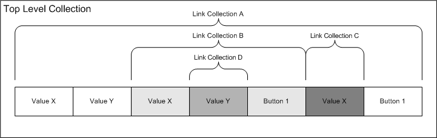

# Link Collections


A *link collection* as a nested subcollection within a [top-level collection](top-level-collections.md). A top-level collection can have zero or more link collections.

[**HidP\_GetLinkCollectionNodes**](https://msdn.microsoft.com/library/windows/hardware/ff539725) returns a top-level collection's [link collection array](#ddk-link-collection-array-kg) that contains information about a top-level collection's link collections.

### <a href="" id="ddk-link-collection-array-kg"></a>Link Collection Array

A *link collection array* describes all the link collections contained within a top-level collection. Each link collection is represented by a [**HIDP\_LINK\_COLLECTION\_NODE**](https://msdn.microsoft.com/library/windows/hardware/ff539764) structure. The array's link nodes are linked in a manner that identifies their sequential and hierarchical order within a top-level collection. The first element of a link collection array represents a top-level collection and the remaining members represent the top-level collection's link collections.

By tracing through the nodes in the link connection array, a user-mode application or kernel-mode driver can determine the organization and usage of all the link collections in a top-level collection. In addition, the application or driver can organize controls by their link collection. This is possible because a top-level collection's [button capability arrays](button-capability-arrays.md) and [value capability arrays](value-capability-arrays.md) identify the link collection that contains each [HID usage](hid-usages.md) described by the capability arrays.

The following figure shows an example of a top-level collection that contains four link collections.



As indicated in the previous figure, link collections are linked together in a top-to-bottom and left-to-right order (ABCD). The following table indicates, for each link collection in the example, the links between the top-level collection and its link collections.

<table>
<colgroup>
<col width="20%" />
<col width="20%" />
<col width="20%" />
<col width="20%" />
<col width="20%" />
</colgroup>
<thead>
<tr class="header">
<th>Link Node</th>
<th>Parent</th>
<th>Children</th>
<th>First Child</th>
<th>Next Sibling</th>
</tr>
</thead>
<tbody>
<tr class="odd">
<td><p>A</p></td>
<td><p>Top-level Collection</p></td>
<td><p>B, C</p></td>
<td><p>B</p></td>
<td><p>None</p></td>
</tr>
<tr class="even">
<td><p>B</p></td>
<td><p>A</p></td>
<td><p>D</p></td>
<td><p>D</p></td>
<td><p>C</p></td>
</tr>
<tr class="odd">
<td><p>C</p></td>
<td><p>A</p></td>
<td><p>None</p></td>
<td><p>None</p></td>
<td><p>None</p></td>
</tr>
<tr class="even">
<td><p>D</p></td>
<td><p>B</p></td>
<td><p>None</p></td>
<td><p>None</p></td>
<td><p>None</p></td>
</tr>
</tbody>
</table>

 

In a link collection array, the following definitions hold:

<a href="" id="parent"></a>**Parent**  
A link collection's *parent* is the collection immediately above it in the top-to-bottom hierarchy of collections. Link collections have one parent. The **Parent** member of a link node specifies the index of its parent in the link collection array.

<a href="" id="children"></a>**Children**  
A link collection is a *child* of its parent. A parent can have zero or more children. The **NumberOfChildren** member of a link node specifies the number of children that a parent has.

<a href="" id="sibling"></a>**Sibling**  
A parent's children are *siblings*.

<a href="" id="next-sibling"></a>**Next Sibling**  
Siblings are ordered left-to-right. A sibling's *next sibling* is the sibling immediately to its right, if any, in a set of siblings. The **NextSibling** member of a link collection node specifies the index to its next sibling in the link collection array. If a link collection node does not have a next sibling, **NextSibling** is set to zero.

<a href="" id="first-child"></a>**First Child**  
The *first child* is the left-most sibling in a set of siblings. The **FirstChild** member of a link collection node specifies the index to its first child in the link collection array. If a link collection node has no children, **FirstChild** is set to zero.

An application or driver can determine all a parent collection's children by, starting with the parent's first child, sequencing through the siblings of the first child until the **NextSibling** member of a sibling node is zero.

The following code shows how to use a link collection node index to find the first child of link collection seven:

```cpp
HIDP_LINK_COLLECTION_NODE Collection[10] ;
HIDP_LINK_COLLECTION_NODE Node1 ;
 
Node1 = Collection[Collection[7].FirstChild]] ;
```

### <a href="" id="aliased-collections"></a> Aliased Collections

Delimiter items can be used in a report descriptor to delimit a set of *aliased collections*. Each aliased collection is represented by an aliased link collection node. A complete and unique set of *n*, *n* &gt;=2, aliased nodes is linked together in the following way:

-   The aliased nodes are in consecutive order in the link collection array.

-   The first *n*-1 nodes have their **IsAlias** member set to **TRUE**. The *nth* node immediately following such a sequence has its **IsAlias** member set to **FALSE**. This node terminates the sequence of aliased nodes. The usage associated with this node is the preferred usage.

An application or driver can determine which collections are aliased by repeatedly incrementing the array index of a link collection array to find such sequences.

[Button capability arrays](button-capability-arrays.md) and [value capability arrays](value-capability-arrays.md) identify, for each usage they describe, the link collection that contains the usage. If a link collection is aliased, the capability arrays specify the preferred usage.

 

 


