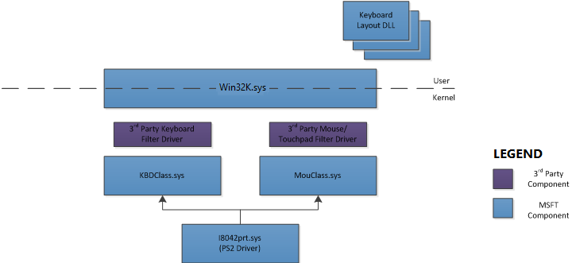

# Non-HID legacy devices

This section describes drivers, transports, and filter-drivers for non-HID keyboards and mice. These devices primarily run on the PS/2 transport.

This section does not contain information about Sermouse, the Windows system function driver for a serial mouse. Note that the operational constraints that apply to I8042prt do not apply to Sermouse. In addition, upper-level device filter drivers are not used with Sermouse to customize the operation of a serial mouse. Instead, vendors need to install a device-specific function driver for the device. A device-specific function driver and Sermouse can operate at the same time, independent of one another.

## Non-HID driver stack

Windows 8 uses the following driver stack for non-HID keyboard, mouse, and touchpad hardware. The only non-HID Transport supported on Windows 8 is PS2.

 

 

