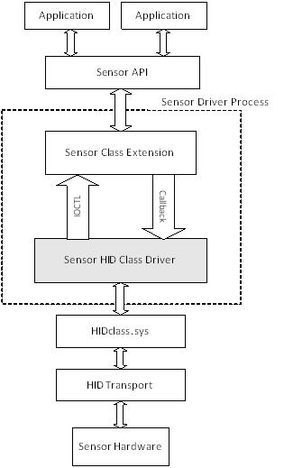
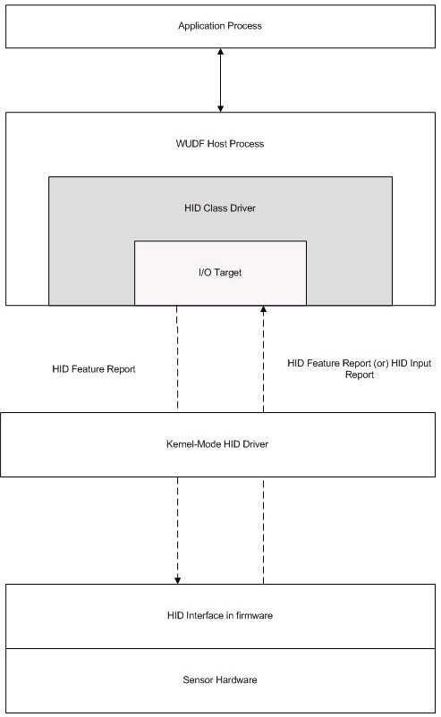

# Sensor HID class driver


Starting with Windows 8, the Windows operating system includes an in-box sensor HID Class driver (SensorsHIDClassDriver.dll), that supports eleven types of sensors that communicate using the HID transport.

Here is a list of the supported sensors:

-   Accelerometer 3D
-   Ambient Light
-   Ambient Temperature
-   Atmospheric Pressure
-   Compass 3D
-   Device Orientation
-   Gyroscope 3D
-   Humidity
-   Inclinometer 3D
-   Presence
-   Proximity

The following illustration depicts the flow of data back and forth from two sensor applications down through the driver stack and, finally, to the hardware itself.



## Support for custom sensors


In addition to the eleven sensors covered in the previous lists, the class driver also supports a Custom class. This class allows a sensor manufacturer to integrate a device not found in the previous list: For example, a carbon monoxide sensor. The custom sensor presents itself to the sensor API as a custom device with unique properties.

## Architecture and overview


If you are creating the firmware for a compatible sensor, you’ll need a basic understanding of the I/O model supported by the class driver.

-   The sensor sends either a feature report or an input report to the HID class driver. A feature report is sent in response to a request from the driver. This report contains property data including the sensor’s change-sensitivity setting, its report interval, and its reporting state. An input report is sent either upon request, or asynchronously in response to an event. This report contains the actual sensor data. For example, for an accelerometer, the report contains the G-forces along the x-, y-, and z-axes).
-   The HID class driver sends feature reports to the sensor. For example, when the application requests a new change sensitivity or report interval, the driver packages these values into a feature report and uses this report to send the request to the sensor’s firmware.

The following diagram illustrates the I/O model:



## Sample Report Descriptor


If your sensor supports one of the seven categories native to the class driver, its firmware will need to support specific feature and input reports. The feature reports include a sensor’s current reporting state, its status, change sensitivity, and reporting interval (in addition to other possible properties). The input reports contain sensor readings: True or False for a switch, G-force values for an accelerometer or LUX for an ambient light sensor.

### Sample accelerometer feature report

The following code example shows the HID feature report for the accelerometer. Note the self-descriptive nature of this report. It includes minimum and maximum values and the count and size of individual fields.

``` syntax
//feature reports (xmit/receive)
    HID_USAGE_PAGE_SENSOR,
    HID_USAGE_SENSOR_PROPERTY_REPORTING_STATE,
    HID_LOGICAL_MIN_8(0x00),                   //LOGICAL_MINIMUM (0) 
    HID_LOGICAL_MAX_8(0xFF),             //LOGICAL_MAXIMUM (255) 
    HID_REPORT_SIZE(8),
    HID_REPORT_COUNT(1),
    HID_FEATURE(Data_Var_Abs),

    HID_USAGE_SENSOR_PROPERTY_SENSOR_STATUS,
    HID_LOGICAL_MIN_8(0x00),                   //LOGICAL_MINIMUM (0) 
    HID_LOGICAL_MAX_8(0xFF),             //LOGICAL_MAXIMUM (255) 
    HID_REPORT_SIZE(8),
    HID_REPORT_COUNT(1),
    HID_FEATURE(Data_Var_Abs),

    HID_USAGE_SENSOR_PROPERTY_CHANGE_SENSITIVITY_ABS,
    HID_LOGICAL_MIN_8(0x00),                   //LOGICAL_MINIMUM (0) 
    HID_LOGICAL_MAX_16(0xFF,0xFF), //LOGICAL_MAXIMUM (65535) 
    HID_REPORT_SIZE(16),
    HID_REPORT_COUNT(1),
    HID_USAGE_SENSOR_UNITS_G,
    HID_UNIT_EXPONENT(0xE), 
    HID_FEATURE(Data_Var_Abs),

    HID_USAGE_SENSOR_PROPERTY_REPORT_INTERVAL,
    HID_LOGICAL_MIN_8(0x00),                   //LOGICAL_MINIMUM (0) 
    HID_LOGICAL_MAX_32(0xFF,0xFF,0xFF,0xFF), //LOGICAL_MAXIMUM (4294967295) 
    HID_REPORT_SIZE(32),
    HID_REPORT_COUNT(1),
    HID_USAGE_SENSOR_UNITS_MILLISECOND,
    HID_UNIT_EXPONENT(0), 
    HID_FEATURE(Data_Var_Abs),
```

### Sample accelerometer input report

The following code example shows the HID input report for the same device. Again, note the self-descriptive nature of the fields in this report.

``` syntax
//input reports (transmit)
    HID_USAGE_PAGE_SENSOR,
    HID_USAGE_SENSOR_STATE,
    HID_LOGICAL_MIN_8(0x00),                   //LOGICAL_MINIMUM (0) 
    HID_LOGICAL_MAX_8(0xFF),             //LOGICAL_MAXIMUM (255) 
    HID_REPORT_SIZE(8),
    HID_REPORT_COUNT(1),
    HID_INPUT(Data_Var_Abs),

    HID_USAGE_SENSOR_EVENT,
    HID_LOGICAL_MIN_8(0x00),                   //LOGICAL_MINIMUM (0) 
    HID_LOGICAL_MAX_8(0xFF),             //LOGICAL_MAXIMUM (255) 
    HID_REPORT_SIZE(8),
    HID_REPORT_COUNT(1),
    HID_INPUT(Data_Var_Abs),

    HID_USAGE_SENSOR_DATA_MOTION_ACCELERATION_X_AXIS,
    HID_LOGICAL_MIN_16(0x01,0x80),             //    LOGICAL_MINIMUM (-32767) 
    HID_LOGICAL_MAX_16(0xFF,0x7F),             //    LOGICAL_MAXIMUM (32767)
    HID_REPORT_SIZE(16), 
    HID_REPORT_COUNT(1), 
    HID_USAGE_SENSOR_UNITS_G,
    HID_UNIT_EXPONENT(0xE), 
    HID_INPUT(Data_Var_Abs),

    HID_USAGE_SENSOR_DATA_MOTION_ACCELERATION_Y_AXIS,
    HID_LOGICAL_MIN_16(0x01,0x80),             //    LOGICAL_MINIMUM (-32767) 
    HID_LOGICAL_MAX_16(0xFF,0x7F),             //    LOGICAL_MAXIMUM (32767)
    HID_REPORT_SIZE(16), 
    HID_REPORT_COUNT(1), 
    HID_USAGE_SENSOR_UNITS_G,
    HID_UNIT_EXPONENT(0xE), 
    HID_INPUT(Data_Var_Abs),

    HID_USAGE_SENSOR_DATA_MOTION_ACCELERATION_Z_AXIS,
    HID_LOGICAL_MIN_16(0x01,0x80),             //    LOGICAL_MINIMUM (-32767) 
    HID_LOGICAL_MAX_16(0xFF,0x7F),             //    LOGICAL_MAXIMUM (32767)
    HID_REPORT_SIZE(16), 
    HID_REPORT_COUNT(3), 
    HID_USAGE_SENSOR_UNITS_G,
    HID_UNIT_EXPONENT(0xE), 
    HID_INPUT(Data_Var_Abs),

    HID_USAGE_SENSOR_DATA_MOTION_INTENSITY,
    HID_LOGICAL_MIN_8(0x00),                   //LOGICAL_MINIMUM (0) 
    HID_LOGICAL_MAX_8(0xFF),             //LOGICAL_MAXIMUM (255) 
    HID_REPORT_SIZE(8),
    HID_REPORT_COUNT(1),
    HID_INPUT(Data_Var_Abs),
```

 

 


