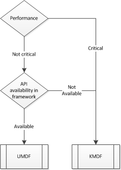

# Transport minidrivers

This section contains details for vendors who need to create their own HID minidrivers. (You will need to create a minidriver if your device requires a transport other than USB, Bluetooth, Bluetooth LE, or I²C.)

HID minidrivers can be built using one of the following frameworks:

1.  UMDF – User Mode Driver Framework
2.  KDMF – Kernel Mode Driver Framework
3.  WDM – Legacy Windows Driver Model

Microsoft recommends that developers use the UMDF framework as a starting point, but the image and table below help identify the framework that is most appropriate.

The following table captures the key advantages and challenges associated with the two WDF models as they pertain to HID Transport minidrivers.

|            |                                                                                                                  |                                                                                                                               |
|------------|------------------------------------------------------------------------------------------------------------------|-------------------------------------------------------------------------------------------------------------------------------|
|            | KMDF                                                                                                             | UMDF                                                                                                                          |
| Advantages | Support available in all Windows platforms that supports WDF Required for all keyboard and mouse filter drivers. | Easier to develop and recommended for most vertical device classes Errors in this driver do not bug check the whole system    |
| Challenges | Poorly written KDMF HID transport minidrivers can crash the system                                               | No support for UMDF hid transport minidrivers on pre-Windows 8 Added K/U transitions, could have a slight performance impact. |

 

**Note**  Microsoft encourages hardware vendors to use the inbox transport-minidrivers whenever possible. However, if your device requires an unsupported transport, Microsoft recommends using the Windows Driver Framework (UMDF or KMDF) as the foundation your minidriver. You should only create a WDM minidriver if a specific transport is not supported by the Windows Driver Framework.

 

 

 

--------------------
[Send comments about this topic to Microsoft](mailto:wsddocfb@microsoft.com?subject=Documentation%20feedback%20%5Bhid\hid%5D:%20Transport%20minidrivers%20%20RELEASE:%20%287/18/2016%29&body=%0A%0APRIVACY%20STATEMENT%0A%0AWe%20use%20your%20feedback%20to%20improve%20the%20documentation.%20We%20don't%20use%20your%20email%20address%20for%20any%20other%20purpose,%20and%20we'll%20remove%20your%20email%20address%20from%20our%20system%20after%20the%20issue%20that%20you're%20reporting%20is%20fixed.%20While%20we're%20working%20to%20fix%20this%20issue,%20we%20might%20send%20you%20an%20email%20message%20to%20ask%20for%20more%20info.%20Later,%20we%20might%20also%20send%20you%20an%20email%20message%20to%20let%20you%20know%20that%20we've%20addressed%20your%20feedback.%0A%0AFor%20more%20info%20about%20Microsoft's%20privacy%20policy,%20see%20http://privacy.microsoft.com/default.aspx. "Send comments about this topic to Microsoft")

